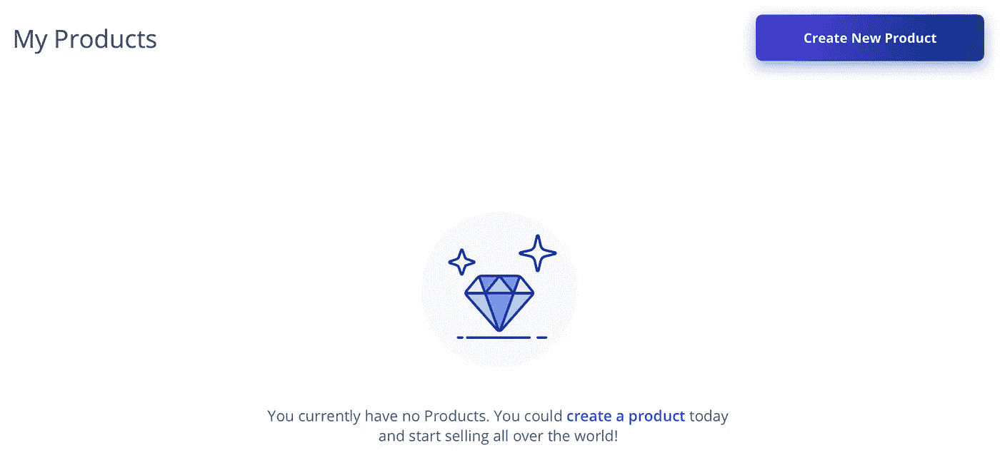

# ELIX 门户网站推出:众筹活动和管理产品的更好方式+即将推出的赠品

> 原文：<https://medium.com/hackernoon/the-elix-web-portal-is-out-62e82fb40a65>

今天对 ELIX 来说是激动人心的一天！我们刚刚发布了我们的[门户网站](https://www.elixirtoken.io/boost)，这是一种创建和管理产品和活动的简化方式。

**在 ELIX 门户网站上创建账户** [**此处**](https://www.elixirtoken.io/boost) **。**

在这篇博文中，我们将介绍新门户的所有新特性。

在不到一分钟的时间内在 elixirtoken.io/boost[创建一个账户。创建帐户后，您的登录凭据可以保存在本地，这样您就不必多次登录。](http://elixirtoken.io/boost)

登录后，您会在左上角看到两个选项:

1.  制品
2.  运动

单击这些选项中的任何一个，开始设置您的项目。以下是你在发起众筹活动时会看到的内容:

您将看到三个独立的选项卡:

1.  基础
2.  内容
3.  奖励

在“基本信息”下，输入活动的背景信息。使用内容来添加项目背后的故事。最后，添加任何活动奖励，并在奖励下指定运费:

Add as many rewards as desired to your campaign.

创造产品也很容易。添加名称、价格和类别以开始使用:

就像营销活动一样，系统会提示您输入该产品的基本信息、内容和配送详情。

在“内容”下，您可以添加产品的详细信息，包括视频和详细图片。

最后，在 Shipping 下，您将能够创建关于产品可以运送到哪里以及运送到那里的费用的规则。从长远来看，我们计划开发工具来估算每个地点的运输成本。

当您完成产品或活动的设置后，只需按“发布”,它就会显示在您的仪表板上。

我们正在开发工具来帮助我们批准和发布新产品，并向发布源发起活动。在我们构建门户时，请花时间熟悉新的布局。非常感谢我们的社区在我们构建 ELIX 时所给予的耐心和支持。

**在 ELIX 门户网站** [**这里**](https://www.elixirtoken.io/boost) **创建账户。**

## 即将推出的赠品

我们将在下周推出另一个赠品！请继续关注我们的[赠品页面](https://www.elixirtoken.io/giveaway)，看看下一个赠品何时上线。

ELIX 已发送给上次赠品中遵循赠品说明的人。

要创建自己的项目，请在此注册成为早期创建者[。通过社交媒体在](https://www.elixirtoken.io/boost) [Reddit](https://www.reddit.com/r/elixirtoken/) 、 [Twitter](http://twitter.com/elixtoken/) 、 [Discord](https://discord.gg/mu4EJaz) 和 [Telegram](https://t.me/ElixirToken) 上联系。点击查看我们的新网站博客[。我们还有](https://blog.elixirtoken.io/)[脸书](https://www.facebook.com/elixirtoken/)和 [Instagram](https://www.instagram.com/elixtoken/) 页面，你可以在我们的[网站](https://www.elixirtoken.io/)底部注册订阅时事通讯。敬请关注 ELIX 网站博客[此处](https://blog.elixirtoken.io/)获取精彩更新！