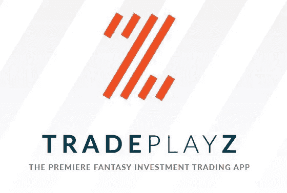
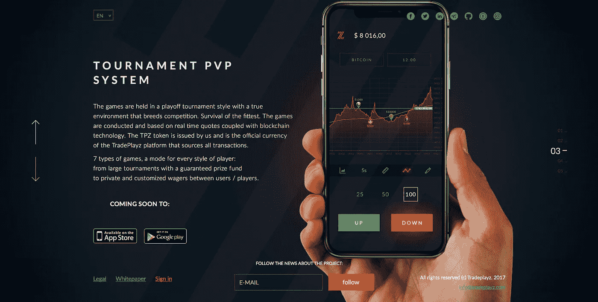
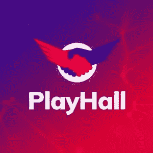
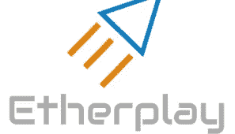

# 基于技能的加密游戏和 ICO 的出现

> 原文：<https://medium.com/hackernoon/the-emergence-of-skill-based-crypto-gaming-and-icos-b802ff39ff52>

新游戏平台和移动应用的快速创建使得移动领域成为最重要的数字游戏平台成为可能。随着比特币、莱特币、以太坊的兴起，各种新的替代币和代币一直试图夺取游戏加密货币的宝座。在区块链上运行星际争霸是可能的。这种事情是可以实现的。复杂的安全性和可伸缩性允许所有这些都建立在上面。

在这篇文章中，我将回顾世界各地正在开发或已经可用的基于技能的加密游戏的出现。

**TRADEPLAYZ**

Tradeplayz 从根本上提供了一个在线游戏平台，让玩家有公平的机会在任何游戏中发挥自己的技能，无论是国际象棋、双陆棋还是智力竞赛游戏等。企业业务发展总监迈克尔·托德将 TradePlayz 描述为“数字时代的垄断，与 21 点和轮盘赌有相似之处，但 100%的幻想加密交易和 100%的法律，因为 TradePlayz 是一种技能游戏。”

让 tradeplayz 脱颖而出的非凡之处在于，它方便了游戏玩家使用加密货币玩真钱游戏。在这个平台上，游戏玩家将能够以真实、安全和匿名的方式通过他们的技能赢得加密货币。正如企业业务发展总监迈克尔·托德所描述的，“我们是世界上首屈一指的梦幻加密交易应用程序/平台，拥有一个创新且利润丰厚的项目，根据美国政府证券交易委员会以及其他任何金融监管机构的规定，该项目 100%合法，并首先考虑了我们的产品。他进一步说，他们有一个快速增长的用户群。官方 Telegram 频道的下载量不到 1.4 万，并且还在上升，在发布的四周内，该应用的下载量超过了 8000 次。Tradeplayz focus 正在教育人们如何投资，包括以真实身份获得回报的机会。

Tradeplayz 的不懈团队已经为潜在玩家提供了 ZED 令牌，供他们在自己的平台上使用。这个代币将仍然是不同玩家在他们的平台上玩游戏的主要货币。尽管如此，其他加密货币如比特币、以太坊、莱特币、以太坊经典、Dash、Zcoin、比特币现金和许多其他加密货币也允许在平台上使用。这将是一个在平台上玩任何加密货币的机会。通过这样做，人们现在有了一个独特的机会，可以有效地利用他们的各种加密货币，而不必只是等待价格上涨或投资周转。

在拥挤的加密游戏市场中，ZED token 和 Tradeplayz 的关键点是,“TradePlayz ZED token 是创新的、有价值的和有利可图的”。此外，这是一个基于 ERC 20 以太坊的实用令牌。他进一步说，他们正在创建一个全球数字商场，这是人们应该购买这场革命的一个有希望的原因。游戏开始了，欢迎来到加密交易游乐场。”

该应用程序已经推出，您可以在 google play 和应用商店中找到它。我已经厌倦了这个应用程序，我发现它非常酷。其他玩家也表示，他们发现该应用程序对于学习如何在现实生活中交易密码很有用。总而言之，它是一个有趣的好应用程序。如果你也喜欢 app，可以考虑参与他们的 ICO。ZED 代币有多种好处，因为你不必交易它，你也可以用它在技能游戏和锦标赛中赢取奖品。

就他们的竞争而言，为了与市场上的其他玩家进行比较，我们可以提到几个。然而，由于没有一种产品是相似的，所以很难对它们进行比较。

**游乐场**

PlayHall 是一个基于区块链的新技能游戏平台。它为游戏玩家提供了各种机会来测试他们在玩家对玩家(PvP)比赛中的技能，参与全球和定制锦标赛并赢得加密货币。PlayHall 是一个去中心化的多加密货币平台。所有玩家都可以使用不同的加密货币和游戏币(PHT)。该代币不仅可以在玩家对玩家比赛和锦标赛中用作奖品，还可以在投票过程中使用。此外，所有 Playhall 令牌持有者将能够参与项目开发和管理。

**以太游戏**

Etherplay 是一个新的技能游戏平台，旨在彻底改变人们玩游戏的方式。Etherplay 是一个技能游戏平台，玩家在玩趣味游戏的同时争夺高分。类似于街机，玩家付出很小的代价就能享受一些乐趣。Etherplay 游戏的意识形态是围绕旧的“付费玩”街机概念形成的。这些游戏通常需要不可预测的游戏内购买才能继续充分享受它们。

随着运行 Etherplay 的基于 Oracle 的智能合约的引入，所有游戏数据都可供玩家使用。这使得他们的平台可以验证和问责。Etherplay 的主要目标是为游戏玩家提供一个新的场所。这允许他们为了玩家的利益来表达他们的创造力。Etherplay 的门户网站提供了一系列游戏，作为常规比赛的一部分。

**比特晶体**

BitCrystals 生态系统是一个为玩家和游戏制作者提供的完全基于技能的加密游戏平台。BitCrystals (BCY)也是一种数字货币，可以在区块链交易或用于购买区块链卡，可以在我们的游戏和其他合作伙伴的游戏中玩。他们的使命是建立一个创新的游戏生态系统，玩家可以完全拥有他们在区块链上的数字财产。此外，他们的平台与他们的加密货币、数字钱包、合作伙伴游戏以及广泛的玩家和收藏家网络相关联。他们的平台基于三大支柱:工艺、分享和团结。

**GAMETACO**

这是现金技能锦标赛的目的地。它们为用户提供了一个有趣、友好和值得信赖的目的地，让他们为基于技能的游戏下注真钱。他们的安全平台为现金锦标赛提供了最简单的设置，最严格地遵守技能游戏，并提供了大量游戏可供选择。Gametaco 认为，每个人都应该因其技能而获得奖励。在 Gametaco 平台上，你练习得越多，你在现金锦标赛中获胜的机会就越高。这就是它在任何练习赛中总是自由发挥的原因；他们通过允许玩家打开零赌注现金锦标赛并邀请人们加入来使这变得容易。

**对比**

划分这些平台有一个有趣的因素，那就是最终产品。这些公司对世界和他们的游戏系统如何整合有不同的看法。Tradeplayz 致力于创造一个新的数字世界，玩家可以加入其中享受游戏和接收资产。他们也有一个明确的议程，那就是大规模的采用和对像你一样的消费者的可及性。

这也是 Tradeplayz 在加密游戏领域独一无二的原因。在现实生活和虚拟世界中奖励玩家可以鼓励用户感觉自己是 Tradeplayz 社区的一部分，而不需要付费。Tradeplayz 已被证明是一个更好的基于技能的加密游戏选择，随着他们制定的计划，他们将极大地受益于即将到来的游戏增长。此外，它们仍然是一个更好的平台，可以让用加密货币赚钱的过程变得更容易。他们的愿景是创新和独特的，因为他们的梦想是让玩家玩真钱游戏。

如果你正在寻找一个基于技能的游戏行业的 ICO，ZED 令牌绝对是你应该考虑的。这款 ICO 的一大优势在于，该公司已经有了一款人们每天都在玩的产品。您不需要等待他们来构建平台。但是你要抓紧时间，因为代币销售就要结束了！

**密码社区的想法**

加密货币和基于技能的加密游戏似乎是数字天堂中的一对。最近，个人希望看到加密货币成为游戏的一个正常部分。这份报告是对北美的 1000 名游戏玩家进行的，这些玩家已经至少在线购买、出售和交易过一次虚拟物品。基于技能的加密游戏越来越受欢迎，导致了游戏中数字货币的产生，这是对流行在线游戏虚拟经济的宝贵补充。

**总之**

在线游戏技能平台正以贪婪的速度增长。它与电子竞技和游戏市场都有关联。2016 年，技能游戏仅占据了约 10%的移动份额，约为 43 亿。据博彩公司预计，这一数字有望在 2020 年底达到 70 亿英镑。随着这一点，基于技能的密码游戏的流行将会升值，并保持每年增长。

链接:

 [## App Store 上的 TradePlayz

### 阅读评论，比较客户评级，查看截图，了解更多关于 TradePlayz 的信息。下载 TradePlayz 并享受…

itunes.apple.com](https://itunes.apple.com/app/tradeplayz/id1346604958?mt=8) 

【https://play.google.com/store/apps/details? id=com.tradeplayz.game

 [## TradePlayz

### 世界上首屈一指的幻想密码交易应用程序！！现在开始赏金计划！！一个平台玩所有游戏！提高赌注！

t.me](https://t.me/tradeplayz)  [## 中等

### TradePlayz 团队中有一部分人是极客和怀旧者。对我个人来说，它老了…

medium.com](/@TradePlayz)  [## trade playz(@ trade playz)| Twitter

### TradePlayz 的最新推文(@TradePlayz)。TradePlayz 是全球首屈一指的梦幻密码交易平台。一…

twitter.com](https://twitter.com/tradeplayz)  [## TradePlayz -提高赌注！

### 比赛以季后赛的形式进行，真实的环境孕育了竞争。的生存…

tradeplayz.com](http://tradeplayz.com/)  [## 多加密货币平台

### Playhall.io 是一个在 mobileapps 上进行技能游戏的平台。它提供 PvP 比赛和全球锦标赛。

playhall.io](https://playhall.io/)  [## 以太游戏:在线视频游戏，在这里你可以获得技能奖励！

### 玩好玩的游戏。无需注册，只需付费即可玩。此外，如果你是一个熟练的球员，你会得到奖励！

以太网游戏. io](http://etherplay.io/)  [## 比特晶体|游戏玩家和游戏制作者的货币

### 我们的使命是建立一个创新的游戏生态系统，玩家可以完全拥有他们的数字财产…

bitcrystals.com](https://bitcrystals.com/)  [## 家庭游戏 Taco:基于技能的现金游戏的首选目的地

### 每场现金锦标赛的赢家！免费玩技能游戏换现金！与朋友一起参加真钱锦标赛…

www.gametaco.com](https://www.gametaco.com/) 

# ICO #区块链#比特币# BTC # trade playz # ZED token # ZED # skill game # bit crystals # gametaco # ether play # play hall # Michael Todd # ether eum # ETH # LTC # lite coin #博彩#加密货币