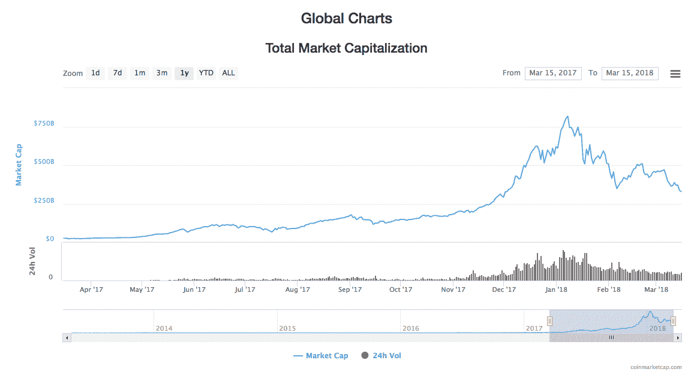

# ICOs 的末日？

> 原文：<https://medium.com/hackernoon/the-end-for-icos-6a53e420a517>

Before reading this article, please read our disclaimer found at the bottom of the article or [here.](https://thebestoficos.com/disclaimer.html)

## 加密货币最糟糕的一周

# 介绍

去年，我们看到了一种新型产业和基金的大规模发展。尽管首次发行硬币(ico)已经存在了 3 年多，但我们在 2017 年 9 月至 12 月期间看到了最多的 ico，也是有史以来最大的一次。

一个月前价值 5 万亿美元的行业在短短 4 周内突然失去了近 2 亿美元的市值。欢迎来到 2018 年 3 月的第二周，这可能是加密货币世界有史以来最糟糕的一周。

市场不稳定得令人难以置信，但这么快就损失这么多已经给这个行业带来了很多恐惧和缺乏信任。这个月有三个事件引发了市场崩溃。

我们将讨论导致崩溃的事件，以及让环境发展到目前状态的错误观念和不受管制的做法。

Image from: Coin Market Cap Global Charts found [here](https://coinmarketcap.com/charts/).

# 问题是

从本质上讲，ico 的问题是基于这样一个事实，即许多人通过购买一些公司开发的代币赚了很多钱，并被设定为一些完全任意的值。然后，这些投资者会公布他们的收益，其他人也会跟进，无意中造成了类似传销的行为。

这种行为最有问题的一个方面是它有多成功。

1.  A 公司用区块链是因为:
    **1 . A**A 公司有一个想法，通常是一个现有的市场，但是用区块链
    **1 . b**A 公司需要融资但无法通过传统手段找到投资人
2.  他们创建了一个 20 页的文档来讨论这个想法，但是忽略了关于公司、经验、牵引力等任何重要的细节
3.  他们发起了一场运动，筹集任意数量的资金，以换取更多随机数量的代币
4.  承诺是代币将在产品中具有核心功能，并带有一些暗示性的描述，即代币的价值将随着公司的发展而上升
5.  公司与公关公司合作，通过社交网络宣传代币销售
6.  初级投资者购买所述代币，并在社交媒体上做广告
7.  二级投资者购买代币，从而提高一级投资者的价值
8.  初级投资者赚取巨额利润，并大肆宣传
9.  新公司 B 重复循环

筹款真的很难是有原因的。那就是私人投资，合格的投资者有很多选择，你的公司必须在多个方面有意义，才能让他们认为这是他们的钱的最佳用途。

即使经过几个月的谈判和工作，很少有公司筹集到第一轮种子资金，更少的公司能够在这一轮之后筹集到资金。这种想法是，象征性的销售将很好地介于种子轮(或原始筹资)和更严肃的首轮融资之间。

之所以如此困难，是因为把钱给新公司本来就有极大的风险。创始人年轻，没有经验，这是一个小团队，他们竞争的市场相当发达，他们必须比他们之前的任何人执行得更快，更好，更强，才能赢得大胜利。投资者需要大获全胜，因为他们投资的每 10 家公司中，只有 1 或 2 家会盈利。

# 这些事件

证券委员会背后的理念是保护其管辖范围内的公民免受欺诈和此类高风险投资的影响。这个想法是，如果不审查一家公司，就不可能很好地预测它的成功，如果有人不把全部注意力放在投资上，他们很可能会犯下致命的错误，失去大量的储蓄。因此，需要建立一个机构来监管不当行为和投资行为。

证券佣金的概念和股票交易本身一样古老。因此，监管机构一直在仔细检查 ico。这种新型的投资策略很奇怪，它不是一轮正式的融资(没有股票)，但也不完全是像 kickstarter 那样的众筹活动(你得到的是代币，而不是产品，代币可能会增值)。

这些代币的怪异性质让委员们感到困惑，他们中的许多人决定等待，然后再制定明确的指导方针，明确什么是证券，什么不是。缺乏明确性使得管辖灰色区域中的舞蹈游戏成为当前 ICO 世界中的游戏。让事情变得更复杂的是，代币销售在全球范围内开放，这让监管者极难达成共识(哈！).

# 证券交易委员会的公告

2018 年 3 月 7 日，美国联邦监管机构证券交易委员会(SEC)发布了以下公告:

> “在线交易平台已经成为投资者买卖数字资产的一种流行方式，包括在所谓的初始硬币发行(“ico”)中提供和出售的硬币和代币。这些平台通常声称让投资者能够快速买卖数字资产。许多这类平台将买家和卖家聚集在一个地方，并为投资者提供显示定价订单、执行交易和提供交易数据的自动化系统。
> 
> 许多这样的平台提供了一种交易资产的机制，这种机制符合联邦证券法对“证券”的定义。"
> 
> —通过在此处找到的[关于交易数字资产的潜在非法在线平台的声明。](https://www.sec.gov/news/public-statement/enforcement-tm-statement-potentially-unlawful-online-platforms-trading)

公告讨论了有多少交易所和其他 ico 通过销售和交易不受监管/未注册的证券而实际上违反了法律。对于许多关注该行业的人来说，这并不奇怪。

诚然，尽管许多(如果不是大多数)ico 违反了法律，但在让人们简单、方便地知道他们出售的是不是证券方面，佣金经纪人也做得很差。据估计，一家公司将花费 5 万至 10 万美元来解决他们有兴趣销售的每个司法管辖区的问题。

我们希望这个过程会变得更加清晰和主流，因为我们看到规例 pur 到位。

# 谷歌的声明

本周，谷歌决定

> “2018 年 6 月，谷歌将更新[金融服务政策](https://support.google.com/adwordspolicy/answer/2464998)，以限制差价合约、滚动即期外汇和金融利差交易的广告。此外，以下广告将不再允许投放:
> 
> 加密货币和相关内容(包括但不限于初始硬币发行、加密货币交易所、加密货币钱包和加密货币交易建议)”
> 
> ——谷歌金融服务政策网站在这里找到了。

这不仅会影响 ICOs，这一消息适用于任何计划宣传任何加密货币信息的人，包括交易所、钱包和试图改善加密货币用户体验的合法软件。

许多批评者认为这一举动非常艰难和幼稚，因为许多 ico、交易所和产品都是合法的，并与监管机构进行了适当的测量以获得批准，并解释他们的技术。谷歌已经决定采取一种广泛的方法，以后再问问题。进一步剥夺了整个领域的合法性。

# 环境

## 太多(坏)ico

据估计，现在每个月都有五十多个 ico。整个网站都围绕着跟踪这类事件的目的而旋转，并试图以某种方式分析或至少比较每一个事件。

这种平台的例子有:

*   [ICO 数据](https://www.icodata.io)
*   [ICO 观察列表](https://icowatchlist.com)
*   [ICO 警报](https://www.icoalert.com/)
*   [粉碎加密](https://crushcrypto.com/ico-analysis/)
*   [标记器](https://thetokener.com/)
*   [ICO 指数](http://icoindex.com)
*   还有更多

新 ico 的巨大数量也导致了市场的过饱和，即使有了所有可用的工具，做出决定和选择赢家似乎比以往任何时候都更加困难。

# 关于以太坊的担忧

未来挑战中最容易被忽视的一个方面是技术方面。大多数 ico 目前都被开发为 ERC20 令牌，也就是说，这些令牌是使用以太坊虚拟机开发的，并且存在巨大的可扩展性和定价问题。

这些问题包括:

*   **可伸缩性**:单位时间内只能处理一定数量的事务，随着越来越多的公司使用这个框架，它就会变得越来越拥挤
*   **EVM 价格:**ETH 公司的处理能力成本持续上升
*   交易成本:随着时间的推移，实际转移资金的成本不断增加

许多其他人已经开始致力于解决其中一些问题的新区块链技术，在有时被称为区块链 3.0 的技术中，例子有:

*   主要的
*   极微小
*   电弧块
*   许多其他人

# 结论:未来

区块链和其他受区块链启发的技术非常强大，并提供了关于传输数据和价值的新理解。在这样一个交换变得极其重要的时代，加密货币已经开发出一种更自由、更快捷、更实用的看待世界的新方式。

现实是，私人融资是一项困难的工作。投资者最关心的是从投资中获利，他们应该这样做。但众筹不同，当人们向 Kickstarter 活动捐款时，他们不是为了赚钱，而是因为他们希望看到一种新产品成为现实，实现开发者的梦想。

当你把两个市场结合起来时，你需要以一种满足双方动机的方式来做:金钱、控制和合法产品的开发。我们认为加密货币是实现这种混合的一种解决方案，如果不是最好的话。

然而，我们也认为，为了满足这两种动机，必须有关于如何进行的严格和极其明确的规则。不同的委员和立法者行动极其缓慢，而技术将继续加快步伐。

走向光明未来的唯一途径是通过一个清晰的市场，以及一套关于如何在这样的市场中定位的清晰规则。如果没有一份“该做什么和不该做什么”的清单，问题就会继续存在，每个领域的人都会受到惩罚。

我们希望未来带来清晰和理性，这将为人们创造一个良好的环境，通过新技术，包括区块链，建立成功和有价值的公司。作为立法的结果，我们也期待看到稳定代币的兴起。稳定的代币价格不变，因此只对寻求融资的人有吸引力，不提供投机投资价值。

如果您担心您的公司没有遵守法规，请联系证券律师或当地监管机构。我们的母公司 [Durata](https://durata.io) 也可以帮助您找到正确的方向。

想帮忙吗？
在奖金上支持我们！[https://www.bountey.com/bestoficos](https://www.bountey.com/bestoficos)

想在 ICOs 中保持最新？
在[https://thebestoficos.com](https://thebestoficos.com/)拜访我们

有一个有趣的故事？给我们在 info@bestoficos.com 写信

# 放弃

本网站及其包含的信息无意成为投资、金融、技术、税务或法律建议的来源。本网站不能代替专业建议和独立的事实验证。在没有首先评估你自己的个人财务状况，也没有咨询财务专家的情况下，千万不要使用这个网站上的想法和策略。本网站的所有内容仅供参考，按“原样”提供，不保证完整性、准确性、及时性或使用本网站所获得的结果。这只是一个存根，您对本网站的访问和使用取决于您对全部免责声明的接受和遵守。免责声明适用于所有希望访问或使用本网站的访问者、用户和其他人。