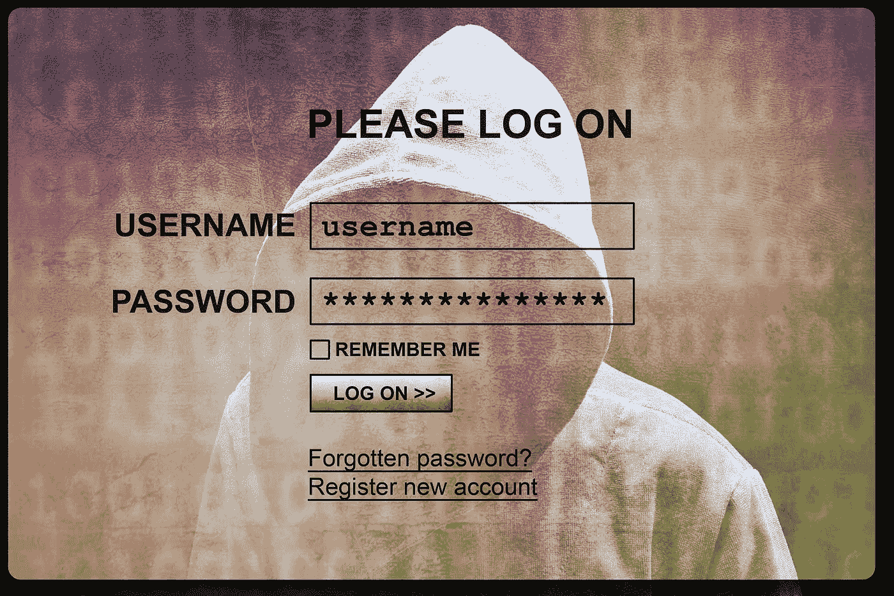
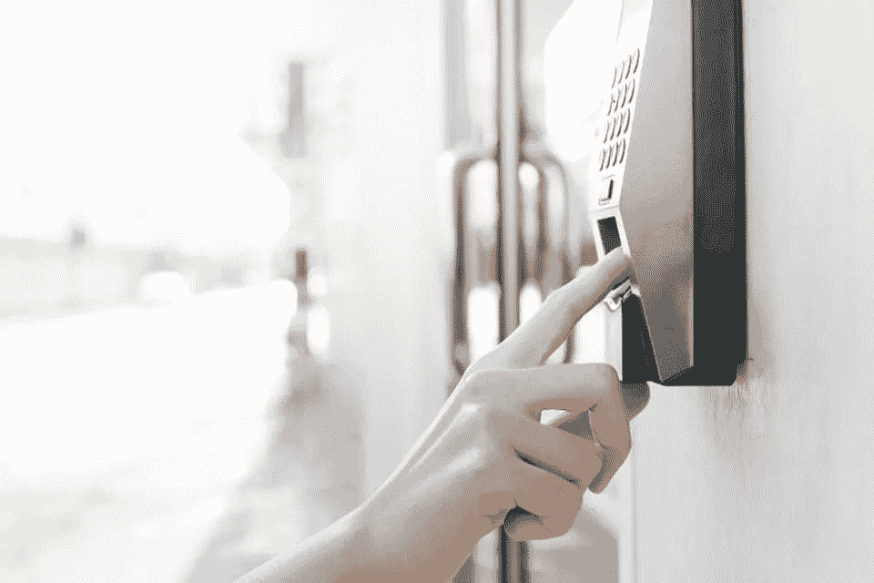

# 密码的末日即将来临

> 原文：<https://medium.com/hackernoon/the-end-of-passwords-is-nigh-a86c65a30465>

我们的网络生活围绕着密码。无论是查看社交媒体、访问电子邮件、观看网飞、通过网站购物还是查看数字银行余额，我们都可以通过字母、数字和标点符号的随机组合安全地访问互联网上的贵重物品。至少，应该是这样的。虽然在过去的几十年里，密码一直是加密私人信息不可或缺的一部分，但现在许多企业和网站都选择省略密码。最近的一系列网络攻击，包括 2016 年美国总统大选期间脸书臭名昭著的[剑桥分析公司黑客](https://www.theguardian.com/technology/2018/apr/08/facebook-to-contact-the-87-million-users-affected-by-data-breach)和国务院最近曝光员工个人信息的[电子邮件泄露](https://www.politico.com/story/2018/09/17/state-department-email-personal-information-792665)，密码似乎不再是一个可以依赖的安全系统。

但是如果密码不可靠，有什么替代方案，它们真的更安全吗？让我们深入了解密码使用的历史和背景，并找出改变计算机和类似设备如何验证用户的关键替代方案。

**数字时代之前的密码**

密码早在现代科技和互联网出现之前就存在了。历史上，密码被用于许多秘密任务，包括加密通信、进入私人机构和识别身份。直到 1960 年，麻省理工学院的费尔南多·科尔巴托将它们引入计算机，作为保持个人文件隐私的一种方式。快进到 20 世纪 80 年代，电脑迷们开始掌握如何解密代码。随着 20 世纪 90 年代越来越多的人接入互联网，对编码过程越来越有经验，在线私人数据存储变得容易受到黑客攻击。一旦黑客攻击成为主流，技术和安全专家开始关注如何防止个人信息泄露。

大约 15 年前，比尔·盖茨在旧金山举行的 RSA 安全会议上发表演讲时预言了密码的消亡，称密码无法“应对”保护关键信息安全的挑战。从那以后，许多企业听从了微软创始人的话，开发了执行在线认证的其他方法。

**忘记密码了？**

但是安全问题并不是避免密码的唯一因素。事实是，密码不仅变得越来越容易被破解，而且对用户来说非常不方便。想想看，你经常会记住多少不同的密码？

五点左右？也许 10 年？

这似乎足够了，但是根据一份密码揭露[报告](https://lp-cdn.lastpass.com/lporcamedia/document-library/lastpass/pdf/en/LastPass-Enterprise-The-Password-Expose-Ebook-v2.pdf)，平均每个人有 191 个不同的密码。这需要记住大量的短语和字母组合。有这么多需要回忆的，人们肯定会不时忘记他们的密码——这就是为什么 61%的人在不同的登录中使用相同或相似的密码。虽然使用这样的系统可能会使记住密码变得更容易，但它也使黑客很容易进入你的帐户。幸运的是，企业长期以来一直在开发实用的方法来防止经常发生的密码破解。目前最流行的解决方案是[双因素认证](https://www.cnet.com/news/two-factor-authentication-what-you-need-to-know-faq/)，这需要一个额外的步骤，比如在你输入密码后输入验证码或安全问题。[密码管理器](https://securingtomorrow.mcafee.com/consumer/consumer-threat-notices/security-world-password-day/) 是另一个有用的工具，它不仅可以帮助创建更强的密码，还可以帮助人们记住它们，并自动登录标记为收藏夹的网站。

虽然这些特殊的方法不能消除密码，但它们提供了额外的安全性和便利性。它们可能无法解决密码安全的核心问题，但它们支持并保护当前的安全系统，因为其他形式的身份验证仍在开发中。

**替代认证解决方案**

一个这样的新兴解决方案是 [web 认证(WebAuthn)](https://duo.com/blog/web-authentication-what-it-is-and-what-it-means-for-passwords) ，这是一个直接内置在 Web 浏览器中的凭证管理 API，允许用户使用认证器注册和认证 Web 应用程序。WebAuthn 最流行的形式是生物识别，包括各种形式的面部、声音和指纹识别。

虽然面部识别已经是 iOS 的标准配置，但这项技术最终可能会完全取代登录密码。面部识别可能会在网站上实现，可以通过电脑、平板电脑或手机扫描你的面部，提供一种快速简便的替代输入密码的方法。语音识别是另一种简化的身份验证方式。在拥有亚马逊 Echo 和谷歌助手等设备的家庭中，这已经很常见了，[的银行已经开始允许客户使用前述的声控数字助理](http://theinstitute.ieee.org/ieee-roundup/blogs/blog/banks-are-offering-voicerecognition-technology-to-replace-passwords)来查看他们的余额，并在不登录的情况下进行信用卡支付。

虽然不像密码那样广泛，但指纹也有用作身份识别手段的历史。由于每个人的指纹都具有高度的唯一性，它已经成为法医实验室或机动车部门等组织的身份认证标准。大多数消费者已经拥有智能手机，可以选择使用指纹登录，而不是输入密码。很快，笔记本电脑将利用生物识别技术来验证用户身份，包括登录电脑本身和网络账户。

[Forbes](https://www.forbes.com/sites/forbestechcouncil/2018/06/04/the-future-of-authentication-is-here/#7eafd4d9432e)

另一个提议的解决方案是[地理位置识别](https://www.forbes.com/sites/forbestechcouncil/2018/06/04/the-future-of-authentication-is-here/#969d2c1432e1)，它利用用户的移动设备来跟踪他们的位置，并在任何需要的地方提供认证服务。地理定位允许组织向用户发送推送通知以授权交易，或者允许金融服务访问用户的 GPS 位置。然后，通过对照用户的位置交叉检查交易的跟踪位置，他们可以验证用户在请求交易的相应附近，作为一种识别方法。很难说这些选项中的哪一个最终会取代密码，但不可否认的是，它们提供了更好的解决方案，因为黑客很难复制它们。

**密码的未来**

鉴于上述替代品的巨大优势，很难不得出密码系统将很快过时的结论。也就是说，许多解决方案仍在开发中，需要数年时间来完善和普及，因此密码将会存在更长时间。最终，密码的未来取决于社会愿意忍受多久的安全漏洞和无尽的密码列表，以及开发人员能以多快的速度完善新的加密方法。