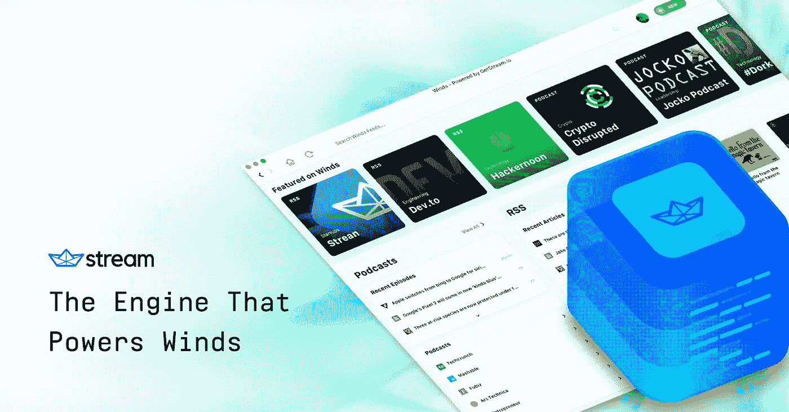
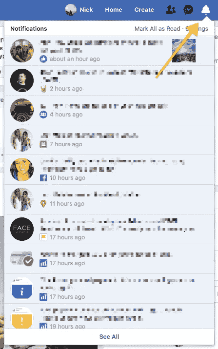
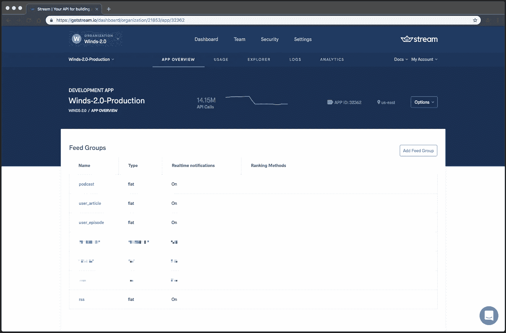
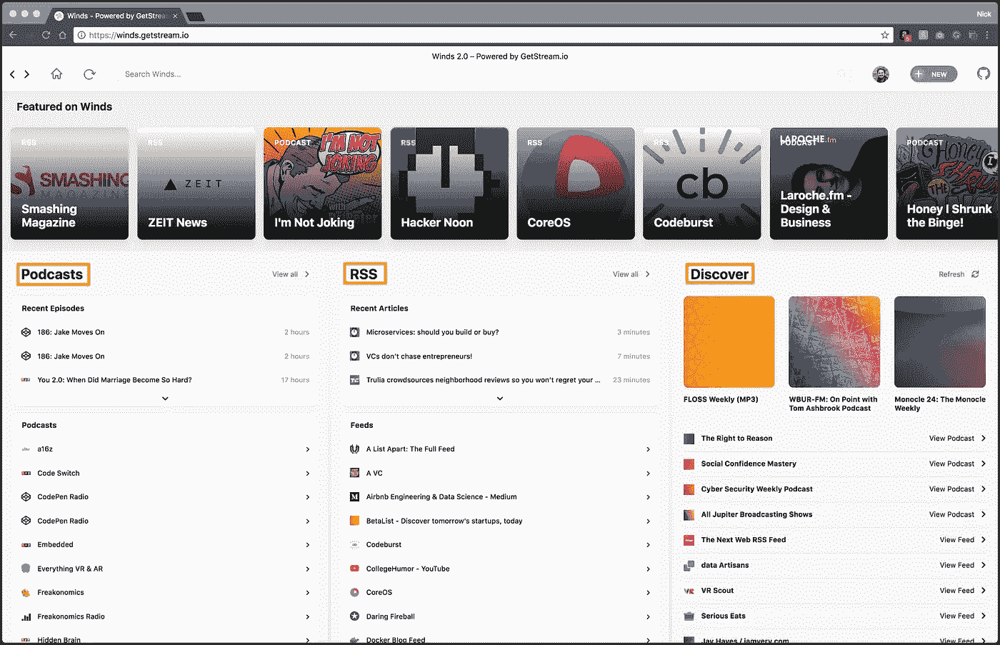
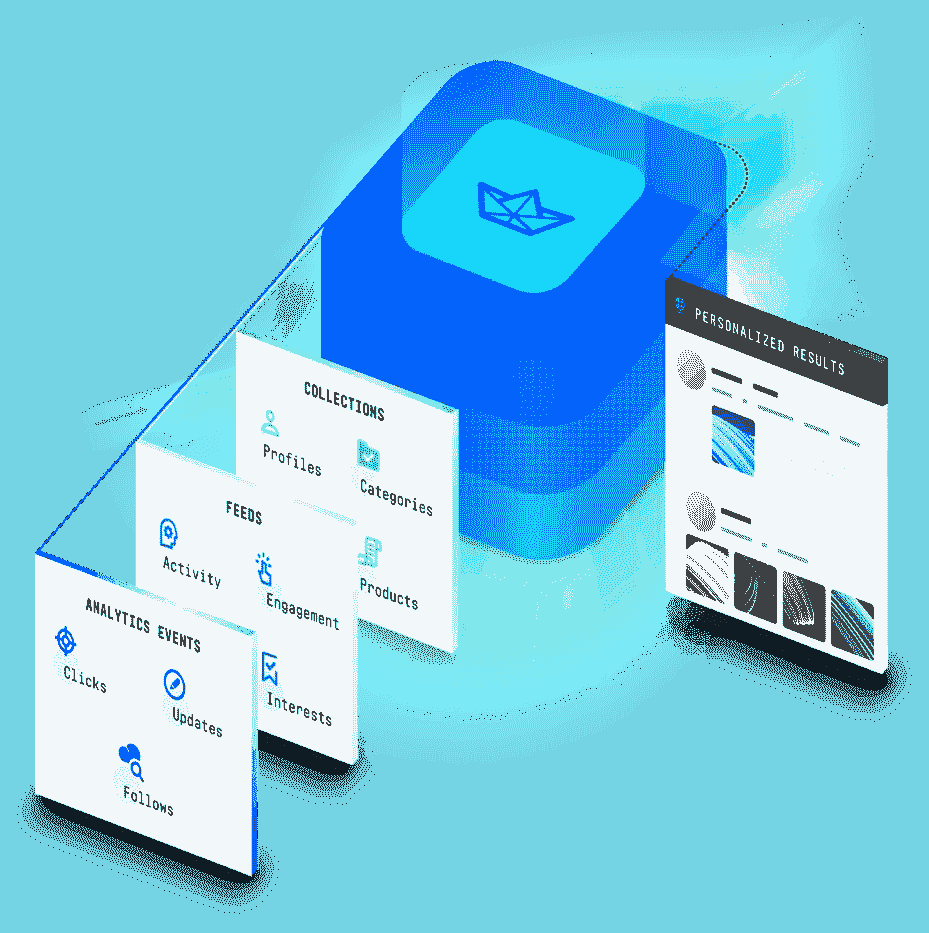
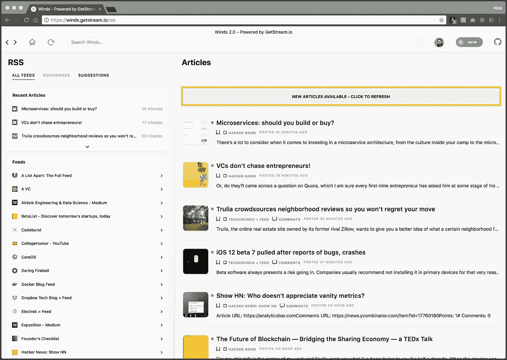
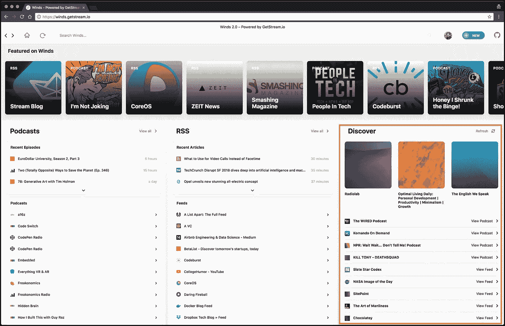

# 给风提供动力的发动机🚂

> 原文：<https://medium.com/hackernoon/the-engine-that-powers-winds-81ae655926cb>

[https://getstream.io/winds](https://getstream.io/winds)

对于那些不知道的人来说， [Winds](https://getstream.io/winds) (流行的开源 RSS 和播客应用)由 [Stream](https://getstream.io) 提供支持，这是一个 SaaS 的产品，专门用于支持新闻和活动提要。如果你想快速了解 feeds，我们有一个很棒的 [5 分钟教程](https://getstream.io/try-the-api/)，介绍如何使用 Stream。如果你已经熟悉 Stream 和/或 feed 技术的奇迹，请继续阅读！

气流可以让风拥有类似于的能力:

1.  跟踪 RSS 源或播客的能力。
2.  关于 feed 变化的实时通知，使 Winds 能够在新内容可用时立即呈现出来。
3.  推荐新的 RSS 源和播客。

构建既可扩展又相关的活动提要是困难的。传统上，公司依靠 Cassandra 或 Redis 来构建他们的 feeds。在内部构建 feeds 耗时、昂贵且难以维护。Stream 使得构建可伸缩的相关提要变得极其容易*和*划算。Feeds 通常在 11 毫秒内加载，拥有 [3 亿多终端用户](https://stackshare.io/stream/stream-and-go-news-feeds-for-over-300-million-end-users)，Stream 已经在一些最恶劣的条件下经受住了考验。

在这篇短文中，我们将深入探讨我们如何使用 Stream 在 Winds 中增强关注关系、实时功能和内容发现，以及它如何让我们的团队自信地无缝扩展应用程序，并在眨眼之间为我们的用户提供新鲜、相关的内容。尽情享受吧！👏

# 什么是饲料？🤔

一个“feed”描述了你今天在很多流行的社交媒体应用上看到的结构；提要允许用户在查看内容时滚动浏览内容并与之交互。从技术上讲，提要是活动流规范的一部分；活动流(也称为“活动提要”)有一个官方规范。官方文档可以在[这里](https://www.w3.org/TR/activitystreams-core/)找到。

在高层次上，该规范概述了如何在适合构建活动提要的表示中正确发送 JSON。在 Stream，我们严格遵循规范，提供应该发送的必需参数，但也提供发送定制数据的能力。

**Stream 提供了以下“饲料类型”**:

*   **平**——最常见的走刀方式。这种提要类型允许您写入特定的提要(例如时间线，并按时间顺序显示内容)。平面提要之后还可以是其他提要，以及表面实时通知(这是使用我们的 [JavaScript SDK](https://www.npmjs.com/package/getstream) 中内置的 websocket 连接来完成的)。
*   **聚合** —这种类型的提要是高级提要，允许使用“聚合格式”对活动进行分组和显示。
*   **通知** —将这种提要类型视为具有扩展功能的“聚合提要”。它可以被修改，这样提要中的条目就可以被标记为可见或已读(想想脸书的通知提要)。

作为一个现实世界的例子，脸书的整个应用程序几乎是一个巨大的新闻 feed，它使用定制算法来显示你最有可能与之交互的内容(Stream 也可以通过内部定制的[个性化](https://getstream.io/personalization/))。

通知源(包含更新的下拉菜单)使用户与内容保持互动，并根据他们与内容的交互自动将项目标记为已查看或已读。脸书是一个例子，然而，Twitter 和 Pinterest 是使用 feed 技术的流行应用程序的其他例子。

# 在 Winds 中将活动添加到流提要中🏃

Winds 有一个相当强大的后端来支持你在应用程序客户端看到的所有功能。例如，除了前端代码之外，我们有一个 API 和一组几个工作人员不时地处理内容。

也就是说，每次我们的工作人员解析 RSS 或播客内容时，他们都会在 MongoDB 中创建一条记录。一旦返回来自 MongoDB insert 的回调，工作人员就开始处理所有文章(对于 RSS 提要)或剧集(对于 podcast 提要)，将它们存储在 MongoDB 中，最后存储在 Stream 中。与上面类似，数据库返回一个 unique _id 值，我们用它作为流中的“foreign_id”。

幸运的是，Stream 使得向我们的提要添加活动变得非常简单。这可以通过 REST API 或任何可用的流 SDK 来完成。使用 JavaScript SDK，将文章活动添加到我们的 RSS 提要看起来像这样:

**我们来分解一下这个例子**:

*   **actor** 是执行活动的用户(或系统)
*   **动词**是用户(或系统)采取的动作
*   **object** 是对活动对象的引用(在我们的例子中，是惟一的 ID)
*   **time** 是一个必需的值，是活动的时间(当它被创建的时候)——这个值确保了唯一性，并提供了以后在必要时修改活动的能力
*   **foreign_id** :活动的应用程序数据库中的唯一标识符(如果以后需要进行更改，则用于查找)

> *注意:“饲料”一词在本节中使用了很多次，看起来好像可以互换。请不要混淆 RSS 或 Podcast 提要是在给定提要 URL(例如*[*https://some website . com/RSS . XML)、*](https://somewebsite.com/rss.xml),) *处可用的内容，而活动提要则特定于 Stream。*

如果你有兴趣阅读更全面的细分，我们在流网站[这里](https://getstream.io/docs/js/#adding-activities)有完整的列表和描述。

# 关注订阅源🎢

关注关系是基本的，如果不是社交网络和许多其他利用提要的应用程序的最重要的部分。follow 关系允许一个提要链接到另一个提要，使得活动在由 follow 关系绑定的所有提要中可见。例如，当一个活动添加到一个提要中时，它会自动添加到父提要之后的任何其他提要中。

在风中，我们有许多关系。最重要也最容易理解的关系是用户和他们关注的 RSS 和播客“源”之间的关系。

> *注意:这里的提要是指流中的提要组，而不是提要 URL。*

它位于订阅源组“user_article”和“user_episode”中，其中包含了关注关系。下面是一个简单的示例脚本，它向您展示了如何通过 JavaScript SDK 中的“followMany”命令在多个项目和父 RSS 提要之间创建关注关系:

> *注意:只能使用“扁平”进料类型。此外，提要不能跟随自身。*

Winds 必须提供的一个很酷的特性是。OPML "文件导入。OPML 是导入和导出 RSS 提要的标准。它是用 XML 编写的，所以我们进行所有的解析，如上所述创建提要，然后进行所谓的批量跟踪。

如果您对批量关注感兴趣，请看下面的示例片段:

有关以下提要的更多信息，请查看我们的[文档](https://getstream.io/docs/js/#following)。

# 风力🛠的水流供给结构

如果你有机会检查 Winds [代码库](https://github.com/GetStream/Winds)或使用该应用程序，你就会知道它是一个复杂的应用程序。为了促进 Winds 中的各种功能，我们非常依赖 Stream 来处理我们的提要。您可以将单个提要组视为数据库中的一个表，其中每一行都是一个活动。

**这里有一个关于 Winds feed 集团结构的简要介绍**:

*   **播客**(平)
*   **用户 _ 文章**(平)
*   **用户 _ 剧集**(平)
*   **rss** (平面)

正如所建议的，每个提要都包含相关的数据。例如，当我们解析一个 RSS 提要或一个 podcast 提要时，我们在相应的提要中插入一个新的活动。所有关注的文章和专题节目都存储在 user_article 或 user_episode 中，这两者都通过 Stream 中的“关注关系”连接到 RSS 和 podcast 提要。追随关系允许我们在用户和他们选择消费的内容之间建立联系。

既然我们已经有了 follow 关系，那么向流 API 发出一个 **GET** 请求来接收 follow 就很容易了。一旦我们收到以下内容，我们就向我们的 Winds 数据库(MongoDB)发出一个 API 调用，并使用响应来“丰富”数据。一旦它得到丰富，我们就可以在 Winds 中向用户显示所有的新闻提要数据。

> *注意:丰富是获取数据的一个小子集(例如，我们播客中带有 ID 的对象)并用我们数据库中的数据扩展它的过程。这是一个重要的过程，因为它允许我们将有效负载保持在可管理的大小，从而减少网络 I/O 并提高传输速度。此外，要知道千万不要在 Stream 中存储个人身份信息(PII ),这一点很重要。*

# 我们如何在风中使用饲料🍭

风中大量使用饲料。事实上，我们使用 feeds 来显示 Winds 中的几乎所有内容。在下面的屏幕中，我们使用以下提要:

*   RSS(最近的文章)
*   播客(最近几集)
*   Discover 是 RSS 和 Podcast 提要的组合，由 Stream [个性化](https://getstream.io/personalization/)驱动。

需要指出的一个有趣现象是,“发现”部分显示了推荐的 RSS 和 Podcast 提要的混搭；RSS 和 Podcast 提要推荐由 Stream 提供的两个个性化端点提供支持。通过使用个性化，我们能够根据用户之前的**点击**、**阅读**、**聆听**以及**整个 Winds 应用程序中的全部内容**，呈现用户最有可能与之交互的内容。

## 实时和网络套接字

最重要的是，当我们的一个抓取工作人员进行更新时，我们会收到来自 Stream 的实时通知，并让用户知道他们应该刷新应用程序以获取更新的内容。

# 从流中检索建议💭

Stream 可以轻松地将[个性化](https://getstream.io/personalization/)提要添加到您的应用程序中。当您的用户与您的应用程序交互时，Stream 开始理解他们对什么感兴趣。有了洞见，可能性是无穷的。以下是我们在野外看到的一些使用案例:

*   个性化订阅源
*   创建以下建议
*   优化电子邮件
*   产品推荐
*   内容推荐

> *注意:Stream 的个性化功能是针对每个应用的。因此，在使用此功能之前，您需要首先联系我们的数据科学和销售团队，以便我们能够更好地了解您的应用需求，并更好地为您的应用提供个性化功能。*

个性化在 Winds 中扮演着重要角色。它从整体上推动了我们的内容发现。

发现部分基于您在创建帐户、点击、阅读和收听时设置的兴趣。有了这些数据，Stream 开始工作，并通过几个复杂的算法来推荐内容。

为了将内容加载到视图中，我们点击一个惟一的端点，该端点通过我们的 API 进行代理，然后合并数据客户端。请注意，这也要经过一个“丰富”过程，在这个过程中，我们获取提要的推荐唯一标识符，并根据我们的数据库执行查找。

# 谢谢大家！👋

感谢您花时间阅读本文。我希望这个示例演练能让您更好地理解提要是如何工作的。

如果你对[流](https://getstream.io)感兴趣，并想尝试一下我们的 API，我们有一个 [5 分钟的教程](https://getstream.io/try-the-api/)，它将带你完成上述各种提要类型的所有步骤。我强烈建议尝试一下。此外，[Stream 如何使用 RocksDB、Raft 和 Go 为超过 3 亿用户提供订阅源](https://stackshare.io/stream/stream-and-go-news-feeds-for-over-300-million-end-users)如果您对支持 Stream 的架构感兴趣，这是一个很好的阅读材料。

如果你还没有下载或注册 Winds，它可以在 web、macOS、Linux 和 Windows 上使用——你可以从这里开始使用 Winds。

一如既往，如果你有任何问题或意见，请在下面的评论中提出！