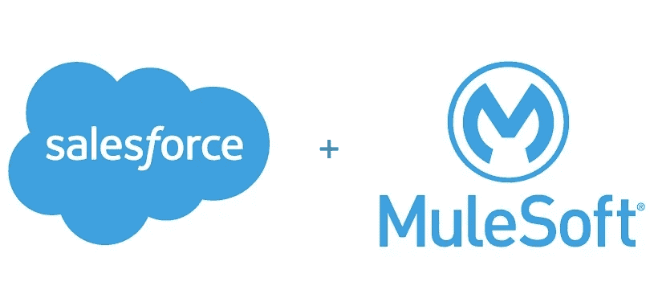
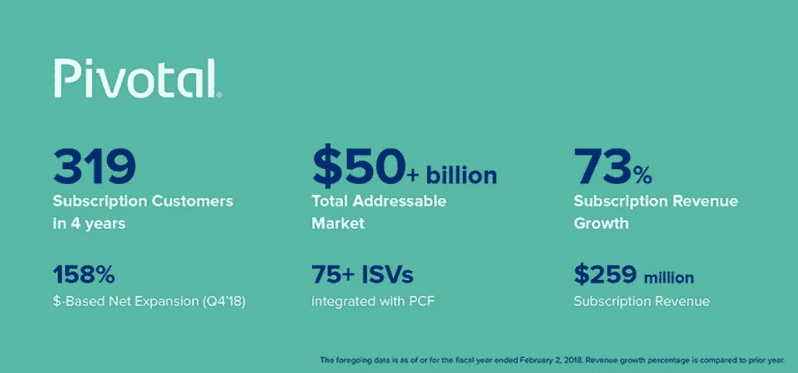

# 企业反击了

> 原文：<https://medium.com/hackernoon/the-enterprise-strikes-back-f2334b34fb15>

Photo by [Hello I’m Nik](https://unsplash.com/photos/F3E5Bkq0JUY?utm_source=unsplash&utm_medium=referral&utm_content=creditCopyText) on [Unsplash](https://unsplash.com/search/photos/star-wars?utm_source=unsplash&utm_medium=referral&utm_content=creditCopyText)

消费品公司是头条新闻的主角，是 Techcrunch 上点击率最高的公司，也是科技行业许多人最关注的公司。所以我想庆祝企业号反击的这个短暂时刻。虽然过去 10 年的宠儿之一脸书正遭受重创，但企业市场又回到了聚光灯下。

看看 Dropbox 的 IPO 吧，它的发行价高于最初价值，并在股市表现最糟糕的一周结束时达到白热化。再加上 Mulesoft 以 65 亿美元的价格被 21x TTM 收入收购([见 Tomasz Tunguz 分析](http://tomtunguz.com/mulesoft-crm/))以及 [Pivotal 最近的 S-1 申请](https://www.sec.gov/Archives/edgar/data/1574135/000104746918002061/a2234898zs-1.htm)，你就能明白为什么企业市场再次吸引了所有人的注意力。然而，我在市场上呆了足够长的时间，知道这一切都会过去的。

我心中的真实故事是关于接下来的。诚然，Salesforce 和 Workday 在最近的企业记忆中创造了一些最大的回报。与此同时，风险投资的资金涌入了每一个可以想象的领域，因为每一个风险投资家和企业家都争先恐后地创造一个新的记录系统……直到再也没有新的记录系统被创造出来。我的观点是，在接下来的几年里，我们将会看到更多的应用层公司上市，这肯定会很棒。仍然会有一些令人惊叹的公司用缩放指标来筹集他们的 C 轮、D 轮和更多轮融资。还会有一些新的 SaaS 应用程序创始人，他们拥有令人难以置信的领域专业知识，能够重塑 SaaS 老牌上市公司的部分业务。

然而，作为企业初创公司的第一批投资者，真正引起我注意的公司更多的是基础设施层的公司，如 Mulesoft 和 Pivotal。随着企业中的传统工作负载继续迁移到云原生架构，我们正处于历史上最大的 IT 转变的开始阶段。身处纽约，与 52 家财富 500 强企业中许多正在经历自身迁移和挑战的企业一起工作，让我们对未来更加兴奋。问题是，作为基础设施的投资者，进入一个 AWS 将基础设施商品化、微软和谷歌等大象紧随其后的世界是非常可怕的。尽管如此，也很难忽视以下事实:

1.  500 亿美元的公共云和应用程序基础架构、中间件和开发人员软件的巨大支出和增长(Gartner，Pivotal S-1)
2.  多重云的兴起
3.  《财富 1000 强》数字化转型之旅仍处于初期阶段
4.  大多数传统工作负载仍被锁定在本地，不会迁移到任何云基础架构
5.  每个大型企业都是一家软件公司，这意味着开发人员的生产力至关重要
6.  基础设施市场发展太快，需要更多软件来帮助管理这种混乱局面
7.  新的体系结构=新的攻击媒介，安全性需要重新设想
8.  无服务器技术…

以及更多可以创造新的十亿美元成果的线程。这里的关键是将所有这些与要解决的业务问题联系起来，而不仅仅是为了基础架构而拥有基础架构。

## SaaS 到基础设施、Salesforce 和 Mulesoft

Salesforce 清楚地看到了未来，它正在向基础架构堆栈中更深的一层移动，并将应用程序世界与后端以及云与本地相结合。具有讽刺意味的是，领导“无软件”运动的公司正是收购 Mulesoft 的公司，该公司 1/2 的收入来自内部安装的软件。Salesforce 清楚地认识到，在企业世界中，随着组织不断寻求使不同的应用程序、数据库和其他系统相互通信，集成成为王道。

> Salesforce 首席执行官马克·贝尼奥夫(Marc Benioff)在一份声明中表示:“每一次数字化转型都始于客户，也止于客户。“Salesforce 和 MuleSoft 将使客户能够跨所有公共和私有云和数据源连接整个企业的所有信息，从而从根本上促进创新。”

这是一次数字化转型之旅，每家财富 1000 强企业都在经历。Gartner 预测，到 2020 年，支持数字业务的 75%的新应用程序将是构建而不是购买的”，在这样一个世界中，您可以看到 Mulesoft 的集成平台为什么能够帮助 Salesforce 经得起未来考验，并嵌入到开发者主宰的未来中。

## 关键故事和数字化转型

如果你正在寻找一个关于大型企业如何数字化地将自己转变为敏捷软件组织的故事(尽可能)，那么我建议阅读 Pivotal 最近在周五提交的 S-1。他们在过去 5 年的上升反映了我们每天听到的许多趋势；各种形式的云—公共云、私有云、混合云和多云；敏捷；开发者的崛起；从单片应用到微服务、容器、持续集成/部署、运营和基础设施的抽象，每一家财富 500 强都是一家伪装的软件公司。他们的收入从两年前的 2.81 亿美元增长到超过 5.09 亿美元就是一个很好的例子。【Pivotal 很早就明白，没有基础设施支出，就没有数字化转型和敏捷应用开发。贝尼奥夫很清楚这一点，这也是他以如此高的倍数收购 Mulesoft 的原因。

对于那些不知道 Pivotal 是做什么的人来说，下面是他们的简单做法:

> PCF 通过降低构建、部署和运行现代应用程序的复杂性来加速和简化软件开发。PCF 集成了一系列重要的现代软件技术，以提供一个交钥匙的云原生平台。PCF 将领先的开源软件与我们强大的专有软件相结合，以满足大型组织严格的企业级要求，包括跨私有云和公共云环境运行和管理软件的能力，如 Amazon Web Services、Microsoft Azure、Google Cloud Platform、VMware vSphere 和 OpenStack。PCF 是在订阅的基础上出售的。

许多个月前，我有幸有机会仔细观察了我对 Greenplum 的第一次调查，该公司最终被出售给 EMC，并重新成为 Pivotal(以及一些 VMWare 资产)。我还记得创始人们决定出售财富 500 强公司的 P&L 部门时所经历的旅程，这些部门负责打造一个更加敏捷的公司。**他们没有向 IT 部门推销基础设施，而是推销了一种关于 P &部门如何更快实现其目标的愿景。**开始时很困难，但随着时间的推移证明是可行的。这些 P & L 部门负责创建未来的银行、未来的酒店、未来的保险公司，所有这些都围绕着一个平台带来的更好的客户体验，该平台使开发人员能够在任何云上更高效地工作和交付。

对于所有这些企业基础设施的兴奋，我唯一担心的是，就像去年的 SaaS 市场一样，这种关注将吸引太多的风险资本，推高价格，减少创造有意义退出的机会。企业基础设施是最重要的，这很好，但我更喜欢它留在幕后，悄悄地提供惊人的结果。