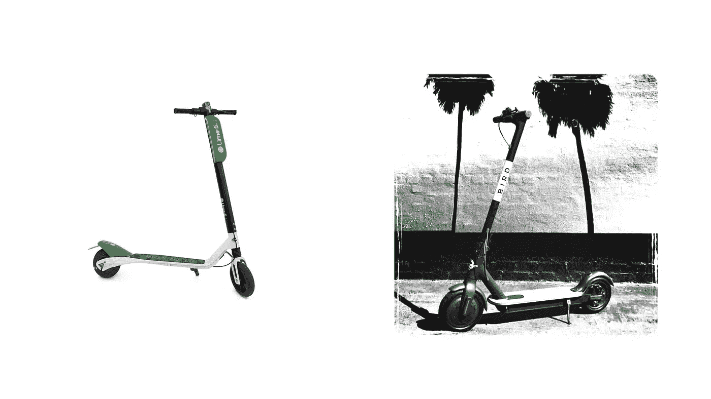
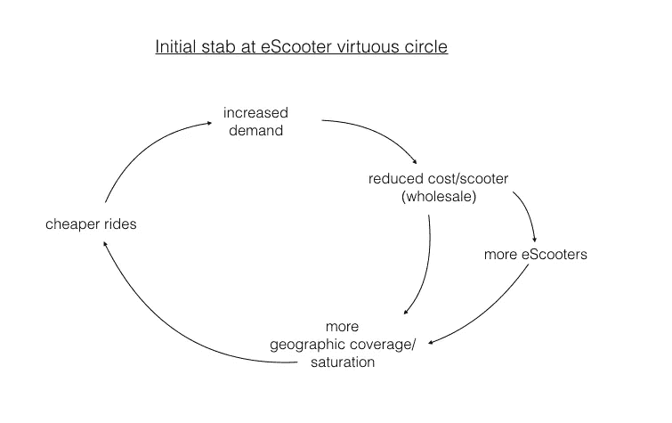

# eScooter 市场 Opp 实际上值得所有的炒作。

> 原文：<https://medium.com/hackernoon/the-escooter-market-opp-is-actually-worth-all-the-hype-aa35b6e0f405>

如果你和大多数人一样，你会被前两家电动滑板车公司的新闻震惊，这两家公司都成立不到两年，尽管似乎有监管问题，但仍筹集了数亿美元。Lime 从 GV(前谷歌风险投资公司，也投资了优步)那里筹集了 2 . 5 亿美元，有消息称 Bird Rides 从红杉那里筹集了近 1 . 5 亿美元。疯狂估值的钱太多了！！*你尖叫*。但是在表面的疯狂背后是有道理的。

## 电动滑板车的系统外壳

当你想到这些车辆服务的“城市”用例时，估值并不疯狂。大多数城市地区/城市正在变得越来越密集，尤其是与它们简陋宽敞的开端相比。有效的交通系统需要有效利用稀缺的城市空间。虽然我们欢呼拼车是一种更有效的交通方式，我们期待自动驾驶汽车，但我们现在需要高效和负担得起的解决方案。正是这种想法可能导致[优步获得跳跃自行车，试图建立自己的 eScooters(我相信](https://techcrunch.com/2018/04/09/uber-acquires-bike-share-startup-jump/))。赛格威本应引领这一未来，但我们知道它的结局是什么。赛格威没有出现这种情况并不意味着它不应该出现。对于它试图服务的用例来说，它只是走在了时代的前面。

## 市场分析

短途交通用例目前包括步行、打车或开车。从创新的角度来看；这正好从“非消费”方面为那些到目前为止可能还没有在短途旅行中使用拼车服务的顾客提供了一种新的服务/产品。从更广的范围来看，是“颠覆性创新”取代了拼车向乘坐优步/Lyft 短途旅行的消费者提供的“过剩”服务。

**对于城市**:对于人口密集、可步行的城市，有意义。对于分散和不太适合步行的城市来说，这是有意义的，尤其是短途旅行。随着各城市争相监管滑板车，更多的是关于能产生多少钱，而不是它们有多讨厌。旧金山限制所有有执照的公司生产 2500 辆小型摩托车怎么样？这将会改变，因为我们正处于谈判的开始阶段。随着一些人甚至推动限制到甚至低于 2500，来自“**新赛格威**”的收入/税收可能会增加到城市，这将确保这些法规很快改变。如果你是罗恩·康韦(或 GV)，你投资了 Lime，你就等着确保进来的市长是商业友好的(你有[他或她的直接电话](https://monocle.com/magazine/issues/114/can-anyone-fix-this-city/)))，以及监管者不会像对自动驾驶汽车等那样对小型摩托车严厉/严格。城市都在从某个地方寻找资金，这是一个不会消失的机会。再加上减少拥堵，我们就有了一个更强有力的制胜主张。*注* : *电力公司也从因 eScooter 充电而增加的能源使用(负载)中获益。*

**对消费者来说**:比打车/拼车便宜，比走路方便。解锁需要 1 美元，每分钟 15 美分。10 个街区的短途旅行大约要花 3 美元。与等待出租车的时间和费用相比，这是非常值得的。虽然对于没有跳上这些滑板车的居民来说可能不方便，但人类适应得很快，我们将适应在任何地方看到它们。事实上，它们是电动的，这为向特斯拉等人承诺的电气化和可持续交通未来[提供了更容易的过渡](https://www.linkedin.com/pulse/why-tesla-needs-apple-upgrade-seyi-fabode)。他们甚至在人口密集的新兴市场城市工作，那里的电力[非常稀缺，因此会抑制电动汽车的普及](https://www.wsj.com/articles/auto-makers-race-to-build-a-cheaper-electric-car-for-india-other-growing-markets-1519381803)。

**对投资者而言**:几乎没有市场不适用滑板车。创业公司购买或制造这些滑板车的成本在 3 个月内就可以收回。算一算，估值并不疯狂，这些投资者很快就被说服了:每天 20 美元(充电时间更少)，5000 辆摩托车/城市，100%使用率/天= 100000 美元/天->；30 万美元/月->；1 个城市 360 万美元/年->；30 个城市 1 亿美元/年(现在奥斯汀市中心到处都是这些东西)。在你意识到之前，你已经有一只独角兽了…

**对于自行车共享公司**:自行车共享公司[筹集了大量资金，监管扼杀了它们成功的机会](https://slate.com/business/2017/12/dock-less-bike-share-is-ready-to-take-over-u-s-cities.html)。也就是说，这些公司是短途通勤用例的试验场，而 [eScooter](https://hackernoon.com/tagged/escooter) 市场现在将为其服务。自行车共享显示，在这一领域还有[份工作](https://amzn.to/2JNpCPI)没有完成。不是每个人都喜欢在主要的城市街道上骑自行车(我就不喜欢)，但是大多数人都喜欢骑踏板车。

**对于公司(Bird、Lime、Jump)** :有了上面的收入可能性，就很容易明白为什么这些公司会跳进这个市场并快速增长。但是管理服务的成本呢([因为它是服务)](https://stratechery.com/2018/the-scooter-economy/)？主要考虑的是硬件，即成本/代步车。[低端滑板车零售价约为 178 美元，高端滑板车零售价约为 1200 美元](https://www.envyride.com/how-much-does-an-electric-scooter-cost/)。人们可以想象，初创公司支付的费用更少，仅在 178 次租赁或 1200 次(即**不到 1 个月的使用时间(扣除充电所需的时间)**后就收回了。

几周前，当我在旧金山的时候，我差点被其中一辆摩托车撞了，就像所有没有立即看到机会的人一样，我抱怨旧金山的愚蠢和傲慢。然后我回到奥斯汀的家，看到 eScooters 在市中心跑来跑去，意识到我完全错过了用例以及下一个巨大的市场机会。这是一个“*优步换 x* ”的用例，实际上复制了拼车的增长可能性。

Borrowing from Bill Gurley’s ‘[How to Miss By A Mile](http://abovethecrowd.com/2014/07/11/how-to-miss-by-a-mile-an-alternative-look-at-ubers-potential-market-size/)’

我对这篇文章的一个预测是？你会在你的城市里看到很多这样的人。

由 HarperJacobs.com 提供动力

*报名参加* [*博学月刊，它被称为“善良的知性兔子洞*！](https://www.getrevue.co/profile/seyifabo)