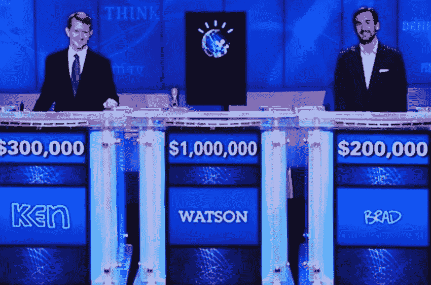

# 组织人工智能与人类对决的基本指南

> 原文：<https://medium.com/hackernoon/the-essential-guide-to-organizing-an-ai-vs-human-showdown-fe435701d755>

Photo by [Andy Kelly](https://unsplash.com/photos/0E_vhMVqL9g?utm_source=unsplash&utm_medium=referral&utm_content=creditCopyText) on [Unsplash](https://unsplash.com/search/photos/robot--human?utm_source=unsplash&utm_medium=referral&utm_content=creditCopyText)

最近，我的公司加入了一个小型但不断发展的人工智能搏击俱乐部。就像之前在[扑克](https://www.theguardian.com/technology/2017/jan/30/libratus-poker-artificial-intelligence-professional-human-players-competition)、危险边缘、[围棋](https://beta.techcrunch.com/2016/03/15/google-ai-beats-go-world-champion-again-to-complete-historic-4-1-series-victory/?_ga=2.244077382.2113748320.1528804224-1388862986.1521364692)、甚至[皮肤病学](https://spectrum.ieee.org/the-human-os/robotics/artificial-intelligence/ai-beats-dermatologists-in-diagnosing-nail-fungus)中的其他人一样，我们的人工智能“机器人”与我们领域的领先人类专家较量，并取得了胜利。

简而言之，我们公司的人工智能首次击败了美国顶级律师，准确地发现了日常商业合同中的风险。

结果就像法律服务解决方案一样迅速传播开来。这个故事被数百家新闻网站报道，包括 [Mashable](https://mashable.com/2018/02/26/ai-beats-humans-at-contracts/#fhH0PTPPhkqg) 、 [Inc](https://www.inc.com/kevin-j-ryan/lawgeex-artificial-intelligence-software-beats-lawyers.html) 、 [Futurism](https://futurism.com/ai-contracts-lawyers-lawgeex/) 、 [The Daily Mail](http://www.dailymail.co.uk/sciencetech/article-5435479/The-AI-outperforms-human-lawyers.html) 、 [The Daily Dot](https://www.dailydot.com/debug/ai-lawyer-competition/) 和 [Popular Mechanics](https://www.popularmechanics.com/technology/robots/a18839164/ai-beats-human-lawyers-at-lawyering/) ，并登上了 [Reddit](https://www.reddit.com/r/Futurology/comments/80b9qc/new_ai_more_effective_at_analyzing_legal/) 的头版。它表明，无论这种摊牌发生多少次，人工智能与人类的较量仍有一些戏剧性。从那时起，我就被我们这个狭窄领域的其他人(在法律领域有超过 67 个人工智能玩家)和其他部门的人要求提供一些关于做类似事情的“为什么”和“如何”的想法。

**为什么会这样**

人工智能与人类的测试已经成为人工智能公司生命周期中的一个 101。做这样一个测试的“为什么”,从根本上与人工智能的简单定义有关。人工智能是一个“学习执行我们通常认为只有人类才能完成的智能任务的系统。”

在过去的十年里，几乎每个行业都经历了技术超越(熟练)人类的时刻。但是展示机器人卢比孔河的穿越仍然是关键的一步。

创造一个动态的竞争是你的研究人员和工程师团队需要团结起来的事情。它也提供了一种简单的方式来明确和独立地肯定你所在领域的转变。尽可能多的玩家重复越多，对人工智能和技术的采用就越好。

**帮助揭开你职业中“魔法”的神秘面纱**

进行人工智能与机器人对决的第二个“为什么”是，在许多职业中，有一种与任务相关的人类固有的“魔力”。历史性的摊牌必然会挑战这一论断。在我们的案例中，它打开了一个百年老专业的眼睛，看到了低效的手工过程。强有力地，它也有助于为持怀疑态度的观众重新塑造 AI。毕业于哈佛大学的商业律师、保密协议专家阿什·谢诺伊是 20 名律师之一，他们在最具律师性质的合同审查工作中与我们的机器展开了对决。她说:“这项测试让我实际了解了技术如何自动化法律专业的一项主要工作——审查保密协议(NDA)。这种发现问题的方式是可信的，与我们几十年来(手动)进行这种工作的方式非常相似。”

**(通过机器人)带回人类**

被算法打败实际上并不会伤害人类。精彩的 [AlphaGo 纪录片](https://www.alphagomovie.com/)，展示了 DeepMind 的 AlphaGo [如何击败国际围棋冠军](https://venturebeat.com/2017/05/25/ai-weekly-alphagos-triumph-shows-the-future-of-machine-learning-isnt-so-black-and-white/)李·塞多尔。最重要的信息不是可怕的机器的崛起，而是追求本身的美丽和人类冠军的高贵，无论是围棋选手还是技术的创造者。

戴密斯·哈萨比斯首席执行官兼联合创始人 DeepMind 从他的历史性成就中回顾了这一点。他在自己的博客上写道:“我们从这次经历中学到了两件重要的事情。首先，这项测试预示着人工智能在解决其他问题方面的潜力。AlphaGo 有能力“全面地”观察全局，并找到人类被训练成不会玩或不会考虑的解决方案。

“这对于使用类似 AlphaGo 的技术来找到人类在其他领域不一定看到的解决方案具有巨大的潜力。其次，虽然这场比赛被广泛宣传为“人机大战”，但 AlphaGo 确实是人类的一项成就。Lee Sedol 和 AlphaGo 团队都在推动彼此走向新的想法、机会和解决方案——从长远来看，这是我们都将从中受益的事情。”

**怎么样:善良的人类+清晰的结构**

但是你应该如何开始考虑创造这样一个挑战呢？首先，找到最好的参与者。创造了 [Libratus](https://en.wikipedia.org/wiki/Libratus) 的诺姆·布朗(Noam Brown)决定性地击败了四名[世界上最好的人类扑克职业选手](https://www.washingtonpost.com/national/health-science/how-computers-were-finally-able-to-best-poker-pros/2017/02/03/3d1fd8c8-e7fa-11e6-b82f-687d6e6a3e7c_story.html)，他说他的第一条建议是:“挑战最优秀的人类，并构建竞争规则，以便人工智能的胜利将毫无疑问地表明人工智能是真正优越的。”

在我们的律师合同中，最大的挑战是找到最好的参与者。如果没有一个无可争议的世界上最好的律师(可能最著名的律师实际上不会如此熟悉我们正在测试的世俗合同的艰苦工作)，我们就能确保每一个被雇佣的律师都有特定的技能和在我们正在测试的经验领域有几十年的经验。这是至关重要的。这无疑表明了人工智能在解决法律问题方面的优越性——在 26 秒内发现问题(每位律师平均花费 92 分钟)。我们的特别测试选取了 20 位顶级公司律师，他们拥有数十年的合同经验，涵盖包括高盛和思科在内的公司，以及包括 Alston & Bird 和 K&L Gates 在内的全球律师事务所。

我们进一步寻找最好的人类“裁判”。我们邀请了美国顶尖大学的顶尖法律学者和资深美国公司律师来检查我们的方法，并聘请了一名律师来监督竞争。如果可以的话，作为进一步的强化，请相关的学者(如果你不是相关的学者)在顶级出版物上发表研究结果(例如 Libratus 在 [Science](https://www.cs.cmu.edu/~noamb/papers/17-Science-Superhuman.pdf) 上概述其研究结果)。

**魔兽争霸 2:建造剧情**

法律很少像电影里那样。观看审查保密协议的现场比赛，我们意识到可能没有观看 Lee Sedol 对 AlphaGo 的汗水焦虑和眼泪的现成电视观看能力。

然而，在电视摄像机的地方，我们使用了我们收集的数据的每一个方面。这有助于在我们的显微镜竞赛中展示律师的日常工作，即使是审查 5 个 NDA 这样一个真实的日常挑战(每个律师被要求审查 30 个法律问题，11 个 A4 纸页面，153 个段落和 3213 个条款)。整个方法被用来创建一个 40 页的研究，我们发表了。为了保持人类的戏剧效果，加上我们的首席技术官和科学顾问提供的冗长的科学解释，我们使用这些数据创建了有吸引力的简单图形。这列出了基本的比赛规则和最终结果。

Part of the AI vs Lawyer infographic used [https://blog.lawgeex.com/ai-more-accurate-than-lawyers/](https://blog.lawgeex.com/ai-more-accurate-than-lawyers/)

通过这种方式，即使是“无聊”的行业也可以申请用他们的技术来对抗人类。例如，保险人工智能玩家柠檬水重新讲述了他们的人机突破的故事，这创造了有史以来最快的保险索赔的[世界纪录。他们通过展示一位名叫布兰登的男子的经历来做到这一点，他的外套(一件加拿大鹅朗福德派克大衣)在 12 月 23 日下午 5 点 43 分的一个寒冷的晚上被盗，而他的人工智能柠檬水付款在 3 秒内得到处理。这比任何人工索赔处理程序都更快、更准确。](https://www.lemonade.com/blog/lemonade-sets-new-world-record/)

**噱头还是最终目的？**

狭窄测试的成功有助于公司转移到其他领域，进一步发展和凸显其人工智能技术的力量。2005 年中期，IBM 在《危险边缘》节目中向参赛者发布了 IBM Watson。它的胜利是 IBM 在医学等领域培训沃森的前兆。在他们技术的初始危险测试中，有一些挑战。时任 IBM 研究部主任的保罗·霍恩(Paul Horn)告诉 Tech Republic:“他们最初说不，这是一个愚蠢的项目，太噱头了，不是真正的计算机科学测试，[而且我们可能无论如何也做不了”](https://www.techrepublic.com/article/ibm-watson-the-inside-story-of-how-the-jeopardy-winning-supercomputer-was-born-and-what-it-wants-to-do-next/)。但是最终整个 IBM 团队都支持它来展示他们的技术。霍恩说:“这些问题既复杂又微妙，只有一种特殊类型的计算机才有机会通过回答这些问题来击败人类”。

人工智能-人类挑战仍然抓住了我们的想象力，因为它继续发展。今年 5 月，谷歌展示了谷歌助手令人瞠目结舌的新功能，它可以拨打电话，并与发廊的工作人员预约。能够在日常人类任务中互动的计算机的细微差别仍然令我们吃惊。就像每个律师都做过合同审查一样，我们所有人都预约过理发，把这项复杂的技术放在一个相关的环境中。

如果人们看看引擎盖下，他们会看到在头条新闻的结果背后是一个团队的人。做这样一个简单的展示需要多年的努力和挫折(大约 20 名研究人员花了 3 年时间达到 IBM 可以获胜的水平，花了 4 年时间让我们的人工智能在最常见的法律合同上斗智斗勇)。然而，这些比赛并没有关注技术的嫁接，而是以一种简单而强大的方式为技术提供了一个清晰的用例。

这也有助于重燃兴趣，重新思考一个古老的领域，无论是古老的围棋还是历史悠久的法律实践。随着 AlphaGo 的宣传，在美国和中国对围棋规则和围棋棋盘的搜索激增，数千万人观看了比赛的直播，新浪微博上“人机围棋对决”标签的浏览量达到了 2 亿次。有 1500 万观众收看了《危险边缘》的重播。我们的[关于我们的人工智能如何打败 20 名律师的报道](https://www.lawgeex.com/AIvsLawyer/)每天被下载数百次。

该挑战成功地弥合了每个领域的技术和人类之间的差距。如果我们从我们的挑战中有一点收获的话，那就是这项强大的技术不应该(实际上目前也不能够)作为一个独立的工具来使用。但是专业人士需要了解快速发展的情况。技术正在改变律师、医生、皮肤科医生和其他人的日常工作方式，让人类能够开展更具战略性的工作。

我们 20 位律师参与者中的另一位说得很好。布朗兄弟律师事务所(Brown Brothers Law)的合伙人贾斯汀布朗(Justin Brown)表示:“作为一名棋手和律师，我将接受特级大师维希阿南德(Vishy Anand)的观点，认为法律的未来是人类和计算机，而不是(另一个)人类和计算机。要么单干不如两者结合。”

乔纳森·马西亚诺是 LawGeex 的公关部主任。

https://hackernoon.com/artificial-intelligence/home