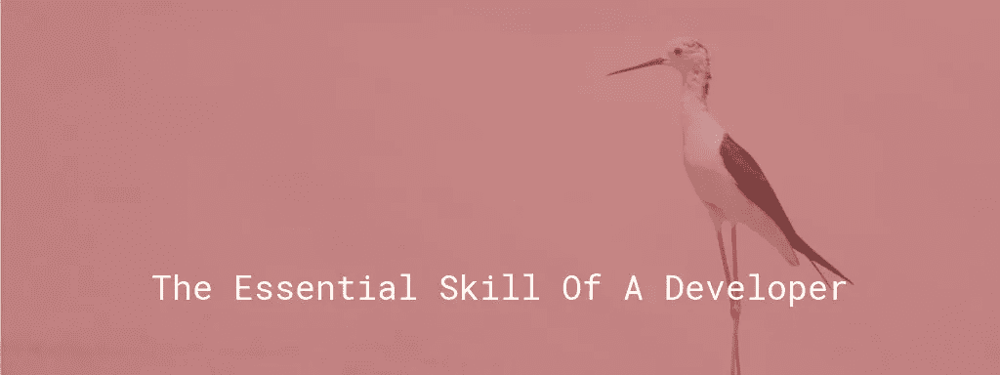
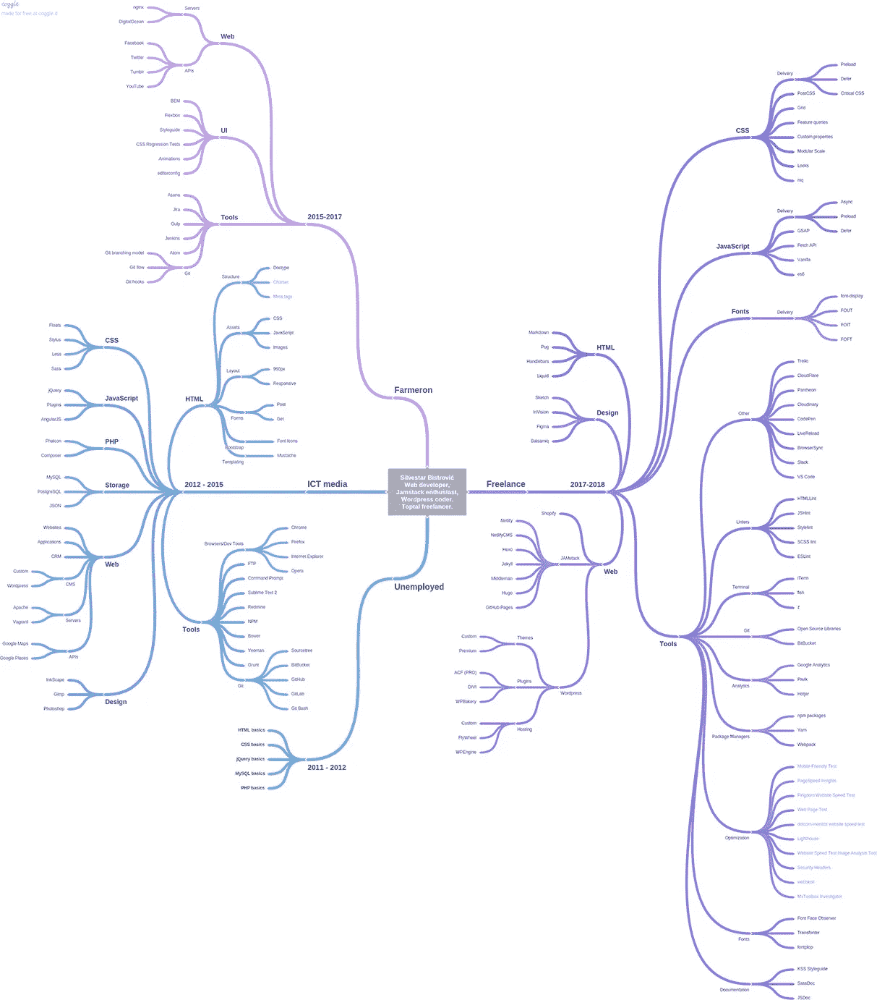

# 开发人员的基本技能

> 原文：<https://medium.com/hackernoon/the-essential-skill-of-a-developer-8f6463b20833>

成为一名开发人员需要特定的技能和工具。我努力列出了我在职业生涯中获得的所有技能、工具和技术，我对它们的数量感到惊讶。在这个过程中，我意识到一个开发人员的基本技能是什么。

我是从一个前端开发人员的角度来写这篇文章的，但是它可以应用于每一个现代开发分支。

# 思维导图

我已经为我在职业生涯中获得的技能和工具创建了一个[思维导图](https://coggle.it/diagram/Wy9XDVsxfi3TaCnK/t/silvestar-bistrovi%C4%87-web-developer%2C-coder-toptal-freelancer)。它的灵感来自于 [Kamran Ahmed](https://twitter.com/kamranahmedse) 的[网络开发者路线图](https://github.com/kamranahmedse/developer-roadmap)。Kamran 的路线图让我思考我学到了什么，我有多少技能，这些技能是否仍然有效和必需。我使用我的[总档案](https://www.toptal.com/resume/silvestar-bistrovic#trust-nothing-but-brilliant-freelancers)作为技能和工具的参考，因为我试图在那里保持我的档案是最新的。

[Click here to open a mindmap in full view](https://coggle.it/diagram/Wy9XDVsxfi3TaCnK/t/silvestar-bistrovi%C4%87-web-developer%2C-coder-toptal-freelancer)

一旦我回顾了所有技能，我决定根据我的就业状况将我的职业生涯分为三个部分。

# 失业年份

当我开始的时候，我不知道我想从我的职业生涯中得到什么。我正在学习 web 基础知识，因为一旦掌握了基础知识，我就有机会成为一名 PHP 开发人员。精通循环、表单、模板和 AJAX 对我来说似乎是不可能的。在几个月的不眠之夜和没有收入之后，我终于觉得我明白了基本原理。

虽然我是在最开始，我知道我想成为一名网页开发人员。使用代码解决问题是痛苦的，但同时也是令人满意的。很快我就会发现，在学习和获得新技能上投入的努力是值得的。

# 组织年份

于是，我开始作为一名 PHP 开发人员工作。凭借我的基础知识，我终于有机会在一个实际项目中工作。我想建立闪亮的网站和强大的应用程序，但我不知道如何去做。我不知道你怎么想，但我觉得世界都要崩溃了。我知道我什么都不知道。如何立项？如何开始？从哪里开始？

在与我的导师进行了无休止的磋商，解决了数十亿个错误和问题之后，我终于开始编写可以工作的代码了。在此期间，我学到的最重要的技能是学会如何找到特定问题的答案。我也获得了一套新的技能，例如，设置 IDE 来帮助我花更多的时间编码，花更少的时间查找错别字，以及如何使用 Composer。

> 每次成功，我都会学到新的东西。每次失败，我都学到了更多。

在我为不同的项目工作了几年后，我开始习惯自己做决定。我在探索解决问题的不同方法。每次成功我都学到了新的东西。每次失败，我都学到了更多。

突然之间，仅仅知道如何编写代码是不够的。使用像 Redmine、Git 和 Bower 这样的工具是提高生产率所必需的。有时候，学习如何使用工具比调试 Internet Explorer bugs 更糟糕。此外，这也很费时间。我不得不把宝贵的时间花在学习上，而不是赚钱。

在我职业生涯的这个阶段，我知道我想在前端开发方面做得更好。很快我换了工作，开始为一家更知名的机构做前端开发。这个组织鼓励主动性，所以学习新的技术和工具，并与团队分享知识是工作的一部分。

这是一个学习的好时机。每月都会引入更多的工具，如果不是每周一次的话。选择学什么和用什么不是一个容易的决定。在对项目或团队没有好处的事情上投入时间不符合任何人的利益。

我也学会了如何向团队的其他成员展示获得的知识。公开演讲，即使是在你知道不容易的团队面前。当我不得不向别人展示一些东西时，我仍然不舒服。我们有团队建设、会议和研讨会，我努力做到尽可能专业。我不得不再次把时间花在其他方面，而不是生产代码。这次不同，因为我知道这是投入的时间，而不是浪费的时间。

# 自由职业的岁月

去年，我开始了自由职业生涯。这是[对我来说很棒的一年](https://www.silvestarbistrovic.from.hr/articles/my-first-year-of-freelancing/)，我和非凡的专业人士一起在非凡的项目上工作。远程工作和连续处理项目意味着要适应新的环境。这就是花费数小时、数天、数月学习新工具的好处所在。

> *学习和使用新的工具和应用程序是工作的一部分。*

在我看来，在过去的一年里，我学到的技术和工具比以前所有的工作都多。我不喜欢了解所有这些，但我也不介意。学习和使用新的工具和应用程序是工作的一部分。

能够适应新环境对我来说至关重要。我并不羞于说我以前从未使用过某项技术或技巧。重要的是不要害怕学习它。在这种情况下，我合作过的大多数人都很灵活，并且善解人意。

# 结论

这里可以引用一部老电影中的一句话:

> *每天在各方面我都越来越进步。*

我学到了宝贵的一课，学习是工作的一部分——一个开发人员不可能知道所有的事情，这是不可能的。永远不要停止学习和提升自己。📚

*原载于*[*www . silvestarbitrovic . from . HR*](https://www.silvestarbistrovic.from.hr/articles/modern-frontend-developer-skills-and-tools/)*。*