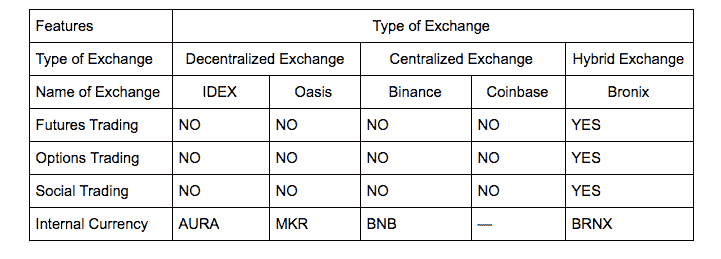

# 密码交换的发展

> 原文：<https://medium.com/hackernoon/the-evolution-of-crypto-exchanges-10bb27f343b4>

与传统市场相比，[加密货币](https://hackernoon.com/tagged/cryptocurrency)交易所的数量现在远远超过了[传统](https://hackernoon.com/tagged/traditional)交易所。并不是所有的银行都提供保证建立独立交易所的服务。在分散交易出现后(像 [Idex](https://idex.market/eth/aura) 和 [Oasis](https://oasisdex.com/) ，挑战已经被密码世界抛出。在 KYCs 和漫长的注册流程形式的最小干预下，这些分散化的交易所是分散化运动的自然结果。

# 分散交易所

随着这种分散化交易所的流动性增加，监管当局的目光也变得更加敏锐。随着每日交易额超过 10 亿美元，这些分散的交易所不再是局外人，而是成长为成熟的主流交易所。一些交易所认为应该集中起来，遵从监管机构的命令，并采用最佳做法来保护用户交易账户中的资金。

分散式交易所在流动性方面的不足，在安全性方面得到了弥补。通过节点的充分分布，这些交换实际上是防黑客的。51%曾经被认为几乎不可能的攻击已经开始以令人不安的规律发生。为了克服这种攻击，交易者必须通过将他们的余额转移到他们的个人钱包来清算他们的交易账户。这个简单的步骤将阻止黑客试图

# 集中交易所

虽然像比特币基地这样的集中交易模仿了传统股票和资本市场其他产品的传统和高度安全的交易的一些特征，但它们严重缺乏核心的安全特征。2018 年，韩国最大的[加密交易所](https://hackernoon.com/tagged/crypto-exchange)bit humb 因将资金存放在“热钱包”中而遭到黑客攻击，这一事实充分说明了此类交易所的安全协议。

客观地看，在 Bithumb 黑客攻击之后，黑客带走了 3100 万美元。传统银行有史以来最大的一次黑客攻击花费了 3000 万美元。这表明了中央交易所面临的问题的严重性。

# 混合交易所

这些问题主要归因于交易所的结构和缺乏监督，导致了另一类加密交易所，即混合交易所的发展。这些交换是集中交换和分散交换的结合。这提供了集中交换的灵活性和分散交换的安全性。

像 [Bronix](https://www.bronix.io/) 这样的混合交易所提供全套交易渠道，如保证金交易、[期货交易](https://www.investopedia.com/articles/investing/012215/how-invest-bitcoin-exchange-futures.asp)和期权交易。那些想使用这一整套交易途径的交易者必须执行强制性 KYC，而那些只想进行小额交易的交易者不需要执行 KYC。

# 顶级加密货币交易所对比

# 结论

很明显，随着公众对加密货币的兴趣上升，对更复杂和先进产品的需求也将增加。今天，期货和期权交易正在充实，但明天，这些将成为 BTC、瑞士法郎和其他替代货币估值的关键驱动力。