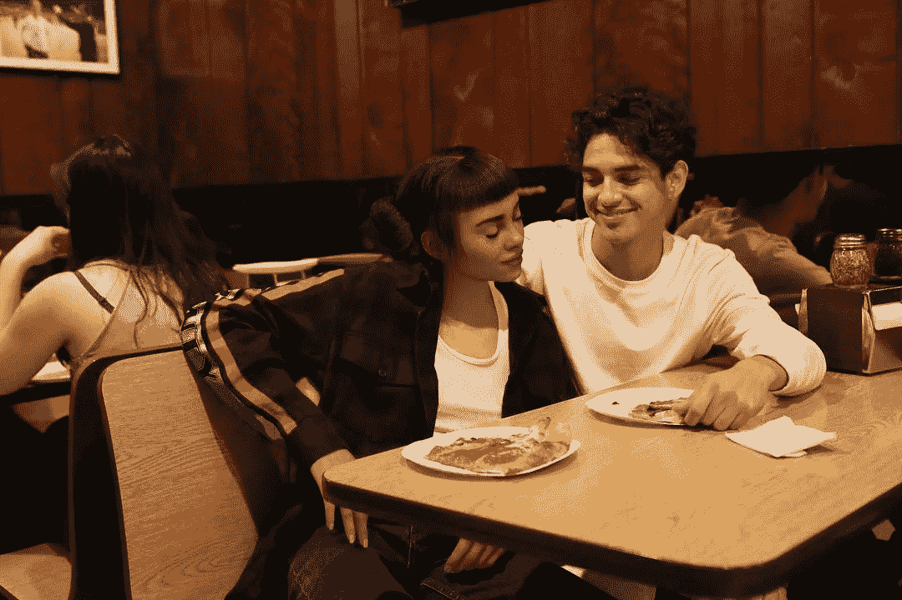

# 混合现实化身的进化

> 原文：<https://medium.com/hackernoon/the-evolution-of-mixed-reality-avatars-690247d9e7d0>

## 我们的世界将充满演员——比我们自己更了解我们的虚拟角色

更新:MagicLeap 宣布了一个虚拟角色演示:

扩展现实将为使用移动应用的陈腐体验注入新鲜空气。最受欢迎的应用类型之一——社交应用——将首先被这种范式转变所改变。今天我们可以看到即将到来的变化的迹象。例如，Instagram 已经有了吸引了 100 多万粉丝的虚拟人

在中国，有些网络名人通过手持摄像机向付费用户直播自己的生活，年收入超过 1000 万美元。这些信息流将很快跳出手机屏幕的微小限制，以全息图的形式出现，在你的客厅里跳舞。然后，舞台开始制作这些大众广播，并为每个付费用户量身定制——每场表演都由人工智能定制

扩展现实和人工智能的结合将会制作出一部精彩的新电视剧，以你为主角，由你最喜欢的名人环绕，全天候播出。

**欢迎来到电视的未来。**

日本在这方面遥遥领先，虚拟角色初音未来已经受到粉丝的喜爱，并以全息影像的形式出现在世界各地:

这些混合现实广播的目标观众正在绕过古典宅男——独自坐着，只与电脑游戏中的女孩互动的极客——转向所有年龄段的 youtube 观众。名人广播的未来，以及由此产生的影响者营销，将是一个定制的、高度相关的、个人化的信息流。

例如，我们可以想象 youtube 名人像虚拟碧昂斯一样走进你的房子，坐在你的沙发上，看着对面和你说话，问你一天的细节。这个场景在最近的电影《她》中得到了巧妙的探索。

它将创造一种新的广播娱乐形式，舞台就是你的客厅，虚拟化的演员在你的私密空间里与你交流。第一阶段将是固定的全息记录，通过增强现实锁定在你房子里的一个地方。例如，我们可以想象 youtube 名人像虚拟碧昂斯一样走进你的房子，坐在你的沙发上，看着对面和你说话。娱乐的范式将从分散注意力转变为成为伴侣。

娱乐将从分散注意力转变为陪伴。虚拟化身已经能够进行奇妙的情感表达(注意下面的虚拟演员是由人类表演驱动的):

当这些栩栩如生的化身由人工智能驾驶时，表演永远不会真正结束。每天结束时，钟声会在你的卧室里演奏我们的卧室用品:

流媒体的下一个阶段——人工智能被用来操纵生殖角色——将是最有趣的。这种娱乐将会在你的房子里制作并播出。

名人将提供化身，然后每个粉丝将享受独特的体验，这取决于他们的环境和个人反应。正因为如此，每个人都会不断地与他们最喜欢的角色分享经历，以防发生什么特别的事情。

这种双向的大众媒体是前所未见的，非常适合混合现实平台。这可能很快成为影响者营销的新方式——流行明星被用来在非常私人的层面上销售一切。

今天，我们已经在开发者演示中瞥见了这一未来:

认为几年后人们会和这些虚拟化身一起生活，用它们来娱乐、陪伴等等，这并不疯狂。

将人工智能化身与算法凝视相结合，将使他们能够理解床、椅子、门的背景，并帮助他们令人信服地与他们的忠实粉丝生活在一起。

Magic Leap 似乎处于这一想法的最前沿，现在公众可以使用硬件和软件来实现这一点:

亚马逊也认识到了 MR 空间中字符的重要性，并推进了其苏美尔人项目:

虽然还很年轻，但亚马逊的苏美尔人为虚拟演员铺平了道路，这些演员可以出现在 VR 或 ar 空间中，并可以通过 Alexa 的自然口语进行交流。

这些混合现实化身将会看到你正在看的同一个房间(通过你的手机摄像头，或者通过你可能在家里安装的另一个永久性人工智能摄像头，亚马逊也有销售): [DEEPLENS](https://aws.amazon.com/deeplens/)

这种算法凝视将让虚拟化身对你的家庭和生活有全面的上下文理解。很可能这些‘bot-eye’摄像头会安装在每个家庭的每个房间，供你的个人 AR 头像透视。亚马逊在这方面再次领先，因为它已经销售了不同尺寸的 Alexa 单元——打算每个房间一个。不难想象，用户会乐于购买带摄像头的 Echo Dots，用于家庭虚拟化身系统。

例如，你可以在你的厨房里放一个人工智能摄像机，用来监视冰箱和炉子，另一个放在你的前门，用来监视你进来。这足以让人工智能驱动的磁共振化身知道你的冰箱里还有什么，提醒你去购物，看你吃了什么，取笑你的饮食，甚至教你做饭。当你不在房间时，它可以看着炉子。它应该很自然地做到这一切。当水壶烧开时，算法凝视会看到蒸汽，头像会通知我。

放在你前门的人工智能相机将确保你友好的化身总是在那里迎接你，当你回家时，他会带着灿烂的笑容。也许这些化身会变成狗、猫或者有商标的卡通人物。

我们不要忘记，有一些受资助的公司正在研究混合现实技术，这种技术不需要用户佩戴或手持任何设备来观看这种现实，全息投影是可能的:[光场](https://www.lightfieldlab.com/)

混合现实结合了计算机视觉、人工智能和数字叠加技术，将允许日常人类行为从你的大脑中卸载到另一个系统，而不需要复杂的基础设施来连接设备或昂贵的机器人来与人类和系统进行交互。在不久的将来，我们很可能会和智能机器人一起生活和工作，但只是在虚拟的意义上。

接下来考虑一下，这些核磁共振头像可能不仅是名人——他们可能是你喜欢的任何人，也可能是异地恋的朋友、已故的亲人，甚至是你的克隆体。这项技术现在就在这里，处于萌芽状态，而且是可能的。这是 Ninjar 正在探索的领域之一，作为 M.R 的未来用例。

我们相信，磁共振化身的应用将不仅仅是为了娱乐，他们也将是客户服务代表和熟练的商人。

例如，如果你想看看一辆新的宝马停在你的车道上是什么样子，你可以通过 AR 在那里放置一辆。(我们在这方面已经做了大量的工作，你可以在这里看到:【ninjar.com/work】T2)

但 A.R .本身并不是最好的推销手段，更不用说参观展厅，让品牌员工情绪化地向你推销升级产品了。

核磁共振头像将成为虚拟销售人员。

我们在 ninjar.com[的部分愿景是，当你把一辆自动售车停在你的车道上时，你应该期待一名自动售车销售员会顺道过来。他们会知道你在看什么，并做出正确的反应——如果你移动手机来拍摄合金的特写镜头，你可以期待他们说“嘿，这些轮子真不错——我可以给你免费升级……”](http://ninjar.com/)

我们听到的对混合现实化身想法的一个论点是“但是他们不能做任何真实的事情——他们不能触摸任何东西……他们不能拿起锤子推倒一堵墙！”。

这是真的，但话说回来——你上一次拿起锤子或使用任何工具来永久改变现实世界是什么时候？对于我们大多数人来说，我们生活在一个对硬件的物理操作已经过时或自动化的世界。食物是用预先煮好的一次性托盘送来的。公寓提供服务，几乎不需要维护。基于家庭的机械维修已成为过去，取而代之的是有计划的淘汰、家电以旧换新和年度升级计划。这几乎就像现代生活在家里留下了一片空白，真实世界的工具和机器人不再是必不可少的。

# 结论

混合现实化身，结合无处不在的人工智能相机，可能是我们在不久的将来进行计算的主要途径。他们将看到我们所看到的，然而他们将拥有超人的智慧、记忆和来自云端的连接。他们会变得非常有用，当他们不在的时候，我们会想念他们。它们看起来会非常真实:

# 额外注释…

但这会是人们想要的真实体验吗？我们从手机应用和社交网络中了解到，欲望很容易被操纵。社交应用设计者使用一种叫做 f . o . m . o——害怕错过——的技术来提高留存率。这种心理把戏让我们不停地查看社交信息，生怕错过朋友的帖子。这种劫持用户思想以增加保留的行为将通过现实的磁共振化身的自然行为得到进一步加强，并考虑到它们将成为我们所有重要信息、友谊和潜在性机会的渠道。

例如，在混合现实化身的世界中，如果我想给你发消息问你一些事情，我可以“发送”我的化身——我的克隆——到你家去问。你可以回答我，我会看到你的化身，你的克隆人坐在我旁边。这种自然的界面可能会让今天的聊天应用看起来非常简单，这可能是脸书投资巨资收购 Oculus 的部分原因。他们意识到社会的未来是先生的

这种虚拟空间充满了可信的化身，这些化身保持并调解着我们和其他人类之间的联系，这种想法是而且应该是可怕的。这个新的界面将成为我们的新闻、我们的朋友、潜在的日期和所有产品销售的真相，并将成为一个强大的平台。信息技术和社交网络的结合，以及通过现实人类的情感展示是独一无二的强大。

在你周围围绕着 MR 头像还有其他可能的负面影响。想想这个事实，当你的手机离你很近的时候，你会变得更傻。发表在《社会心理学》杂志上的一项研究发现，手机的“存在”——即使没有被使用——也会影响简单的精神表现。人们注意到，当用户的手机在视线范围内时，这个人在给定的任务中表现差 20%。想象一下，当被人工智能驱动的化身包围时，你的思维会变得多么懒惰。

你喜欢我们的帖子吗？您可以在[媒体](https://medium.com/ninjar-com)上发表评论并加入聊天

我们希望收到您的来信。在[推特](https://twitter.com/ninjar_com)、[脸书](https://www.facebook.com/Ninjar-1546188488814672/)和 [LinkedIn](https://www.linkedin.com/company/ninjar/) 上找到我们