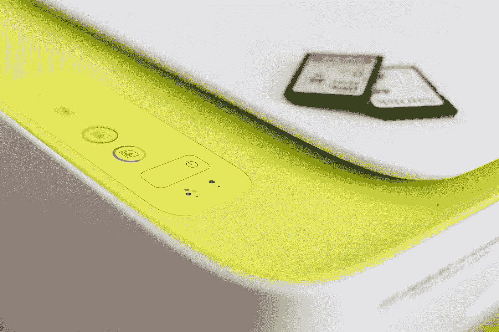

# 移动票务的发展和 2019 年的展望

> 原文：<https://medium.com/hackernoon/the-evolution-of-mobile-ticketing-and-what-to-expect-in-2019-cc3fc1408297>

买到我们最喜欢的节目的票或者我们下一次乘坐火车的票不再像过去那样紧张、不确定、匆忙。

这是因为世界正在向基于手机的票务转变。虽然网上购票已经比亲自或通过邮件购票更容易，但移动售票进一步简化了这一过程。

以下是移动票务的发展历程，以及你对 2019 年这一新兴行业的预期:

**实现最后一分钟购买**

诚然，我是一个临时抱佛脚的人。我最后一刻的生活方式通常不利于购票(过去，我会买不到票，发现票要么卖完了，要么被黄牛以高价卖出)，所以我根本不去看很多演出或比赛。

移动售票已经发展到不仅能让最后一分钟的购买成为可能，而且相当容易和没有压力。

几乎所有的移动票务应用程序都允许用户在他们喜爱的赛事门票有售时，或者他们想要的门票价格特别有竞争力时设置提醒。

就连公共交通这个在向移动领域转变的过程中往往有些滞后的行业，也因为移动票务应用而变得更加用户友好。由 [Genfare](https://www.genfare.com/fare-management-solutions/mobile-link/) 、 [Infeon](https://www.infineon.com/cms/en/discoveries/smart-public-transport-mobile-ticketing/) 等公司开发的此类应用减少了公共交通乘客提前计划的需求。由于乘客可以接收移动警报和实时更新，他们能够在最后一刻做出战略性的交通选择。

移动售票选项也有助于人们在最后一分钟购买，因为它加快了购买过程。买家可以安全地保存他们的个人信息，甚至他们的信用卡信息，这样他们就不必花时间填写在线表格，如果他们忘记了信用卡，也不会被阻止购买。这对于公共交通票务选择也很有用，因为乘客不再需要[寻找零钱](https://mashable.com/2018/05/12/public-transit-mobile-ticketing/?europe=true#HDvcN6IhHsqy)来算出准确的票价。

随着移动售票平台竞相变得更加精简，未来一年，这类平台将调整自己，以适应最后一刻的买家——从发送重要的、时间敏感的警报通知到加快购买过程本身。

**促进决策过程**

在线购票选项已经存在很长时间了，当用户在谷歌上快速搜索游戏或音乐会门票时，它们通常是用户导航到的第一个页面。但是许多网站经常有太多的选择——事实上，太多了，以至于搜索一张票是一个冗长而耗时的过程。

当用户被迫面对一个漫长的决策过程时，他们很容易推迟购买而不是立即购买。想想买机票有多耗时，很大程度上是因为有太多的选择。

与在线售票相比，这是移动售票取得巨大飞跃的一个领域。移动票务目前的趋势是使用算法向用户提供最佳的可用选项，而不是向用户提供过多的信息。此外，移动票务应用鼓励用户在同一个平台上进行所有搜索，这样他们就不必浏览几个不同的网站。

**跳过可怕的印刷阶段**

虽然打印看起来像是事后的想法，被整个购买过程所掩盖，但它通常是在线售票的最大障碍。

当移动售票首次作为一种选择出现时，大多数网站和平台仍然要求您在确认后打印您的机票。但是现在，许多不同类型的票——包括飞机票——根本不需要打印。

移动售票应用抓住了这一趋势，并试图消除对打印机的需求，努力使这一过程完全数字化。移动票务应用 [Gametime](https://gametime.co/) 的创始人兼首席执行官 Brad Griffith 声称，在自己遇到印刷问题后，他受到了创作这款应用的启发。结果是一个平台提供了一个纯粹的移动选项，一个完全消除了打印过程的平台。

随着打印阶段的逐渐消除，用户也发现他们可以用纯数字的方式向朋友和家人发送门票。在接下来的一年里，看起来越来越多的平台将使你能够完全数字化，让你在应用程序上保存门票，并通过电子邮件或短信发送。

**总结**

如今，所有的在线活动——从基于应用的功能到谷歌搜索——都在向手机转移。票务行业也在向移动领域转移，进一步简化了票务流程。正如在线售票消除了传统购票的障碍一样，移动售票也消除了在线购买中一直存在的障碍。