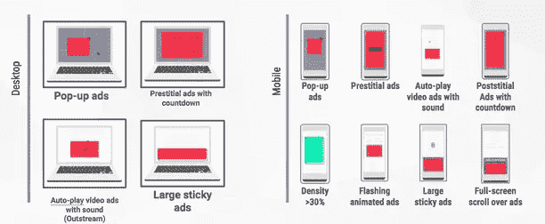

# 在线广告拦截器的演变

> 原文：<https://medium.com/hackernoon/the-evolution-of-online-advertisement-blockers-1518481154f6>

自从广告开始以来，人们就一直试图避开广告。在早期的广告形式中——面对面的、印刷的、广播的和电视的——广告更容易被忽视，也不太可能太具侵扰性。然而，互联网改变了这一切。

随着互联网在所有人群中的使用越来越多，对销售和潜在客户的需求越来越高，以及新技术允许更有针对性和更积极的外联，侵入式在线广告无处不在。你最喜欢的网站可能在顶部、底部和侧边栏都有广告。尝试在谷歌上搜索一个研究主题或你正在研究的东西的新配方，可能会把你带到一个会弹出广告攻击你的网站。在线广告的自信变得如此糟糕，以至于许多消费者几乎感觉他们受到了攻击。这导致了一种新的防御手段——广告拦截软件的迅速传播。

如今，广告拦截已经被广泛采用，T2 有 6 . 15 亿台设备安装了这种软件。这个数字只会继续增长——2017 年[德勤调查](https://www2.deloitte.com/content/dam/Deloitte/global/Images/infographics/technologymediatelecommunications/gx-deloitte-tmt-2018-adblocking-media-report.pdf)发现，广告屏蔽的用户在一年内几乎翻了一番。但是广告拦截器已经使用了十多年，提供了许多不同的方法来保护消费者免受“恶意”广告的侵害。

这种趋势是从哪里开始的？广告拦截器是如何进化成在今天的消费者中如此受欢迎的？

**开端:外部应用**

广告拦截器起源于外部应用程序，要求用户直接在设备上下载并安装软件。一些最初的版本甚至要求用户不断地运行程序才能有效。第一个流行的广告拦截器是 Ad Muncher——它开始于大约 20 年前，是一项通过从 Windows Sockets API 导出函数来修改从网站下载的内容的实验。众所周知，这个程序很轻便，非常容易使用，而且能有效地去除大多数应用程序上的广告。

但在当时，广告拦截工具被认为是一种奢侈品，而不是一个常规的可用程序。例如，Ad Muncher 本身只需 29.95 美元，外加每年 19.95 美元的订阅费(尽管该程序的 v5 版本今天是免费的)。此外，该程序在屏蔽 HTTPS 网站的广告方面效果不佳。许多其他产品也有高成本、严格的安装要求或类似的缺点，使得普通消费者很难使用它们。那是在计算机比现在贵很多的时候。

随着消费者对互联网的了解越来越多，以及在线广告技术的改进，人们需要更有效、更简单的广告拦截器，这导致了该领域更多的形式和创新。

**崛起:扩展**

2002 年，一名丹麦大学生为凤凰浏览器(后来被称为 Mozilla 的 Firefox)开发了一个小型浏览器扩展。该扩展可以很容易地添加到浏览器中，并自动运行以隐藏所有在线广告，使用户看不到，这很快使它在 Mozilla 社区中流行起来。

几年后，该项目被一名德国软件开发商接手，并升级为当今最流行的广告拦截工具之一:Adblock Plus (ABP)。该计划也得到改善，以完全阻止广告的要求。这超出了简单的广告隐藏原来的节目表演，完全阻止广告，甚至为用户加载。

这使得 ABP 有能力做一些它的前辈不能做的事情，比如屏蔽 HTTPS 网站上的广告，以及屏蔽恶意广告和恶意软件。该计划还允许用户选择将某些广告或网站列入白名单。虽然 ABP 最初只适用于 Google Chrome，但 ABP 扩展的好处和免费性质很快使其成为消费者的热门选择。随着用户群的增长，ABP 最终扩展到了其他浏览器，包括 Firefox 和 Safari。

总部基地的异军突起将它置于聚光灯下。许多人开始意识到过滤或屏蔽侵入性的在线广告是一项需求很高的服务——包括浏览器公司本身。

**今日:内部整合**

随着 ABP 逐渐被主流接受，消费者在屏蔽广告方面的行为开始转变。许多在线广告不仅具有侵扰性，而且极大地影响了网站的性能和速度。用户不想屏蔽广告，不仅仅是因为它们令人讨厌，还因为严重的隐私和安全问题。最近的研究表明，30%的用户出于安全原因使用广告拦截器，64%的用户选择 T2 速度作为浏览互联网时最重要的特征。

随着对不受臃肿或有害广告影响的安全快速网络浏览体验的需求日益增长，大型浏览器开始采取行动。2015 年，ABP 与 Maxton 达成合作，将其功能直接集成到网络浏览器中。这使得 Maxton 浏览器成为第一个将内部广告拦截集成到原生浏览程序中的浏览器。谷歌和苹果等公司也紧随其后。

*Image from The Verge,* [*Google’s Chrome ad blocking arrives today and this is how it works*](https://www.theverge.com/2018/2/14/17011266/google-chrome-ad-blocker-features)

谷歌最近宣布将为 Chrome 启用内置广告拦截器[。与 ABP 类似，这种集成的广告拦截器可以过滤广告并阻止它们加载。然而，谷歌明白互联网需要广告来维持免费服务。因此，他们的集成广告拦截器只会阻止特别是攻击性的广告，如弹出广告，大型粘性广告和自动播放声音的视频广告。我们公司对](https://www.theverge.com/2018/2/14/17011266/google-chrome-ad-blocker-features)[海雀浏览器](https://www.cloudmosa.com/apps/)采取了类似的方法——保护我们的用户免受令人沮丧的侵扰或恼人的广告。

在目前由广告主导的网络世界中，技术创新者不断想出不同的方法来屏蔽广告。2018 年似乎标志着创新和发展的一年——无论是更好的广告还是广告屏蔽——但这还远远没有结束。下一个十年可能标志着广告津贴、订阅、新的交付模式甚至更多的出现。广告和广告屏蔽格局将继续发展，我们很高兴能成为这一转变的一部分。