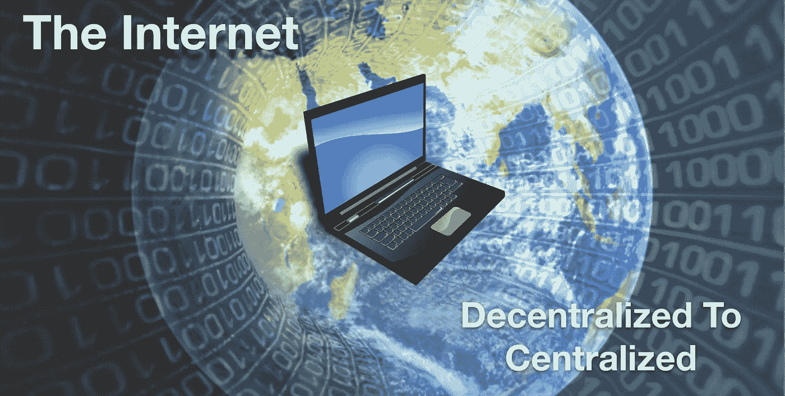
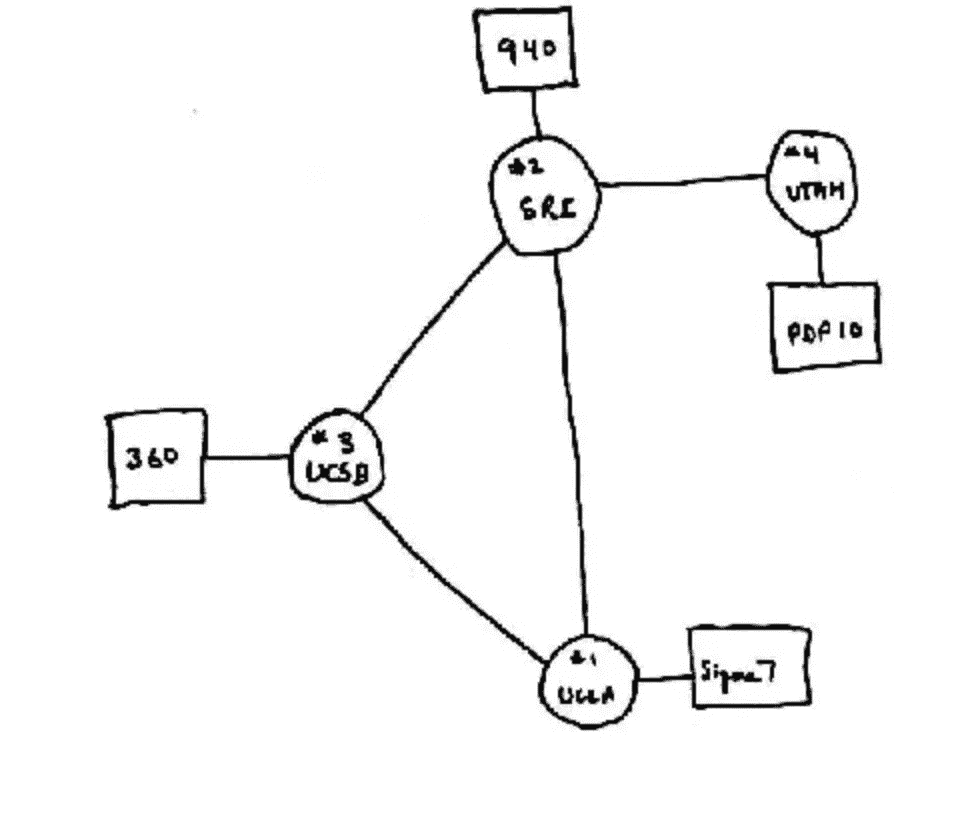
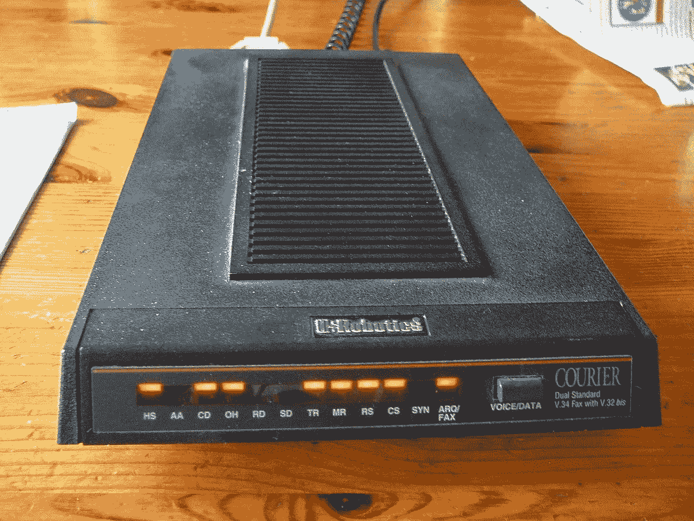
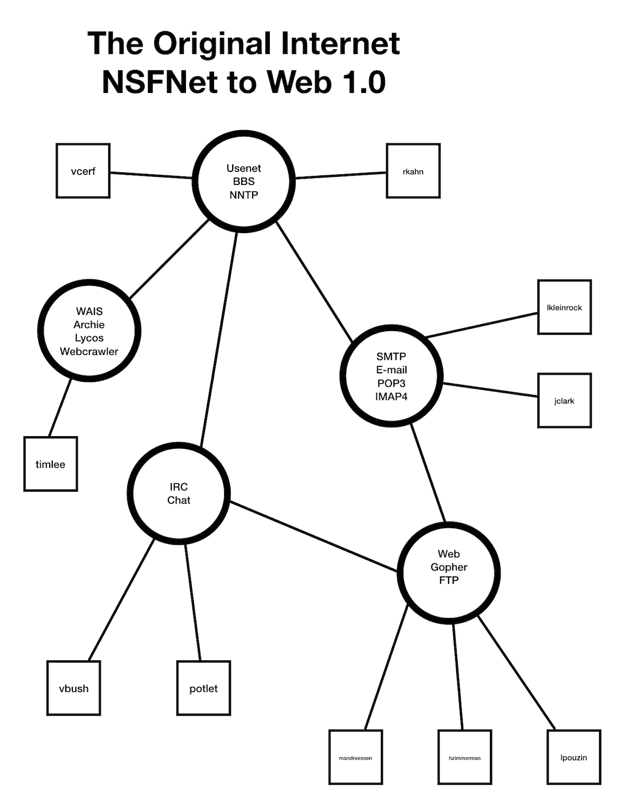
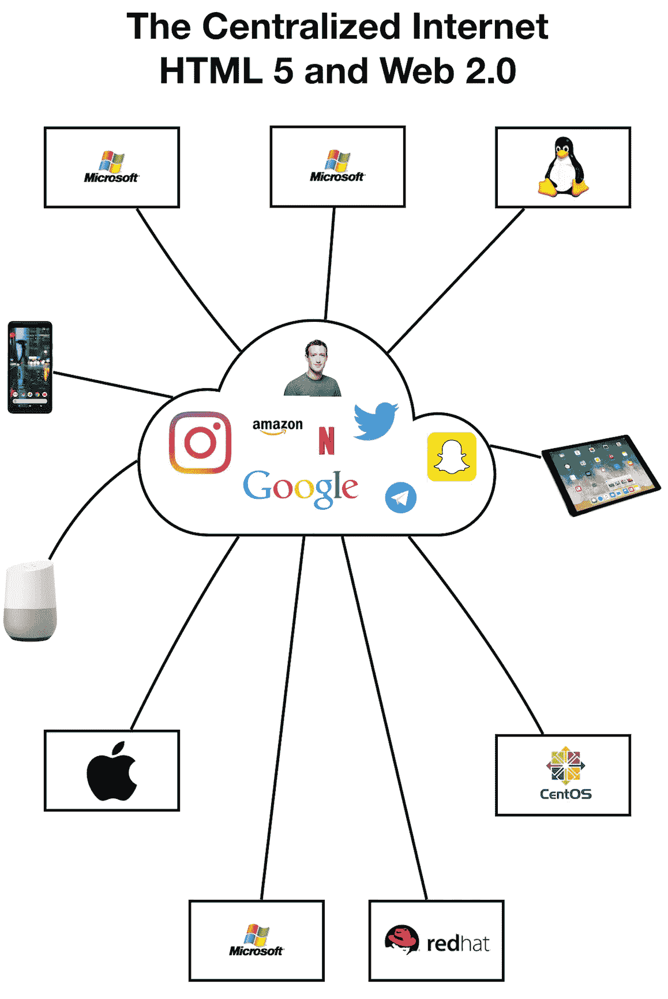

# 互联网的演变，从分散到集中

> 原文：<https://medium.com/hackernoon/the-evolution-of-the-internet-from-decentralized-to-centralized-3e2fa65898f5>

互联网是我们今天无处不在使用的数字信息高速公路。“在线”一词已经成为互联网的同义词。我们实际上几乎总是在线，有时我们并没有意识到这一点。这是因为互联网服务提供商(ISP)和移动电话提供商为我们提供了透明的服务。我们的互联网计划和智能手机服务提供 24/7/365 的互联网数据访问。

我们不仅仅使用互联网进行网上购物和一般性研究。我们还使用互联网支付账单、回复邀请、上传日常生活照片，甚至订购食品杂货。它已经成为现代生活的必需品，似乎我们离不开它。如果互联网突然关闭，将会引起人们的焦虑，他们的生活已经变得非常依赖它。

The Internet is now provided from data centers run by Internet Service Providers.

博客作者和视频博客作者、社交媒体影响者和在线游戏玩家构成了在线社区的很大一部分。这表明互联网现在已经成为日常生活的一个重要部分。这是由于商业化以及现代生活的方方面面都围绕着它。这就是导致互联网集中化的原因。这种集中化现在由提供 it 服务的大公司控制，然而最初的互联网并不是这样的。

为了理解，最初的互联网的计划是不被集中。事实上，这是美国国防部的一个项目，旨在建立一个计算机数据通信网络，以抵御不可预见的事件和灾难，如战争。因此，它必须是分散的，这样，如果系统的一部分发生故障，其余部分仍然可以正常工作。它还必须能够使用对等互连进行通信，而不依赖于单个计算机。另一个重要的考虑因素是，计算机必须在不同的系统之间具有互操作性，以便更多的设备可以成为网络的一部分。

这一切都始于 1969 年 10 月 29 日的 **ARPANET** ，当时第一条成功的信息从加州大学洛杉矶分校的一台计算机发送到了斯坦福研究所(SRI)的另一台计算机(也称为 node)。这些计算机被称为接口信息处理器(IMP)。

This was the sketch of the original Internet, developed by the DoD ARPA (Advanced Research Project Agency). The computer nodes connected the Stanford Research Institute, UCLA, UCSB and the University of Utah. (Source: Computer History Museum)

最初，ARPANET 不仅使军方受益，也使研究机构受益，所以尽管它是一个军事项目，但它起源于学术界。该系统发展缓慢，因此没有立即用于商业用途。相反，在 20 世纪 80 年代早期，通过 NSF(国家科学基金会)的倡议，它被大学和研究机构采用。它被称为 NSFNET 项目，其目的是促进研究和教育。最好的方法是使用一个互联的计算机网络，它可以提供一种协作和共享信息的方式。这提供了一个包括计算机科学网络(CSNET)在内的主干网，将学术界的计算机科学研究联系起来。

最终 ARPANET 和 NSFNET 将退役，从而为互联网的商业化铺平道路。它也被称为“互联网”，是“互联”和“网络”的一种组合，此后一直被称为互联网。这将涉及由 IETF(互联网工程任务组)维护的标准的开发，许多组织，如 IEEE(电气和电子工程师协会)、IESG(互联网工程指导小组)和 ISO(国际标准化组织)都做出了贡献。

在我看来，如果没有 5 项重要发展的成功，互联网就不会被广泛采用。这些是:

1.  ***TCP/IP*** —传输控制协议/互联网协议是互联网上使用的数据通信协议的标准集合。它是由罗伯特·卡恩和温顿·瑟夫在 DARPA(国防部高级研究计划局)下开发的。它现在是互联网事实上的标准，由 IETF 维护。这些协议给了互联网电子邮件、文件传输、新闻组、网页、即时消息、IP 语音等等。这就像是计算机在网络上相互交流时使用的一种通用语言。
2.  ***万维网和 HTML***——这归功于蒂姆·伯纳斯·李，他开发了一个系统，允许文档链接到其他节点。这是超文本的开始，超文本是存储在网络中其他计算机上的信息的链接。用户不再需要知道实际位置或计算机名称就可以通过使用 HTML(超文本标记语言)超链接来访问资源。因此，可以访问称为网站的资源，该资源提供可以用鼠标点击的这些链接。整个链接系统被称为万维网，要访问网上的资源，必须输入“www ”,然后输入域名“servername.com”。
3.  ***浏览器***——如果没有一个叫做浏览器的软件程序，万维网将毫无用处。web 浏览器的早期开发始于 1993 年的 Mosaic。在浏览器出现之前，有一个叫 Gopher 的软件提供访问网站的功能，但是这个软件很繁琐，而且对用户不友好。最终，像 Mozilla 和 Netscape 这样的新一代浏览器发展出了更强大的功能。实际上，正是微软在 1995 年推出的 IE 浏览器导致了万维网和互联网的广泛应用。
4.  ***搜索引擎***——为了从互联网上获取信息和内容，需要一个搜索引擎软件。早期的搜索始于 Gopher。当基于浏览器的搜索引擎出现时，它变得不那么流行了。其他基于网络的系统如 Lycos、Yahoo 和 Webcrawler 也在发展。然后，谷歌在 20 世纪 90 年代末出现，成为最受欢迎的搜索引擎。它简单快捷，为用户提供了在互联网上获取信息的最佳途径。“谷歌”一词现在成了互联网搜索的同义词，也是最著名的搜索引擎。
5.  ***互联网服务提供商*** —早期的互联网需要一个连接到电话线的拨号调制解调器，数据速度为 14.4–28.8 kbps。这足以满足 80 年代末和 90 年代初的数据需求，因为大多数互联网都是基于文本的。随着互联网越来越受欢迎，企业开始采用它，更多的内容需要更快的数据速度。这导致互联网服务提供商(ISP)开始像美国在线(AOL)一样通过邮寄免费 CD 软件来鼓励用户注册捆绑服务。关键是获得一个电子邮件地址和一小时免费上网时间。ISP 通过提供速度更快的 DSL 和 ADSL 服务来替代拨号，从而不断改进服务。DSL 服务的速度提升至 128 kbps。然后，有线电视公司使用电缆调制解调器提供更快的互联网速度，这就是所谓的宽带服务。该基础设施由电信公司和有线电视巨头建造，旨在提供更快的速度，使用户能够流式传输视频、聊天、浏览网络上的活动内容、视频会议和更快的数据下载。基于 DOCSIS(电缆数据服务接口规范)的电缆调制解调器速度提供 20 到 100 Mbps 甚至更高的速度(取决于用户电路上连接了多少用户)。

当互联网在 20 世纪 90 年代初刚刚起步时，基本上是大学生和研究人员。用户可以通过串行端口将一种称为调制解调器的设备连接到他们的计算机上，并使用拨号服务。互联网是通过电话线连接的。要访问互联网，所有用户需要做的就是知道连接的计算机的电话号码。从这台计算机，用户可以建立到其他计算机的连接。这台计算机被称为服务器，为用户提供基本或特定的服务。这就是所谓的客户机/服务器体系结构。用户可以拨号到学校的电子邮件服务器来检查邮件。然后，当用户需要做研究时，他们可以断开连接并拨号到 Gopher 服务器。互联网的组织非常混乱，高度分散。

The dial-up modem was the original device used to connect to the Internet. (Photo Source: Wikipedia)

根本没有中央权威，每台计算机都是相互独立的。如果一台服务器不工作，用户总是可以拨号到另一台服务器。许多早期的互联网用户访问所谓的公告牌服务(BBS ),这是一种托管电子版公告牌的服务器。这是一个寻找某些利益集团信息的地方。用户可以通过这项服务认识其他人并与之合作。由于更多的社会互动，这使得像互联网中继聊天这样的消息传递程序流行于实时通信。最终像 USENET 这样更大的服务开放了，这些服务通过论坛或新闻组提供更多的信息。

用户还使用了一种叫做 FTP 的服务，这种服务允许他们上传或下载文件。这对于需要交换数据文件的研究人员来说非常重要，因为这些数据文件可能太大而无法通过电子邮件附加。这种类型的系统有它的缺点。如果包含信息或用户电子邮件的服务器出现故障，那么这可能是一个大问题。大多数大学都有备份数据，但其他服务器没有。这也是一个不方便的过程，当你需要时，每次都必须拨号到不同的计算机。这就是互联网服务提供商(ISP)介入的原因。这是被称为 Web 1.0 的互联网时代。当时，互联网主要是网页和超链接内容。通过向用户提供互联网服务，他们可以更方便地使用互联网。互联网的商业化就这样开始了。

互联网的集中化始于其商业化。像 AOL 这样的公司作为 ISP 开始了这一努力。微软随后从 Windows 95 开始将 IE 与 Windows 操作系统捆绑在一起。通过拥抱互联网并将其扩展到 Windows 用户，微软有效地扼杀了竞争。网景公司关门大吉，而其他浏览器如 Mozilla 则被边缘化。免费提供 IE 是大多数用户的出发点，因为他们中的大多数人都有一台运行 Windows 的电脑。既然他们有了访问互联网的软件，那就容易多了。他们接下来需要做的就是订购互联网服务。

虽然一些评论家预测互联网只是一时的时尚，最终会随着 20 世纪 90 年代末的网络泡沫而衰落，但它却蓬勃发展，部分原因是它的商业化。你可以称之为网络效应，更多的用户加入进来，建立更多的联系，允许更多的信息被分享和访问。甚至主流新闻巨头也注意到了这一点，很快他们也建立了自己的网络形象。作为信息来源，互联网现在是新闻媒体的竞争对手。与此同时，AOL 在 2000 年将面临更激烈的竞争，这次来自提供捆绑服务的宽带互联网提供商，而不仅仅是互联网。大公司以优惠的起始价格提供带有电话和有线电视服务的互联网，以吸引更多的顾客。这影响了只能提供互联网服务的较小的 ISP，所以他们不得不关门大吉。这种服务的融合导致了更加集中的互联网。

Tim Berners Lee, the father of the World Wide Web. (Photo Source: New York Post)

可以随便上网的日子已经一去不复返了。现在，大多数用户都需要一个 ISP。随着商业利益随着互联网的使用而增长，出现了许多被称为社交媒体的平台。这将带来 Web 2.0，届时用户生成的内容和网页的互操作性将变得更加动态，并能与更新的设备一起工作。这也是云计算的出现，在云计算中，对服务器的访问被互联网所掩盖。

云是向用户提供服务的服务器的虚拟集合。这场游戏中的巨头是脸书、谷歌、Twitter 以及最近的 Snapchat 和 Instagram。脸书开始利用其影响力收购较小的公司，并使用它们的功能。它试图收购 Snapchat，但却收购了 Instagram，并开始整合 Snapchat 的功能。很明显，拥有超过 22 亿用户的脸书遥遥领先。脸书并不是一个开放的系统，因为他们可以控制用户可以看到什么，这已经成为一个问题。另一个平台 Twitter 也可以审查某些用户，要么是因为违反了他们的政策，要么是因为其他原因。有人抱怨 Twitter 在阻止用户使用该平台时不公平。

The Internet today is available from broadband Internet service using WiFi at blazing speeds now > 10 Mbps for many homes. There is still a disparity in speed among countries, depending on the infrastructure and service providers.

另一个平台如 YouTube 允许用户上传视频。它也是由 YouTube 控制的内容，以便清除有害内容，这是一个好的做法。唯一的问题是，有时内容并不真的有害，但 YouTube 会因违反其政策而禁止它。所以政策总是社交媒体平台强加给用户的东西。这些可能是应用程序，但它们是许多人使用互联网的原因。如果没有这些平台，分享或传递信息的方式将会减少。也许社交媒体平台最大的问题是它们收集用户数据并将其出售给感兴趣的第三方。这都是合法的，因为服务条款(TOS)协议允许平台共享您的信息并将其用于自己的目的。根据脸书自己的 TOS:

**“通过使用或访问脸书服务，您同意我们可以根据不时修订的** [**数据政策**](https://www.facebook.com/about/privacy/) **收集和使用此类内容和信息。”**

这样做的问题是，如果数据落入坏人之手。这可能被恶意行为者用于更不正当的目的。在很大程度上，从社交媒体收集的数据更多地用于品牌锁定用户。第三方最有可能是广告公司、营销公司和研究团体。他们对从社交媒体上获得的冷数据进行分析，并从中收获有用的信息。他们得到的是洞察，即提供这些平台用户数据的信息。

然后，这些信息作为产品出售给品牌商，让他们可以针对用户进行广告和服务。信息并不是真正免费的，它已经成为一种商品，人们愿意为其支付价格。虽然一个集中的平台控制着你提供给它的所有数据和信息，但一个分散的平台不会。在分散平台上也有更多的隐私，因为你的任何数据或活动都不会被监控和收集。

与中央互联网相关的一个话题是美国的网络中立。解除管制的互联网可能对相关的 ISP 有利，但对用户可能不利。网络中立的废除给了 ISP 更多的控制权去做他们想做的事情。他们可以限制速度，控制媒体内容访问，甚至在没有联邦通信委员会(FCC)干预的情况下提高速率。相反，另一个政府机构，美国联邦贸易委员会(FTC)，将负责监督互联网服务提供商。

它仍然不能向用户保证 ISP 不会滥用他们的权力。从商业利益来看，废除意味着 ISP 更有动力去创新和改进他们的网络和服务。再一次，集中的权力给了互联网服务提供商，使得消费者没有多少选择。分散式 ISP 项目有一些概念。一个这样的项目被称为开放互联网社会化项目(OISP)。他们的目标是让社区成员拥有向彼此提供互联网的手段，并为此提供激励。只是这些项目实施的效果如何的问题。

集中式互联网有利也有弊。就优点而言，由于 ISP 提供的服务以及社交媒体平台的流行，它使互联网得以扩展。缺点是，由于它是集中的，用户没有太多的选择。用户对互联网的访问受到他们的提供商和平台的支配。这是一个单点故障，不是最初的互联网设计的目的。大多数地方也没有太多的互联网选择，因为 ISP 可能已经垄断了该地区的市场。这里的安全性也是一个问题，因为数据的集中存储使其很容易成为黑客的攻击目标。用户经历过因为个人信息被一家公司存储而导致个人信息被泄露的黑客攻击。这些信息经常会落入坏人之手。

集中式系统也很容易成为 DDOS 攻击、服务中断和恶意软件病毒感染等破坏性活动的目标。我不会深入讨论互联网的分散解决方案，但我只是指出互联网过于集中的弊端。出于这个原因，一些人担心互联网的集中化。权力的天平向拥有巨大商业利益的 ISP 和平台倾斜。然而，随着这些巨头的成长，他们正在扼杀创新，这使得其他公司更难在同一领域竞争。去中心化为这些问题提供了解决方案，因此对于互联网的未来发展是值得探索的。

推荐阅读:

区块链上的去中心化互联网
[https://hacker noon . com/decentralized-Internet-on-区块链-6b78684358a](https://hackernoon.com/decentralized-internet-on-blockchain-6b78684358a)

为什么一个中央集权的互联网很烂
[https://bdtechtalks . com/2017/10/27/why-the-Centralized-Internet-suck/](https://bdtechtalks.com/2017/10/27/why-does-the-centralized-internet-suck/)