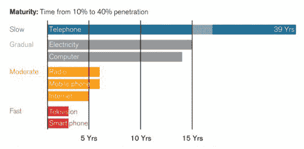
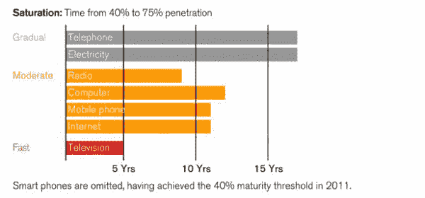

# 激动人心的未来不会到来

> 原文：<https://medium.com/hackernoon/the-exciting-future-isnt-coming-ce5f4f10b5f1>

## 除非是

在你最喜欢的搜索引擎中输入虚拟现实这个词，然后点击新闻标签。去吧，我等着。五大结果之一是关于销售如何滞后，VR 如何死亡，[未来](https://hackernoon.com/tagged/future)如何黑暗无望。第二个结果是关于虚拟现实是如何火起来的，销售额在上升，预计从现在起五年内销售额将达到 1000 亿。

那么，为什么会出现这种差异呢？

部分原因是简单的确认偏差:很容易找到满足你已经得出的任何结论的统计数据。[糖会导致癌症](https://www.medicalnewstoday.com/articles/320156.php)，并且是[体重增加背后的唯一因素](https://www.nhs.uk/news/obesity/is-sugar-causing-the-obesity-epidemic/)，例如，或者[糖实际上对你有好处](https://www.independent.co.uk/life-style/health-and-families/sugar-brain-effects-benefit-health-drew-ramsey-glucose-insulin-fruit-slow-release-a7941911.html)，我们都应该吃更多的蛋糕！(好吧，也许不是最后那部分，但你明白我的意思了。)如果你想要一个销售额下降的标题，你可以[找到一些显示销售额呈下降趋势的数字](https://www.telegraph.co.uk/technology/2018/06/19/virtual-reality-headset-sales-plummet-early-hype-wanes/)。如果你想要一个销售上升的标题，你可以[找到一些显示销售趋势上升的数字](https://venturebeat.com/2018/03/19/idc-vr-and-ar-headset-sales-expected-to-jump-over-50-annually-hit-68-9-million-in-2022/)。(最精彩的部分？那些文章引用了来自同一份 IDC 报告的数字！)

但是有更大的事情在起作用。更复杂的东西。这与我们采用新技术的方式有关。

人们很快会说，随着每一项新技术的发布，技术采用的速度都在加快。请看这张摘自《技术评论》的图表，它展示了美国技术饱和的历史。

但是，如果你看一下市场完全饱和的时间，这些数字会发生相当大的变化。

智能手机从发明到饱和不到十年，而电话用了 55 年。但是越新越快被采用的说法是不正确的。例如，计算机完成同样的旅程(26 年)要比无线电(15 年)花费更多的时间。

再举个最近的例子怎么样？比特币于 2009 年发明，但直到 2017 年 11 月，每比特币突破 10，000 美元，并在大型公共交易服务上可用，它才开始真正窃取头条新闻，并获得非技术受众的欢迎。几乎有[2850 万个比特币钱包](https://www.bitcoinmarketjournal.com/how-many-people-use-bitcoin/)，尽管人们当然有可能同时持有多个钱包。对美国用户来说，这是一个很难推断的数字，但是可以很有把握地说，它还没有达到市场饱和，尽管它已经存在了九年。然而，密码爱好者毫不怀疑这项技术有着不可思议的未来，无论是对货币还是一千多种其他用途。

那么激动人心的未来是否来临的真正答案呢？我们完全不知道。在 VR 的旅程中，要知道它是否会达到饱和，或者它是否会被一些更新、更闪亮的版本所取代，还为时过早。但不管怎样，很明显，这个行业正朝着某个方向发展，越陷越深不太可能让你很快触底。

*最初由雷恩汉德曼发表，为***。**