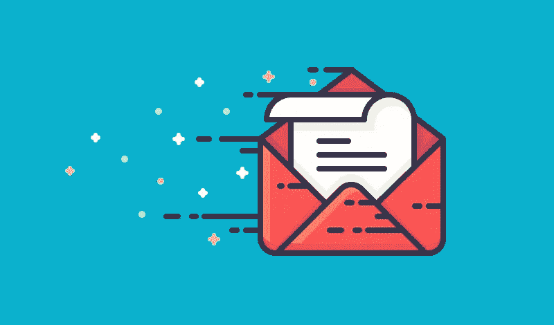
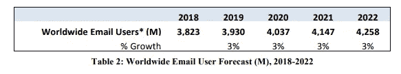
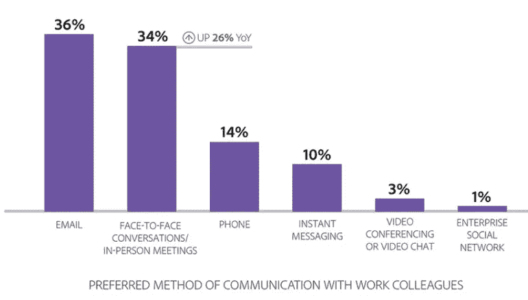
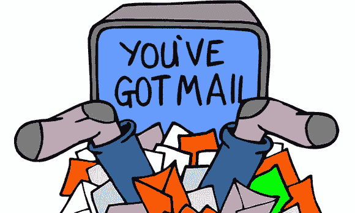
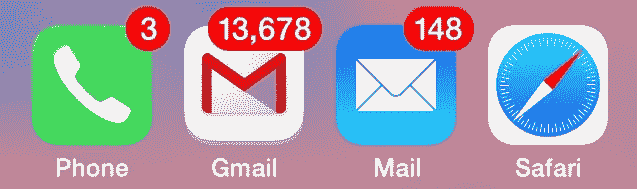
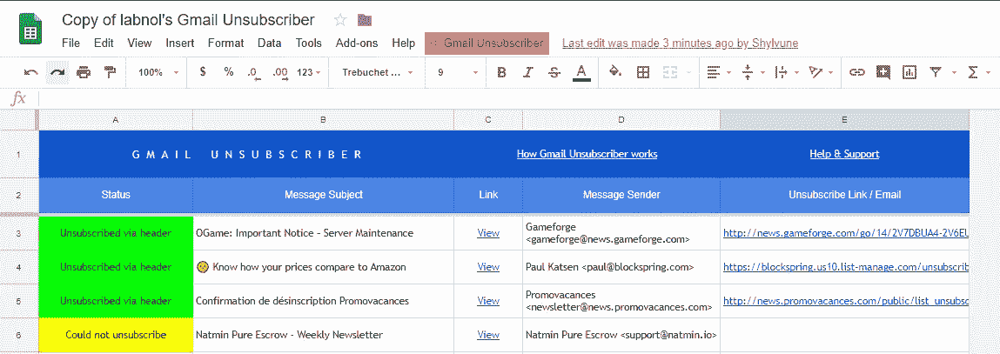
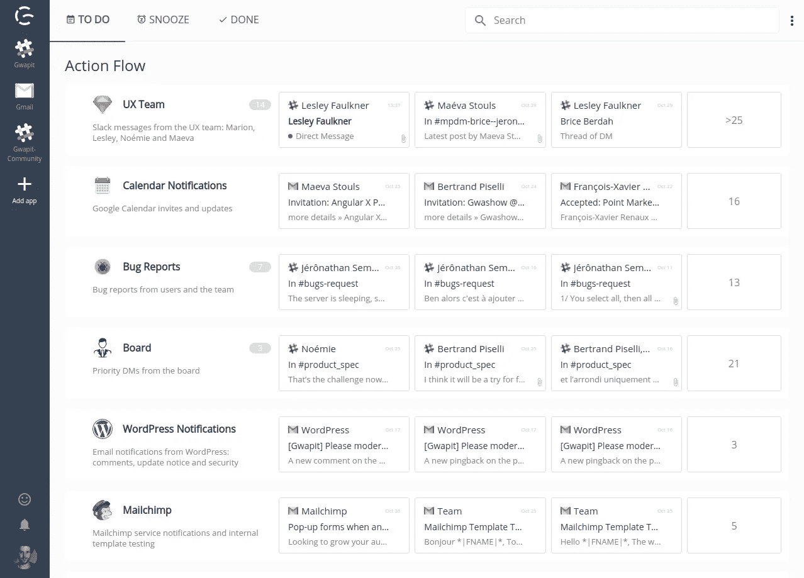

# 详尽的电子邮件管理指南:驯服你的收件箱

> 原文：<https://medium.com/hackernoon/the-exhaustive-email-management-guide-tame-your-inbox-ba1795b5450c>

听说过零收件箱吗？

对一些人来说，这听起来像是生产力爱好者无法实现的梦想。对于其他人来说，考虑到他们每天收到的大量电子邮件，这听起来可能像一个笑话。

如果你必须处理几个高流量的电子邮件地址，你需要建立并坚持使用一个强大的电子邮件管理系统。当然，有人可能会说，最简单的方法就是干脆把电子邮件全部废弃。然而，这既不现实也不实际。即使你把整个组织都转移到 Slack，你仍然需要和外界交流——通过电子邮件。

电子邮件不会很快消失，当然也不会在工作场所消失。考虑一个系统来改善我们管理电子邮件的体验是下一个合乎逻辑的步骤。电子邮件超载带来了巨大的额外压力。即使不考虑时间损失，一个杂乱无章的邮箱也会损害专业人士的健康。

在我们讨论你可以建立的系统，以及你可以用来帮助你跟上它的工具之前，让我们考虑一下大的图景:电子邮件是如何成为主要的工作交流媒介的。

尽管人们试图摆脱电子邮件，转向下一件事，但它已经成为互联网的标准协议之一，就像 HTTP 一样。它是**我们在线身份的基石**:我们用它在大多数(如果不是全部的话)服务和应用上验证自己。

# 电子邮件已经存在

随着 Messenger、Whatsapp 或 Telegram 等 OTT 应用的出现，用于个人通信的电子邮件的使用可能会呈下降趋势。因为这个问题没有经济价值，所以统计数据很少。**总体电子邮件使用指标逐年上升**。2018 年，我们现在拥有超过 38 亿电子邮件用户，年增长率稳定在 3%左右:

[*Source: Radicati*](https://www.radicati.com/wp/wp-content/uploads/2018/01/Email_Statistics_Report,_2018-2022_Executive_Summary.pdf)

我们观察到用户活动的类似趋势，每天发送 2810 亿封电子邮件，增长率类似。这相当于地球上每个人每天发送大约 37 封电子邮件，或者每分钟大约 15 万封电子邮件，令人印象深刻。

# 工作场所的沟通媒介

虽然个人使用可能会减少，但电子邮件的其他使用案例肯定会呈上升趋势，如自动化电子邮件和商务电子邮件。在工作场所，电子邮件仍然是首选的沟通方式:

*Preferred method of communication with colleagues (*[*source:Adobe/ZDNet*](https://www.zdnet.com/article/sorry-enterprise-social-networks-email-still-dominant-form-of-work-personal-communication/)*)*

电子邮件从其卑微和简单的开端发展至今，我们现在已经有了一个围绕它建立的整个产业。想想所有与电子邮件相关的工具和服务:提供商、电子邮件客户端、地址研究和清理工具、电子邮件自动化软件、垃圾邮件检测、电子邮件分类、时事通讯和活动管理器、CRM 软件……我们甚至还没有触及“电子邮件行业”的表面

关于电子邮件使用的统计数据对媒体的未来是光明的，但这些指标还包括电子邮件生态系统中另一个不断增长的部分，也可以说是电子邮件的阴暗面:垃圾邮件、自动促销信息，或者只是占日常流量很大一部分的不必要的电子邮件。

如果你仍然不相信电子邮件的统治地位，或者是怀疑应用程序将取代它的人，我们邀请你阅读我们的论文:[看看电子邮件，这个有 47 年历史的通信协议将让 Slack 进入睡眠。](http://gwapit.com/blog/email/emails-are-here-to-stay/)

# 如何遏制邮件泛滥？

考虑到电子邮件的主导地位，**寻找一个详尽的替代品是不现实的**。无论你的设置是什么，你总是不得不至少部分地处理电子邮件。我们在专业环境中管理的所有电子邮件地址，以及他们收到的大量电子邮件，可能会很快变得不堪重负。这种现象甚至有了一个名字——**电子邮件超载**—[研究人员记录了它的影响](https://www.researchgate.net/profile/Kim_Mcmurtry/publication/264710192_Managing_Email_Overload_in_the_Workplace/links/59da6dcb0f7e9b12b36d8897/Managing-Email-Overload-in-the-Workplace.pdf)。这些包括孤立感、焦虑感和失控感；更长的工作日；更快的工作节奏；任务碎片化；甚至电子邮件成瘾。

为了避免电子邮件超载引发的压力和其他负面后果，你最好做好准备。这当然是工具的问题，但在我们进入技术细节之前，有必要强调一下为什么处理电子邮件的方法很重要，以及如何改进它。我们已经准备了一份详尽的指南，我们将带您浏览一遍。

# 电子邮件管理技巧

在互联网上，你会发现许多应对电子邮件超载及其造成的困扰的技巧。在这个过程中很容易迷失，忘记最终目标。为了保持简洁，我们只涵盖了最有影响力的。

# 上电脑

尽管很诱人，但在平板电脑和智能手机上处理电子邮件几乎没有效率。这种设备最初被设计为**消耗设备**。手机上的电子邮件客户端和桌面上的不一样。让我们不要忘记所有其他桌面专用工具，它们可以帮助你处理你的电子邮件。此外，触摸板键盘不适合快速书写电子邮件，而且不会出现打字错误。

## 手机不适合有效处理电子邮件

在智能手机上设置邮箱是一个严重的生产力风险。如果你是那种会微调自己的通知设置并禁用无用设置的用户，那就去做吧。但是，要知道你是独角兽，那 1%的一部分。

**更改通知设置是一件麻烦事，大多数人不会经历**。见鬼，我们大多数人都不在乎换手机铃声。虽然铃声是无害的，但通知会很快成为生产力的汇点。

电话成瘾对生产力已经够糟糕的了，我们不要再火上浇油了。

> *ds cout 的研究还发现，普通用户每天花 145 分钟在他们的(Android)手机上，进行 76 次电话会话。至于 iPhone 用户，苹果公司最近证实，其设备用户每天解锁手机 80 次。大约每小时六到七次。*

–[指出我们对手机的痴迷](https://blog.dscout.com/mobile-touches)——ds cout 的迈克尔·温尼克

控制你的电话和电子邮件的互动并不一定非黑即白。当然，在某些情况下，您需要在移动设备中访问电子邮件。你可以在手机上设置你的电子邮件账户，然后**禁用所有通知和自动同步**，为这些时候做好准备。你可以偶尔阅读和发送电子邮件，而不会影响你的日常工作效率。

对于我们大多数人来说，手机严重降低了日常工作效率，随着时间的推移，这种情况会导致惊人的时间损失。首先解决这些问题至关重要。我们的下一个话题可能会产生同样的影响，尽管它不那么明显。

# 让你的写作风格为你服务

电子邮件是双向的。在我们讨论如何处理你收到的电子邮件之前，让我们先来谈谈如何确保你在写邮件时不会增加噪音。你的客户、同事和潜在客户会欣赏它，它会渗透到你身上。最终，电子邮件噪音会影响到从发件人到收件人的每一个人，甚至抄送人和密件抄送人。

采用有效的写作风格对你所有的书面作品都有重大影响:这比电子邮件要大得多。我们已经写了一个全面的概述，涵盖了[有效写作以及它如何应用于电子邮件](http://gwapit.com/blog/email/effective-writing/)，以下是它的要点:

## 1.保持简短和切题

注意力是一种稀缺资源:承认它是尊重你的读者的标志。在你的电子邮件中要节约，把琐碎的事情留到喝咖啡的时候。如果你保持高信噪比，你的同事会密切关注你的电子邮件，信息会畅通无阻。

## 2.简洁明了的格式

计算机上的文本有许多特征来组织信息，如标题、粗体、有序和无序列表。利用这些来让你的邮件更容易处理和浏览。请记住，第一稿魔术是一个神话。写作是一个反复的过程。确保你的邮件清晰的唯一一致的方法是**写草稿并无情地编辑它们，**尤其是对于重要的邮件。

## 3.牢记目标/保持行动导向

当你写电子邮件时，试着想想它的目标。什么是成功的场景？在你发送邮件之前，想想你期待的答案，并适应它。例如，当要求开会或打电话时，建议时间窗口，或者当要求输入时，列出预期决策的列表。

如果你想了解更多关于[有效写作](http://gwapit.com/blog/email/effective-writing/)的知识，请查看我们的专门文章，其中包括更多帮助你开始的细节和资源。

有了基础知识，让我们开始解决电子邮件超载的实质问题:实现一个有效的过程来分类收到的电子邮件。

# 设置整理收件箱的流程

第一步是解决你查收邮件时的心态问题。去邮箱里读它就像去脸书“查看订阅”:一个时间冲水的入口。相反，如果你想在处理电子邮件时保持高效，你就必须**带着一个目的去检查邮箱:处理它们**。

一旦我们明确了心态，下一步就是找到适合你的处理方法。但在成功的工作流程中存在一些冗余:

*   **减少收到的邮件数量**:退订不想要的邮件(下面我们有一个方便的工具)，通过有效的写作减少更多的邮件。
*   **找到一个跟进重要邮件的流程**:你可以使用邮箱的内置功能(比如标记或主演)或连接第三方应用程序(Trello、Slack……)来设置提醒。
*   **有效分类收到的邮件:**这通常是使用文件夹/标签来分类你的邮件。你也用电子邮件兄弟姐妹(+如`myemail+newsletter@gmail.com`)

通过我们的专门文章[获得更多关于您可以执行哪种电子邮件处理方法的想法:通过 7 步方法实现电子邮件优先级排序](http://gwapit.com/blog/email/farewell-email-overload-prioritization/)。

无论你的选择是什么，合乎逻辑的下一步是**尽可能自动化这个过程**。这将使你更容易跟上你选择的方法。在我们的下一部分中，我们已经有了为此目的而设计的整个工具箱。

# 电子邮件管理工具

Gmail 是最流行的电子邮件提供商之一。它附带的功能可以帮助你组织和处理收到的电子邮件。我们在我们的指南中详细介绍了它们:[减少 Gmail 收件箱混乱的实用指南](http://gwapit.com/blog/email/inbox-zero-gmail-practical-guide/)。

我们在本文中推荐的一个技巧因其优雅和简单而引人注目。它会让你取消订阅，甚至不必寻找按钮，并通过麻烦。一旦你设置好了，你就可以**取消订阅不需要的邮件，只需给它们加上标签**:电子邮件魔法！

你可以感谢 Amit Argawal 的剧本。

## 高级电子邮件集成

虽然我们不是 Gmail 的狂热分子，但我们也向其他提供商和客户发送邮件。在[我们的文章《编译高级电子邮件技巧](http://gwapit.com/blog/email/automate-your-inbound-email-workflow/)中，我们介绍了将你使用的生产力应用程序与你的电子邮件相结合的不同方法。无论是 Asana、Trello、Evernote、Pocket 还是其他，你都可以将它们与你的电子邮件联系起来，至少让你的流程自动化一部分。

应用内电子邮件集成很有趣，但是 IFTTT 和 Zappier 等工具提供的高级集成和定制选项会让你走得更远。流程可以是你想要的长度，从两步到无限长，这让你可以创建一些非常酷的自动化。

例如，在我们的专门文章中，我们介绍了一个 **IFTTT 小程序，用于在将收据、订单和发票**保存到专门的 Google Drive 文件夹后，将其整齐地组织在 Google Sheets 中。一旦你掌握了逻辑，可能性真的是无穷无尽的。开始吧:[高级邮件技巧:自动化你的收件箱。](http://gwapit.com/blog/email/automate-your-inbound-email-workflow/)

有了我们所有的提示、工具和建议，整理你的邮箱将会容易得多。你可能会被整个组织要求提高电子邮件的效率所淹没，这是完全可以理解的。如果是这样，我们也为您准备了另一个完全不同的解决方案！

# 彻底解决通知过载问题

**电子邮件超载是一个更大问题的一个子集:我们每天从我们使用的所有服务和应用程序中收到的大量通知。遗憾的是，对于你的个人生活，我们没有建议的解决方案；你必须忍受 Messenger、Instagram、Telegram 和其他应用程序的通知，或者找到自己的解决办法。**

好消息是，我们是认真的，并提出了一个全面的解决方案，以专业的方式处理您的通知。Gwapit 保留了您的关注点——您的所有通知都是集中的，优先级出现在您的提要的顶部。你只有在重要的时候才会收到通知(根据你的规则)，并且可以直接从应用程序中快速采取行动。

好奇吗？来试用产品，也许可以和我们一起制作？ [Gwapit 目前处于测试阶段，可以免费获得。](https://gwapit.com/?utm_source=blog&utm_campaign=em&utm_term=emn)我们奖励从一开始就坚持使用我们的用户，并帮助我们改进应用程序。来加入我们吧！

## [在 Gwapit 上报名](https://gwapit.com/?utm_source=blog&utm_campaign=em&utm_term=emn)

*原载于 2018 年 11 月 6 日*[*gwapit.com*](https://gwapit.com/blog/email/email-management-guide-tame-your-inbox/)*。*