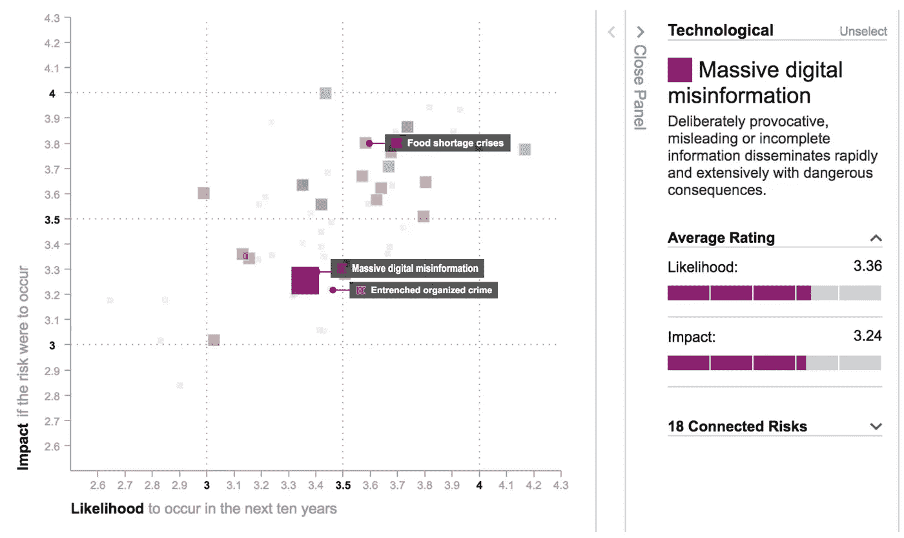
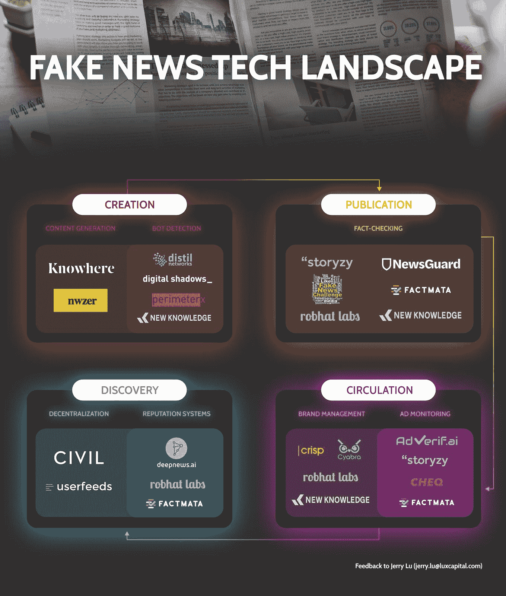
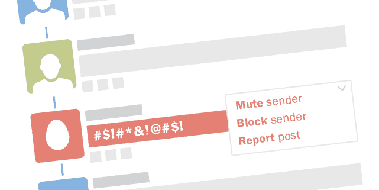
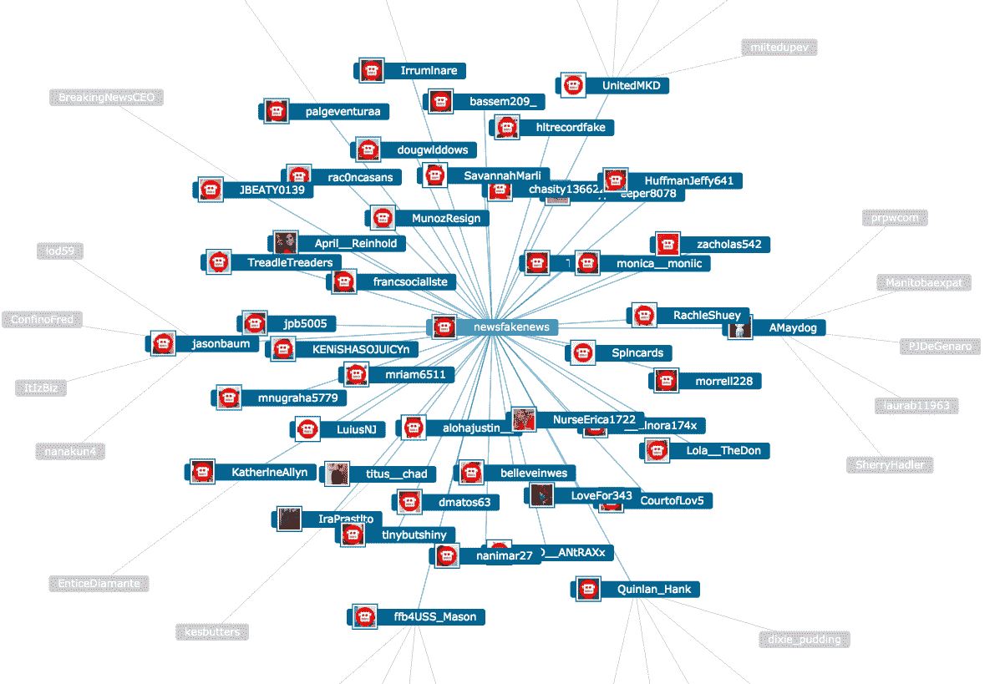

# 假新闻军备竞赛

> 原文：<https://medium.com/hackernoon/the-fake-news-arms-race-448675592803>

自 2016 年美国总统大选以来，“假新闻”一词已经成为我们日常用语的一部分。假新闻在我们的社会中变得如此普遍，以至于我们中最老练的人有时也会上当。它已经达到如此流行的程度，以至于法国总统马克龙最近评论说，“我们必须与假新闻的病毒作斗争。”

事实上，[世界经济论坛](http://reports.weforum.org/global-risks-2013/section-seven-online-only-content/data-explorer/)将这种错误信息的大规模数字传播与未能适应气候变化、有组织犯罪和粮食短缺危机一起列为未来全球最大的风险。

World Economic Forum — [Global Risks 2013 Eighth Edition](http://reports.weforum.org/global-risks-2013/section-seven-online-only-content/data-explorer/)

我们生活在一个信息“[军备竞赛](https://hackernoon.com/tagged/arms-race)”的时代，随着假新闻技术的激增，媒体和技术公司争相开发新的防御手段。

但是谁应该解决这些问题呢？首先要确定的是谁对假新闻负责。有些人喜欢指责社交媒体及其对这一新疫情的反应不力。其他人喜欢补充说，假新闻的本质是极具共享性——就像新闻媒体围绕合法内容创造出新的传播模式一样。

在我看来，提高平台和媒体应对假新闻现象的能力需要采取更全面的方法，确定价值链每个部分——从创作到流通和发现——需要改变的领域。

随着这个问题得到越来越广泛的承认，打击假新闻已被证明是[初创公司](https://hackernoon.com/tagged/startups)的沃土。有很多不同的创业公司在与假新闻做斗争，他们用许多不同的方式在做这件事。例如，一些人旨在应对打击社交媒体平台上的虚假信息的巨大挑战，而另一些人则旨在保护品牌及其声誉免受错误信息的影响。因此，在许多不同的市场中，初创公司都有机会取得成功。

为了指出这些机遇和挑战在哪里，我把假新闻分成四个不同的阶段:1)创造，2)出版，3)流通，4)发现。我将在下面讨论这些阶段，并强调初创公司在每个阶段努力解决各种问题。

# 价值链

# 启动图

## 创造

寻求传播错误信息的攻击者需要创建内容，然后广泛传播。为此，他们可以采用两种广泛的方法:1)创建虚假内容和/或 2)创建用于传播虚假内容的虚假帐户。一家公司攻击虚假内容问题的例子是人工智能驱动的新闻网站 [Knowhere](https://knowherenews.com/) ，它生成不带偏见的新闻故事。查看所有站点(左倾、右倾等。)，Knowhere 根据它发现的内容编写自己的“公正”版本。处理虚假账户，另一家公司[perimerx](https://www.perimeterx.com/)跟踪网站访问者的行为，并使用人工智能来确定哪些是机器人，哪些应该被阻止。在假新闻的核心是一大批分发机器人的论点下，PerimeterX 旨在在恶意机器人攻击之前阻止它们。

## 出版

一旦创建了内容，攻击者就需要在线发布他们的错误信息。大多数打击假新闻的公司都在这个阶段运作，试图解决辨别事实或虚构的挑战。尽管考虑到人类理解的细微差别，这在技术上是一个难以解决的问题，但我认为在这个阶段单独运营的初创公司是项目而不是风险企业，因为没有明确的商业模式，这在很大程度上是一种需要大规模自动化的打地鼠游戏。因此，你会看到草根阶层的努力，如人工智能社区志愿者举办的[假新闻挑战赛](http://www.fakenewschallenge.org/)，促进了工具的开发，帮助事实检查员更有效地完成工作。

## 流通

像任何好的新闻故事一样，虚假内容会在许多不同的平台和渠道上被分享、点赞、转发和传播。虽然对个人消费者的影响可能不会很大，但广告商可能会因为托管不良内容而失去业务，品牌可能会因为显示在不良内容旁边而受损。事实上，雅虎 bright roll 2017 年 6 月的一项研究发现，96%的程序性决策者都担心假新闻，因为这与他们的业务有关。在接受调查的人中，31%的人表示，他们将通过减少与项目合作伙伴的支出来应对这一问题，这些合作伙伴的库存将品牌与假新闻联系在一起。因此，像以色列的 AdVerif.ai 这样的初创公司不仅希望帮助广告公司识别虚假故事，以确保他们的品牌不会出现在它们旁边，而且还希望消除制作低质量内容的坏演员。

## 发现

一条错误信息传播得越广，就越有可能抓住公众的想象力，实现其目标。为了防止发现此类内容，一些初创公司正在采取分散化的方法，即编辑委员会不再决定什么值得阅读:相反，用户、开发者和出版商通过定制排名来产生搜索结果。一家这样的公司是 [Userfeeds](http://userfeeds.io/) ，它正在使用区块链技术来创建透明和可公开审计的内容网络和排名算法。一个去中心化的平台为出版商和应用开发商提供了广告和订阅之外的新商业模式，并有可能改善受众的“有机”内容发现，而不依赖于容易被滥用的社交媒体信号，如链接、喜欢和投票。

# 全栈解决方案

我在上面强调的公司是在单一阶段运营的初创公司，但如果你看看市场地图，你会注意到三家公司更多地作为全栈解决方案运营，其中一个阶段的输出作为输入输入到另一个阶段，以创建数据反馈环路，这是一个竞争护城河。

很明显，随着攻击者继续发展他们的技术并不断创新，防御者也会如此，无论是:

*   [Factmata](https://factmata.com/) 建立事实核查平台的方法，以创建内容可信度分数，用于与广告网络或；
*   [Robhat Labs](https://robhat.com/)‘利用图像数据保护消费者在浏览或浏览时免受假新闻侵害的方法；
*   [新知识](http://newknowledge.io/)构建一个平台来识别协同攻击并为企业提供最佳应对工具的方法。

当我思考为什么这些公司最有可能成功的机会时，我将其归结为三个核心主题:

## 双产品商业模式

类似于计算机病毒在主机间传播的方式，错误信息像野火一样在人与人之间传播。例如，最近麻省理工学院的一项研究表明，推特上假新闻的传播速度是真相的六倍。继续这个病毒类比，我看到公司处理假新闻的方式与他们在 20 世纪 90 年代和 21 世纪初应对反病毒软件的方式相同；赛门铁克是一个适当的消费者+企业商业模式的例子，值得今天复制。

通过提供免费的消费者服务，一家找出并识别假新闻的公司可以以很少甚至没有成本的方式收集数据，并建立一个关于所有有害内容所在位置的知识库。然后，这些数据可以出售给企业，提供一层分析和见解。因此，消费品是向企业销售的一种手段。

一旦服务汇编了这些数据，一个潜在的商业化可能是围绕品牌安全。社交媒体管理/分析市场(声誉管理是其中的一个细分市场)预计到 2022 年将增长到 954 亿美元，主要受信息访问增加的驱动。如今的品牌不知道它们会出现在哪里，也知道它们的声誉会在很短的时间内受损。他们的品牌可能会出现在不受欢迎或不适当的内容旁边，或者其他内容可能会传播关于他们的不公平、欺骗性或不可信的信息。越来越多的公司正在寻找不仅能保护其品牌，还能让他们了解其品牌形象的解决方案。

## 内容上的协调

在这一点上，我已经看到太多的创业公司围绕着事实核查服务开展业务，这种服务是谷歌 Chrome 的某种扩展。将新闻来源列入白名单的问题在于，你将优势拱手让给了现有的新闻来源——这意味着这个领域几乎没有创新。

我更感兴趣的是看到初创公司向内容来源移动，并试图确定活动的协调性，而不是数据的真实性，这是一个小得多的市场。

如果你有一个分享事物的网络和一个分享它们的人的网络，那么分享“有趣”事物的人比被分享的人多几个数量级。内容本身的变化没有用户的变化快。此外，任何识别内容的人都会遇到一个棘手的问题:尽管假新闻很普遍，但识别假新闻是非常主观的。“假新闻”一词有如此多的定义，需要人类理解的细微差别，以至于合格的事实核查成为一种人工智能完全的问题。

因此，最大的改进空间是在检测不同类型的协调，行为的标志。由于网上信息的庞大规模，人们还没有尝试所有可能的方法来在网络中聚集账户。想象一下，不仅通过内容，而且通过比较风格、话题性、时间和其他特征来识别聚类。通过分析故事的网络传播，并试图使用这种启发式方法将事情分类为假的，公司可以避免必须确定什么是基本事实。

## 将真理推向权力

在我看来，旨在创建一个更全面、更值得信赖的新闻平台的公司比那些寻求构建下一代众包事实核查服务或偏见检测算法的公司有更大的成功机会。

推行真理的价值观可以有多种形式。一个例子可能是建立一个信誉分数，该分数指示读者可以在多大程度上信任一段内容。

对于试图做出明智决策的消费者来说，拥有一个识别和区分来自机器人和错误信息的可信信息来源的声誉系统可能是一个非常宝贵的工具。

我把这比作纽约市要求餐馆在菜单上标明卡路里含量。这不仅鼓励纽约人吃得更健康，而且——一个意想不到的后果——也迫使餐馆推出低热量食品。类似地，通过对每一条内容进行声誉评分，用户将能够看到他们可以相信哪些来源和内容，这无形中给关心他们声誉的内容制作者施加了压力。

正如卡路里和营养成分等食品指标的可用性有助于推动更好的决策并在元层面上改变公共卫生一样，扩大规模以增加准确新闻的权威性的指标将推动对多种信息源的更准确思考。

名声产生信誉，信誉产生信任。

互联网已经使出版民主化，但它并没有使为了公共利益的编辑——也就是说，最佳的消费者教育和媒体素养——成为一种价值或优先事项。无论是提出新的分销模式，还是随着时间的推移开发出安全产品，我也很赞同法国总统埃马纽埃尔·马克龙的话，“我们必须与假新闻病毒作斗争。”

最终，我认为这个空间将是媒体和网络安全的融合，在这个空间中，公司将重新思考真实新闻的传播，同时进行技术创新，以阻止假新闻的传播。如果你想一想，病毒和 DDoS 等网络安全攻击的运作方式是一样的，但现在利用了过去八年来取得成果的社交媒体网络。那些最终采取多学科方法进行预防，并寻求解决上述三种机会中的一种或多种机会的初创公司将在假新闻军备竞赛中获胜。

如果你正在创建一家公司，希望加入这场战斗，或者在上述任何一个类别中有一家初创公司值得推荐，请给我发电子邮件到[jerry.lu@luxcapital.com](mailto:jerry.lu@luxcapital.com)。

我喜欢聊天。