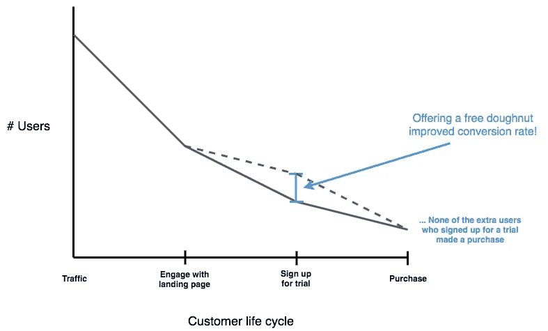
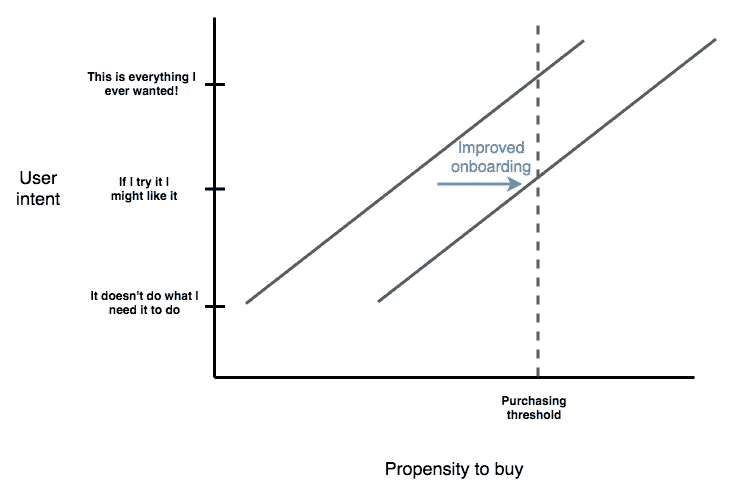

# 提高转化率的谬论

> 原文：<https://medium.com/hackernoon/the-fallacy-of-improving-conversion-rates-14870ae9f51a>

在 SaaS 和电子商务的世界里，我们发现自己不断转向转化率来定义我们的成功。从第一次接触客户，到试用、入职和重复使用，有一个漫长的用户旅程。我们将这一旅程分成几个部分，并组建一个产品团队来改进他们所负责的部分。作为产品人，我们的目标是在客户被交给下一个团队之前，从 A 到 B 获得尽可能多的用户，我们的成功就是用这个转化率来衡量的。能够用单一指标来衡量我们团队的表现是很棒的…在某种程度上。

它是可测量的吗？滴答。
向利益相关者解释容易吗？滴答。

但是当我们慢慢地剖析我们的产品体验，找到引导用户使用我们产品的新方法，并消除摩擦点时，我们来到了一个危险的[现实](https://hackernoon.com/tagged/realisation)。

*是的，我可以提高我的转化率，但我很清楚，用户在生命周期中会越来越少。*

# 是什么让我们陷入这种困境？

让我们把公司归结到他们的本质。公司的存在是为了向他们接触的受众销售产品，产品和受众以及公司可以利用的两个变量。

在电子商务的世界里，观众可以算作你网站的流量。对于应用程序来说，他们是应用程序下载，在实体世界中，他们是路过你商店的人。为简单起见，我们把受众统称为流量。

从流量货币化的角度来看，衡量产品成功的最佳指标是每单位流量的客户终身收入。

显然，用这个衡量是不可行的。顾客会在几个月内重复购物(比如 Airbnb)，在 SaaS，这可能是几年的重复付款。从我们第一次接触客户到他们最后一次接触，不可能进行受控的 AB 测试——在这段时间里，产品已经改变了！我们从脸书广告中获得的客户类型已经改变了！

我们选择清楚地在我们的控制下测量那段旅程的一部分，并且不需要等待大约半年来获得有意义的测试结果。可能是页面登陆注册，登陆到首次购买，或者 2 个月重复使用。

# 收购技巧掩盖了产品的市场适应性

但是困难就在这里。如果你有很强的产品市场契合度，用户会忍受你糟糕的购买体验。高意向用户对你的产品有强烈的需求。

被迫阅读大量文本来理解你的产品的 5 个好处？没问题，在看过第一部后就卖出去了。
页面在手机上看起来很屎？他们会打开一个桌面视图。

这些用户也是最有可能逗留时间最长的人，他们会一次又一次地购买，因为这是解决他们问题的最佳方案。通过改善你的产品流，现在通过漏斗来推高你的转化率的用户是意图较少的边缘用户。他们对你的产品没有强烈的需求，但是你的入职很好，所以他们愿意尝试一下。

自然，他们不太可能成为回头客。通过提高收购转化率，LTV 队列已经下降。

这是不是意味着你做错了什么？当然不是。您现在已经赢得了更多的客户，带来了收入，并创造了推动重复使用的机会。错误在于假设这些用户和你上个月获得的对你的产品有更强需求的用户有相同的 LTV。

如果下一代的 LTV 更低，你能负担得起同样的注册会计师吗？

# 保留还是收购？

如果我们进一步观察这个过程，增加用户的 LTV(更多的重复购买、追加销售和交叉销售)会产生双倍的影响。显然，这增加了现有用户的收入。经常被忽视的是，这可以直接反过来以更高的 CPA 获得客户，并接触到你以前无法接触到的客户。以前你只能通过有机交通接近顾客，现在你可以用蜗牛邮件地毯式轰炸整个城市。如果可以选择，我会选择更高的 LTV，而不是更高的收购转化率。

如果这篇文章引起了你的共鸣，我强烈推荐阅读陈楚翔关于意图守恒的文章，它帮助我将一些模糊的想法转化为这篇文章。