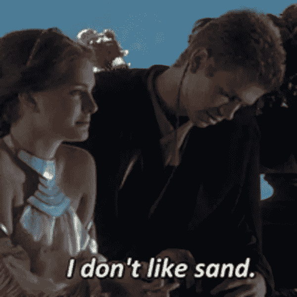
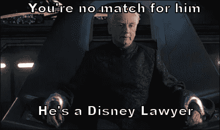

# 粉丝的威胁

> 原文：<https://medium.com/hackernoon/the-fandom-menace-f24b57b846f7>

## 粉丝如何使用区块链从迪士尼购买《星球大战》

# 问题是

似乎自从前传问世以来，影迷们对新的《星球大战》电影的反应就非常复杂。一些粉丝对前传非常失望，认为他们没有公平对待原三部曲，而其他人(像我一样)欣赏前传使佳能成为可能的扩展，喜欢《克隆人战争》系列，喜欢高速光剑战斗，但对最新续集的方向感到不确定。前传令人失望的地方是，乔治·卢卡斯令人敬畏的存在和他的应声虫委员会经常被指责过度使用 CGI，有时对话非常糟糕。

The dialogue at times could be coarse and rough and irritating.

随着续集出现不同寻常和令人惊讶的转折，人们似乎开始重新欣赏前传，以及它们给天行者传奇带来的更广泛的影响。粉丝群体中日益增长的迷因趋势表明，粉丝们开始接受前传事实上是伟大贡献的概念，也许乔治·卢卡斯事实上对这部系列电影有着明智的长期愿景。我注意到一些社交媒体渴望“让乔治再次掌权”的例子。

## (迪士尼)帝国反击了

作为一个狂热的《星球大战》粉丝，我发现一些最令人愉快的内容是粉丝制作的独立电影和 YouTube 上的评论。像“我愿意花钱看这个”和“如果这是佳能就好了”这样的评论很常见。特别是，最近引起我注意的一个项目是由[星球大战理论](https://www.youtube.com/watch?v=pyzl742SNsU)频道所有人制作的达斯·维德电影。意识到同人小说受到的限制，并意识到在穆斯塔法他不可能被允许将自己的创作货币化，他选择了众筹。

然而，即使这样也遭到了迪士尼知识产权所有者的阻挠，因此他被迫自己出资 10 万美元资助整个项目，并希望他的粉丝群能通过 Patreon 继续支持他。虽然我意识到有些人可能比我自己更同情知识产权法，但这种无法将任何与《星球大战》概念有一点相似的作品货币化的做法似乎有点过分，并严重降低了在这样一个美丽的宇宙中可能出现的广度和范围。打个比方，想象一下如果托尔金庄园禁止使用类似中土世界的精灵、矮人和兽人。想象一下，从历史中删除整个奇幻类型，并把它简单地限制在《指环王》这个一次性事件中。从某种意义上说,《星球大战》不仅仅代表一个伟大的宇宙，除了面向未来的科幻小说之外，它本身也是一种类型。《星球大战》跨越了蒸汽朋克、西方和科幻的界限，整个空间都覆盖着适合家庭的禅宗主题。然而，这种类型受到目前谁拥有版权的瓶颈的限制。总而言之，现在阻碍星球大战的两个主要问题是:

1.  热情的粉丝群完全无法参与指导佳能的方向，除非通过门票销售的不透明力量，这些力量本身聚集了太多对迪士尼非常有用的信号。
2.  对繁荣的同人小说行业的严厉限制可能会产生一种类似于幻想小说类型的基于星球大战的内容类型，以托尔金主义为背景的角色扮演 D&D 和幻想游戏的兴起，所有这些都有独特的情节主线，现在完全独立于中土世界。

# 解决方案

最近在管辖法律和区块链发展方面的事件已经汇集了必要的成分，使球迷群体集体回购专营权成为可能。方法如下:

1.  治理:一个分散的自治组织(DAO)将在以太坊区块链创建。道将有一个章程，概述如何进行投票以及道的目的和使命是什么。大概类似于*“从迪士尼购买《星球大战》的知识产权，这样道就可以以公开公平的方式敲定佳能并许可同人小说”。*
2.  筹款:道会以固定的价格出售名为迷魂药的代币，给予所有者相应的投票权。出售的 midichlorians 数量没有限制。筹集的资金(以 Eth 和 ERC20 代币形式)将被添加到一个资金池中。这笔钱将代表迪士尼可以预期得到的收购价格。起初，这个值当然会很小，但是由于更多的迷笛龙意味着更多的投票权，随着狂热的粉丝争夺影响力，奖金会逐渐增加。此外，价格的大幅上涨可能会突然让迪士尼刮目相看。
3.  **民主**(！):投票成员将能够就如何处理知识产权的最终所有权提出建议。提案将被投票表决。提交提案烧迷魂阵，以防止球迷滥发新的提案刀。
4.  **使命**:宪法将由一个分权的司法机构执行，比如 [Kleros](https://kleros.io/) 或者(当它触及区块链) [Ulex](https://github.com/proftomwbell/Ulex) 。
5.  **出售**:在某个时候，迪士尼可能会决定将其出售给 DAO 是值得的。在这一点上，他们可以发出一个公共信号，让所有的 DAO 参与者都知道现在是买入的时候了。在这一点上，DAO 将使人们知道，一个真实世界的法律团队将需要充当代理，以促进知识产权从迪士尼转移到 DAO。各种法律公司将表明他们的意图，并将保证金存入 DAO。然后，DAO 将投票选出最值得信赖的公司，如果购买交易正确进行，法律公司将获得一定比例的支付。DAO 需要迪士尼发出可信的信号，才能开始出售业务。这可能需要预先要求，当迪士尼准备好了，他们在 Twitter 等官方网站上发出“执行 66 号命令”的信号。
6.  **合法存在**:最后一步，DAO 需要有能力拥有知识产权。马耳他最近的[立法变化](https://www.coindesk.com/among-blockchain-friendly-jurisdictions-malta-stands-out/)使得 DAO 可以在整个欧盟(欧盟，而非扩展宇宙)拥有财产并作为法人实体行事。星球大战迷道将在马耳他注册，这样这个过程在现实世界中就有法律效力了。

## 影响和长期可持续性

对上述大纲的第一个反对意见是，如何保持势头，使最初的筹款兴奋不会逐渐消失，并以停滞告终。DAO 可以投票将 50%的收入支付给同人小说的独立内容创作者，提升他们在社区中的地位，创造一种平行的同人贵族，一旦知识产权转移到 DAO，就准备好影响新佳能的生产。这样，在迪士尼出售之前，DAO 将充当以星球大战为主题的分散式 Patreon。

然而，这只是道为了自我管理和维持一个充满活力的使命所能采取的许多步骤之一。这篇文章的目的不是解释每一个动作和行为，而是清楚地表明，一个范拥有和指导的星球大战的未来是可能的。

## **避开剧透**

假设 DAO 最终筹集到足够的资金来促使迪士尼出售，粉丝们(至少是那些有迷笛龙计数的人)将会控制这个特许经营权的未来。道不太可能想要微观管理佳能的扩张。相反，它很可能会将佳能的扩张委托给值得信赖的作家，比如前面提到的 YouTube 名人，或许还有乔治本人。道的力量将是在任何时候撤回这种信任，而不是无助地坐在一旁，因为正典正被带向一个不愉快的方向。

## 同人小说和版权

知识产权的实施可以从目前的限制转向更宽松的限制，例如

> *所有同人小说都可以货币化，只要明确内容不是官方经典。道保留将任何同人小说作为官方正典的权利。当同人小说没有引用佳能的任何角色或地点时，就不需要提供这样的通知，可以被视为更广泛的《星球大战》类型的一部分。*

## 预算

It’s not a story Disney would tell you

随着知识产权规则的严重放松，人们可能会说没有足够的收入来证明大预算制作的合理性。然而，DAO 代表了一个众筹渠道，通过它所有未来的电影都可以得到补贴。例如，DAO 可以宣布一组帕尔帕庭前传，从“瘟疫:一个星球大战的故事”开始。影迷可以向这个项目投入资金，如果它达到了目标，这部电影就成功了。如果没有，押金退还。最终的门票销售将会是最初资金的补充，减少了为大预算制作支付唱片销售的需要。

## 结论:新的企业希望

这种由警觉的"道"进行授权的机制是一种可以在整个企业界复制的模式，以分散传统产业，而不牺牲在公司一级组织生产的效率。它一方面作为所有者控制的直接民主合作社的替代方案，另一方面通过分散权力而不分散任务，作为集中的公司等级的替代方案。为了检验这种以道为导向的资本主义理论，我们需要一个试验台，在广泛的基础上唤起人们的热情，这就是为什么我通过《星球大战》的例子提出这个想法。粉丝们将再次统治银河系…那里将会有和平。