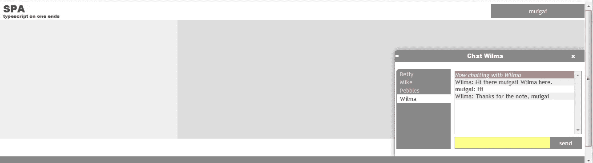
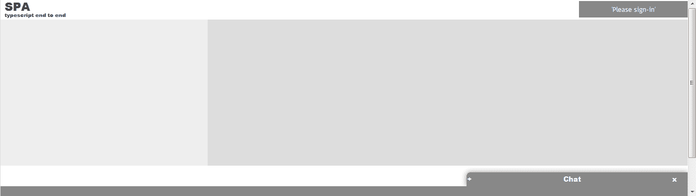

# 我开始了解并喜欢的神奇 4: TypeScript 特性

> 原文：<https://medium.com/hackernoon/the-fantastic-four-typescript-features-ive-come-to-know-and-love-eab5b1d9a026>

The chat interface

本文将展示这四大特性在创建聊天应用程序时的用法:

*   异步/等待
*   工会类型
*   防护类型
*   只读属性

## 异步/等待

这个特性使您能够简单明了地定义和调用异步代码。

在聊天应用程序的上下文中，用户需要通过网络呼叫登录聊天室。为了保持用户界面的响应性，您需要:

1.  异步调用
2.  通知用户登录挂起
3.  用户成功登录后，更新用户界面，如下所示:

Logon process

实现这一点的代码非常简单:

## 工会类型

此功能使您能够使用轻量级语法定义一系列类型。您可以在不定义类层次结构的情况下做到这一点。

在聊天应用程序的上下文中，它用于定义可以在聊天框中显示的消息类型:

各个消息类型定义如下:

它们都定义了一个共同的属性*种类*，您可以用它来确定您正在处理哪种类型的消息。在下面的例子中，每种消息类型都有一个显示在聊天框中的模板，这取决于它的种类。

## 防护类型

[类型守卫允许您缩小条件块中对象的类型。](https://basarat.gitbooks.io/typescript/docs/types/typeGuard.html)

该特性用于将属性仅应用于那些定义了属性的 HTML 元素。例如，为 HTML 元素子集定义的 *href* 属性。

使用示例定义如下:

## 只读属性

[TypeScript 的类型系统允许你将一个接口上的单个属性标记为](https://basarat.gitbooks.io/typescript/docs/types/readonly.html) `[readonly](https://basarat.gitbooks.io/typescript/docs/types/readonly.html)` [。这允许你以一种功能性的方式工作(意外的突变是不好的)。](https://basarat.gitbooks.io/typescript/docs/types/readonly.html)

聊天应用程序中定义的所有数据容器都是不可变的。一个典型的例子如下:

## 临告别时的最后一句话、特别表情或行为

完整的源代码可以在[这里](https://github.com/Muigai/ChatApp)找到。如果你喜欢这篇文章，请点击“鼓掌”按钮。谢了。

## 感谢

聊天 app 的 [HTML](https://hackernoon.com/tagged/html) 布局和 [CSS](https://hackernoon.com/tagged/css) 都是从这个[伟大的项目](https://github.com/mmikowski/spa)中“借鉴”来的。