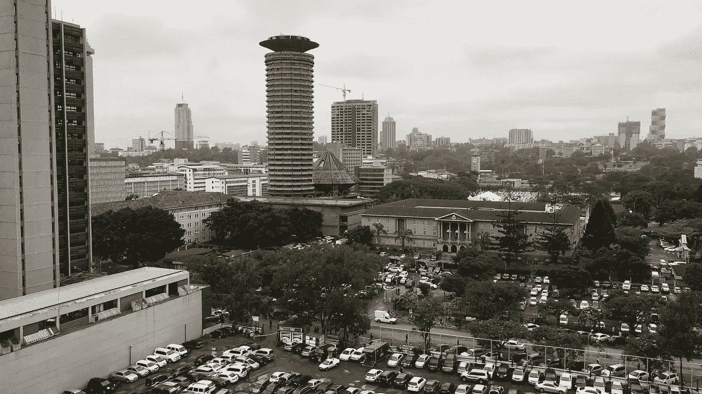
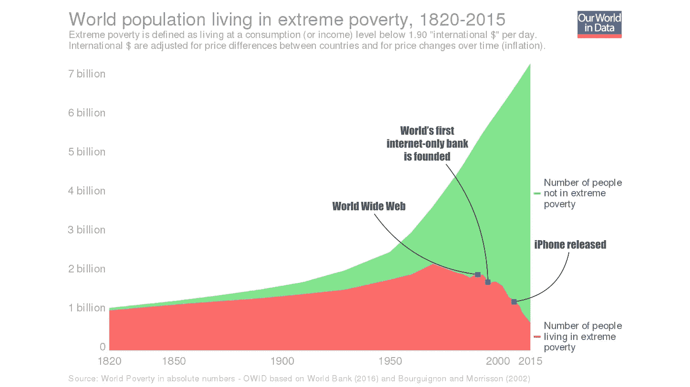

# 人工智能和区块链的“快速”和“主流”采用

> 原文：<https://medium.com/hackernoon/the-fast-mainstream-adoption-of-ai-blockchain-1adbcd8d3f3d>

## *一场未记录在案的“技术革命”*

Nairobi, Kenya (June 7, 2018)

我听到并读到了许多关于人工智能和分布式账本技术(包括区块链)不会很快被主流采用的故事。

这种怀疑的故事可能是引人注目的。毕竟，这些技术仍然有许多缺陷，倡导者的说法经常被夸大，并且在 AI 和区块链的公开讨论中有大量的炒作。

然而，在我上周的肯尼亚之行后，关于主流接受和采用这些新技术的负面预测有了不同的看法。

这里有三个原因。

# **# 1——政府正在寻找“尖端”的数字解决方案**

肯尼亚政府似乎明白数字技术协同工作的潜在好处。值得注意的是，政府愿意紧跟科技潮流。

出于这个原因，他们组建了一个特别工作组，探索人工智能和区块链技术如何简化土地所有权的处理过程(同时，结束“土地掠夺”)。

在接受英国广播公司采访时，工作队主席比坦格·恩德莫明确表达了肯尼亚的愿望:

*“我们错过了互联网浪潮，赶上了移动技术……区块链是下一波浪潮——我们必须成为其中的一部分。”*

这些不仅仅是空话。

我与政府代表的对话和讨论清楚地表明，他们不仅在讨论应对腐败和欺诈等问题的“尖端”解决方案。但是，他们也愿意实现它们(即使它们还不完美)。他们看到了新技术在金融普惠、初创企业和中小企业成长以及创造可持续环境等领域带来的诸多机遇。

监管机构甚至在考虑创建一个“监管沙箱”，在这个沙箱中，他们促进和鼓励与创新技术专家进行讨论、合作和实验的空间。这允许在监管机构的监督下测试新技术驱动的服务。

# **#2 —企业了解技术驱动的颠覆的力量**

我在一家总部位于内罗毕的大银行做了演讲。

该银行已经利用移动技术来改善传统上被排除在此类机会之外的个人获得金融服务的质量和机会。该银行将新的数字技术(包括人工智能和区块链技术)视为改善这些服务的下一步。

企业家精神和对创新解决方案和建议的开放态度可能是我在银行工作期间最激动人心的部分。我在世界各地的“大”公司做过许多演讲，但听众如此迅速地接受变化的情况并不经常发生。

# **#3 —消费者需要下一波新技术**

我也与新技术的消费者进行了多次交谈。你可以感受到对最新数字技术的兴奋。

他们意识到新的数字技术将如何提供巨大的创业机会，而这些机会是他们长期以来一直被剥夺的。他们已经对智能手机和移动技术有了非常积极的体验。

在这方面，金融包容性经常被提及。例如，一名出租车司机非常清楚地解释了移动技术如何改变了他的生活。甚至在几年前，他还被排除在金融体系之外。开立银行账户是不可行的。它太贵了，而且需要太多的文书工作。

> 现在他已经把银行收入囊中了。

科技使得开立银行账户和转账变得更加简单和容易。这有助于为他的孩子打开世界。

在一代人的时间里，许多人的生活发生了改变。毕竟，无论你在哪里生活和工作，成为金融体系的一部分都会创造机会。

尝到了新技术的好处，对下一代技术创新的需求是显而易见的。

# **下一步是什么？**

我在肯尼亚的经历让我从一个不同的角度理解了新数字技术的潜力。

> **活力、实验和共同创造令人振奋。**

此外，还有其他迹象表明，在肯尼亚等地，主流采用新技术的速度可能比我们想象的要快:

*   政府认识到在经济发展的各个阶段实现“跨越”的机会。
*   许多国际和本地组织教授开发者如何使用和开发区块链技术和人工智能。
*   “传统媒体”中“社交媒体”影响者的出现和庆祝
*   移动技术生态系统的发展是围绕早期技术的社会转型的成功而构建的。
*   越来越多的外国投资和合作机会(特别是与中国)。

One of the many Chinese development projects in Nairobi

我经常看到有人声称，新技术在传统经济中心的少数科技巨头身上创造了更大的权力集中。毫无疑问，这种说法有些道理。科技巨头越来越大，其经济和政治实力令人咋舌。

但是我在肯尼亚的时间向我展示了一个不同的，很少被记录的方面，技术是如何扰乱我们的世界的。这是一个关于技术如何为卓越的“新中心”的出现创造新的可能性和机会的故事，这些“新中心”远离现有的技术巨头和传统的经济中心。

在这些地方，科技推动的社会变革的可能性可能要大得多。从这个意义上来说，如果“第四次技术革命”的要素源自肯尼亚这样的地方，也就不足为奇了。

*感谢您的阅读！请点击*👏*下面，还是留下评论吧。*

*每周都有新的故事。因此，如果你关注我，你不会错过我关于数字时代如何改变我们生活和工作方式的最新见解。*