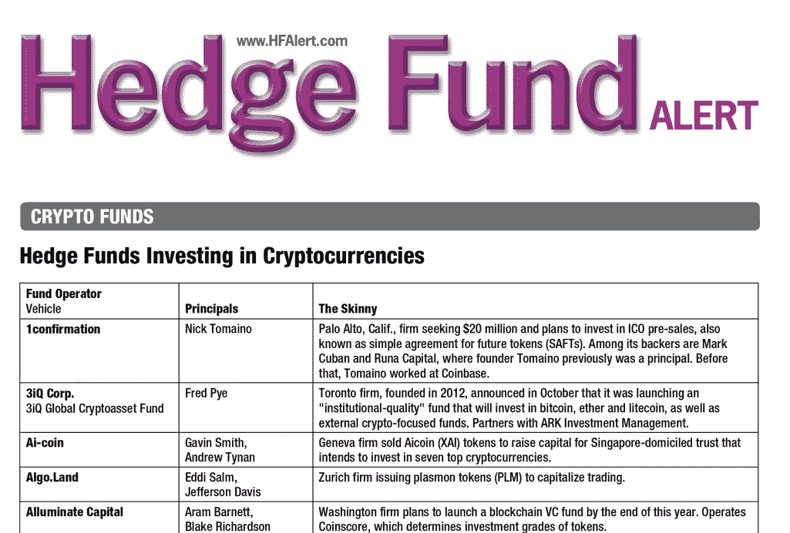

# 加密对冲基金的命运

> 原文：<https://medium.com/hackernoon/the-fate-of-crypto-hedge-funds-ca5850e8421c>

在上周的一次秘密活动结束时，两名千禧一代的企业家走近我，开始聊起他们的新企业。

它是多方面的:一个区块链支持的服务业务，将对世界产生重大影响——但首先将由一个加密对冲基金筹集资金。该对冲基金将投资代币和 ico——留出 20%—30%投资于尚未开发的加密服务业务。

> *建立服务业务的第一步:为他们的新对冲基金筹集资金。*

怎么会？一点储蓄和信用卡债务，一个明显的信托基金，以及——不情愿地——一次筹资(就像他们这些老前辈做的那样)。

在一次谈话结束时，其他几个人也加入了我们。其中一位是年轻女士，她白天在银行工作，但同时也为一家位于英属维京群岛的新加密对冲基金工作。这只对冲基金被令牌化了——投资被转换成一种令牌，其价格将根据投资组合中所有投资的价值而涨跌——其结构是向印度投资者募集资金。30 万美元已经承诺用于 500 万到 1000 万美元的融资。

包括这两笔交易在内，当晚至少有 8 笔对冲基金投资。

甚至没有接近记录。

根据对冲基金警报，截至 2017 年 11 月，已经有 130 只加密对冲基金。

很多名字你可能已经知道了:[碉堡](https://twitter.com/aridavidpaul?lang=en)[多币资本](https://medium.com/u/1ac059405a76?source=post_page-----ca5850e8421c--------------------------------)[多币链](https://medium.com/u/4df822acbecd?source=post_page-----ca5850e8421c--------------------------------)。但是在地下和未上市的地方，有数百家甚至数千家规模较小的对冲基金正在发展。

*   大多数是低于 1000 万美元的汽车。“训练轮”基金将为以后更大的事情建立信誉。也就是说，向任何秘密人群扔一块石头，你肯定会让某个人盯上 2000 万至 5000 万美元的基金。
*   有的专注 ico。一些在代币上。一些关于股权或 SAFTs。一些人会搜出在美国将会很大的中国区块链公司..一些人利用电报泵和转储方案。还有一些…嗯，为什么要选择任何策略呢？
*   许多人正在从家族理财室筹集资金。少数仍然专注于风险投资和天使投资。一些人在 Reddit 上提到他们认识的可能投资的鲸鱼。一个人和那个古怪的亿万富翁密码专家 Brock Larson 一起出去玩，但是他太敬畏了，没有向他要求投资。
*   这些新对冲基金的领导层明显不一致。当然，这里有经验丰富的企业家，也有一些具有实质性的金融行业技能——但大多数人几乎没有经验，除了他们对加密有一肚子热情，还会说唱区块链的行话。
*   令人震惊的是，似乎很少有人精通投资他人资金所需的监管框架。我问一位高调的加密对冲基金经理(请注意，他已经筹集了资金，并一直在积极交易)，他是否注册为 ERA 或 RIA。他的回答是“都不是”，随后表示，他正在积极讨论对同行基金的监管和合规问题。

第一个对冲基金是阿尔弗雷德·温斯洛·琼斯在 1949 年创建的，可投资资产为 10 万美元。如今，全球最大的对冲基金之一复兴科技管理着超过 450 亿美元的投资者资本。

“对冲基金”一词来源于通过使用包括杠杆在内的各种复杂方法对冲投资来增加收益和抵消损失的策略。

对于传统的对冲基金来说，多空策略经常被采用:投资多头头寸(这意味着购买股票)和空头头寸(这意味着用借来的钱卖出股票，然后在价格下跌时再买回)。

我敢打赌，如果我们调查所有的加密“对冲”基金，只有不到 5%的人了解杠杆购买或多空策略。

真的。一个人给他们的策略贴上标签，“纯粹的直觉。”

但是，*对冲*这个术语听起来确实很酷。

筹集资金的时候可能会帮上大忙。

好吧，这不公平。

大多数加密基金将自己标榜为对冲基金有两个明显的原因。

*   **关锁。**与共同基金不同，对冲基金通常寻求在特定时期产生回报。这被称为“锁定期”。投资对冲基金，在禁售期结束之前，你不能退出或出售股票。对于那些作为投资经理的领导者来说，这为你提供了充足的时间来解决所有问题。
*   20%的回报率。对冲基金经理从他们为投资者赚取的回报中收取一定比例的费用。典型的 2/20 比率意味着，在投资者看到一分钱之前，2%的基金支付管理费(工资、运营)，20%的回报归基金经理所有。

嘿，这个对冲基金听起来还是不错的。

# 所以，一些预测

2017 年见证了公众对 ico 看法的快速起伏:最初作为创新的[加密货币](https://hackernoon.com/tagged/cryptocurrency)推出策略的东西，变成了被误用的快速致富投资策略。

到 2019 年，加密对冲基金将遵循类似的模式。大规模饱和将会比任何人想象的都要快，冷静因素将会消失，流入非尖端工具的资本将会迅速枯竭。

除此之外，还有 3 个对加密对冲基金市场的预测:

1.  加密基金经理将变得高度警觉，并因一个重大而痛苦的疏忽而不堪重负:运营。购买和存储加密货币的过程并不适合轻松的人。管理交易所和场外交易合作伙伴，建立数字钱包，确保万无一失的托管流程和跟踪活动。这需要专注、时间、精力、耐心和资源。耐心、深思熟虑的投资幻想将被制作税务跟踪电子表格和数字钱包管理的苦差事所抹杀。预计将会有一波第三方资源为继续运营的基金提供服务。
2.  2/20 的比率和锁定将会失宠。投资者会想要加密货币本身承诺的民主化和灵活性。有人坐在中间，拿着巨额回报，同时拿着钱做人质，这看起来非常讽刺地矛盾。
3.  缺乏竞争优势、融资能力——该死的，还有必要的投资头脑——将导致大规模的整合，当然还有彻底的失败。在整合方面，融资不足的基金将开始相互配对。失败将以僵尸基金的形式出现，由失去兴趣并转向其他项目的基金经理留下。是的，肯定会有很多诉讼。

所以，对于那些新的加密对冲基金，我们把它扼杀在萌芽状态怎么样？

在它变得不可收拾之前？

太嫩了？