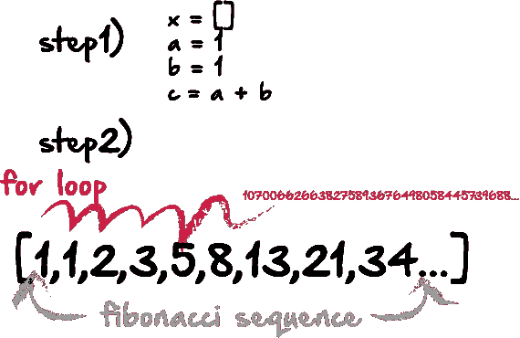

# nᵗʰ数的斐波纳契数列(Python 和 JavaScript)

> 原文：<https://medium.com/hackernoon/the-fibonacci-sequence-to-the-n%E1%B5%97%CA%B0-number-python-javascript-b77f591b210b>


程序员经常使用编码问题来提高他们的技能，测试他们的知识，或者为技术面试做准备。这些问题中有许多是基于数学的，而基于数学的最常见的技术挑战之一就是处理斐波纳契数列。

斐波纳契数列中的每一个新项都是通过将前两项相加而生成的。例如，从 1 和 2 开始，序列中的前 10 个数字是:

1, 2, 3, 5, 8, 13, 21, 34, 55, 89…

我最喜欢的处理斐波纳契数列的挑战之一是，要求数列中某个任意高的数字的索引值。例如，假设我们想要获取包含 1000 个数字的第一个斐波纳契数的索引值。

通常，一个简单的方法是把所有的数字放在一个数组中，然后用 for 循环遍历它们。在 for 循环中，一旦我们到达一个有 1000 位的数字，我们将简单地获取那个索引或数字。我们的代码可能如下所示:



现在，这不是一个特别好的主意，有几个原因。首先，它需要两种不同的功能。一个生成斐波纳契数列的函数。第二个函数循环遍历我们生成的所有数字。此外，这样做可能会占用大量内存。作为一个稍微好一点的选择，我们可以使用 while 循环，并在 while 循环中生成序列，但是如果我们到达一个长度为 1000 的数字，就结束循环。此外，如果我们想要的只是一个数字或它的索引，那么我们实际上不需要创建任何其他数字的数组。

下面是我们如何在 Python 和 JavaScript 中使用这种类型的解决方案:

# Python:

我们将从创建变量开始，这些变量将代表斐波那契数列中的数字:

```
a = 1
b = 1
c = a + b
```

接下来，我们将再创建两个变量，一个用于`count`，另一个用于`length`。由于我们实际上并不想创建一个列表或数组，我将使用`count`来递增每个值。这样，我存储的是一个数字，它代表索引值，而不是一个数组，我必须通过循环来获得索引值。`length`变量是我用来结束 for 循环的。我将初始值设为长度 3。然后我会找到每个新的斐波纳契数的值，如果该数的当前值大于`length`变量，那么我会将长度`variable`的值设置为新的数。我的 while 循环条件是`length`变量将小于或等于`999`。这是我的两个变量:

```
count = 0
length = 'aaa'
```

这里是 while 循环:

```
while len(length) <= 999:
    a = b
    b = c
    c = a + b
    count = count + 1
    str1 = str(c)
    if len(str1) > len(length):
        length = str1
```

此时，当我找到第一个 1000 位数时，while 循环将结束。如果我想要那个数字的索引，那么我可以打印变量`count`。或者，如果我想要`number`本身，我可以打印`length`，它将那个`number`存储为一个`string`。

```
print length
print count
[Finished in 0.09s]
```

很酷吧？

# JavaScript:

现在你完蛋了。从技术上讲，我们可以使用第一个例子中使用的相同代码。或者，我们可以改变它，做一些类似于我之前描述的不要做的事情。该代码可能如下所示:

```
let x = [];
let a = 1;
let b = 1;
let c = a + b;
while (x.length < 5000){
  a = b;
  b = c;
  c = a + b;
  x.push(c);
  }
let val = [];
for (var i = 0; i < x.length; i++) {
  let str1 = x[i].length;
  if (x[i].length == 1000){
    val.push([x[i], i])
  }
}
console.log(val);
```

然而，无论哪种方式，你都会很快遇到问题。任何长于 15 或 16 位的数字，JavaScript 通常不会正确处理它。这是因为 JavaScript 使用 IEEE-754 双精度(64 位)格式表示数字。据我所知，这给你 53 位精度，或 15 至 16 位十进制数字。JavaScript 中的所有数字都是浮点数，这意味着整数总是表示为

> *符号×尾数×2 指数*

尾数有 53 位。您可以使用指数来获得更高的整数，但是它们将不再是连续的。例如，您通常需要将尾数乘以 2(指数 1)才能达到第 54 位。但是，如果乘以 2，则只能表示每隔一个整数:

```
> Math.pow(2, 53)  // 54 bits
    9007199254740992
    > Math.pow(2, 53) + 1
    9007199254740992
    > Math.pow(2, 53) + 2
    9007199254740994
    > Math.pow(2, 53) + 3
    9007199254740996
    > Math.pow(2, 53) + 4
    9007199254740996
```

加法过程中的舍入效应使得奇数增量(+1 对+3)变得不可预测。实际的表示有点复杂[1]，但是这个解释应该有助于你理解基本问题。

# 结论:

如果你遇到类似的问题，尤其是在技术面试中，你最好尝试用 JavaScript 之外的东西来解决这个问题。为了让你听起来更聪明，你可以用 Python 来解决，然后解释 JavaScript 如何处理整数。