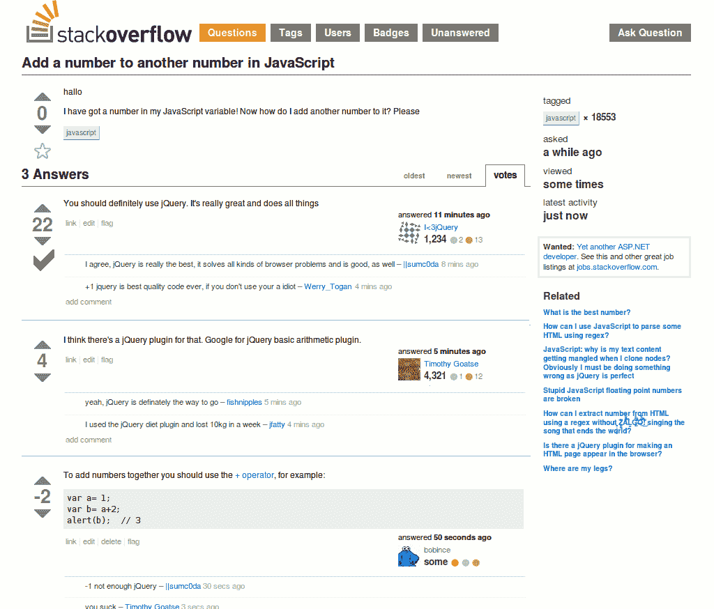

# j 也代表 JavaScript:1990–2000(第 2 页，共 2 页)

> 原文：<https://medium.com/hackernoon/the-fifth-decade-of-programming-j-is-also-for-javascript-dcc3c5d30179>

## 个人编程史第五章的第二部分。[在这里阅读第 1 部分](https://hackernoon.com/the-fifth-decade-of-programming-j-is-for-java-5694bf59c5ae)。

## 不，另一只在左边

在我上一篇文章里，我大概疏远并激怒了 Java 祭坛上几百万虔诚的崇拜者。本周，我还不如继续去激怒另外几百万热爱 JavaScript 胜过生命本身的狂热分子。

毫无疑问，网景公司对 Java 的成功起了很大的作用，然而在它采用 Java 的同时，网景公司也在开发自己的竞争语言，这种语言有一天会威胁到 Java 的统治地位。它最初是以 LiveScript 的名字开发的，但是后来市场营销人员相当混乱地选择从 Sun 获得许可，这样他们就可以将这种语言命名为 JavaScript。

这令人困惑，因为尽管理论上 JavaScript 与 Java 有相似的遗产(它是 ALGOL 的后代，通过 C、SmallTalk 和 Self，以及 Scheme 的风格)，但实际上两者除了名字之外几乎没有什么共同之处。我不会涉及无聊的技术细节。对程序员来说，这样说就足够了:JavaScript 和 Java 几乎没有任何共同之处。

当 Java 越来越多地被用来编写“服务器端”代码和“小程序”供浏览器下载，然后作为运行在*沙箱*中的独立应用程序启动时，Java Script 缓慢但肯定地变得不可或缺，因为它是唯一一种在浏览器 *中运行*的语言。程序员可以使用 JavaScript 编写代码，在 HTML 页面运行时修改页面。**

起初，这是用来做验证之类的事情:确保数据以正确的格式输入，例如，确保人们没有在数字字段中输入字母。然而，它最终变得更加重要。2005 年，杰西·詹姆斯·加勒特出版了《Ajax:Web 应用的新方法》( T11 ),这给了程序员一个让小程序下载变得过时的方法。

Ajax 代表:*异步 JavaScript 和 XML* ，在 Garrett 的论文使其流行之前，这种基本技术已经使用了几年。它使用 JavaScript 动态改变网页，而无需重新加载 HTML。

在本系列的第三篇文章中，我解释说:

> “当你与一个网页交互时，你至少要处理十几个抽象层。你点击的“按钮”实际上是屏幕上的一个区域，它被操作系统捕捉到，并传递给网络浏览器，浏览器将它与内存中的一个映射进行比较，这个映射是由一个“文档对象模型”呈现的，这个“文档对象模型”是通过解释 HTML(以及 CSS 和 JavaScript)构建的

Ajax 的工作方式是修改内存中的文档对象模型(DOM ),这将导致像素渲染在屏幕上发生变化，而无需重新加载整个页面。

DOM 规范与 Java 和 JavaScript 都有“挂钩”,但是因为 JavaScript 在浏览器中运行，所以 JavaScript 有明显的优势，Ajax 模式几乎成为创建动态网页的普遍技术。一年之内，发布了几个 AJAX 的“框架”实现，其中一个你可能听说过(如果你在 IT 行业工作的话)的名字是 *jQuery* 。

这是 JavaScript 流行的起源。从那以后，许多用 JavaScript 编写的公共领域软件变得可用。和 Java 以及之前的 Objective-C 一样:预写应用程序组件的丰富类库似乎是编程语言成功的关键。

尽管它非常流行，但在我看来，JavaScript 也没有什么革命性的。在我看来，它只不过是另一个 SmallTalk 的克隆版，增加了一些功能(诚然有些相当奇怪)，使得编程变得很容易。

在本世纪初，像 Salesforce.com 这样的公司向 IT 部门证明，不仅可以通过网络交付应用程序，而且用户更喜欢它们，而不是必须通过软盘或光盘安装的*厚应用程序*。随着 IT 部门采用这种技术，形成了两个阵营:用 Java 编写的“开发团队”和用 HTML、CSS 和 JavaScript 编写的“前端”团队(或 web 集成商)。

网景公司开发了一种服务器端的 Java 脚本实现，叫做 LiveWire Pro Web，但它从未像 Java 那样流行。但是，2009 年 Ryan Dahl 创建了一个新的服务器端 JavaScript 实现，名为 Node.js。

自从 Node.js 可用以来，许多具有硅谷或创业文化的公司已经在前端和后端(服务器端)使用 JavaScript。这些公司，以及为他们工作的程序员，与传统领域的大型上市公司的 IT 部门有着非常不同的文化。

在大多数公司中，这两个阵营在文化、技能甚至报告结构方面相距甚远，Java 后端开发团队向 IT 部门报告，前端团队通常向营销部门报告。

尽管如此，使用 Node.js 的服务器端 JavaScript 正在企业 IT 中获得立足点，公开可用的源代码(用于剪切和粘贴目的)越来越多地是 JavaScript 代码。

这是否足以取代 Java 的已安装代码库还有待观察。无论哪种方式，我预测都不会有什么不同。随着每一代程序员的发展，语言时好时坏。企业 IT 项目失败的问题源于手工生产的根本不可伸缩性，而不是语言的选择。

> 现在没有，将来也不会有一种编程语言能让编写糟糕的程序变得一点也不困难。
> 
> ~劳伦斯·弗伦

## [<——系列文章的前一篇](https://hackernoon.com/the-fifth-decade-of-programming-j-is-for-java-5694bf59c5ae)

[1]一个了不起的语言的细节这个脚注太小包含。

[2]浏览器外的一个数字安全区*。*

[3]考虑到 JavaScript 对数据类型相当宽松的处理方式，这有点讽刺意味。

这篇文章摘自我即将出版的书*《混乱工厂*》，书中解释了为什么大多数公司和政府不能编写“正常工作”的软件，以及如何解决这个问题。