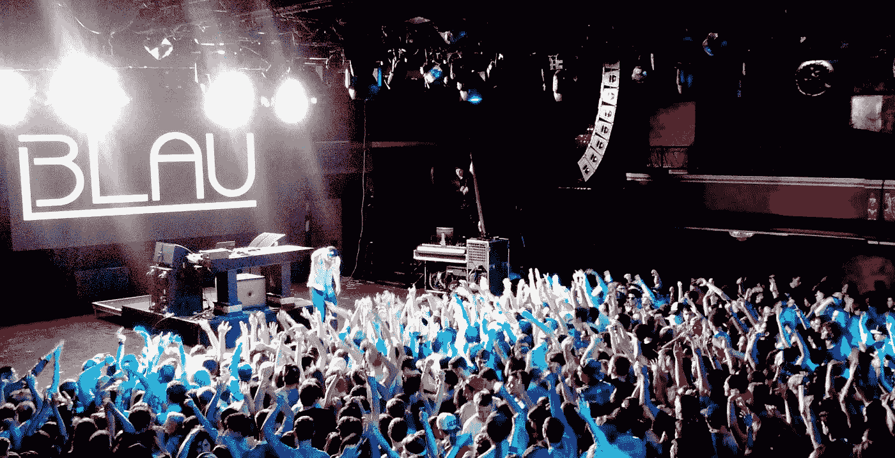
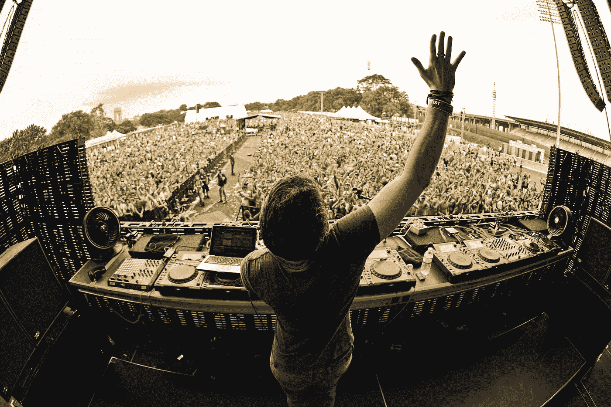
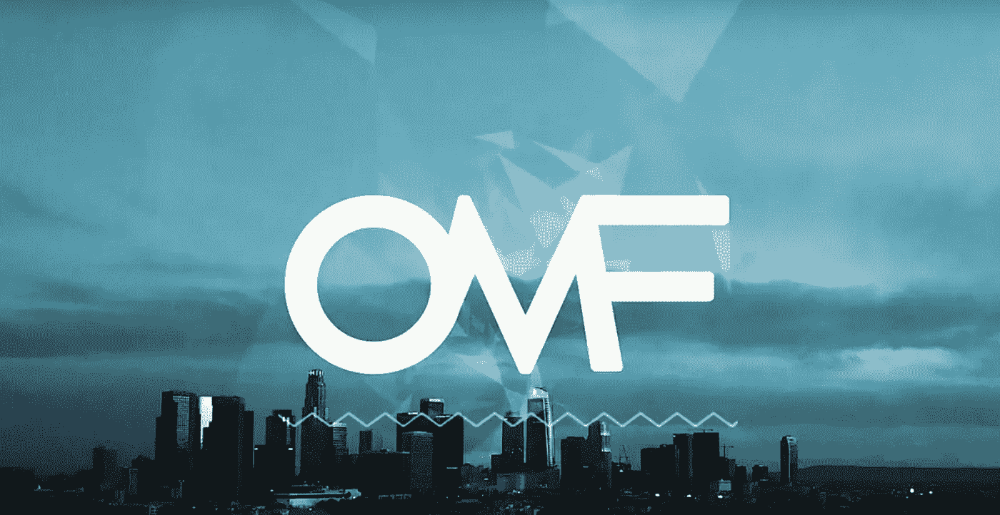
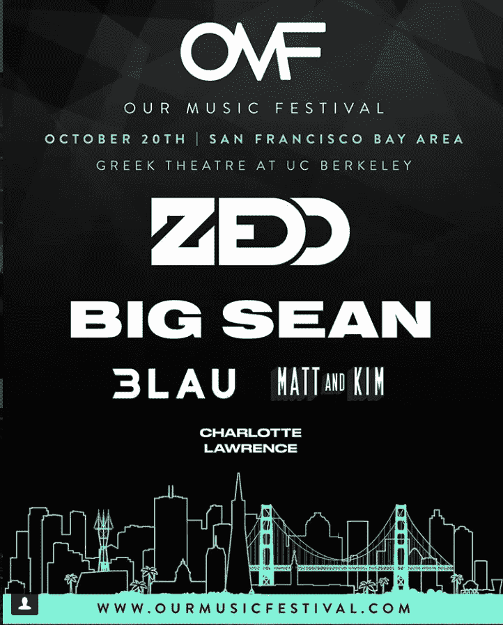
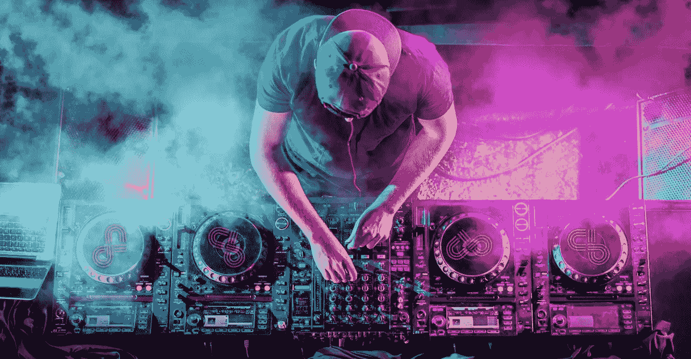

# 首届加密动力音乐节:采访 OMF 联合创始人贾斯汀·布劳

> 原文：<https://medium.com/hackernoon/the-first-crypto-powered-music-festival-interview-with-co-founder-justin-blau-ddb91ecec2e0>

3LAU doing his thang at Royale Boston

我是通过一位共同的朋友介绍给贾斯汀·布劳的，他告诉我他的愿景是通过将音乐活动符号化，让粉丝们获得更好的体验。我的第一反应是翻了翻白眼，说，“又来了，”然后就把他当成了又一个试图利用加密狂热赚钱的家伙。我对贾斯汀做了一些研究，意识到他是一位著名的 DJ 和制作人，与许多一线音乐人合作过，目前正在世界各地巡回演出。我的好奇心占了上风，我们约定打电话讨论他的活动。

在我们交谈之前，我记下了各种各样的问题，我的目标是测试他，试着找出计划中的漏洞。我非常怀疑代币计划，并承诺自己要对他严厉。贾斯汀和我终于通了电话，我们聊了一个多小时。在他向我介绍他的活动将会如何进行的过程中，我在许多问题上向他施压。贾斯汀从未犹豫过，他想让音乐节对粉丝更友好的真诚让我深受感动。

我告诉他，我有兴趣接受采访，但这不会是一个松散的公关作品。我向他解释说，许多人会对这个想法持批评态度，这次采访将是回应人们质疑他动机的绝佳机会。在过去的几个月里，贾斯汀和我通过短信保持联系，而他正在世界各地巡回演出，我们设法安排了这次采访。在这个过程中，我对他的尊重与日俱增，我可以向你保证，他是一个非常脚踏实地和谦逊的人，因为他受到了如此的赞誉。

与此同时，贾斯汀和他的团队一直在努力工作，计划于 10 月 20 日在三藩市推出 premier Our Music Festival (OMF)活动。Zedd、大肖恩、Matt 和 Kim，当然还有 3LAU 又名 Justin，以及其他音乐人的阵容都不是闹着玩的。事实上，当我写这篇介绍时，OMF 加密预售不到一小时就售罄了。不像许多没有效用的代币，OMF 代币可以兑换音乐会入场券。贾斯汀和他的团队有继续发展这个项目的大计划，不管你同意还是不同意这个商业模式，看看它如何发展将会很有趣。

Justin 3LAU

**在线身份:**

3LAU，之前的 *Chronocornica*

RJ:(真正的工作)

音乐家/制作人 DJ

**在$BTC 游戏中的岁月:**

3 个非活跃年，1 个活跃年

人们怎么可能认识你？

最有可能是为了我的音乐:)

**别人怎么跟你？**

3LAU 在大多数社交平台上

你的背景、教育或正规培训是什么？

在进入音乐界之前，我在奥林圣路易斯的华盛顿大学学习金融。在我的教授、朋友和父母的祝福下，我在大三后离开了学校，开始全职追求音乐。

**你是什么时候对比特币和加密产生兴趣的？**

文克莱沃斯双胞胎是我的朋友，当我第一次对这个领域感兴趣的时候，他们正在建造双子座。

**你在这个领域最美好的经历是什么？**

遇见如此不可思议，聪明，有远见的人。

**告诉我们你最大的比特币或加密失败。**

当 BCH 被加入 Gdax 时，我把我在交易所持有的大部分币安股票转换成了 BCH 股票，以套利币安和 Gdax 之间的价差……然后 Gdax 锁定了市场，我的提款限额太低了，对此我无能为力……糟糕的日子。

**你个人从哪里获得比特币或加密新闻？**

到处都是，但最近我最喜欢的作者的帖子，以及聚合应用程序！

**你能给刚接触比特币世界的人的最佳建议？**

在做出草率的投资决定之前，不要相信任何人和 DYOR。

**你在哪里长大？**

最初是纽约，但从我 13 岁起，我现在的家拉斯维加斯。

你是哪种类型的孩子？

我喜欢电子游戏、乐高积木和怪异的音乐。我肯定没有很多朋友。

你会给年轻时的自己什么建议？

接受我的个人怪癖，听我父母的话(两者都是真正的英雄)。

Justin got his start DJing small college parties.

你是一个成功的 DJ 和制作人，告诉我们你是如何进入这个行业的？

这一切都是偶然发生的！我一直喜欢制作音乐，但在大学时受到启发制作混搭，以接触更主流的观众。我以前制作更多的实验性电子音乐。一些这样的混搭在音乐博客上开始流行，在我意识到之前，我就收到了在全美大学校园里播放的请求。

我们可能认识哪些与你共事过的人？

从爱莉安娜·格兰德到凯蒂·佩里；在他们成为游戏中最大的一些人之前，链烟者实际上为我的巡回演出打开了大门:)

作为一名 DJ 环游世界是什么感觉？

它并不像任何人想象的那样迷人。制作音乐和表演是我的两大爱好。

**你演过最大的戏是什么？**

2016 年的 EDC 维加斯，可能是我参加过的最大的人群。这也是我长久以来的梦想。

人们在哪里可以找到你的音乐？

最好的地方是搜索我的 spotify 个人资料，就@ 3 lau——一定要看看我最新的专辑《紫外线》。

去年，你们发起了我们的音乐节(OMF)。解释它是什么，你想完成什么？

我们与 OMF 的目标是让粉丝们在节日体验中拥有更大的权力，奖励他们的参与，并鼓励他们通过告诉朋友和提供反馈来回馈生态系统

**OMF 的总部在哪里？**

第一年，OMF 将在加州柏克莱的希腊剧院上演。我们希望在未来三年内扩展到世界各地，目标是巴塞罗那、首尔和东京！

**还有谁参与了 OMF，为什么你认为它会成功？**

我很幸运拥有这样一个由音乐行业领袖、成功企业家和技术专家组成的不可思议的团队。从我的联合创始人亚当，到我们一些不可思议的顾问，比如 Origin Protocol 的创始人，我认为我们已经准备好在音乐行业和区块链空间掀起波澜。

许多人听到这个会挠头，问为什么音乐活动需要在区块链上？

我们正在探索三种主要的应用。首先是票务；通过更加透明的准入转让/价格发现手段瓦解一级和二级市场。“门票”的整个概念将转向支持访问的数字资产，我们希望成为这一旅程的一部分。其次，对于体验创造者来说，粉丝参与度和忠诚度都越来越难获得。通过激励粉丝更深入地参与节日生态系统，OMF 将使节日业务非中介化，并削减从任意收费和无法吸引最终用户的无用营销活动中获利的中间商。理想的情况是，这样可以对抗门票膨胀，分散活动的宣传力度。最后，OMF 的目标是公平地补偿贡献数据和选择分享个人信息的粉丝。音乐节生态系统中的大多数其他参与者都无法获得这些数据，包括像我这样最终推动现场音乐体验流量的艺术家。我们最终希望为所有事件建立一个协议来标记，并在更深的层次上吸引粉丝。我们的品牌活动将作为我们开发的技术的先导！从长远来看，我们的愿景是让粉丝为阵容中的艺人投票；我们不能等到我们到达那里！

你觉得区块链是一个被过度使用的流行语吗？

是的，也不是。这绝对是描述这场人类仍在了解的巨大革命的首选术语，但很难用任何其他术语简洁地描述这个新行业。这是一个拐杖，但在交谈中是必要的:)

**为了建立发布 OMF 的后端基础设施，你已经私下筹集了哪些资金？**

我们从 100 万英镑开始，现在我们投入了超过 2 倍的资金用于我们的战略轮 300 万英镑。这一轮是为长期合作伙伴保留的，我们相信他们可以构建 OMF 故事&提供劳动力和资本资源以确保项目的成功。下一轮将是 12 米软帽 15 米硬帽轮。用 ICO 的术语来说，这些都是小数字，但对我们的团队来说，保护投资者更重要&公平地评估我们正在建设的东西的性质。从长远来看，我们相信这是我们成功的关键。

Just 3LAU tours the world and his home is entertaining sold out venues.

许多人可能会称 OMF 代币是一种营销策略。你对此有何回应？

我会告诉别人去看看我们的全明星队，阅读我们的材料，并提出问题。OMF 团队的每个人都很乐意回答这个问题。

**你如何将 OMF 与那些试图通过开发狗屎硬币或代币来快速赚钱的骗子区分开来？**

我们的目标是尽可能透明。我们不会从公众那里筹集资金，直到我们知道我们正在建造完全功能化的技术。我们的首要任务是粉丝体验。

**你正在以太坊上建造 OMF 令牌。你为什么选择以太坊而不是比特币，或者使用其他选择？**

我们目前正在探索每一种选择。我们主要使用 ETH 作为筹集资金的手段，因为它已经成为 ico 的行业标准，并且为投资者所熟悉！

**带我们了解一下粉丝们将如何在你们的活动中使用 OMF 代币？**

最容易想到的是 OMF 公用事业代币，如 SkyMiles，但数量有限，功能多样。粉丝将能够通过参与节日生态系统来获得代币，如本文前面的粉丝激励机制部分所述。粉丝获得的代币越多，他们在网络中获得的地位就越高，代表着他们对网络成功的贡献。同时，获得的代币可以以大幅折扣兑换门票、商品、食品和饮料；他们还可以兑换专属体验，如艺术家见面会、后台参观、VIP 升级和音乐节社区成员目前无法获得的其他音乐节元素。

**乐迷如何购买 OMF 代币？**

公众将不能直接购买 OMF 代币，直到美国证券交易委员会对公用事业代币框架给予更多的澄清。我们正在探索符合要求的空投方式，以使粉丝能够尽快开始获得 OMF，而不必直接购买。

**OMF 代币会在交易所上市吗？如果有，是哪些？**

不幸的是，由于规定的原因，我们不能提供更多的细节，这是一个非常不幸的情况。

**OMF 面临什么样的监管挑战？**

很多。这就是为什么我把这个项目的前六个月的重点放在合规措施和公司结构上。我期待着与公众分享我的许多文档！

第一届 OMF 赛事将在何时何地举行？

第一次 OMF 将于 10 月 20 日在湾区发生！佐德是我们阵容中的第一位艺术家，当然我也会参加。我们迫不及待地想尽快宣布其他艺人的名单，我们会尽快开始售票。

**描述一下粉丝可以期待什么？**

在第一年，我们将启用门票加密支付，每个参加音乐节的人都将收到一个 ETH 纸质钱包，我们可以在未来空投到这个钱包。随着我们的应用程序的开发，粉丝们将能够导入那个钱包&我们将随着时间的推移添加功能。

**有哪些艺人签约演出？**

我们将很快宣布我们的艺术家大使名单！

所有与会者将被强制使用 OMF 代币购买门票吗？

肯定不是，我们的目标是创建一个混合系统，让所有消费者都能访问，这是在宏观层面上推动主流加密技术的关键。

如果他们不想呢？

他们将能够使用菲亚特，瑞士联邦理工学院，BTC +更多。

粉丝可以用 OMF 代币购买商品和音乐吗？

在第一年，我们可能会面临网络问题，但在第二年，我们希望 OMF 能够购买节日生态系统中的所有产品和服务。

你担心这个概念会超出大众的理解范围吗？

理想情况下，我们可以构建一个漂亮的 UI &创建简单的、有教育意义的内容，将大众带到我们的平台上。幸运的是，我们的创始人和顾问有一些严重的影响。

**你认为还有哪些技术障碍？**

区块链票务存在明显的网络/规模问题。我们还必须确保节日互联网能够处理负载。

**粉丝将如何持有他们的 OMF 代币，这样做会有什么激励？**

将有多种奖励来获取 VIP 升级、提前获取门票、见面和问候+等。确切的激励结构仍在开发中。

**你从音乐行业得到了什么样的回应？**

到目前为止，反应令人难以置信，我们项目的六个代理顾问组成了现场音乐业务中一些最强大的领导者。我们很高兴能继续扩大我们的音乐团队！

你对 OMF 的最终目标是什么？

最终目标是给粉丝更多的控制权，让他们能更好地掌控自己每天喜爱和期待的体验。整个音乐行业的非中介化对其增长至关重要，但从音乐节业务开始是很好的，它吸引了全球各地许多不同品味的人！

The tools of the trade for a boss DJ

你和文克莱沃斯双胞胎是什么关系？

我首先把进入这个空间的原因归功于这对双胞胎。我在他们建造双子座的时候遇到了他们，并立即对加密货币的潜力产生了兴趣。直到 2017 年年中，市场引发了前所未有的上涨势头，我才进行了更深层次的投资。

**他们是来帮助和支持你的吗？**

这对双胞胎帮助我为这个项目指出了正确的法律方向。他们警告说，在没有合适的法律团队之前，行动太快。我很感激他们鼓励我仔细检查我所有的工作。

**你对比特币未来 5-10-20 年的预测是什么？**

我真的相信，一旦机构开始探索这个领域，我们将看到价格大幅上涨。在那之前，我们处于不确定的监管和不断的欺诈之中。我希望世界对比特币的潜力保持开放。

你想对谁大喊大叫？

对你 PB 喊出来！感谢您花时间采访我，并向大众宣传 DLT 的潜力！

**人们可以从哪里了解更多关于即将到来的 OMF 活动和纪念品的信息？**

你可以在 omf.io 查看所有信息，并通过我们的电报频道保持联系:)[https://t.me/ourmusicfest](https://t.me/ourmusicfest)

有什么遗言吗？

非常感谢 PB 主持这次采访。很高兴在空间里遇到其他热情的人！

*如果你喜欢这个采访，可以看看我的其他一些文章*[*hacker noon/@ piratebachbum*](https://hackernoon.com/@piratebeachbum)*或者在 twitter 上找我*[*@ piratebachbum*](https://twitter.com/piratebeachbum)*或者* [*@ coin _ strategy*](https://twitter.com/coin_strategy)*或者*[*coin strategy . io*](https://www.coinstrategy.io/)