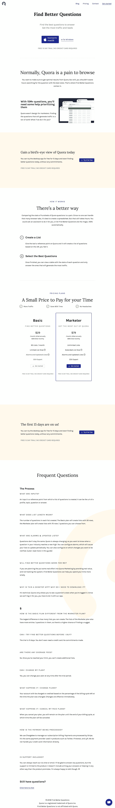

# 第一个顾客

> 原文：<https://medium.com/hackernoon/the-first-customer-e683ba5ccd88>

## 我的创业之旅

## 第 2 周—回顾

点击这里阅读上周的文章。

我这周做的主要事情是发布新的登陆页面。您可以在这里查看:【https://findbetterquestions.com/[。我还是想补充两三张图片。一张图片在顶部，两张在工作原理部分。页脚可能也需要一些改进。我也没有添加分析。](https://findbetterquestions.com/)

我这周只在 Quora 上发表了一个答案:[我如何在 Quora 上做广告？](https://www.quora.com/How-do-I-advertise-on-Quora/answer/Emil-Bruckner)

我一直在写一篇尚未发表的文章。

差不多就是这样。我修复了关于 Find Better Questions 应用程序的两个小问题，但是我的产品工作的其余部分进入了登陆页面。我的大部分营销工作也是如此。

Photo by [Alexandru Tugui](https://unsplash.com/@alexandru_tugui?utm_source=medium&utm_medium=referral)

有人花钱买了发现更好的问题。

暂时就这样了。我希望下周有更多的事情可以讲述。

[←第 1 周](/p/3bd4abf586d9/)
[→第 3 周](/p/68593a916aa5/)