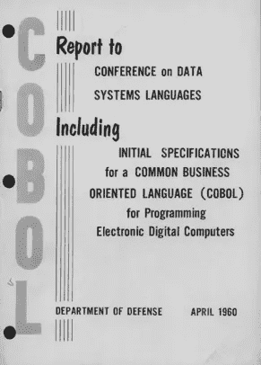

# 说方言:1950 年至 1960 年

> 原文：<https://medium.com/hackernoon/the-first-decade-of-programming-speaking-in-tongues-f395a228cf35>

## 个人编程史第一章的第二部分


## 言语含混

1957 年，FORTRAN(公式翻译)使得人们可以通过用人类的逻辑进行组合来编写程序，而不需要记住困难的操作码。

人类可读(和相关)的编程语言的工作方式是通过获取一个概念，比如打印出一些东西，正如我们刚才看到的，这需要十几行汇编代码，并将那个概念 *abstracting⁶* 成一个*保留字*。保留字不同于二进制或十六进制字。保留字是人类语言的代码字，用计算机字表示整个句子。在 FORTRAN 的情况下，取代上面大部分汇编程序的保留字是“write”。

一个叫做*编译器*的特殊程序将“写”扩展成十六行汇编语言，并将其他保留字扩展成它们各自的汇编语言等价物。

我们很快就会看到，许多早期的程序员不喜欢编译器。他们不相信他们能做得像人类一样好。一开始，这很可能是有价值的，但是随着时间的推移，人类将更多的“智慧”转移到了编译器中。此外，随着计算机容量越来越大，程序也越来越大，越来越复杂。对于一个现代程序员来说，击败编译器几乎是不可能的，也没有人真正去尝试。

但是在过去，即使使用编译器，程序员仍然“接近”金属。他们通常知道编译器在做什么，当它“看到”人类可读语言中的某些模式时会做出什么“选择”。优秀的程序员会以特定的方式编写人类可读的代码，以迫使编译器“做正确的事情”。

以下是用 FORTRAN 语言编写的“Hello World”程序:

```
1 implicit none
2 write ( *, ‘(a)’ ) ‘ Hello, world!’
3 stop
4 end
```

正如您所看到的，用 FORTRAN 编写减少了所需的编程语句的数量。平均来说是 20 倍。

编程生产率的提高是数量级的，因为程序越长或越复杂，生产率的提高就越显著。我给你举的例子都很短。对于一个更大的程序(几万或几十万行),这种差别会更明显。写 500 行而不是 10000 行比写 4 行而不是 16 行更能提高生产力。

几年前，格蕾丝·赫柏创造了一种商业语言，叫做 FLOW-MATIC，她认为人们应该能够用简单的英语给计算机编程，让计算机把英语单词转换成机器指令。很少有人听说过 FLOW-MATIC，但很多人听说过 COBOL(面向公共业务的语言),它在很大程度上基于 FLOW-MATIC，被很多人认为比 FORTRAN 更易于阅读。

```
1 IDENTIFICATION DIVISION.
2 PROGRAM-ID. HELLO-WORLD.
3 * simple hello world program
4 PROCEDURE DIVISION.
5 DISPLAY ‘Hello world!’.
6 STOP RUN.
```

必须指出的是，许多程序员不喜欢 COBOL 程序，因为它非常罗嗦，这可以被认为是生产力的下降。

麻省理工学院的术语 File⁷是这样说的:



来自瑞典的报道，一种(假设的)疾病可能是由 COBOL 语言编码引起的。该语言要求代码过于冗长(参见 candygrammar)；因此，有人声称用 COBOL 编程太多会导致一个人的手指因无休止的打字而磨损。“我拒绝再次输入所有源代码；它会给我 COBOL 手指！”

尽管如此，让更多的人能够使用编程总体上来说是一种生产力的提高，而且它仍然比汇编代码要少得多。

在 50 年代后期，同时出现了另外两种有影响力的语言，LISP 和 ALGOL(算法语言), LISP 今天仍被用于 AI(人工智能)编程。

几乎所有今天常用的语言都不是 FORTRAN 或 COBOL 的后代，而是 ALGOL 的后代(有时还带有一点 LISP 的影响)。但是这些后代在二十年后才开始出现，接下来的十年属于计算机制造商和电气工程师。他们不是通过语言，而是通过硬件和操作系统来提高编程效率。

> 这是一种远远领先于其时代的语言，它不仅是对其前辈的改进，而且是对几乎所有后继者的改进。⁸
> 
> ~查尔斯·安东尼·理查德·霍尔爵士
> 图灵奖获得者计算机科学家
> 谈到 ALGOL

## [<——上一篇系列文章](https://hackernoon.com/https-medium-com-it-explained-for-normal-people-the-metal-years-5be295dad17c)

## [系列下一篇- >](https://hackernoon.com/https-medium-com-it-explained-for-normal-people-big-iron-6aee4e32ed51)

[1]稍后，在第四章，我将深入解释*抽象*在计算中的含义。

[2]“行话文件是[电脑程序员](https://en.wikipedia.org/wiki/Computer_programmer) [俚语](https://en.wikipedia.org/wiki/Slang)的[词汇表](https://en.wikipedia.org/wiki/Glossary)和[用法词典](https://en.wikipedia.org/wiki/Usage_dictionary)。最初的行话文件是来自技术文化的术语的集合，例如[麻省理工学院人工智能实验室](https://en.wikipedia.org/wiki/MIT_Computer_Science_and_Artificial_Intelligence_Laboratory)、[斯坦福人工智能实验室](https://en.wikipedia.org/wiki/Stanford_University_centers_and_institutes#Stanford_Artificial_Intelligence_Laboratory) (SAIL)和其他旧的 [ARPANET](https://en.wikipedia.org/wiki/ARPANET) 、[人工智能](https://en.wikipedia.org/wiki/Artificial_intelligence)/[LISP](https://en.wikipedia.org/wiki/Lisp_programming_language)/[PDP-10](https://en.wikipedia.org/wiki/PDP-10)社区，包括 [Bolt、Beranek 和 Newman](https://en.wikipedia.org/wiki/BBN_Technologies) 、[卡耐基梅隆大学](https://en.wikipedia.org/wiki/Carnegie_Mellon_University)和[https://en.wikipedia.org/wiki/Jargon_File](https://en.wikipedia.org/wiki/Jargon_File)

全文可在 http://catb.org/jargon/html/index.html 获得。我在我的*幼虫期*的时候，怀着宗教般的热情阅读了它。可以在行话文件中查找*幼虫期*。

3 c . a . r .霍尔。1973.*编程语言设计提示*。技术报告。美国加州斯坦福大学。

这篇文章摘自我即将出版的书*混乱工厂*，它解释了为什么大多数公司和政府不能编写“正常工作”的软件，以及如何解决这个问题。