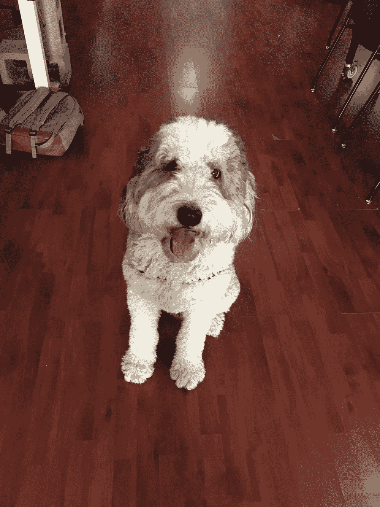

# 训练营结束后的第一年:反思

> 原文：<https://medium.com/hackernoon/the-first-post-bootcamp-year-a-reflection-1fc431e7d7de>

几天前标志着我作为一名软件工程师的第一年，或者像我们在这里喜欢说的那样，我的生日。这是令人惊讶的第一年，我想我应该反思一下作为一个在这个行业起步的人，我学到的一些重要的东西。

帮助我成功的因素:

1.  **富有同情心的经理和团队**

在 IFTTT 的头几个月，我可能 99%的时间都很慌张。我能够向我的经理和团队成员倾诉我的压力和不安全感。对我来说，有空间表达我的担忧，不被冷漠对待是很重要的。

2.**提问、分享知识和提供反馈的文化**

在 [IFTTT](https://hackernoon.com/tagged/ifttt) 我们有着浓厚的知识共享文化。web 团队每周都开会讨论我们一直在做的工作，并就与我们的堆栈相关的不同主题进行演示。我们经常亲自和[远程](https://hackernoon.com/tagged/remotely)配对完成任务，并定期给出和接收对彼此代码的反馈。在我们的团队中没有太多的自我意识阻止我们问问题或承认我们可能不知道最好的解决方案。这就是我们最终产品如此强大的原因。

A few of the members of my incredible Web team

3.**围绕多元化和包容性的对话**

我们每月都有多元化和包容性会议。我们不回避关于偏见和我们自身缺点的艰难对话，这有助于我们向前迈进，使 IFTTT 成为一个员工能够感受到自我价值的地方。作为一名从事技术工作的女性，有一个地方让我可以表达自己的观点，感受被倾听的感觉，以及倾听他人的经历，这一点很重要。

4.**狗友好型办公室**

IFTTT 对狗友好的事实是锦上添花。我的小狗 Tulsi 可以和我一起去工作，并把我们的团队视为她的大家庭。她的存在对每个人来说都是一种压力释放，她的滑稽动作让 IFTTT 成为一个有趣的工作场所。

Tulsi and her friend Finley

**还有什么难的**:

1.  你不可能什么都知道，这可能会让人不舒服。

有这样的时刻是很好的，我可以敲出一个功能，并对此感到自信，但我的大部分工作是说我会完成一些事情，而不是 100%确定我会如何执行它。我们在网上的后台都是用 Ruby 做的，这是我在工作中学会的。这就是问问题的安慰所在，有一个团队看到了寻求帮助的力量。

**2。不拿自己和别人比较。**

很容易看到另一个工程师完成工作有多快，或者他们理解一个概念有多容易，并开始将你和那个人进行比较。这是我仍在纠结的一件事，当它出现时，只要承认它，就能强有力地解除它对我信心的束缚。

为在 IFTTT 度过更多快乐的时光干杯！当然，还有一些我们办公室小狗的照片:

从左到右:格斯，佐伊和松饼