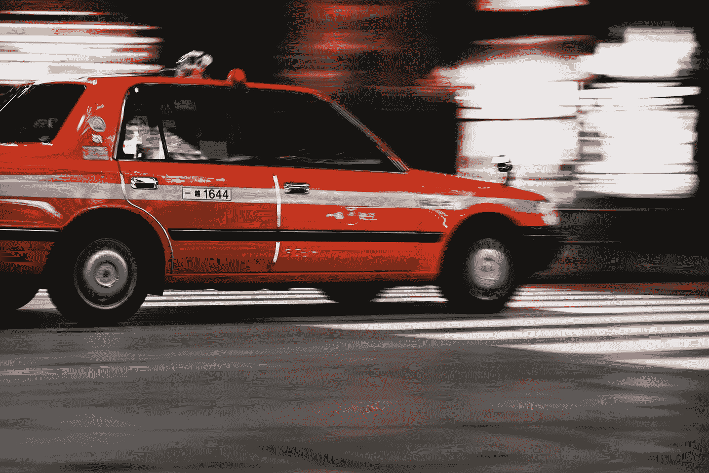

# 第一起自动驾驶汽车死亡事件

> 原文：<https://medium.com/hackernoon/the-first-self-driving-car-fatality-b16b6d523b83>

Not a self-driving car. Photo by [Oskar Krawczyk](https://unsplash.com/@oskar?utm_source=medium&utm_medium=referral) on [Unsplash](https://unsplash.com?utm_source=medium&utm_medium=referral)

今天，一辆自动驾驶汽车造成了第[起死亡事故](https://www.reuters.com/article/us-autos-selfdriving-uber/self-driving-uber-car-kills-arizona-woman-crossing-street-idUSKBN1GV296)。这不会是最后一次。

但让我们客观地看待这件事:2016 年，[有 37461 人](https://en.wikipedia.org/wiki/Motor_vehicle_fatality_rate_in_U.S._by_year)死于美国的道路上。每天有 102 人死亡。

在这一点上，很难说人类司机和计算机谁更安全。最好的衡量标准是每行驶英里数的死亡人数(VMT)。

2016 年每 1 亿 VMT 人有 [1.18 人死亡](https://en.wikipedia.org/wiki/Motor_vehicle_fatality_rate_in_U.S._by_year)。

> 自动驾驶汽车一直在进步，而人类司机却没有。

我们还没有自动驾驶汽车的 VMT 统计数据。这很难计算，因为自动驾驶汽车是新的，但也因为自动驾驶汽车一直在改进，而人类司机却没有。

我们确实知道人类司机越来越差。2015 年和 2016 年，每 VMT 死亡人数上升。这可能是由多种因素造成的，从基础设施恶化、速度到注意力不集中，尽管车辆更安全。

预计会有更多的自驾车死亡。但也期待总体死亡率下降——最终——这要归功于无人驾驶汽车。

**感谢阅读。如果你喜欢这篇文章，请点击上面的拍手按钮，并与你的朋友分享。我也鼓励你订阅我的 YouTube 频道。**