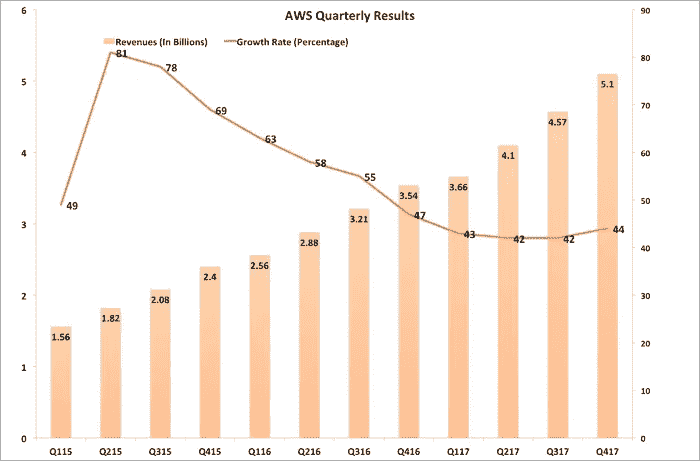

# 企业在 AWS 上犯的五大错误

> 原文：<https://medium.com/hackernoon/the-five-biggest-mistakes-enterprises-make-with-aws-9dd8760304d8>

AWS 很大而且越来越大已经不是什么秘密了。如果你看一下它过去三年的季度业绩，就会发现增长惊人。AWS 是一项每季度 50 亿美元的业务，增长率超过 40%。它的首席财务官说，AWS 是一项每年 200 亿美元的业务。让那件事过去一分钟。200 亿美元。40+%.从来没有一家企业技术公司有这样的数字。很明显，AWS 是科技行业的一个重要因素。

AWS 的大部分采用和使用是在企业 IT 组织内部。尽管 Airbnb 或网飞这样的公司知名度很高，但在信息技术上花费的绝大部分资金都花在了企业 IT 内部。这些组织越来越多地采用 AWS。

然而，他们中的许多人都做错了。在我从事云计算十多年的时间里，我与许多企业合作，帮助他们向 AWS 过渡。一些人已经迷上了 AWS 有些人最终达到了他们期望的结果；许多人连枷，从来没有完成他们的目标。

那么是什么把冠军和从未发生过的事情区分开来呢？根据我的经验，失败的 AWS 计划显示了以下五个错误:

# 错误 1:将 AWS 视为外包数据中心

AWS 运营数据中心，是的。当然，它提供计算服务。但它提供的服务不同于传统的数据中心功能，就像猎豹不同于家猫一样。

理解 AWS 与传统数据中心有何不同的简单方法是查看 [NIST 云计算定义](https://csrc.nist.gov/publications/detail/sp/800-145/final)。它确定了云计算的五个特征:

*   按需自助服务
*   广泛的网络访问(即服务的 API 控制)
*   共享资源库
*   资源弹性
*   基于细粒度资源消耗的成本

这些听起来都不像传统数据中心的运作方式*，但许多 IT 组织坚持将 AWS 视为一个*。他们用故障单请求机制来前端 AWS。一切都通过运营团队进行。用户可以请求的计算量是有限的。对计算环境的任何更改都由手动流程控制。用户无法看到或控制成本，因为他们只能获得季度总成本分配。

疯狂的一个定义是重复做同样的事情，却期待不同的结果。不幸的是，许多用户就是这样做的，并想知道为什么他们的 AWS 结果不令人满意。认为 AWS 只是一个位于电线末端的数据中心，会阻碍 IT 组织了解云计算的潜力。

# 错误#2:维护已建立的架构模式

云计算*可以*实现可扩展的应用程序，这些应用程序在面对资源故障时具有弹性。要实现这一点，需要改变传统的应用程序设计模式，传统的应用程序设计模式假设静态基础设施永远不会发生故障。直到它发生。

构建具有单点故障(SPOF)的应用程序只意味着一件事:当底层资源发生故障时(它们将会发生)，应用程序将会停止运行，直到通过操作防火演习执行紧急交换。

AWS 以一种完全不同的方式应对这一现实。它告诉你资源失败，你应该为此做好准备。其“[架构良好的框架](https://d1.awsstatic.com/whitepapers/architecture/AWS_Well-Architected_Framework.pdf)”白皮书提倡使用冗余资源。它还建议应用程序采用自动缩放来处理不稳定的流量负载。

太多的 IT 组织没有遵循这个建议，将他们现有的应用程序设计模式大规模转移到 AWS 中。当基础设施资源出现故障时，同样的消防演习也会发生。直到它了解到 AWS 的好处是它*允许在本地环境*中无法承受的 *应用模式，AWS 的生活将看起来很像传统数据中心的生活:脆弱的应用程序，运行时间统计数据很少。*

# 错误 3:不要改变开发过程

我看到许多企业 IT 组织热情地采用 AWS。他们对在几分钟内而不是几个月内访问计算资源的前景感到兴奋。但是，当应用程序不能更快地推出，不能更快地更新时，他们就会感到沮丧。

这是因为他们继续运行他们的应用程序开发过程，没有改变。沃伦·巴菲特对高风险投资有一句有趣的话:[在退潮之前，你永远不知道谁在裸泳。换句话说，当投资环境发生变化时，你就会知道谁的做法不谨慎。](https://www.quora.com/What-does-Warren-Buffett-mean-when-he-says-only-when-the-tide-goes-out-do-you-discover-who-has-been-swimming-naked)

AWS 的采用也是如此。因为过去获取基础架构资源需要花费很长时间，所以低效的应用程序实践不会暴露出来。花了几天时间完成一个构建？那又怎样？几周时间来解决所有的集成问题？没什么大不了的。然后一个月左右通过变更控制委员会获得更新并安装到生产系统中？是的，它可以更快，但真的，这不是我们最大的问题。直到 AWS 出现。然后所有这些延误都暴露出来，看起来很糟糕。

我把 AWS 称为 DevOps 的强制函数。一旦用户习惯了快速资源可用性的节奏，他们希望一切都以这种速度进行。迁移到 AWS 后保持现有的开发过程会导致无尽的头痛和不满。一个好得多的方法是将 AWS 的采用视为重新评估 IT 价值链的每个部分并将其修改为以云的速度移动的机会。

# 错误#4:不要解决遗留应用程序组合怪物

如今，许多 IT 组织都有云优先的政策。他们假设——甚至要求——新的应用程序将部署在 AWS 中。

然而，这并没有解决遗留应用程序组合的问题。一个简单的事实是，大多数 It 预算的 80%都花在了维护现有应用程序上。您知道，那些弹性差的应用程序，需要花费很长时间来更新，并且无法响应不断变化的负载模式？是啊，那些。

展望未来，公司将无法承受双层系统，整个应用程序组合中的一小部分驻留在 AWS 中，而大部分在旧的条件下遭受损失。

尽管看起来很困难，但所有这些旧应用都需要迁移到 AWS，并在某个时候重新编写，以利用 AWS 的云功能。不这样做就像把一个周末慢跑者放进尤塞恩·博尔特的运动鞋里:[设备在那里，但没有其他东西准备好利用它](http://www.telegraph.co.uk/usain-bolt-worlds-fastest-man/0/958-1919-3684---usain-bolt-worlds-fastest-man-in-numbers/)。

# 错误 5:不要给你的员工配备云技能

错误#1 到#4 反映了未能真正接受 AWS 和云计算。他们试图像对待传统数据中心一样对待 AWS，并使用在传统环境中一直有效的相同做法。我希望您已经确信，这些错误虽然可以理解，但都会让 IT 组织表现不佳。

错误 5 是不同的。它与人打交道。需要工作来纠正前四个错误的人。指望他们用他们在您的传统 It 环境中使用的技能来完成工作是不公平的。指望他们凭空获得必要的技能是不公平的。他们需要接受 AWS 和云计算方面的培训，以便能够通过使用 AWS 和云计算帮助 IT 组织提升到一个新的水平。

让员工参加一个共同的培训计划，确保每个人在设计应用程序、选择 AWS 服务和操作生产环境时都在同一页面上。根据解决新的和遗留的应用程序的需要，认识到您需要在整个组织中进行多广泛的培训。

知识是不可替代的，所以将 AWS 教育放在您的云采用路线图中。解决错误#1 到#4 的唯一方法是用新的解决方案解决旧的问题。给你的员工合适的工具，他们就会完成任务。

我可以帮助解决第五个错误。您可以在我的 Udemy 课程“最终 AWS 认证解决方案架构师助理”上获得 90%的折扣[使用此代码](https://www.udemy.com/the-ultimate-aws-certified-solutions-architect-associate/?couponCode=HACKERNOONCOUPON)开始您的 AWS 之旅。一旦你接受了培训，一定要解决第 1 到第 4 个错误，这样你就能在 AWS 的道路上取得成功。