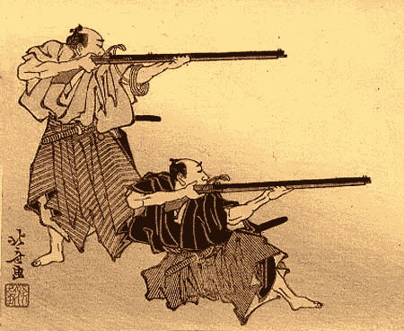
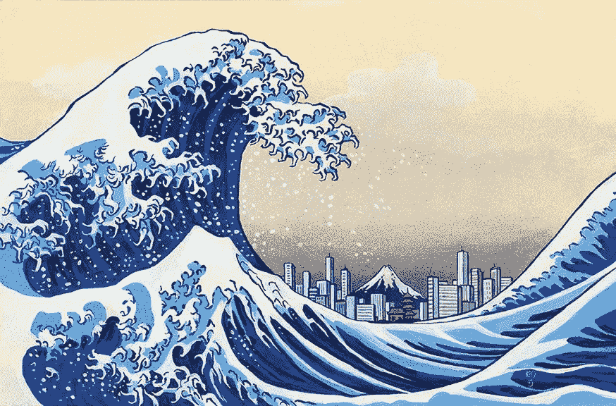
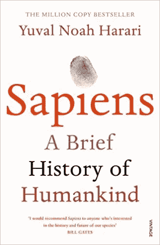
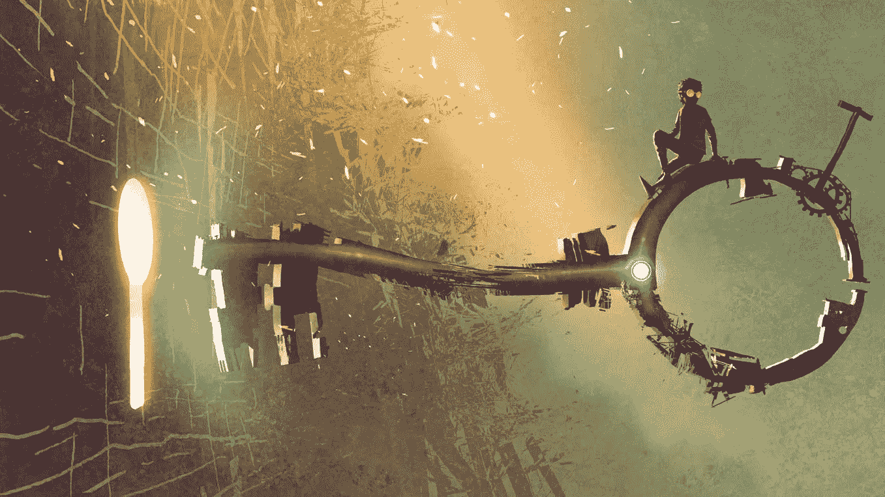
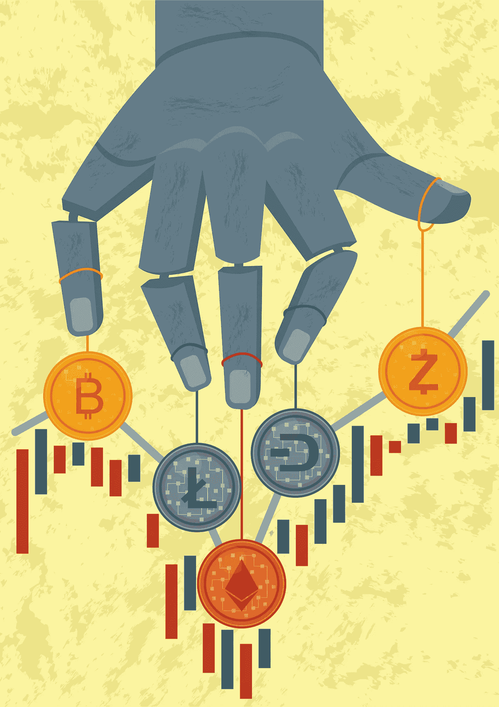
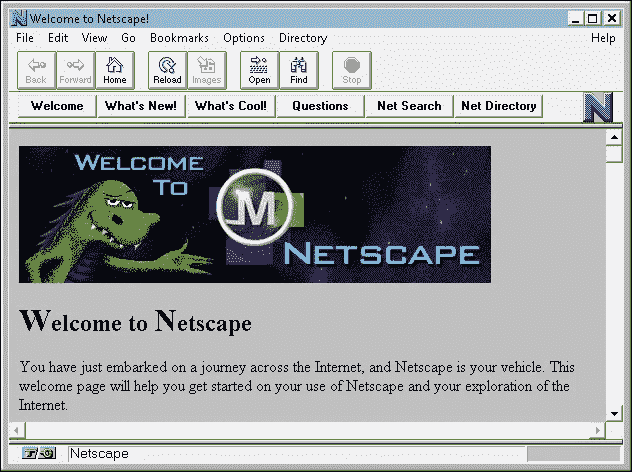
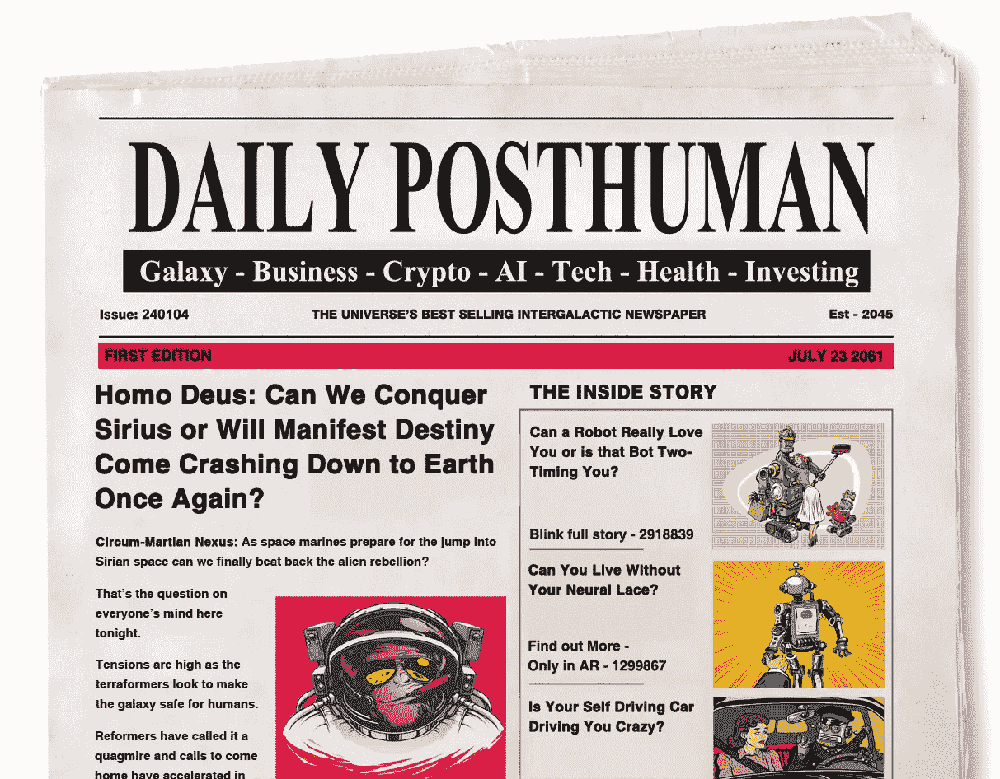

# 密码进化的五个关键

> 原文：<https://medium.com/hackernoon/the-five-keys-to-crypto-evolution-94be921e6354>

所以末日预言家一直都是对的。Crypto 只不过是一个泡沫，最终破灭了。

很好。

也许你会很惊讶这话出自我之口，一个对密码改变世界的力量贡献良多的人。我是不是突然变心了？我是否追随了保罗·克鲁格曼的潮流，并最终意识到比特币是邪恶的？我是否加入了那些每当价格下跌就幸灾乐祸地大笑，并傲慢地大喊比特币将归零的唱反调者？

没有。

我说好是因为马戏团终于离开了小镇。照相机已经打包回家了。记者们正在失去兴趣。故事讲完了。

现在，加密社区可以回去做和平和安静地建设未来的艰苦工作。

我总是说[泡沫会破裂，从长远来看，这一点也不重要。回想起来，我认为比特币这么快就涨到 2 万美元是这个社区发生的最糟糕的事情。多年来，比特币只不过是互联网极客的钱和笑料，但当比特币的价格越来越高时，它突然完全变成了另一种东西:](https://hackernoon.com/what-will-bitcoin-look-like-in-twenty-years-7e75481a798c)

一种威胁。

比特币的疯狂上涨吓坏了各地的银行和政府。随着可编程货币席卷全球，银行看到自己的商业模式崩溃，政府担心它们可能会失去对货币供应的铁腕控制。独裁政权竞相摧毁它。监管机构开始大规模行动。新闻界发表了大量充满恐惧、不确定和怀疑的文章[。](https://hackernoon.com/the-empire-strikes-back-with-a-coordinated-war-on-crypto-bdd84fd2f854)

但现在，随着比特币价格的回落，无知和恐惧的狂热将随之消失，社区可以重新开始工作。

在索伦的眼皮底下很难工作。

当中央集权感到受到攻击时，他们会因恐惧和愤怒而大发雷霆。他们以百倍的火力回应。没有办法正面赢得这场战斗。在战斗中，火力永远是赢家。

但是现在比特币不一定要赢。它可以回到在雷达下飞行，被嘲笑和嘲弄，只不过是书呆子的一个玩具，它的批评者相信它将直接归零。

当权者可以高枕无忧了。就像曾经在黎凡特打退了一大群入侵智人的尼安德特人一样，他们可以欢呼雀跃，重新感到安全。他们知道威胁已经过去，可以在洞穴里睡得很香。他们可以继续使用他们的石头和木头工具，而不用担心外国侵略者带来的奇怪的铁工具。

比特币有巨大的机会。它输掉了第一场战斗，但幸存了下来。现在它可以撤退并重组。

最重要的是它可以进化。

中国有句古老的谚语:

韬光养晦.

隐藏你的光芒，在黑暗中滋养。

# **现在是真正的撞车时刻**

不管你知不知道，cryptos 有了很大很大的突破。对崩溃心存感激。现在索伦之眼将转向新的想象中的恶魔。

已经开始了。

实体经济正濒临崩溃。

DJI 的图表开始变得和比特币崩溃前一模一样。

Quick, which is Bitcoin and which is the DJI?

DJI 面临着拉锯式的暴跌和上涨，这是市场陷入困境的迹象。

一场迫在眉睫的贸易战可能会让世界陷入混乱。为现代经济奇迹提供动力的科技公司面临着激烈的反弹，一些当权者试图打破它们。他们想象我们可以让时光倒流，回到一个更安静、更简单的时代，在那个时代，每个人都在当地的小商店里买书和电池。

没用的。舒适的小社区书店已经一去不复返了，因为他们已经在亚马逊和易贝上销售，接触到了一千多倍的顾客。甚至他们也不想回去在附近等待步行交通，而他们拼命地试图使租金。

你不能对抗未来。

在日本封建时代的江户时代，幕府设法在一百年内不让枪支进入该岛。

但最终枪战胜了剑。

现在事情进展得更快了。每一次革命都会加速进化。狩猎采集时期持续了近 200 万年，但农业革命只持续了 12000 年，五百年前科学革命爆发并再次重塑了社会结构。

变化在加速，而不是减速。

任何阻止它的尝试都只是堆沙袋对抗海啸。

# **智人归来**

尼安德特人的故事还有第二部分，由尤瓦尔·诺亚·哈拉里在史诗般的人类历史 [**智人**](https://amzn.to/2GIX1tb) 中完美地讲述。

尼安德特人击退入侵者后，他们似乎拥有了所有的优势。他们更大更强壮，有更大的大脑。但是有些不对劲。他们无法改变。像所有其他动物一样，在稀树草原和天空中滑行、赛跑和飞翔，它们的基因决定了它们的全部行为。

他们创造了石头和木头工具，但是几百万年来，这些工具实际上保持不变。它们没有变得更复杂。尼安德特人没有将它们组合成新的形状，也没有将它们与其他更耐用的材料融合在一起创造出混合体。这样，他们就像猿一样。类人猿围绕一个占统治地位的阿尔法雄性形成严格的等级社会，但他们有限的基因意味着他们永远不会发动民主革命，用长老理事会或法治取代这些阿尔法。

有一段时间，尼安德特人的远亲智人也是如此。他们似乎一代又一代地重复着同样刻板的行为模式，沿着进化、狩猎和采集的平稳平行轨道前进，快乐地生活在简单之中。

但是后来事情发生了变化。

我们不知道具体是什么，但它可能是一个随机的基因突变。他们的代码变了。突然间，他们说话不一样了，思考不一样了，看东西不一样了。

他们进化了。

后来有一天，智人回来了。

他们获得了时间感。他们可以谈论过去和未来。他们可以形成先进的战略和沟通的距离。

尼安德特人毫无胜算。

> “如果两个物种之间爆发暴力冲突，尼安德特人也不会比野马好多少。50 个以传统和静态模式合作的尼安德特人不是 500 个多才多艺和创新的智人的对手。即使智人输掉了第一轮，他们也可以很快发明新的策略，使他们能够赢得下一轮。”

[2001 A Space Odyssey](https://amzn.to/2H9Lf9a)

新的超级智人很快征服了他们，尼安德特人很快就灭绝了。

同样的命运等待着今天的机构。它们高大、强大、暴力，但它们以静止的模式移动。他们不能或者不会进化。

加密技术的优势在于其巨大的多功能性，只要有一些基因突变，加密技术将永远改变金钱和权力的面貌。

进化是关键。

但是怎么做呢？演变成什么？

让我们来看看五个必不可少的变化，这些变化将使去中心化的 cryptos 势不可挡。

# **密码进化的五把钥匙**

## ***1)缩放***

加密中的缩放问题是众所周知的，工程师们已经在努力工作了。我们已经知道如何扩展分布式、集中式系统。几十年来，我们一直在研究这个问题，从数据中心开始，到云基础设施，但分散式系统仍然非常新，是博士级研究的主题。

如果你认为扩展仅仅归结于大块，那么你还没有看得足够深入。

传统云系统线性扩展。如果您添加更多的服务器，就会增加更多的容量。当您将系统插入结构中时，设计合理的云系统几乎可以无限地继续增长。尽管越来越多的人每晚观看流媒体电影，网飞仍在不断增加容量。

令许多加密新手感到惊讶的是，无论你增加多少服务器，你都不会获得更大的容量，而只会获得更高的安全性。这是一个问题，但随着新架构的发展，它已经在发生变化。我们需要可伸缩性和安全性。

像 [Radix](https://cryptolingo.com/2018/01/25/radix-blockchains-days-numbered/) 这样的项目希望一劳永逸地解决缩放问题。以太坊已经深入[分片的兔子洞](https://thenextweb.com/hardfork/2018/02/23/ethereum-vitalik-buterin-sharding)，它可以也应该为这个星球上最大的去中心化应用网络增加巨大的容量。即使这两种方法都行不通，最终还是会有办法的。这只是时间问题。

说到比特币，规模已经在加速扩大。[闪电网络](https://motherboard.vice.com/en_us/article/gyw9aq/wtf-is-the-lightning-network-and-will-it-save-bitcoin)已经开始测试并运行，而[正在与日俱增](https://lnmainnet.gaben.win/)。我预计它将在夏季全面上线，并将永久解决比特币容量不足的诸多问题。

有些人不认为闪电网络将解决网络的所有挑战。那也没多大关系。再说一次，即使批评家证明是对的，LN 没有被证明是结束，请记住，我们仍然处于分散共识技术的早期。越来越多的想法将继续流入集体解决问题的意识，在某个地方有一个孩子拿着白板，梦想着一劳永逸地解决问题。

结垢问题你的日子屈指可数了。

## ***2)消除中枢扼流点***

Choke points strangle innovation.

如今，加密有两个主要的集中瓶颈:

*   交换
*   采矿

加密架构师需要尽快摧毁这两种范式。

ASIC 挖掘肯定比 GPU 挖掘更有效，但批评者是对的，它仍然燃烧大量的能源。即使是专注于保持采矿完全分散化的 cryptos，最终仍会蚕食有限的世界能源产能。

但这不是采矿的最大问题。尽管它对环境有破坏性的影响，但世界上还有成千上万更糟糕的能源消耗，比如汽车和农业。Crypto 能够也将会降低他们网络的电力拉力。他们最好尽快采取行动，因为大型采矿场最糟糕的地方在于，它们是中央权力的一个简单而明显的目标。

到目前为止，我们还没有看到很多试图淘汰矿工的尝试，但随着生态系统的增长，你可以指望它。我们已经看到对矿工进行登记的尝试，以及 T2 对大规模农场的禁止。预计随着中央大国变得更加偏执，并面临经济衰退带来的更多压力，这些攻击在未来将会加剧。

交易所是第二个瓶颈。他们是过度热心和反动的监管者和黑客的目标。作为新旧金融体系之间的主要桥梁，它们的权力有所增长，但它们非常容易受到法律和技术的攻击。

我们现在需要分散的交易所。但是，即使是分散的交易所也是由人发起的，通常需要网络基础设施来运行，这使得它们很容易受到攻击，就像我们在[以太三角洲黑客](https://news.bitcoin.com/one-week-etherdelta-hack-funds-still-stolen/)事件中看到的那样。即使你不能黑掉区块链，交易所仍然依赖脆弱的网络技术，这种技术已经被持续威胁公司使用了十年，囤积了他们从不报告的漏洞。Web 技术是安全和不安全框架的拼凑，它只不过是一个纸牌屋。

我们必须永远超越网络技术。

答案是原子互换。我们需要一个通用的硬币交换协议。

此后，交易硬币就变得简单了，只需监控总价格流，然后从你的钱包里发送一笔交易即可。这将终结巨大的目标和不安全的个人身份信息的集中存储库，这些信息很容易被黑客攻击和丢失。

密码是可编程的钱。我们需要对它的每一个方面进行编程，以设计出一个好的解决混乱的代理问题的方法。在今天的金融世界中，从交易、托管到资产继承的每一个动作都应该在程序本身中发生，而不需要“可信的”第三方。

## ***3)分配***

加密的最大问题是我在[中广泛写过的一个问题，为什么每个人都错过了加密货币最令人兴奋的功能](https://hackernoon.com/why-everyone-missed-the-most-mind-blowing-feature-of-cryptocurrency-860c3f25f1fb)和[将货币交付游戏化](https://hackernoon.com/gamifying-the-delivery-of-money-c55c25cecaee)。今天的 cryptos 错过了一个千载难逢的机会。他们想出了如何在没有中央权威的情况下印刷钞票，但他们使用了我们今天使用的自上而下的旧发行方法。

启动一个新的经济生态系统的最快和最具流动性的方法是改变我们*分配*金钱的方式。就像我们在视频游戏中因为做各种各样的动作而获得硬币一样，我们可以在创作的时候分发硬币，用于聊天，在社交媒体上发布故事和所有其他我们喜欢的事情。

出于某种原因，当我谈论游戏化的金钱时，似乎经常有人认为我在谈论共产主义或空投。

空投不会激励任何人使用这些钱或者参与到这个系统中来。我有一个 BAT 的空投，根本没有给网站。这个系统是坏的，因为没有激励让我继续把钱花在网站的内容上。我不是花钱买来送人的。但是如果我因为做日常事情而“赢得”钱，那就是另一回事了。

至于共产主义，我恨之入骨。从来没有成功过，也永远不会成功。它曾经“起作用”的唯一方式是谋杀数千万人，即使这样它也失败了。它失败了，因为它没有解释人的双重性。我们既自私又无私。任何只解决硬币一面的系统都是永久性的。

共产主义是将人们已经拥有的钱重新分配给其他人，并坚持每个人都生活在相同的经济阶层。货币交付的游戏化是在创造的时候把钱分配给人们而不是银行，这绝不意味着完全平等的分配，也不意味着人们不能创业、贸易和做其他任何事情来赚更多的钱。

我们说的是直接交付给人们的可编程资金，用于网络上的有益行为。那不是历史上存在的模式。这是无可比拟的。从来没有在任何地方尝试过。这是一个革命性的模式，不适合以前的想法。

我们为什么想要这个？

因为如果我们能迅速将资金分配给一个庞大的经济参与者生态系统，我们就能永远绕过菲亚特的瓶颈。如果我们不需要继续通过旧的系统，把钱转换到新的系统，一切都会改变。

想想吧。

一旦人们没有理由去接触旧世界的脏纸就可以靠密码生活，我们就有了一种全新的做生意的方式，这种方式会变得不可阻挡。

为什么？

因为依赖会产生瓶颈。

现在加密完全依赖于当前的货币系统。如果你仍然必须在菲亚特赚足够的钱来买一辆车，或者你必须把你的密码转换成菲亚特来买那辆车，你就有一个瓶颈。

但是，如果你能通过玩用可编程硬币制作的经济游戏赚到足够多的钱，那么你就可以独自依靠加密生存和发展，这意味着所有这些瓶颈都变得完全无关紧要。

如果我们不需要把菲亚特转换成密码，我们就根本不需要遵守旧规则。这将是一个全球并行的经济操作系统。

这就是金钱和人永远获得真正自由的方式。

## ***4)黑仔 App***

到目前为止，我们只讨论了基础设施。没有人购买基础设施，但今天我们有很多项目向公众兜售等同于 DNS 和 TCP/IP 的服务。在这里注册你的域名！为失误做一点分组交换怎么样？

没人关心基础设施。他们关心运行在基础设施之上的应用程序。我们需要杀手级应用。

那么什么是杀手级应用呢？

我给了这个世界[许多想法](https://hackernoon.com/why-porn-might-just-be-cryptos-first-killer-app-596cf822ef3f),正如我们所说的，许多项目正在努力将其变为现实。

我越来越怀疑这只是一种新的交流方式。

人类是特殊的，因为我们交流和讲述故事。我们创造我们都能相信的想象中的现实，这样我们就能一起朝着更高的目标努力。毫不奇怪，电子邮件、浏览器和加密信息是网络的杀手级平台。它们都是关于创造和传播信息和交流的。都是讲故事的。

Crypto 现在需要它的网景时刻。

可编程的钱是不够的。我们需要这笔钱的接口。

一旦普通人有了一个惊人漂亮的应用程序，功能上与他们习惯的集中式应用程序相同，同时还提供了他们不知道他们需要的难以置信的新功能，游戏就结束了。

普通人不关心隐私和安全，直到在战争或萧条中被武力夺走。相反，杀手级加密应用将不得不赋予他们隐私和安全，而他们甚至不知道它是内置的。

## ***5)超越网***

最后，一旦我们完成了所有这些，还有最后一步，这一步可能会让你大吃一惊。超越网络。

[网状网络](https://www.wired.com/2014/01/its-time-to-take-mesh-networks-seriously-and-not-just-for-the-reasons-you-think/)是未来。

互联网越来越被漠不关心的中央带宽提供商所主导，他们花费了数亿美元来抑制竞争对手的流量，这样他们就可以把他们拥有的劣质网飞替代品塞进你的喉咙。[独裁政府扭曲了网络协议](https://en.wikipedia.org/wiki/Great_Firewall)，将它变成了一个监控国家。民主力量紧随其后，甚至可能更先进，给我们自由的幻觉，而[他们吸收我们在网上说过或做过的每一件事](https://en.wikipedia.org/wiki/Global_surveillance_disclosures_(2013%E2%80%93present))。我们过去认为我们是脸书等社交媒体公司的客户，但现在我们知道我们是产品，广告商是客户。

随着人工智能加强监控，情况只会变得更糟。

未来的通信平台不仅需要没有后门的健壮的端到端加密，还需要跳过网络并永远离开它的能力。第一步是把互联网变成一个无声的数据包穿梭层，对运行在其上的加密应用程序视而不见。之后，是时候超越网络，转向网状网络，纯粹的点对点中继网络。他们会让我们领先老大哥的黑眼一步。

# **明天的战斗**

毫无疑问，加密是一场未来之战。

我们正处于世界历史的十字路口。

阿拉伯之春变成了阿拉伯之冬。到处都有间谍机构证明政府无视人民的意愿，无论如何还是建立了总信息感知计划。中国人每天都在收紧套在他们公民身上的绞索，比如社会信用评分等新的邪恶的数字产品。

They told us they were going to build it. Guess we should have believed them.

数字技术有能力永远锁定开放，否则它可能会变成一个我们永远无法逃脱的隐形监狱。

一如既往，除了我们自己，没有命运。

我曾经相信互联网会拯救我们所有人，像野火一样传播开放和自由，一种不可阻挡的向善的力量。从很多方面来看，的确如此:维基百科是一个持续的奇迹，就像远程办公一样，以及在几个小时或几天内将任何东西送到我们家门口的能力。

但是坏人也开始使用开放平台，虽然速度很慢，但是他们肯定已经把它扭曲成了他们自己的黑暗设计。

回想起来，这并不奇怪。中央大国无法抗拒无限扩张自己的权力。

这就像《哭泣的游戏》中的故事一样，青蛙同意带着蝎子过河，蝎子上下发誓它永远不会蜇他。在水的中途，当蝎子攻击时，青蛙突然痛苦地尖叫起来。

“你为什么这么做，蝎子先生？”青蛙说。"现在我们都会被淹死。"

“我没办法，”蝎子嘶嘶地说。“这是我的天性。”

我们不能指望中央权力归还他们前所未有的权力，窥视每个人的卧室和浴室，跟踪我们的朋友和家人，系统地研究我们的关系网。

我们必须自己决定我们的数字足迹是会成为一种控制的武器还是一把永远快刀斩乱麻的剑。

没人会来救我们。

明天就要靠我们收回了。

这意味着如果你正在读这封信，你就是革命。

############################################

# 看看这篇文章对我的新播客的讨论，[每日邮报](http://dailyposthuman.com/the-five-keys-to-cryptocurrency-evolution/)！上 RSS 频道，永远不要错过下一集。

###########################################

## 如果你喜欢我的作品，请[访问我的 Patreon 页面](https://www.patreon.com/danjeffries)，因为那是我与所有粉丝分享特别见解的地方。顶级赞助人可以独家访问传奇的硬币表 Discord，在这里您可以找到:

*   **市场来电**来自我和其他专业技术分析大师。
*   进入**投币人**专用**私聊**。
*   **幕后**看看我和其他专业人士是如何解读市场的。
*   **你还可以独家参加每月一次的虚拟聚会**，在那里我会分享我正在做的一切，让你看看我的幕后过程。
*   每次谈话后，我都会有一个问答环节。问我任何问题，我都会回答。

############################################

你也可以在 [**DecStack 停下来，这是加密货币和分散式应用项目**](http://decstack.com/) 的虚拟合作点，在这里你可以接触多个项目。永远完全免费。只是进来和社交，一起工作，分享代码和想法。通过反馈让你的想法更好。寻找新朋友。见见你的新家人。

############################################

[Photo credit](https://extranewsfeed.com/the-winds-of-world-war-iii-8bc369584f67)

*简单介绍一下我:我是一名作家、工程师和连续创业者。在过去的二十年中，我涉及了从 Linux 到虚拟化和容器的广泛技术。*

*你可以看看我的最新小说，* [***一部史诗般的中国科幻内战传奇***](http://amzn.to/2gAg249) *在这部小说中，中国挣脱了共产主义的枷锁，成为世界上第一个直接民主国家，运行着一个高度先进、人工智能的去中心化应用平台，没有领导人。*

## 加入我的读者群，你可以免费得到一本我的第一部小说《蝎子游戏》。读者称之为“神经癌的第一次严重竞争”和“黑色侦探会见约翰尼记忆术。”

############################################

## 最后，你可以[加入我的私人脸书小组，Nanopunk Posthuman 刺客](https://www.facebook.com/groups/1736763229929363/)，在这里我们讨论所有的科技、科幻、幻想等等。

############################################