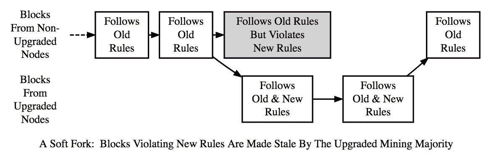
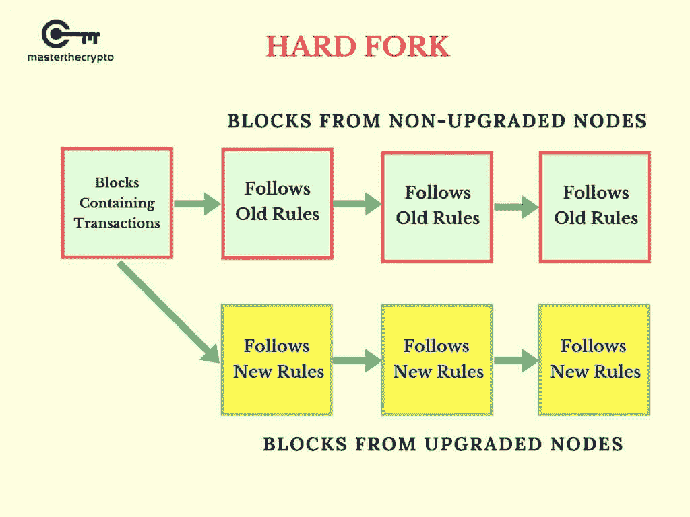

# 七月的叉子:区块链社区如何宣布独立

> 原文：<https://medium.com/hackernoon/the-forks-of-july-how-blockchain-communities-declare-independence-5382b933a0a9>

今天是 7 月 4 日，有趣的是，区块链项目的一个独特之处在于，用于传播变革的相同机制可以被用来违抗和宣布独立于链条之外。这种活力是一个特性而不是一个缺陷: ***分叉是区块链的自由机制。***

Photo by [Ursula Spaulding](https://unsplash.com/photos/bmxYEhqLVEk?utm_source=unsplash&utm_medium=referral&utm_content=creditCopyText) on [Unsplash](https://unsplash.com/?utm_source=unsplash&utm_medium=referral&utm_content=creditCopyText)

重要的事情先来。叉子是什么？

叉子是[工具](https://hackernoon.com/tagged/tools)，用于改变[区块链](https://hackernoon.com/tagged/blockchain)的共识规则。迈克·赫恩[简洁地解释了这一点](/@octskyward/on-consensus-and-forks-c6a050c792e7):

> “软分叉是指……协议的规则发生变化，使得旧节点意识不到规则不同，并继续接受遵循变化后的规则集的新节点创建的块。硬分叉是指……协议的规则发生变化，旧节点拒绝接受新节点创建的块。”

([Source](https://www.investopedia.com/terms/s/soft-fork.asp))

([Source](https://masterthecrypto.com/wp-content/uploads/2017/10/wsi-imageoptim-Copy-of-Copy-of-CRYPTOCURRENCY-1-1.jpg))

软分叉和硬分叉都被用作区块链治理的一部分，作为解决可伸缩性等关键问题的一种方式。在他的作品 [**“分叉、信号和激活”**](/@elombrozo/forks-signaling-and-activation-d60b6abda49a) 中，Eric Lambrozo 解释了激活的过程，通过这一过程，新共识规则的分叉得以实现。

如果在某些情况下，分叉只是进行必要更改的过程，那么在其他时候，它们代表了一种基本的分裂——通常植根于价值观或激励——将一个协议社区分成多个协议社区。

以太坊经典和比特币现金就是两个众所周知的例子。

以太坊经典是关于如何处理 DAO 黑客攻击中最终被盗的约 5000 万美元的分歧的结果。虽然社区中的大多数人(89%)投票支持硬分叉回到黑客入侵之前，以收回资金，但不同意的群体——重视金钱之上链的不变性——分叉了后来成为以太坊经典的东西。关于这方面的更多信息，请查看[“掉进兔子洞:以太坊，不变性，共识规则，&分叉。”](/social-club/down-the-rabbit-hole-ethereum-immutability-consensus-rule-forks-e9fa8faa9e07)要了解社区当时是如何讨论分叉的，请阅读 Blockstack 的穆尼布·阿里关于以太坊经典替代品出现的[和](/ownage/understanding-proposed-ethereum-forks-6abd63a478fc)[这篇综述文章。](/@muneeb/peeling-the-layers-of-blockchain-forks-d06b52340a3c)

与此同时，比特币现金是围绕区块链改进提案 148 的结果，该提案在 2017 年年中引入了隔离证人(SegWit)。核心上，围绕 BIP148 的争论是围绕如何扩大比特币的规模。正如 bitcoin.com 所说:“Segwit 试图压缩每笔交易的数据量，从而释放块空间，而比特币现金则使每个块的大小更大，最大可达 8MB。“如果有点简化论，这场辩论有效地将用户社区与矿工对立起来(这场战斗将在 2017 年晚些时候继续进行，最终出现了 SegWit2x 提案和反 No2x 运动)。正如下面的线索所示，这些是分叉并继续塑造社区的关键时刻。

目前，以太坊经典是市值第 15 大的加密货币，而比特币现金是第 4 大。这两种货币现在都是比特币基地可以交易的五种货币之一。

这些社区的成熟赋予了使用叉子作为有意义的不满表达的合法性，这本身就决定了其他社区如何发展。在应用中，福克斯将改写区块链共识规则的技术过程转变为一个讨论这些规则背后的价值观的社会民主过程。

**从臣民到公民**

这个质疑决策甚至指责的新机构可能不仅会影响开发者的心态，还会影响基于区块链的服务的更广泛的用户群体。

Web 2.0 建立在一系列将公司置于用户之上的假设之上:将个人数据交给第三方和平台是在网上做生意的代价；用户受制于服务想要做的任何改变，不管他们对谁感兴趣。

在 Web 3.0 中，这些假设将会改变。一切事物的流动性——换句话说，代理资本、编码者和社区必须宣布独立——从根本上改变了数字时代精神。分叉以及它所代表的更广泛的新兴治理流程，象征着消费者从产品用户向参与式技术生态系统公民的转变。

当然，民主是一个混乱的过程。丘吉尔著名的“民主是最糟糕的政府形式，除了所有其他的”这句话(与许多著名但未经证实的引用不同，[丘吉尔实际上是这么说的](https://richardlangworth.com/worst-form-of-government))已经在 cryptotwitter 上流传开来，抓住了这种情绪:

此外，就像在现实世界中一样，许多民主进程实际上是利益集团试图发挥他们的意志，把对他们最好的东西强加给整个集团。人们只需看看用户的需求与矿商希望看到的结果之间的紧张关系就够了。

尽管如此，今天是 7 月 4 日。在美国独立日，很难不对新规范的出现感到兴奋，开发人员和数字公民可以利用这些新规范发挥他们的自由，塑造一个更有活力、自由和开放的技术时代。

**延伸阅读**

如果你和我一样，对这些东西很着迷——或者如果你只是需要假装在工作，以便从你的家人那里得到短暂的休息，*当然*你爱他们，但是，你知道，他们会变得不知所措——那么你开始吧:

[要叉还是不要叉](/crypto-nyc/to-fork-or-not-to-fork-fbc8f9010cc1) ( [弄雷蒂](https://medium.com/u/9f3988a56032?source=post_page-----5382b933a0a9--------------------------------))

[硬分叉和加密不变性的神话](https://blog.sfox.com/hard-forks-and-the-myth-of-crypto-immutability-56adccbd8eb9) ( [SFOX](https://medium.com/u/94080810b346?source=post_page-----5382b933a0a9--------------------------------) )

[比特币核心合并流程](/@elombrozo/the-bitcoin-core-merge-process-74687a09d81d) ( [埃里克·隆布罗佐](https://medium.com/u/8fcd91e98202?source=post_page-----5382b933a0a9--------------------------------))

[关于加密货币分叉的解释](https://hackernoon.com/an-explanation-of-cryptocurrency-forks-65d79efe214c) ( [菲尔·格雷泽](https://medium.com/u/ea2960c31deb?source=post_page-----5382b933a0a9--------------------------------))

[民主化区块链分叉](https://blog.aeternity.com/democratizing-blockchain-forks-2460ff245c4e) ( [互联网](https://medium.com/u/6d952745da12?source=post_page-----5382b933a0a9--------------------------------))

[可扩展性、硬分叉和市场](/@spair/scalability-hard-forks-and-markets-faf80350c3ff) ( [斯蒂芬对](https://medium.com/u/522f25eff532?source=post_page-----5382b933a0a9--------------------------------))

[如何给硬叉子定价](/@jillcarlson/how-to-price-hard-forks-8605d4f6c7be) ( [吉尔·卡尔森](https://medium.com/u/2ccb8f2dd2ba?source=post_page-----5382b933a0a9--------------------------------))

[防御“白”的硬叉，像以太坊刀——修](/@dennyk/in-defense-of-white-hard-forks-like-the-ethereum-dao-repair-9a0eb2e848df) ( [DK](https://medium.com/u/8adae634cadf?source=post_page-----5382b933a0a9--------------------------------) )

[剥区块链叉子的层](/@muneeb/peeling-the-layers-of-blockchain-forks-d06b52340a3c) ( [穆尼布阿里](https://medium.com/u/8dd3ab013f82?source=post_page-----5382b933a0a9--------------------------------))

[叉子指南:你需要知道的关于叉子、硬叉子和软叉子的一切](https://masterthecrypto.com/guide-to-forks-hard-fork-soft-fork/)

[叉这个:关于加密货币的未来，这是一场前所未有的法庭大战](https://www.technologyreview.com/s/610928/fork-this-what-an-unprecedented-court-battle-says-about-the-future-of-cryptocurrency/)

[矿池和硬叉预示 51%攻击](https://cryptobriefing.com/mining-pools-hard-forks-51-percent-attacks/)