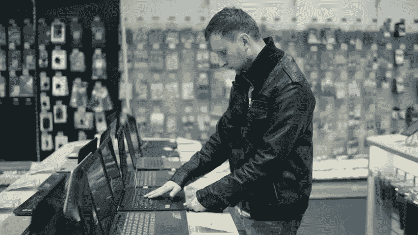
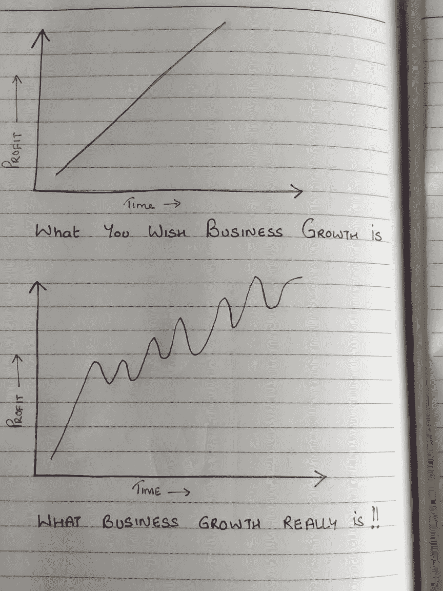
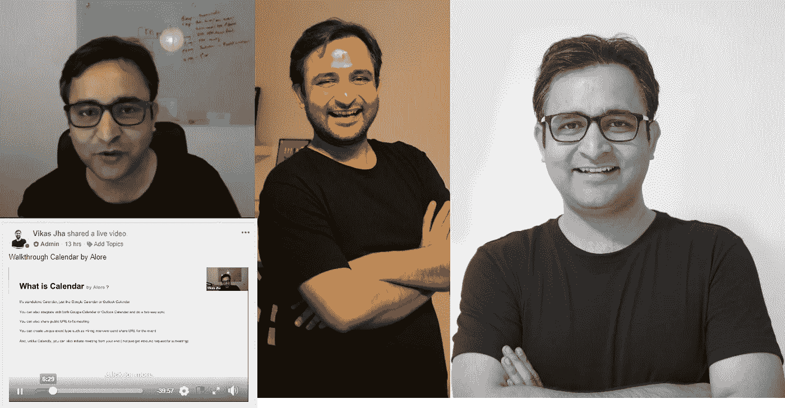
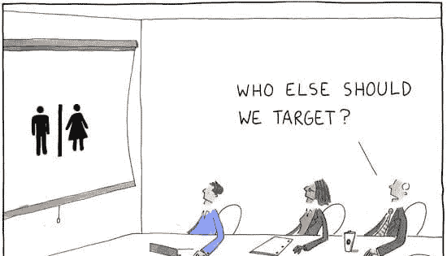

# 创始人的困境——当我们做出消极的隐形选择时，我们错过了什么

> 原文：<https://medium.com/hackernoon/the-founders-dilemmas-what-we-miss-when-making-negative-invisible-choices-8ca1eb467cd9>

We’re always overdosed with choices, Image credit — Shutterstock.com

了解我们初创公司创始人做出的无形选择的力量，这些选择塑造了我们成功的轨迹，避免了决策疲劳。

几天前，我无意中看到了 Unsplash 首席执行官兼创始人 Mikael Cho 的一篇文章。他说的一些话深深打动了我——“要成为一名富有成效的初创企业创始人，选择很重要”。

由于是在团队电话会议前几分钟，我在电话中提到了这件事，这引发了关于这个话题的长时间讨论。发布这个电话，在一毫秒内，我可以用一个整齐的和弦把过多的看似不相干的事情绑起来。

作为创业者，我们的决定决定了我们是谁，但我们的选择决定了我们会成为什么样的人。

它总是与我们做出的选择有关——不仅仅是作为创始人，还是作为领导者。这就是我们高潮和低谷的区别，也是我们跌倒和冲刺的区别。

Startup growth — The reality of it !

我们一天有 24 小时！作为一名创始人，你应该对自己和团队负责，通过把时间投入到正确的地方来最大限度地利用你的一天。

为了最大化你的一天，你需要做出正确的选择。这里的精彩之处在于，这不仅适用于创始人，也适用于任何想要成功的高层领导。

每天我们都要做出和面对数百个选择——创始人的困境！！有些是显而易见的，比如向哪些潜在客户演示，追逐哪个客户，今天要见谁等等。但是有很多隐藏的选择——我觉得在塑造你的一天和一周中更重要的那些看不见的选择。

以听起来像个极客为代价，我将分享我在这上面读到的一些有趣的东西。诺贝尔和平奖得主、经济学家希尔伯特·西蒙将人们分为两类决策者——满足者和最大化者。

**满足者**——他们是去买土豆的人。他们去最近的市场，看看他们是否喜欢新鲜的土豆，然后买一两公斤。

**最大化者**——这些人会首先检查附近市场是否有任何交易，他们卖得很便宜，甚至可能在市场上跳来跳去寻找最佳交易，并根据食谱的需要只买 650 克。

现在想象一下，这两个人中谁会面临决策疲劳和压力。

为了让我们感到富有成效，我们需要明白我们不可能一直是最大化者。你可能会说这些人是超级勤奋的一群，但老实说，过度勤奋是有害的。

作为初创公司的创始人，时间是你最宝贵的资产——不是团队，不是风投资金，而是时间。把时间花在正确的决定和任务上，你可以在几个月内从零开始变成英雄。朝着这个方向的一个重要步骤是做出选择，帮助消除认知超载，当面对多种选择时，认知超载基本上会变得混乱。

它始于一些基本的东西——你的睡眠时间。我注意到，总的来说，拥有标准化的睡眠时间会让你在一天的工作中领先一步。在工作日，我 12 点睡觉，4 点左右醒来。它帮助我建立了一个清晨惯例，我可以用它来制定一天的计划，区分优先次序，处理需要全神贯注的任务等等。相反，当我睡得晚，在早上 6-7 点醒来时，这种习惯就会失去平衡。我在这里做的无形选择是选择那些时间。

甚至你对衣柜的选择也会起到一定的作用。我在这里研究消去原理。我有大约 20 件黑色圆领 t 恤和 7-8 号牛仔裤，每天都穿着去上班。你可能会想“哦，他在模仿扎克伯格和史蒂夫·乔布斯”，这几乎是真的。他们这样做证明了这个想法是正确的。我并没有试图复制它们，而是学习其中很少有人愿意看到的更大的意义和价值。

56%的人花 11 -30 分钟来决定早上穿什么并做好准备(来源: [YouGov](https://today.yougov.com/topics/lifestyle/articles-reports/2012/07/10/morning-routine-30-spend-over-week-getting-ready-e) )。对于一个创始人来说，这是相当大的一笔钱。如果你已经知道穿什么，你就节省了时间，可以利用它做其他事情。例如，我为妻子做早餐，或者边听播客边跑步，因为我总是在不到 5 分钟的时间内做好准备！

I really am in black all the time. From webinars to meetings to everyday at work.

当然，按照时尚警察的说法，这很疯狂，但我又少了一个决定，我更喜欢这样。(我也不会写我的妻子如何不喜欢我的衣柜😉)

下一步，外出工作时——即使是开优步或自己的车也会有所不同。我发现自己在开车的时候会更加烦躁和疲惫(如果遇到堵车就更是如此)。

这些只是生活中的小例子，当你第一次意识到你潜意识中做出的无形选择，然后把它变成积极的有意识的选择。

我们很多人都面临习得性无助的概念。它源于我们的被动、拖延和解决问题能力的下降，导致愤怒，在极端情况下可能导致抑郁。

我想详细谈谈我们在工作中做出的选择:

# 1.即使不对，也要选择友善

我无法告诉你有多少次我听到创始人同事在接到电话后感觉不对，选择解雇表现不佳或不一致的员工。事实上，在许多文化中，解雇或被解雇被视为可耻和消极的行为。不应该，也不是这样。这只是两个人发现他们是错位的，意味着不同的事情。雇佣一名员工并不是为了在他们最糟糕的时候照顾他们而与他们结婚，但我们大多数人选择推迟这个决定，希望事情会有所改变。事实是，如果事情在 100 天内没有改变，它们可能永远不会改变。

选择你的事业，而不是选择把它的成功押在磕磕绊绊的新员工身上。

# 2.不拖延的选择

拖延应该被称为一种流行病。我是认真的！

我们当中有太多的人会推迟事情，想着“嘿，今天我好像排满了，让我把它推到下周吧”或者“等我有时间的时候再做吧。”。商业不是这样运作的，当然也不是早期阶段。

最近，我们采访了 Scott Sambucci，他是 SalesQualia 的首席执行官和创始人，也是这个行业的天才。在谈话中，他说，“给我看看你的日历，我就给你看看你的现金流”。

他的一句话真的让我开始思考，我是如何为自己的所作所为感到内疚，也为看到别人这样做却不去改变而感到内疚。有意识地努力找出你拖延的时间。挑选出你将致力于完成任务的日子，比如每天花两个小时做一些特定的事情。周一——战略和计划，周二——发现潜在客户，周五——招聘等。一旦你做到了这一点，坚持下去，你就会看到

# 3.不选择特异性

这是理论上我们都知道的事情，然而在现实生活中，我们只是失去了控制。我们从制定一个防弹计划开始，计划你的业务在第 0 周、第 10 周、第 30 周会是什么样的，你将分别特别关注人物角色 a、人物角色 b 以及人物角色 a 和人物角色 C，但是当你真正开始行动的时候，你却没有明确目标是谁。

Target audience when there is no strategy , Image Credit — marketoonist.com

不了解谁是你的目标受众，并采取一种近乎“喷雾和祈祷的方式”,重要的是要注意，你是你时间的主人！！

# 4.选择理解少即是多

今天有一百万种工具可以让你的生活变得轻松。例如，如果你想做社交媒体日程安排，你可以使用 Buffer、Hootsuite、Sprout Social、tweet Deck 等。如果只有一个可用的工具，那么这很容易，但是当有很多工具时，就几乎出现了分析瘫痪。你不知道该选择哪一个，也不知道将来需要什么样的功能。害怕错过(FOMO)也占了上风。

现在听着，听我说，选择意味着说一个是和一百个不。

一件简单的事情就是相信你的直觉，只采用一种解决方案。例如，当我负责营销的同事 Deepika 想同时使用 Hootsuite 和 Buffer 时，我让她使用其中一种，而不是两种都用，这样就不需要在不同工具之间切换了。它帮助我们更专注于正确的事情。

# 5.选择技术来帮助你而不是引导你

好吧，这听起来可能有点傲慢，但我是技术是为了帮助我们变得富有成效，但定义方向。我说的是不要成为技术将你引入歧途的牺牲品。好吧，诚实地回答这个问题，有多少次你感觉每隔几分钟就要检查一次你的电子邮件，或者在每次手机响的时候都有检查手机的冲动。我不是说隐姓埋名，而是限制这种行为。例如，你可以每小时查看一次电子邮件。当你专注于某件事情时，确保你的手机是静音的，只有紧急联系人可以打电话(是的，几乎所有的智能手机都允许你这么做！)

也使用大多数客户使用的技术。例如，在 B2B 领域，我们都知道 LinkedIn 是一个令人惊叹的平台，但是对于我们 Alore CRM 来说，我们觉得脸书通过各种小组和功能帮助我们更好地与我们的客户和潜在客户联系。由于人们对脸书的警惕性有所下降，而且那里的声音更大，我们以脸书团体社区的形式创建了我们的支持论坛。我们还发起了一个大规模的社区创意，分享销售和增长的秘诀，并与对[大规模创意](https://www.facebook.com/groups/ideasthatscale/)的销售和增长感兴趣的生态系统建立联系

这帮助我们利用技术和合适的平台为用户创造身临其境的体验。我建议，退一步，看看什么技术可以帮助你节省时间，让你远离绒毛和咳嗽。这不仅能帮你节省时间，还能避免你在十种工具和频道之间转换而导致的精神疲惫。

最后，我想说，创始人的困境将永远存在。路上的每一步你都会觉得你必须做出选择——花时间在 X 或 do Y 上，但最终哪一步会带你走向更大的目标是你成长的关键。有些日子你会一天工作 18-20 个小时，有些则不会。如果你每天都在增加价值，你需要始终关注。休息一下并不坏，但如果你能休息一下并仍然受益，那为什么不呢？比如，你可以看看网飞，或者读读菲尔·奈特的自传《鞋狗》，每周和朋友去喝酒，或者去附近的共同工作空间参加社交聚会。选择权在你。让它正确，让它有价值！

我想引用约翰·C·麦克斯韦的话来结束我的演讲——“生活就是一个选择的问题，你所做的每一个选择都会造就你！! "

*原载于 2018 年 5 月 18 日*[*blog . alore . io*](https://blog.alore.io/the-founders-dilemmas-what-we-miss-when-making-negative-invisible-choices/)*。*