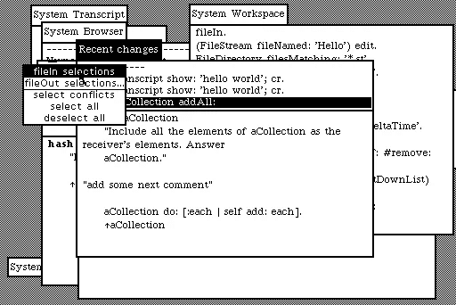

# 大盒子，小谈话:1980-1990(第 1 页，共 2 页)

> 原文：<https://medium.com/hackernoon/the-fourth-decade-of-programming-bigger-boxes-smaller-talk-ba3d2410898e>

## 个人编程史第四章的第一部分

## 比面包盒还大

在八十年代，一种新的计算机开始变得普遍，即*工作站。工作站是功能强大的专业版个人电脑，价格相当于一辆 T2 新汽车。消费者个人电脑的价格只相当于一辆 T4 二手车的价格。有用于数字动画等工程任务的 SGI，用于报纸版面设计的 Apollos，运行计算中心和计算机辅助设计(CAD)的 sun，以及成为世界上第一台网络服务器的 NeXT 工作站。这里有一个有趣的事实:从程序员的角度来看，iPhone 是 NeXT 的直接后代。*

为这些新计算机编写的许多程序是用新语言编写的。自 COBOL 以来，语言对生产力的影响首次超过了硬件或操作系统。在这十年间出现的许多语言中(至少有 65 种)，有三种为这些工作站开发的新语言对所有计算机的编程产生了持久的影响。

因为它深刻地影响了几乎所有在它之后出现的语言。

**C++** *(在本文的第二部分)*因为尽管它没有像其他两个那样改变编程的技巧，但它是如此的普遍以至于不得不被提及。

最后， **Objective-C** *(在本文的第二部分)*因为这是一个与语言打包在一起的类库如何极大地提高生产力和灵活性的故事，它们可以在几十年内驱动数百代设备。

## 好东西来自小包裹

Smalltalk 实际上最早写于 1972 年，但在施乐帕洛阿尔托研究中心(PARC)保存了八年。1980 年，发布了新版本并分发给四家公司进行同行评审和实施:惠普、数字设备公司、泰克和苹果。我估计 Smalltalk 在重要性以及对计算机和编程效率的影响方面与 C 语言相当。

它有影响力的众多方式之一是它附带了一个开发环境。集成开发环境(ide)在今天已经很常见了，但是在 Smalltalk 之前，大多数程序员都是用文本编辑器编写代码的(这种编辑器在最近几年有所恢复)。Smalltalk 附带了一个特殊的工具，它不仅可以组织*存储库*中的代码，还可以帮助你查看代码的哪些位与其他哪些位相连，并且它允许在运行时检查代码*。在此之前，程序员必须嵌入调试消息(在程序运行时发送给自己)，这样他们就可以看到程序在崩溃前执行了多远。他们必须使用硬件功能，一次一条指令地单步执行代码，并拍摄称为核心转储的内存快照。*

Smalltalk 是第一种包含开发环境的语言，支持在程序运行时对其进行实时检查，这意味着开发人员可以立即看到他们编写的任何代码的所有含义。想知道一个索引是从零开始还是从一开始？试试吧——“问编译器”。它比查字典要快。Smalltalk 是有史以来最具交互性的编程语言。

如果没有 Smalltalk 开创的一些 IDE 概念，许多现代语言(如 Java)将完全无法使用。

Smalltalk 也是第一种通用的面向对象编程(OOP)语言。几乎现在使用的每一种语言都使用对象。Smalltalk 向我们展示了如何操作。

对象被视为控制代码重用的一种方式。从编程的早期开始，编码人员就重用自己喜欢的代码来实现大多数程序共有的例程和功能。与以往一样，这种代码重用非常特殊，从一个程序员到另一个程序员在各个方面都有所不同。同样，对一个副本进行的错误修复和增强并不适用于复制该代码的所有其他程序。

对象的工作方式就是有一个“类库”。这些类是对象的模板或蓝图，程序的主代码将使用它们来“实例化”或构建对象。因为程序的代码与类库是分开的，所以一个类可以用一个 bug 补丁来更新。因此，任何使用该库的程序都可以被重新编译，错误修复将被自动合并，而无需重写任何程序代码。至少理论上是这样。

今天，几乎所有流行的语言都使用这一明显的改进，而不是从笔记本上剪切和粘贴代码片段。

对象是一个抽象层，当潜在的复杂性隐藏在一个模型后面时，这就是你所说的抽象层。电视频道就是一个很好的例子。信道是无线电频率的抽象。当你把电视机调到“频道 2”时，你实际上是在调整电视机的电路，使它接收 54 到 60 兆赫之间的无线电频率，而忽略所有其他的无线电信号。

FORTRAN 等语言是汇编代码的抽象，汇编代码是机器码的抽象。面向对象的语言增加了第三层抽象。

现代软件使用许多抽象层次。当你与一个网页交互时，你至少要处理十几个抽象层。你点击的“按钮”实际上是屏幕上的一个区域，它被操作系统捕捉到，并传递给网络浏览器，浏览器将它与内存中的一个像素图进行比较，该像素图是通过解释 HTML(以及 CSS 和 JavaScript)而构建的“文档对象模型”呈现的，该模型调用 HTTP 函数，而 HTTP 函数又调用 TCP/IP 协议。 该“应用编程接口”通常由一个或多个“框架”构建，这些“框架”是编写它们的语言的抽象，它们本身是汇编语言的抽象，汇编语言是机器代码的抽象。

这是高度简化的。现实是，实际上有*多* *多*层牵涉其中。

然而，在八十年代，程序员仍然在“接近金属”的地方工作。只有操作系统抽象和语言抽象。优秀的程序员知道下面是什么。好的程序员，即使他们没有用汇编代码写，也知道如何阅读它，并且知道他们的代码如何翻译成汇编代码——至少在对性能至关重要的领域。

苹果电脑受到 PARC 施乐公司所做工作的强烈影响。苹果公司与施乐公司达成协议，允许他们以 100 万美元(一年后价值 2200 万美元，今天价值 67 亿美元)购买 10 万股股票，以换取 1979 年在 PARC 进行的两次为期一天的技术演示。施乐做得不错。

与施乐管理层不同，苹果管理层致力于将这些想法传递给消费者。很自然，施乐公司的一些最优秀的人才最终为苹果公司工作，想法也随之而来。

尽管苹果可以访问 Smalltalk，但它使用 Pascal 作为其官方开发语言，因此它最终扩展了 Pascal 语言以包含对象。这是帕斯卡物体。然后，它创建了一个名为 MacApp 的对象库或框架，旨在为开发人员创造巨大的生产力收益。它错过了标志，因为它有太多层次的继承，太复杂了。它没有简化开发，反而在许多方面使开发变得更加复杂。这就是为什么你可能从未听说过它。

## [<——系列文章的前一篇](https://hackernoon.com/the-winds-of-change-1970-1980-c1baa1c07872)

## [系列下一篇- >](https://hackernoon.com/the-fourth-decade-of-programming-how-the-web-was-won-9e4c258ec9fb)

[1]如果火车站是火车停靠的地方，那么什么是工作站呢？
*(典型的程序员幽默)*

这篇文章摘自我即将出版的书 *The Chaos Factory* ，该书解释了为什么大多数公司和政府不能编写“正常工作”的软件，以及如何解决这个问题。