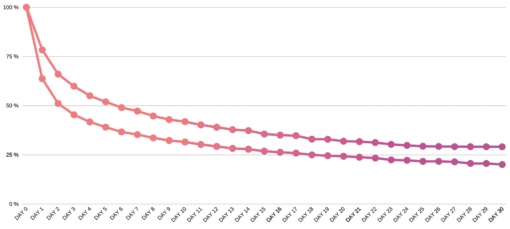
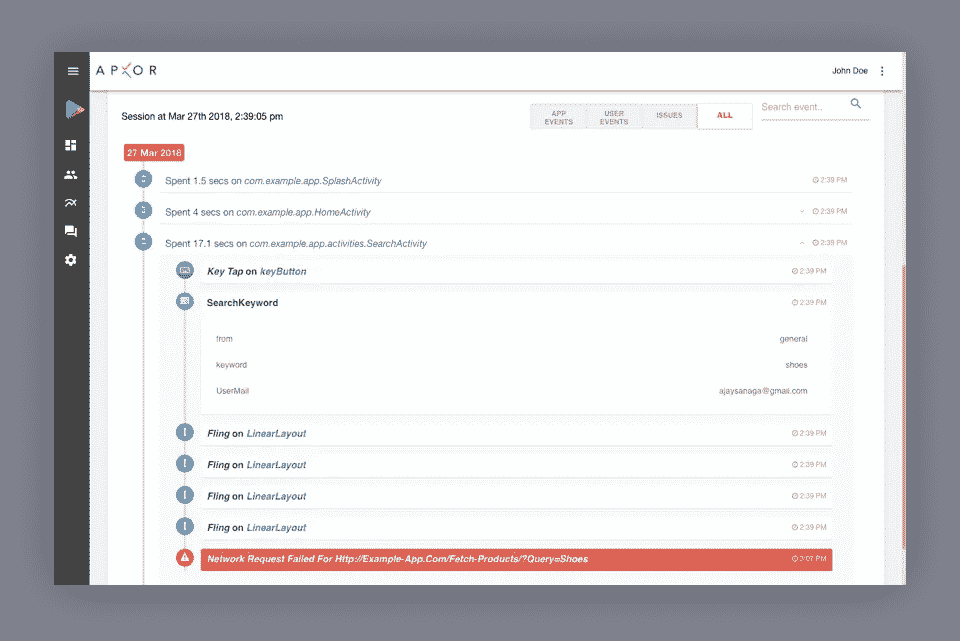

# FTUE 的故事——事实证明，1/2 的新用户会在不到一分钟的时间内决定是否需要你的移动应用。

> 原文：<https://medium.com/hackernoon/the-ftue-story-turns-out-1-in-2-new-users-decide-if-they-need-your-mobile-app-in-less-than-a-7d5f7fafe606>

Guiding a new user to activation.

对于一个做产品的人来说，一个用户在他的[手机应用](https://hackernoon.com/tagged/mobile-app)中的第一次用户体验就像是第一次见他女朋友的爸爸。

他沉迷于自己的穿着，试图获得一个体面而又酷的胡子长度。见面时，他试图友好地握手，但只是挥挥手就被拒绝了，而经济时代习以为常的眼睛会把他从头到脚扫视一遍。

但是紧张的片刻之后，他们会敞开心扉，轻松地交谈。他不禁想知道这个老人在想什么……他对我有什么看法？我的服装可以吗？他觉得我的大学趣闻好笑吗？他在把我和他脑中的其他潜在匹配者进行比较吗？哦，最好不要去那里。

正如我精心设计的类比所示，当新用户浏览你的移动应用程序的[功能](https://hackernoon.com/tagged/ftue)时，他们也留下了许多没有答案的问题。

他们点击最重要的下载按钮，等待应用程序安装，并通过你的入职序列。然而，在不到一分钟的时间里，几乎一半的新安装程序卸载了该应用程序，再也不会出现。就像我们之前的相遇，有太多的未知。

快速的谷歌搜索会让我们看到一些文章，这些文章提供了提高用户在应用中的价值的技巧。有各种各样的建议，从减少应用程序的大小，跳过登录页面，增加一个入职教程等等。

这些提示在某些情况下可能很有效，但通常只会给你的未来指标带来不可察觉的变化。

这里的交易，测量和改善 FTUE 需要一个系统的方法。我们来分解一下。

> D1 保留率提高 20%会导致 D30 保留率提高 50%。

Improvement in D1 retention corresponding to D30 retention

**又一次测量 FTUE**

一旦用户经历了你的入职流程，他们就会探索、理解并发现使用你的应用的价值。但是第一次使用的用户很少会做你期望他们做的事情。

理解这些用户体验所需的大部分关键信息都没有被捕获。例如，在分析这些用户时，用户交互、该瞬间的应用环境以及用户应用体验中每个阶段的时间因素都会发挥作用。正是这些非常短暂的数据充分说明了用户的意图，他们对应用程序的期望，以及他们开始使用你的应用程序不到一分钟就放弃的原因。

FTUE 的方法需要改进。在 D0 上卸载应用程序的用户不能像终生保留在应用程序中的用户一样进行分析。

让我们来看一些系统的方法来理解和提高所有改进的价值。

**确定并利用你的 D0 机会段**

对于移动应用程序，正面解决 D0 流失问题是很棘手的。虽然其中一些是已知的，但根据我们的经验，如果你的 D0 流失率低于 28%(基于垂直行业可以更高)，请认为你是幸运的。

好消息是，相当大一部分第 0 天的流失是可以保留的，因为它包括那些渴望使用你的应用程序但却离开了的潜在客户。根据特定于你的应用的行为和互动来识别这些被搅动的用户。

进入 D0 机会阶段需要科学的方法。

对于希望通过个性化新闻源吸引用户的新闻空间中基于内容的应用程序来说，在确定 D0 机会细分市场时，需要考虑一些首次会话因素。

*   花在个性化上的时间(选择兴趣)
*   用户交互模式，如每次花费的滚动次数、达到的内容界限数等
*   阅读完整文章的数量
*   总花费时间

根据这些因素分析 D0 未安装用户会带来商机。

同样，找出特定于您的应用程序的 D0 机会细分市场，并努力留住它们。

**了解你的阈值**

当涉及到优化 FTUE 的 D0 流失时，最重要的因素是找到他们的卸载阈值，即用户在他们流失之前给移动应用程序的机会。

例如，在一个优惠券应用程序中，大多数第一次使用的用户如果在 48 秒内没有找到优惠券，就会被激怒。像这样的阈值将决定用户界面的变化，揭示应用程序中潜在的功能发现和采用问题。基于该阈值，可以进行诸如让用户在少于 4 次点击或在规定时间内获得想要的优惠券之类的改变。

用户动机决定了卸载阈值，并从一个垂直行业变为另一个垂直行业。虽然有些用户在应用程序上花了 2 分钟以上才找到价值，但也有一些恼怒的用户等待不超过 30 秒。

设计在您的卸载阈值内工作的用户激活路径是处理 D0 流失的有效方法。

**定性用户理解**

另一个实现 FTUE 的重要方法是如何理解新用户。一个用户是在应用中度过一生，还是在第 0 天就开始翻腾，是他如何在移动应用中度过第一分钟的一个因素。

定性地说，理解新用户的旅程为进一步的定量分析和行动奠定了基础。它可以帮助你回答一些问题，

*   他是如何使用这款应用的？
*   我的应用对他来说是什么样的？
*   他在做什么？
*   他喜欢应用程序中的什么，他是如何与之互动的？
*   如果有机会，他会给出什么样的反馈？

> 通过分析用户交互、应用性能和业务事件，全面了解用户旅程。

Holistic understanding of individual user behaviour with Apxor

这有助于您制定假设，这些假设可以通过对数据进行量化切片和切块来验证。您的 FTUE 指标(如用户激活和卸载阈值)应源自特定于垂直行业的定性分析，而不仅仅是指标。

**动作**

虽然分析和理解用户很重要，但在正确的时间对他们采取行动才是一个伟大的未来。在这个阶段，只有很少的用户关注，因此立即采取行动就像终生留住这些用户一样重要。配备提供个性化和强大操作的工具真的很方便。

这是一个通过引导女性用户进入隐私设置来留住女性用户的例子。

Contextual in-app guidance in real-time.

这些是打造令人印象深刻的未来的步骤。但这些决策需要由数据驱动，并实时执行。下一篇文章将会有更多关于衡量和改善移动应用 FTUE 的内容，请订阅我们的时事通讯。

同时，如果有任何关于你如何工作的有趣的事情，我们很乐意听听。在 contact@apxor.com[联系我们](mailto:contact@apxor.com)

*原载于 2018 年 8 月 28 日*[*blog.apxor.com*](https://blog.apxor.com/2018/08/28/the-ftue-story-1/)*。*