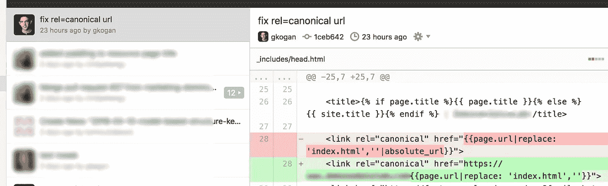

# 故障排除的乐趣

> 原文：<https://medium.com/hackernoon/the-fun-of-troubleshooting-10bfeeae3340>

Cartoon by Greg Kogan, published in Harvard Business Review.

“我应该做点什么，”我想。一个客户的[谷歌](https://hackernoon.com/tagged/google)分析账户在过去 15 天里丢失了数据，我只是在早上第一时间注意到了这一点…

我认为值得花几分钟时间来确定问题的范围—丢失了哪些数据以及丢失了多少—然后计划在适当的时候修复它…

几分钟后，我得知丢失了 15 天的数据，仅限于[营销](https://hackernoon.com/tagged/marketing)网站，而不是博客或应用程序。“让我至少排除一些明显的原因……”如果这个问题可以在几分钟内解决，让它再持续几天将是一种耻辱！

这些最初的想法不起作用，但排除它们让我专注于分析堆栈的三个领域。不妨尝试隔离问题，这样当我真正坐下来解决这个问题时，我就知道去哪里找了…

Cartoon by Greg Kogan

又过了一段时间，我发现问题源于 Segment——一种收集分析数据并将其分发到其他目的地(如谷歌分析)的工具。对于每个数据包(“命中”)，它包括命中发生的 URL。但是它发送的是相对路径而不是完整的 URL，谷歌分析拒绝了这些点击，因为它被配置为期望完整的 URL，如`https://www.website.com/path/`而不是`/path/` …

然后我就很好奇为什么会这样。毕竟，没有人改变谷歌分析或细分市场的设置。最近几周唯一的活动是在网站本身。我去 GitHub 查看了网站的提交历史…

不知过了多少分钟，我看到了:在编辑列表的深处，页面的规范 URL 标签的生成方式发生了看似无害的变化。他们不再显示完整的 URL，而是改为只显示页面的相对路径…

我写了，推了，验证了一个简单的修复，带着一个跑步者看到终点线时的喜悦和兴奋。

A quick fix that was a lot of fun to find.

拼图的最后一块已经就位，现在我正带着小小的骄傲看着完成的组件。如果再容易一点，那就成了一件苦差事；再难一点的话，就会分散注意力。这个问题有合适的解决步骤，以快乐作为回报。