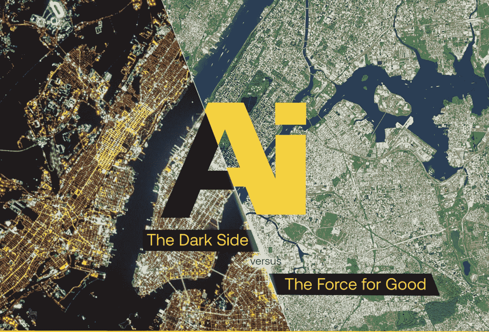
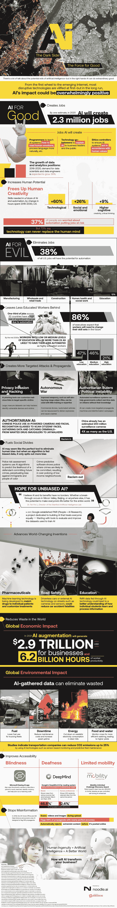

# 未来就是现在:人工智能为恶 vs 人工智能为善

> 原文：<https://medium.com/hackernoon/the-future-is-now-ai-for-evil-vs-ai-for-good-8e87093b148>

人工智能能力的爆炸式增长得益于人类的聪明才智。制造机器来接管从建筑到零售的服务业是技术的一大步，也是人类更大的一步。但是，尽管我们中的一些人担心我们的工作，但人工智能在错误的手中可能会有更邪恶的意图，甚至将生命置于危险之中。

在商业环境中，人工智能增强减少了我们日常做的平凡和重复的任务，有助于释放我们宝贵的创造力。到 2021 年，这将为企业创造近 3 万亿美元的收入，并提高 62 亿小时的员工生产率。作为一股向善的力量，我们期待人工智能帮助我们变得更安全、更聪明地学习、更高效地工作——但并不是每个人都有良好的人工智能动机。从专制政府，到宣传，再到加剧社会分化，人工智能的好坏取决于我们的意图。

尽管我们可能害怕人工智能的结果和能力，但这项技术背后的驱动力是人类。当这些机器被指责为邪恶时，我们只能怪自己。看看这张信息图，了解更多关于人工智能的发展及其善恶潜力。

