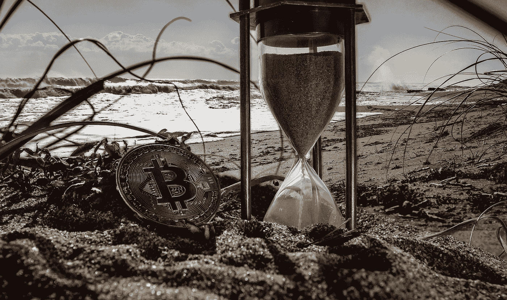

# 比特币的接受度越来越高

> 原文：<https://medium.com/hackernoon/the-future-is-now-bitcoin-acceptance-is-growing-ab4a01fb3b38>

## 未来就在现在

比特币已经存在了近十年，并正在迅速成为全球公认的支付方式。有很多不同的地方可以接受比特币支付。这些范围从点对点市场一直到知名零售商。甚至有公司允许你用加密货币购买礼品卡，然后可以在目前不接受比特币的在线商店兑换商品。可以用 BTC 买到的东西每天都在增加。对于一个完全对抗全球金融现状的去中心化和密码学的实验来说还不错！

# 是什么推动比特币前进？

五年多以前，没有人会相信这种不为人知的新货币能与传统货币相匹敌。很可能连创始人中本聪都没有想到比特币会得到全球认可，比特币的价格会一飞冲天。

自那以后，人们对加密货币的态度发生了变化，现在比特币不再是一个新鲜事物。这是一种受欢迎的资产，既可以作为有利可图的投资，也可以作为合法的支付手段。那么，是什么扭转了比特币的局面？

# 媒体炒作

主流媒体一直是一个强大的工具，以促进对新的发布和发展的认识。比特币也不例外。然而，另一个黑客，市场的兴衰，政府的禁令——任何与加密货币相关的新闻都被媒体大量报道。这种炒作导致比特币在公众中得到更好的认可和接受。目前，加密货币市场回顾或分析是任何类型媒体的必备标题。

# 思想领袖的支持

人们倾向于追随关键人物。当世界上最受尊敬的领导人如[比尔盖茨](https://www.bloomberg.com/news/videos/2014-10-02/bill-gates-bitcoin-is-exciting-because-its-cheap)、[史蒂夫沃兹尼亚克](https://bitcoinmagazine.com/articles/money2020-wozniak-thinks-bitcoin-better-gold/)、[理查德布兰森](https://twitter.com/richardbranson/status/789391121969360896)支持比特币或其背后的技术，甚至投资加密货币时，它不会不被公众注意到。这助长了对该行业的积极情绪，并引发人们购买一些硬币，以进一步受益于价格上涨，或者只是参与新的技术革命。

# 政府宽容

政府监管是另一个有助于塑造公众舆论的工具。迄今为止，只有少数几个国家强烈反对比特币。大多数政府正在研究将加密货币纳入监管框架的方法，但不是将其清除。一个突出的例子是日本。一旦金融服务机构在 2017 年承认加密货币是支付商品和服务的合法手段，比特币的价格飙升，投资者的信心也增加了。

这种公众和政治支持也有助于企业更广泛地接受比特币。下面，我们列出了人们使用加密货币的一些方式。让我们来看看。

# 比特币:此处接受

**零售商。**越来越多的在线零售商直接接受比特币付款。许多不同类型的商家开始接受加密货币。一些比较突出的例子是在线约会网站 OKCupid、绅士生活杂志《花花公子》、计算机巨头微软和家居用品销售商 OverStock.com。

这些网站允许他们的客户直接用加密货币支付商品或服务。随着 2017 年的价格爆炸，他们中任何一个更早开始接受比特币并决定保留部分数字货币支付的人都很高兴他们的决定(我们看着你积压！).

**楼市。**随着比特币价格在 2017 年一路飙升，这个空间里有很多新的资金。这些早期投资者中有许多是年轻的千禧一代，否则他们将很难登上房地产阶梯。对他们来说幸运的是，越来越多的卖家接受用比特币支付房地产的例子。有像比特币房地产这样的网站，或者像坎特公司这样的经纪人，提供高端房产来换取 BTC。

事实证明，房地产的加密货币支付非常受欢迎，以至于更多的代理商开始专门促进这一过程。坎特公司的安德鲁坎特解释道:

*“我们意识到，在加密领域有如此多的新财富……有许多新买家，许多人的财富在过去一年里出现了波动。”*

点对点市场。如果你喜欢易贝的想法，但希望你可以直接用 crypto 支付，像 OpenBazaar 这样的[平台是理想的选择。用户可以在平台上出售他们不想要的物品，他们自制的商品，各种种子，以及各种收藏品。OpenBazaar 对用户能卖什么和不能卖什么没有像易贝那样严格的政策。你几乎可以用它来转移任何你喜欢的东西(从而购买任何东西)!](https://bravenewcoin.com/news/openbazaar-sets-its-sights-on-ebay-and-amazon/)

**脱衣舞女。**那么，在你通过比特币房地产购买了你的豪宅，在 OverStock 装修了它，并且在 OKCupid 未能找到爱情之后，你的比特币还能花在什么地方呢？

今年早些时候报道了第一个脱衣舞女接受加密货币支付的例子。舞者们戴着二维码，游客可以扫描这些二维码，然后用手机直接给她们小费。据报道，这个想法非常受欢迎，以至于罪恶之城的加密货币自动取款机经常爆满！D 赌场就有一台这样的机器。它们的主人强调了它们在拉斯维加斯的成功:

该死的机器快满了！它价值 8 万美元，每隔几天就会变满。”

这些只是凸显比特币在全球越来越被接受的一些事情。然而，对于比特币固有的功能和监管仍有许多担忧，这使得比特币无法被主流接受。一旦提供了解决方案并做出了改进，比特币将不仅作为一种投资资产，而且作为一种普遍有效的支付方式而存在。希望明年这个时候，支持比特币的商家名单会更长。我们对它的发展方向感到兴奋！