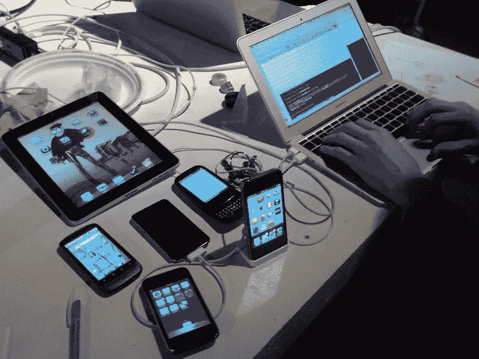

# 应用程序开发的未来

> 原文：<https://medium.com/hackernoon/the-future-of-app-development-e89f72c3ea8b>

Source: [Flickr](https://www.flickr.com/photos/jenny8lee/5152854505)

在过去的二十年中，世界各地的组织开始意识到，如果没有足够的网站，商业成功的机会就会大大减少。随着时间的推移，网络存在的范围已经扩大。社交媒体档案、优化页面和移动响应网站已经变得司空见惯，有些人会说，这是在现代开展业务所必需的。现在，将移动商务应用程序或“应用程序”添加到列表中

我们都知道什么是移动应用——专为平板电脑、智能手机和其他移动设备设计的软件应用。你通常通过专门针对你的手机操作系统的应用商店来下载，比如苹果的应用商店或者谷歌 Play。这些应用可能是游戏(想想糖果粉碎或 Flappy birds)，实用程序或办公程序(Gmail 和 Slack 就是很好的例子)，甚至是购物或服务门户网站(亚马逊和优步的应用很适合这一类别)。

对于应用程序开发领域的任何人来说，理解“所有移动事物”的流行和增长都很重要。2015 年，移动设备总共下载了 100 亿千兆字节的数据。到 2020 年，预计通过应用商店和应用内广告，移动应用的收入约为[1890 亿美元](https://www.statista.com/statistics/269025/worldwide-mobile-app-revenue-forecast/)。此外，[根据 Statista](https://www.statista.com/topics/1002/mobile-app-usage/) 的数据，“截至 2017 年 3 月，谷歌 Play 商店有 280 万个可用应用，苹果应用商店有 220 万个可用应用，这是世界上两个领先的应用商店。”

有趣的是，虽然应用程序的使用持续增长，收入也在增加，但 TechCrunch 的 Sarah Perez 报告称，大多数美国消费者实际上每月下载的应用程序为零。

移动应用程序开发者可能对应用程序下载量的下降相当熟悉，并且已经有一段时间了。Recode 在 2016 年年中发表了一篇文章，开头写道:“移动应用热潮始于 2008 年 7 月，当时苹果推出了应用商店。现在结束了。”

这似乎是一个悖论:人们厌倦了下载应用程序——但应用程序比以往任何时候都更受欢迎。那么这对应用程序开发的未来以及应用程序本身的未来意味着什么呢？

# 物联网和云连接

Source: [Pexels](https://www.pexels.com/photo/access-adult-blur-business-261628/)

这里的主要观点是，人们*希望*使用应用程序，但他们厌倦了下载它们。人们希望事情快速、简单、容易。例如，2018 年初，[谷歌实施了变化](http://www.wearetg.com/google-update-puts-emphasis-on-mobile-first-content-strategy/)，在确定结果页面的排名时，考虑了网站在移动设备上的加载速度。这远不是唯一的排名因素，但它预示着一个向移动友好世界的重大转变。谷歌已经表示，他们认识到移动体验对绝大多数互联网用户来说极其重要。如果你还没有[投资响应式网页设计](https://hackernoon.com/the-importance-of-responsive-web-design-for-optimal-user-experience-3aee5c3c6099)，那你就落后了。

企业领导、员工和消费者等都在呼吁移动优先的技术解决方案，让他们能够通过多种设备即时轻松地访问静态数据。这个不断增长的设备和传感器网络被称为物联网，或物联网。

“不断增长的移动市场背后的驱动力是物联网的影响及其广泛的覆盖范围，”玛丽维尔大学在线的专家写道。“物联网连接延伸到交通、能源和农业领域，预计将推动移动战略的发展。”

在未来，应用程序将需要相互“说话”，就像物联网中的设备通信一样——事实上，云及其通过 API 和容器连接如此多不同事物的能力将是应用程序开发的轻量级、低代码未来的*基本*。

# 前途是光明的。未来是光明的。

Source: [Pexels](https://www.pexels.com/photo/background-blur-bokeh-bright-220067/)

今年早些时候，为 CIO 撰稿的 Kevin Rands 说，如果你还没有听说过应用程序开发的低代码方法，你最好做好准备，因为你马上就要听说了。

“简化的方法包括用最少的代码量进行快速设计和开发，通常依赖于第三方应用程序编程接口(API)，”他说。“低代码开发没有真正的个人定义，因为它更多的是一种思维模式，而不是可以直接测量的东西。但事实上，这是一种心态，导致围绕这种心态的社区涌现，低代码创新者正越来越多地扰乱各种不同的行业。”

Rands 认为低代码平台提供了更低的成本，更少的错误，更好的可访问性，以及整体上全新的开发类型。他指出优步是低代码平台最有前途的例子之一，因为它“存储用的是 Box，地图用的是 Google，支付用的是 Braintree，通讯用的是 Twilio，电子邮件用的是 SendGrid”等等。

理想情况下，这些低代码平台由两部分组成；一种 WYSIWYG 界面构建器，一种语法上类似于人的语言规则和模式的语言。正是*这种*简单性实际上将最大程度地改变应用程序开发。

# 应用程序开发人员和云计算转向数据科学

Source: [Pexels](https://www.pexels.com/photo/coding-computer-data-depth-of-field-577585/)

正如我们所知，低代码平台将同时导致应用程序开发人员的崛起和消亡——或者至少,《信息世界》的作者卡洛斯·梅伦德斯是这样认为的。

梅伦德斯写道:“应用程序开发人员的消亡在传统的非技术市场最为明显，因为成熟的商业用户已经准备好了易于使用、可定制的工具，他们知道自己想要什么，可以轻松编写自己的脚本。”。“然而，在构建更复杂的认知解决方案的技术公司内部，人们维护和管理这些应用的需求将会继续。”

因此，梅伦德斯认为，非科技市场的传统应用程序开发人员和软件工程师可能需要考虑磨练他们在数据科学、云计算和安全技术方面的技能。他指出，这些领域将是需求最大的领域；这是不断发展、复杂、数据驱动的市场不断增长的结果

虽然没有人能够绝对肯定地预测未来，但应用程序开发的发展方式与传统软件过去的发展方式相似。在“底层”建立之后，软件库开始相互集成和交互——我们在同一点上，不同的是这些“库”存在于云中。

虽然应用程序开发的未来尚不确定，但我们可以回顾过去，预测未来。很有可能在未来这个领域将会被数据点和 API 连接所充斥——更不用说区块链上的应用开发了。

我们可以肯定的是，应用程序开发的未来看起来将与当代迭代大不相同。开发商最好开始为未来做准备。