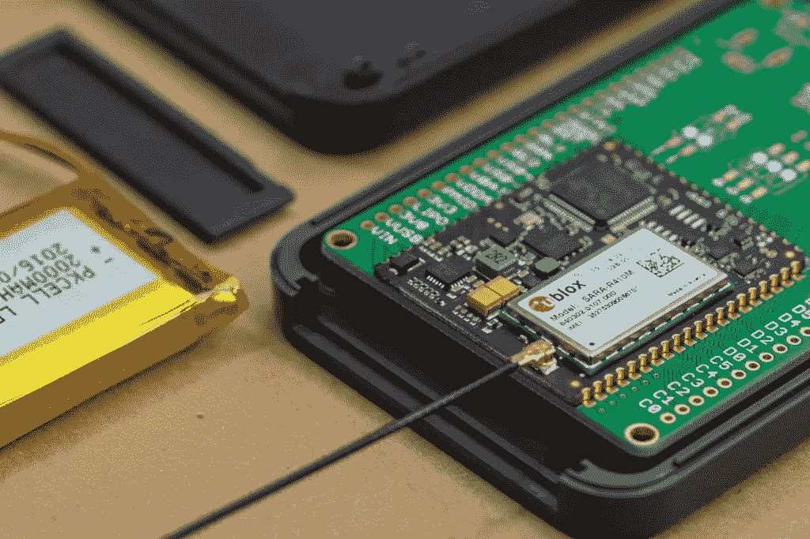
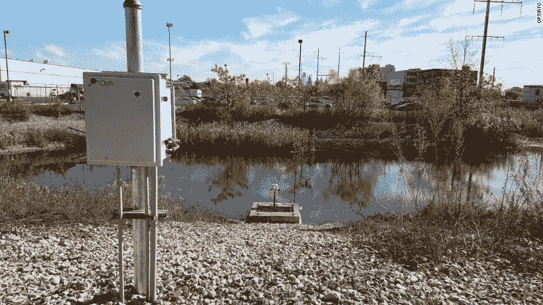
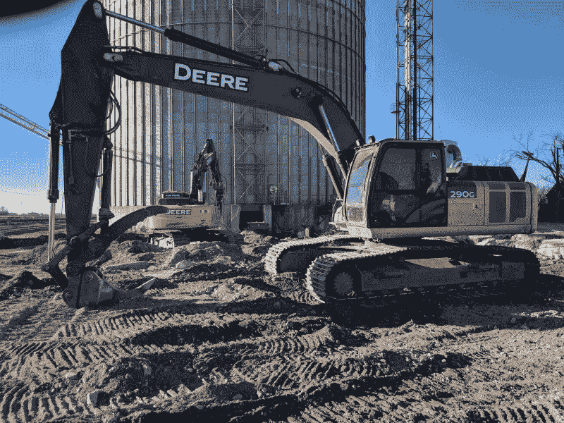
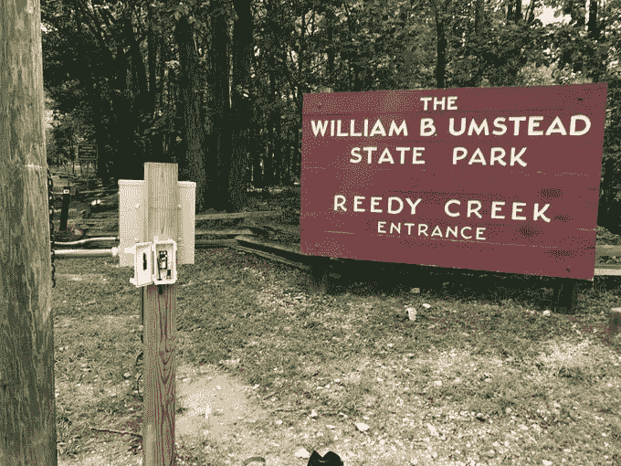
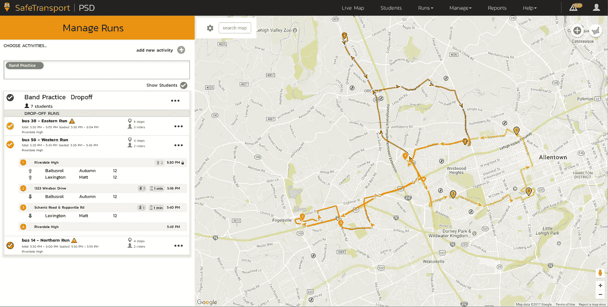
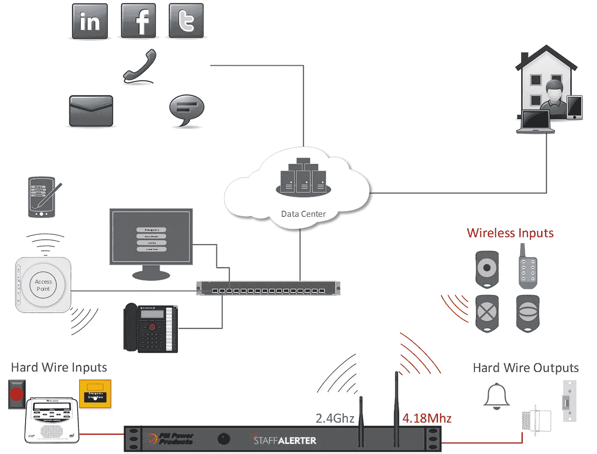

# 手机的未来是物联网

> 原文：<https://medium.com/hackernoon/the-future-of-cellular-is-iot-782d254561de>

## 了解世界如何使用蜂窝物联网硬件安静高效地解决实际问题。

蜂窝[物联网](https://hackernoon.com/tagged/iot)(物联网)正在快速加强无处不在的连接，[行业专家](https://www.ericsson.com/en/mobility-report/reports/november-2017/internet-of-things-outlook)预测，到 2023 年，蜂窝连接设备的数量将增长到 18 亿。从 2017 年 5 亿蜂窝连接设备的市场来看，这一增长主要是由小型计算蜂窝物联网硬件的兴起推动的。

蜂窝物联网硬件(如 [***物联网原型套件和开发板***](https://www.postscapes.com/internet-of-things-hardware/))**专为低功耗、低成本和远程应用而设计。它们旨在为企业和产品创作者提供一种可靠、安全的方式，通过蜂窝连接将他们的产品连接到互联网。蜂窝物联网硬件通常配备有 SIM 卡，可以通过 2G、3G 或 LTE 连接来连接网络。**

**然而，蜂窝物联网硬件的问题是，它通常很难在行动中看到。这就是为什么在本文中，我收集了真实的物联网应用来展示蜂窝技术如何帮助产品创造者和企业解决现实世界的问题。**

# **六个真实的蜂窝物联网应用**

## **1.Opti 环境管理**

**今天，绝大多数城市都没有能力应对地震、飓风和洪水带来的环境破坏。然而，像 [Opti](https://www.particle.io/customers/case-studies/opti/) 这样的公司已经开发出一些方法，通过配备蜂窝物联网硬件的排水系统来解决基础设施不足的问题。**

****

***Opti’s stormwater management system***

**Opti 的 CMAC(连续监测和自适应控制)排水系统通过监测天气预报和激活排水阀来最大限度地减少洪水和损害，从而对抗环境破坏。排水系统配备了一个[电子](https://www.particle.io/products/hardware/electron-cellular-2g-3g-lte/)，允许他们通过蜂窝网络控制他们的排水系统。这让他们能够控制实际的固件，并[通过空中](https://blog.particle.io/2017/12/18/over-the-air-firmware-the-critical-driver-of-iot-success-859927/)更新固件，当你在一个地区部署了数百个排水系统时，这是非常有用的。Opti 的 CMAC 系统代表了越来越多使用蜂窝物联网让世界变得更安全的组织。**

## **2.遥控启动挖掘机**

**[Greg Meandel](https://hackernoon.com/how-a-north-dakota-farmer-built-an-iot-driven-farm-99a0ecc56f10) 不是普通的农民——他喜欢构建和编程物联网项目，这些项目可以消除日常农场生活的复杂性。他的许多物联网项目中有一个是可以远程启动的挖掘机。**

****

***Remote-Starting Excavators***

**通过使用一个[电子](https://www.particle.io/products/hardware/electron-cellular-2g-3g-lte/)，他可以远程加热挖掘机的内部加热器，这有助于启动发动机。在某些情况下，他不得不等待几个小时让内部模块升温。现在，他可以醒来，通过手机向电子设备发出无线指令。早餐结束时，挖掘机已经加热，随时可以使用。格雷格的哥哥在一个打捞队工作，现在使用拖拉机，因为他可以在野外远程启动它，而不必依赖断断续续的 Wi-Fi 服务。**

## **3.跟踪公共公园系统中的数据**

**See Insights 的创始人奇普·麦克莱兰正在使用蜂窝物联网来跟踪他在北达科他州公园区的出勤情况。美国各地的公园部门必须报告有多少人参观他们的公园，以确定资金分配。传统上，公园部门会雇人坐在入口处，记录有多少人会进入公园。然而，Chip 正在使用蜂窝传感器来跟踪任何进入他公园的游客(步行者、慢跑者、骑车者或汽车)。**

****

***Chip McClelland’s Electron-based counters***

**这些传感器由[电子](https://www.particle.io/products/hardware/electron-cellular-2g-3g-lte/)构成，利用其蜂窝连接性远程发送数据。通过电子设备，传感器可以将公园的出勤数据直接发送到报告仪表板和系统，这意味着公园管理人员不必让员工站在公园入口处。在制造出这些传感器三年后，其他公园管理者也开始采用 Chip 的方法。在过去的两年里，Umstead 州立公园在每个入口都部署了芯片传感器。在北卡罗来纳州，克拉布特里公园也在测试芯片的传感器，以跟踪公园的出勤情况。凭借这些成功，Chip 目前正致力于大规模生产这些设备，以增强美国各地公园的能力。**

## **4.安全运输的车队管理**

**[计算机辅助公司(CAI)的子公司 SafeTransport](https://blog.particle.io/2018/01/04/safetransporter_case_study/) 正在使用蜂窝物联网将车队管理带到学校通勤中。使用[蜂窝资产跟踪器](https://www.particle.io/products/hardware/asset-tracker/)，安全运输使学校官员能够远程实时跟踪和监控校车。**

****

**Safetransporter’s user-interface that allows schools and parents to track busses in real time**

**学校官员现在可以实时跟踪公交车，并可以识别哪些公交车晚点或偏离路线，这使他们能够在公交车晚点时与家长沟通。现在，两年多过去了，宾夕法尼亚州的三个大型学区已经在他们的巴士车队中采用了安全运输系统，增加了透明度，改善了家长和学校管理人员之间的沟通。**

## **5.使用 StaffAlerter 的大规模警报**

**来自 PM Power Products 的 StaffAlerter 正在使用 Wi-Fi 和蜂窝物联网硬件来创建一个可编程的大规模警报系统。用户可以设置定制的大规模警报系统，在紧急情况下传达信息。该系统可以通过文本消息、电子邮件、文本到语音、应用警报、接触开关等等来激活。**

****

***An illustration of how StaffAlerter Works***

**Staffalerter 使用 Wi-Fi 和蜂窝物联网硬件作为其核心连接引擎，来配置命令和传达大量警报消息。目前，Staffalerter 可用于工业监控、恶劣天气警报、紧急远程门锁等。StaffAlerter 正在不断改进他们的产品，并继续为新的人口统计数据引入大规模警报系统。**

## **6.环境信息推动公共卫生影响**

**全世界有超过 30 亿人在家中用明火烹饪。虽然这听起来没什么害处，但烧柴的炉子会释放大量的二氧化碳和其他有害气体，导致气候变化。然而， [Envirofit](https://www.particle.io/customers/case-studies/envirofit/) 正在与这种环境破坏作斗争，他们设计了全新的能源炉灶来减少有害排放。**

****

***Envirofit’s clean energy stoves***

**最近，Envirofit 和洪都拉斯政府联手向有需要的当地社区提供炉灶。然而，政府和环境部担心这些炉子不会被使用。为了确保这些炉灶被采用，Envirofit 为 1000 个炉灶配备了温度传感器和电子设备，以记录拥有这些炉灶的家庭使用这些炉灶的时间和时间。通过这个系统，他们可以联系不使用他们的炉灶的客户，了解原因并帮助改善他们的体验。**

# **所有的一切**

**物联网是移动电话的[未来](https://hackernoon.com/tagged/future)，因为它支持新产品应用并释放新的商业价值。蜂窝连接的物联网设备每天都在部署，由于蜂窝物联网硬件选项的数量不断增加，预计其覆盖范围将增加到数百万。这些物联网应用表明，蜂窝物联网应用不受限制，可以用于从交通运输、环境管理到农业的多个行业用例。**