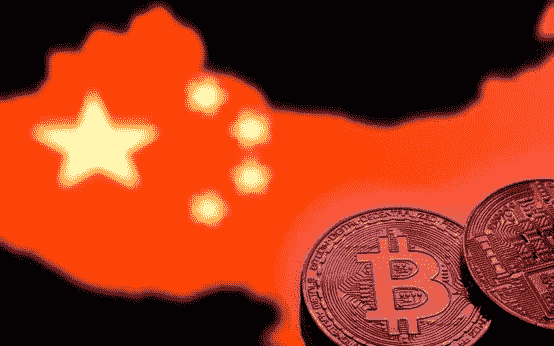
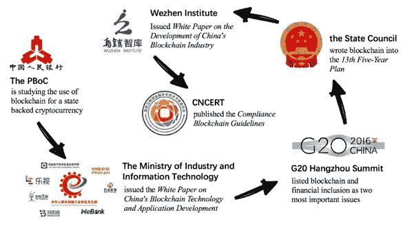

# 中国区块链产业的未来

> 原文：<https://medium.com/hackernoon/the-future-of-chinas-blockchain-industry-7a1c37abcef>

一个因禁止加密货币交易而被其他国家谴责的国家，现在正处于其背后技术的最前沿。一直以来，从移动支付到高速铁路和无人驾驶汽车，中国都在利用技术来改善公民的生活。因此，中国人在全国范围内采用[区块链](https://hackernoon.com/tagged/blockchain)不会花费太多时间。事实上，有强有力的证据表明，中国正在走向一个区块链强国。

区块链是一种经常与加密货币联系在一起的技术，可能会改变我们的生活方式和对信任的看法。随着技术的成熟和越来越容易采用，用不了多久我们就会看到它融入我们的日常生活。毫无疑问，中国将是区块链浪潮的最前沿。

# **加密货币禁令**

早在 2017 年加密热潮之前，中国就是最大的加密货币市场和比特币矿商。在 2016 年末的高峰期，人民币占全球比特币交易量的 90%以上。

然而，早在 2013 年 12 月，中国政府部门就已经对比特币采取了行动。发布了一份名为[《关于防范比特币金融风险的通知》](http://www.pbc.gov.cn/english/130721/3377816/index.html?__hstc=172477884.47f4fea8ab884286c11d72f5acbded2a.1513641600091.1513641600092.1513641600093.1&__hssc=172477884.1.1513641600094&__hsfp=998628806)的官方通知，将比特币描述为一种承载相当大金融风险的虚拟商品，并概述了一些金融机构不再被允许提供的比特币相关服务。2017 年 1 月再次发布了类似的通知，警告中国公民持有加密货币的风险。2017 年 9 月，在世界范围内的首次硬币发行(ICOs)热潮中，一份题为“关于防范已发行代币金融风险的通知”的通知。中国 ico 被禁；正在运营的 ico 被迫向投资者退款，而即将运营的 ico 不得不迁往海外，以规避禁令。BTCC 和 OKCoin 等许多中国交易所被迫关闭当地办事处，并迁至新加波和丹麦等对加密货币友好的国家。使用称为 ASICs(专用集成电路)的专用“计算机”的采矿工厂被迫关闭，进一步抑制了中国加密货币社区。自打击行动以来，人民币交易量降至不到 10%。

禁令动摇了国际社会的立场，促使各国采取反对数字货币的立场。许多人直言不讳地表达了对中国激进的反加密货币政策的不满，声称这是荒谬和没有根据的。

# ***为什么禁？***

人们必须明白，禁令是暂时的，但却是必要的。ICO 泡沫在中国社区内迅速膨胀，任何时候都有成千上万的中国 ICO。许多中国散户投资者对区块链缺乏基本了解，被 10 倍回报的潜力所吸引。对许多人来说，ico 似乎是加密货币热潮中一场稳赢的赌博。然而，*国家互联网金融安全技术专家委员会(IFCERT)* 最近的一份报告显示，有 [421 种假加密货币](https://www.ifcert.org.cn/industry/208/IndustryDetail)，其中 60%的网站设在海外，这使得当局很难采取任何措施。此后，强制性的临时禁令不仅戳破了 ICO 泡沫，也给中国加密货币行业贴上了创可贴。这为当局提供了一个绝好的机会来按下暂停按钮，颁布法律，清除虚假项目。

此外，官员们对拥有加密货币保持沉默。至于是否会有一个彻底的禁令来禁止持有它还有待观察，尽管这样做似乎是不明智的，也是不可能的。

自禁令颁布以来，许多人依赖 VPN 和海外账户继续交易，尽管最近的打击可能会使这种方法不可行。中国当局已加紧冻结涉嫌资助加密交易账户的中国银行账户，并阻止访问任何加密货币相关网站。

# ***中国区块链举措***

快速搜索一下区块链的一些举措，就不难发现中国政府正在积极鼓励在国内推进和采用区块链技术。很明显，加密货币和区块链之间的区别已经明确界定，中国政府在推动这项技术方面的积极作用正在取得成效。

区块链技术在中国的支持来自三个层次，主要是政府、省和企业。

在政府和部委中，尽管他们对加密货币持严厉态度，但区块链技术被视为他们的优先事项之一。除了十三五规划明确提到区块链技术是其核心发展计划的一部分，诸如《中国区块链发展报告 2018》等报告和**中国区块链技术与产业发展论坛等活动都表明了中国政府对区块链的支持。**最近在 2018 年 2 月，中国共产党(CCP)的官方报纸《人民日报》发表了一篇题为“对区块链的三个问题”的整版特写，进一步强调了国家对区块链的积极立场。中华人民共和国[国家审计署](https://oracletimes.com/chinese-government-watches-block-chain-data-storage-solution/)也在探索区块链缓解当前数据基础设施造成的瓶颈以及改进审计实践的能力。

在省级层面，城市仍然是中国政府资金到达基层社区的主要渠道。全国各地的城市都在积极推动各自的区块链计划，以吸引创业公司加入他们的生态系统。就在最近，阿里巴巴集团总部所在地杭州承诺投资 100 亿元人民币(16 亿美元)投资区块链公司，其中 30%的资金来自中国政府。还建立了[杭州区块链产业园](https://www.chinamoneynetwork.com/2018/04/10/hangzhou-sets-up-1-6b-government-backed-blockchain-fund-to-invest-in-start-ups)，作为区块链孵化创新中心；该园区目前容纳了 10 家区块链公司。中国的许多城市也设立了基金来吸引区块链的创业公司，深圳宣布设立 5 亿元人民币(合 7900 万美元)的资本基金，贵阳向符合条件的区块链创业公司提供高达 500 万元人民币(合 79 万美元)的补贴。

在企业内部，各大公司都致力于开发和采用区块链技术。阿里巴巴就是一个很好的例子。在 2017 年提交的 [406 项区块链相关国际专利](https://smartereum.com/7630/how-alibaba-application-blockchain-technology-china-globally-mon-apr-30/)中，阿里巴巴拥有 43 项，仅次于中国人民银行(PBOC)的 68 项；中国总共提交了 200 多项专利申请，美国以 91 项申请紧随其后。在应用领域，阿里巴巴的子公司天猫商城(T-mall)和菜鸟(Cainiao)合作应用区块链技术来追踪其平台上的进口商品。阿里云还与厦门中川物联网产业研究院[合作，开发面向物联网(IoT)](https://www.financemagnates.com/cryptocurrency/news/alibaba-cloud-partners-blockchain-powered-internet-things-startup/) 的区块链计划。除了阿里巴巴，几家中国巨头也在运营中采用了区块链技术。[JD.com 在其供应链中试点使用区块链](https://www.supplychaindive.com/news/jdcom-artificial-intelligence-blockchain-platform-beef/518300/)来追踪和证明进口牛肉产品的真实性。互联网巨头腾讯在 2017 年发布了一份白皮书，详细介绍了区块链服务在一个名为 [TrustSQL](https://www.ccn.com/chinese-internet-giant-tencent-to-develop-a-blockchain-platform/) 的开放平台上的应用。最近，领先的互联网公司百度推出了[图腾](https://cryptoslate.com/baidu-blockchain-photo-service/)，这是一个数字图像产权管理平台，使用区块链为提交的内容加时间戳，保护内容创作者免受知识产权侵犯。显然，这些中国企业集团了解区块链的价值，并积极押注于此。

# ***政府控制的数字货币***

中国人民银行(PBoC)正在积极开发国家开发的数字货币和电子支付系统，在提供数字货币优势的同时，保持对其可用性和可追溯性的高度控制。[小规模交易](https://www.technologyreview.com/s/608088/chinas-central-bank-has-begun-cautiously-testing-a-digital-currency/)早在 2017 年就已经在几家中国银行进行了测试。这种数字货币无疑会更有效率，减少欺诈和伪造的机会，同时让农村地区的公民有更多机会获得金融服务。将由商业银行维护的数字货币有望成为法定货币的数字替代品。

> *“……由于技术的发展，数字货币是不可避免的。未来，传统纸币和硬币的使用将会萎缩，甚至消失。”* [*周小川*](https://www.finextra.com/newsarticle/31861/digital-currency-inevitable---bank-of-china) *，任职时间最长的中国人民银行行长*

虽然中国当局似乎正在利用数字货币的优势来改善当前的金融系统，同时控制定义加密货币的匿名性和去中心化功能，但这些功能有可能在未来被整合。央行数字货币研究室主任姚谦解释说:“央行发行的数字货币(CBDC)在未来不可避免地会融入更多功能。一种只是严格模仿法定货币并将其数字化的方法可能会在长期内削弱 CBDC 的竞争优势。在那之前，这种数字货币不太可能与加密货币有任何相似之处。

# ***区块链和加密货币在中国大有可为***

随着越来越多的千禧一代和中产阶级要求更大的透明度和问责制，尤其是在消费品行业，中国对区块链和加密货币的兴趣越来越大。此外，各行业都在努力应对现有系统的低效率，这个问题有可能通过区块链得到解决。目前，传统企业的现有基础设施和区块链技术之间存在巨大差距。NEO、QTUM、VeChain 等公司正在寻求通过简化区块链集成的要求和降低准入门槛来弥合差距。随着整合越来越容易，中国可能很快就会在采用区块链方面达到临界质量。

到目前为止，还没有规定使用区块链技术和加密货币的官方规则和标准。虽然全世界都在为区块链而激动，但仍需要一个国际框架和标准来规范该行业，并促进企业和最终消费者采用它。ISO/TC 307 区块链和分布式账本技术委员会是国际标准化组织下属的委员会之一，专注于区块链技术的框架和应用。虽然中国已经加入了 ISO/TC307 委员会，但它也有兴趣在国内实施自己的法规。工业和信息化部(MIIT)和几个部委最近成立了一个*国家* [*区块链和分布式记账技术标准化技术委员会*](https://www.ethnews.com/national-blockchain-standards-take-shape-in-china) 来制定区块链本地行业的国家标准。该标准预计将于 2019 年底发布。

到目前为止，同样显而易见的是，中国政府讨厌比特币，但热爱其背后的技术。随着中国人寻求海外替代投资，中国长期以来一直严格限制资本外流。加密货币提供了一个简单、快速和匿名的渠道将资金转移到国外，这对中国当地人来说是一个巨大的吸引力，但却是政府不想要的。随着加密货币在全球范围内的采用和流动性的增加，我们可以预见，随着市场的稳定(以及 FOMO 的介入)，中国当局将会做出让步。

# *中国制造区块链的崛起*

人们可以摒弃密码货币，但他或她不能否认区块链将给世界带来的好处。虽然 Blockchain 在过去的 10 年里经历了几次迭代，但是它的基本特征——不变性、透明性、安全性和分散性——仍然是该技术的核心。

中国已经采取具体措施，使其成为其核心技术的一部分。随着区块链公司在中国各地的蓬勃发展以及当地政府的大力支持，我们无疑将看到中国制造区块链的崛起。尽管如此，区块链的特征很可能会削弱统治这个国家的共产主义意识形态和中央集权制度。此外，还需要对其员工进行技术教育，不要盲目被其扰乱行业的潜力所吸引。

Blockchain 将信任从人类降为 1 和 0 的能力可能是该技术的最大特点，也可能是谎言和欺诈无缝编织到我们日常生活中的时代的当务之急。这项技术被称为继互联网之后的第二好东西，它改变我们生活、工作和互动方式的潜力越来越得到政府的认可。现在，所有国家都把目光投向了区块链。问题是，谁将实现与人造卫星 1 号相当的目标，谁将是第一个登上区块链月球并赢得比赛的人？

############################################

> 大家好！我现在是在上海实习的学生！作为一名技术发烧友，我对世界上正在发生的技术进步感到不知所措和兴奋！** **鼓掌、分享和评论！我也欢迎任何出现的机会****