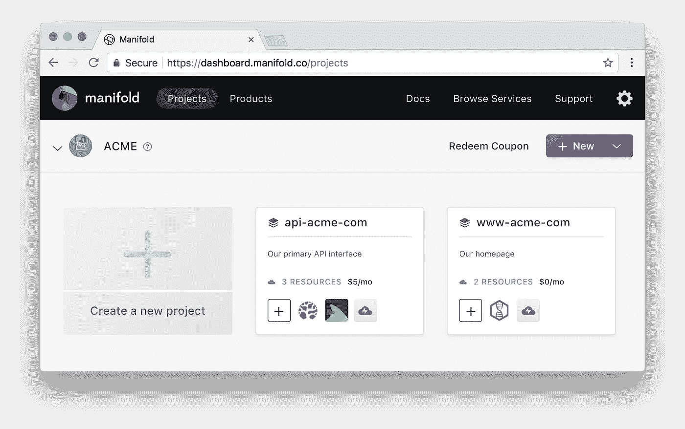

# 云服务的未来是无国界的

> 原文：<https://medium.com/hackernoon/the-future-of-cloud-services-is-borderless-4710914f1b01>

> *揭秘:* [开发者集市](https://goo.gl/BtueKD) *曾赞助黑客正午。* [使用 code HACKERNOON2018 获得任何服务 10 美元优惠。](https://goo.gl/BtueKD)

云计算是一种商品。容器化[技术](https://hackernoon.com/tagged/technology)和诸如 [Kubernetes](https://kubernetes.io) 之类的平台使计算领域变得公平，以至于虚拟机在哪里运行都无关紧要。

它们消除了特定于供应商的实现和平台怪癖的风险。现在，您以统一的方式协调您的基础设施。

你不再做一个巨大的决定，把自己锁在一个单一的生态系统中。您可以混合搭配，评估在哪里可以获得针对您所需容量的最佳支持和价格。

# **落入单一生态系统陷阱**

过去，你可以从云计算提供商那里获得尽可能多的服务。这既安全又简单，因为每个部署案例都始于选择适合您工作流程的计算解决方案。

接下来，您将添加您不想自己管理的附加服务:DNS、监控和日志记录、电子邮件、数据库。您的云计算提供商通常会提供一个“足够好”的版本，导致您在生态系统上加倍下注。这很简单，你只需在管理其他服务的同一个地方点击几个按钮就可以了。

更容易的是，云计算提供商将提供大量免费信贷，让你可以自由地继续提供服务。

这是他们设陷阱的地方。

随着你增加新的服务，甚至那些你并不真正需要的服务，你的月账单也在稳步攀升。每项服务都有自己的定价方案和计算器，这让你很难确切知道你在注册什么。

这些“足够好”的服务中的每一个都有自己特定于平台的特点和实现细节。只有通过专有的 API 和集成才能协同工作。

很快蜜月期结束，信用枯竭。你将面临一个令人生畏的现实:你必须支付现金才能继续下去，因为搬家的努力太令人生畏了。你被锁住了。

# **多生态系统架构的危险**

除了将自己锁定在一个提供商的生态系统中，另一种选择是购买最适合这项工作的工具，而不管它来自哪里，但这也有其自身的问题。

现在，有很多人向您的应用程序添加来自不同供应商的服务。

您的账单被不同的定价模式分割开来，并且在月底不再出现在相应人员的单个账单上。

随着应用程序的增长，您将无法预测成本会如何增长。您失去了对处于休眠状态但仍在付费的服务的跟踪。您有多种付款方式，不可避免地会在某个时间点拒绝其中一种，从而导致停机和混乱。

真理没有单一的来源。您看不到运行应用程序所必需的服务的广度，这使得新开发人员的入职和谁可以访问什么的审核变得复杂。

开发人员必须从多个来源获取运行应用程序所需的配置，我们都知道一件事:开发人员可能会偷懒。工作流疲劳会导致对您的机密(纯文本格式的值、存储在磁盘上的值、复制和粘贴的值)的处理不够理想，而这些对安全性和完整性至关重要。

这是一个烂摊子，令人讨厌的工作。

# **我们如何能够拥抱流形上的混乱**

在 [Manifold](https://goo.gl/BtueKD) ，我们的团队拥抱多生态系统基础设施的碎片化。我们希望找到最适合这项工作的工具，不管它来自哪里。我们希望我们的开发人员能够在需要时自由添加服务，而不必经历冗长的审批过程。

我们有一张王牌。

我们使用自己的产品来管理我们的云服务和配置。 [Manifold 的 marketplace](https://goo.gl/BtueKD) 是一个从多个供应商那里寻找、购买和管理云服务的单一位置，这些服务是您的应用程序的支柱。

我们有许多从事多种应用的跨学科团队，他们需要能够专注于构建我们的应用，而不必担心获取配置、机密或哪个团队管理什么服务。

每次开发人员提供新服务时，他们都不必担心添加计费信息。月底我们会收到一张账单，上面详细列出了公司使用的所有服务。

我们将我们的云服务、内部服务和一般配置整合在一个位置，以形成无缝的工作流，无论我们的应用程序部署到哪个平台。

每个应用程序都被分组到项目中，这使我们能够准确地记录哪个应用程序需要哪些服务和配置。不要再为了得到一个 API 令牌而追逐另一个团队的人。

A preview of the Manifold dashboard for ACME Corp

有时我们使用的服务不能直接通过 Manifold marketplace 获得，这是我们添加定制配置资源的地方。这让我们可以将任何外部秘密带入到多种多样的生态系统中，与购买的服务共存。

类似地，有时我们创建自己的内部服务(工人、API 等)，它们需要相互交流，定制配置让我们也能带来这些服务，给我们一个真实的来源。

**您需要的配置**

在开发中，我们所有的开发人员都使用 [Manifold CLI](https://blog.manifold.co/manage-your-cloud-services-like-a-developer-with-our-cli-tool-f02c88d9a7fd) 将所需的配置无缝地注入到他们的应用程序中。不再有配置文件，不再有明文秘密。配置变量在运行时从管汇的 API 安全交付。

在生产中，我们使用 Terraform 从代码中部署我们的基础设施。使用[多种平台提供商](http://github.com/manifoldco/terraform-provider-manifold)，我们能够准确定义哪种配置需要放在我们架构中的哪个位置，将最新的价值与每次部署相协调。我们的运营团队不再需要担心另一个团队提供的服务是否有正确的密钥。

随着 Kubernetes 在我们的堆栈中的出现，在我们为真正的无边界生态系统做准备时，我们使用一个[自定义资源定义](http://github.com/manifoldco/kubernetes-credentials)来实现相同的功能，该定义不断地将正确的配置和秘密与我们的集群进行协调。这使得我们在需要时迁移云变得更加容易。

## **现在和未来的典范**

生态系统锁定不再是常态。开发人员需要选择，他们希望能够为工作选择最好的服务，为他们提供最好的工作流程。

随着云计算成为一种商品，服务和配置的可移植性变得至关重要。您需要灵活地更改应用程序的部署位置，而无需花费大量精力来转换到新的平台。

[Manifold](https://goo.gl/BtueKD) 以这样一种方式为您的服务和配置建模迈出了第一步，即您不需要考虑您的应用程序将部署在哪个平台上，并继续发展多生态系统工作流。

