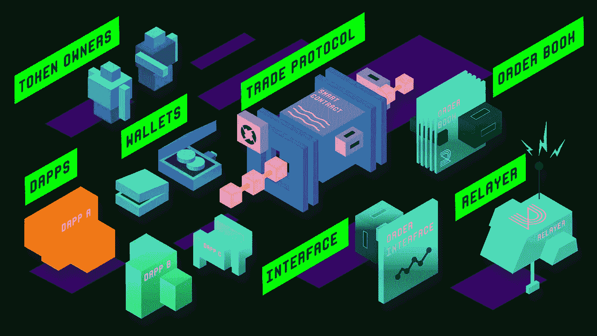
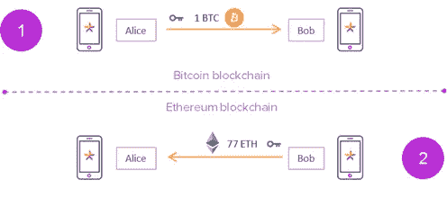
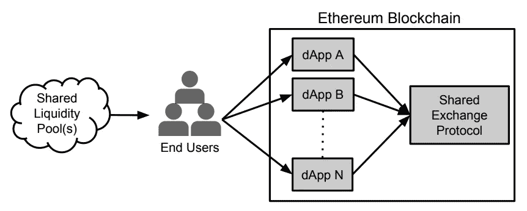

# 分散交易的未来:dex 对 Cryptosphere 有什么

> 原文：<https://medium.com/hackernoon/the-future-of-decentralized-exchanges-what-do-dexs-have-for-cryptosphere-b61f5bbf31b0>

在过去的几年里，分散式交换和它们所基于的协议取得了巨大的进步。一个通用的[区块链](https://hackernoon.com/tagged/blockchain)用例面临的许多问题，比如可伸缩性、缓慢采用、易变等等，正在逐渐消失。

这些问题大多源于这样一个事实，即大量自称“去中心化”的交易所要么隐藏在集中式后端系统后面(读 ShapeShift)，要么只是未来“去中心化”的一个承诺(读 KuCoin 和币安)。然而，在最近一段时间里，当谈到分散的交易所时，事情变得好了很多。

我们 Sodio Technologies 一直在研究分散式交易所，这种交易所本质上没有早期分散式交易所面临的问题。正如[在我们的科技博客](https://blog.sodio.tech/how-to-make-a-decentralized-cryptocurrency-exchange/)中所讨论的，这些问题包括前期运作、低流动性和交易量。

我在 DEX 生态系统上工作了如此长的时间，并花了数小时研究和实验如何使它们变得更好，这是我试图帮助 cryptosphere 中的人们想象未来的去中心化交易所是什么样子。

**交叉链互换和血浆**

到目前为止，分散式加密货币交易所最可怕的缺点之一是限制在单一区块链上进行交易。令人惊讶的是，几乎所有即将推出的最有前途的 dex 和协议都在寻求解决这个问题。Neo 智能合约是创建此类应用的经典范例，因为 Neo 固有地支持跨不同区块链的原子交换。

尽管其他链目前存在局限性(主要是在加密层面),但随着技术的成熟，我们可以预计会有越来越多的原子互换进入分散交易领域。

推出更快 dex 的另一个市场就绪解决方案是[等离子协议](https://plasma.io/plasma.pdf)，其中 dex 的性能可以得到增强，以匹配集中式交换的吞吐量，同时通过使用针对根链、dApps &侧链的分层状态通道方法以及零知识证明(L2 缩放)的额外实现来确保资产的安全

另一个相关的概念，原子交换，在最近获得了相当大的牵引力。虽然它仍在开发中，但基于原子交换的许多应用已经出现。至于它的含义，如果你还不知道的话，原子互换被称为加密货币 A 与加密货币 B 的交换，不涉及任何集中/托管中介。

它直接发生在两种货币的区块链之间，甚至发生在钱包层面。不依赖任何第三方或托管管理人，任何参与者违约的风险为零，这使得原子互换的想法充满希望。

即使在较新的以太坊 dex 的情况下，ERC20 和其他不可替代的 ERC 代币也可以在以太坊区块链上与其他代币或 [WETH](https://weth.io/) (包装以太)自动交换，因为 ETH 不支持以太~ ERC 代币的自动交换，从而在钱包和链上级别实现真正的点对点交易体验。

**以太坊 dex 的 0x 协议**

几乎每个人现在都知道 0X 协议对以太坊区块链上 ERC20 令牌的对等交换的影响。不仅如此，0X 的团队声称解决了 dApps 最臭名昭著的问题之一——互操作性。

0X 协议为几乎所有包含交换功能的分散式应用程序提供的一个显著优势是通过网络访问流动性池。

基于 0X 项目的交易量最大的继电器之一是雷达继电器。在早期，他们选择不收费。此外，当您在 Radar relay 中创建新订单时，默认情况下会将最近一次交易的价格作为价格输入。Radar relay 本质上是一个 P2P 交易平台，用于基于以太坊的令牌，构建于 0X 协议之上。

**彻底消除抢跑**

即使在股票市场的旧时代，抢先交易对于交易者来说已经是一种痛苦，对于集中式加密货币交易所中的许多诚实的交易者来说仍然是一个真正的问题。

然而，分散加密交换的兴起见证了从交换和协议中彻底根除前端运行的巨大主张，如 [AirSwap 和 ShapeShift](https://sodio.tech/Blog/decentralized-cryptocurrency-exchange/) 。但是他们的方法的全面应用需要时间和耐心，这显然是密码圈不需要的。

正如本文中[所讨论的，抢先源于两种情况:](http://hackingdistributed.com/2017/06/19/bancor-is-flawed/)

1.  矿工有关于订单的全部信息。
2.  矿工掌握的信息并非无害，而且依赖性很大。

人们想到的最明显的解决方案是隐藏订单的“交易”金额。然而，由于密码领域存在许多不良玩家，在买卖订单中隐藏交易金额或出价金额可能会被证明是适得其反的。因为我们如何能确保一个交易者确实支付了她赢得投标的金额。

然而，另一种完全消除预先交易的方法是隐藏交易金额，因为它是关于隐藏交易正在发生的事实。这将通过使用 k-匿名来完成。在 k-匿名中，表面的和虚拟的数据点(在这种情况下是交易细节)与你想要隐藏的数据点(在这种情况下是用户的交易细节)相加，这样坏的参与者几乎不可能抢在买卖订单的前面。同时仍然设法通过智能合同。

我们做的 DEX！

在我们的[白色标签的 DEX 解决方案](https://dex.sodio.tech/)中，我相信这是一个很好的机会来改善我们许多密码领域居民的交易体验，有许多独特的功能。

共享流动性:

我个人最喜欢的一个功能是在我们的中继器下连接的所有分散交易中提供订单匹配。这有助于 DEX 所有者从多个分散交易所获得更大的流动性池，而不管单个交易所的交易量。显然，是否加入共享流动性池是每个 DEX 运营商的自由裁量权。

除此之外，DEX 还配备了用户与 DEX 所有者协作来启动 ICO、令牌创建，以及以无缝、便捷的方式与他们一起列出他们的令牌。顺便说一下，这对于 DEX 所有者和用户来说是一个极好的创收选择，因为推出 ICO/列出他们的令牌从未如此容易和便宜。

这些是我想分享的关于分散式交换的进步。它基于我们团队在开发一些加密货币交易所时收集的见解。

此外，询问所有读者对他们认为未来的 dex 可能是什么样子或者应该是什么样子的建议、评论和想法是不言而喻的。

如果你喜欢这个，不要阻止他们鼓掌。每个人都喜欢他们。

此外，你可以在[脸书](https://www.facebook.com/sodio.tech/)或[推特](https://twitter.com/sodiotech)上关注 Sodio Technologies，获取最新的技术博客和其他黑客资料。