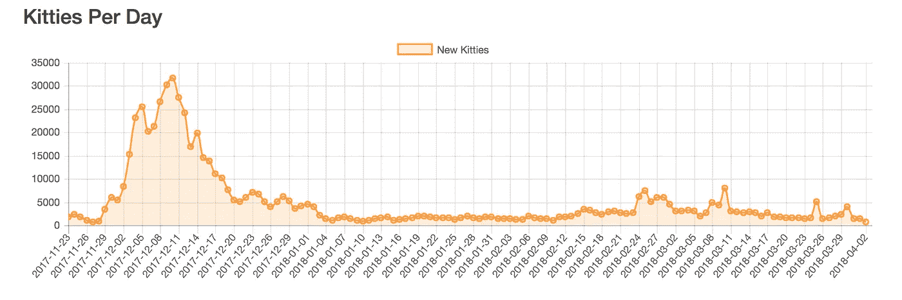

# 数字收藏品的未来:实物商品能推动智能合同价值吗？

> 原文：<https://medium.com/hackernoon/the-future-of-digital-collectibles-can-physical-goods-drive-smart-contract-value-50813d12aa46>

在区块链上不朽的艺术，以及我们正在走向的数字未来。

我一生都在玩电子游戏。在数字世界中，无形商品具有价值的概念对我来说并不难理解。我相信数字收藏品将撼动互联网，并为人们进入加密资产市场提供一个入口。当我和不熟悉区块链的人谈论数字收藏品时，他们似乎并不真正理解，或者说不在乎理解。当我把一台电脑放在他们面前，上面有某种智能合同的数字表示时，他们掉进了兔子洞。很快，那些对这个空间一无所知的人帮助我计算出我需要使用多少 Gwei 来完成我的交易。

**猫年**

就在一年前，CryptoKitties 以一股可爱的流行文化席卷了加密社区。许多人声称该应用程序只不过是 dApp 领域的一个过度开发，但一年后，它仍然很强劲，其他新的加密收藏品正在快速加入市场。像 BlockchainCuties 和 EtherBots 这样的网站跟随它的足迹，慢慢增加功能，测试我们认为“正常”的界限。因为说实话，几年前，甚至是今天，一只数码小猫售价超过 10 万美元的想法听起来可能有点疯狂。

几个月前，CryptoKitties 在由 Andreesson Horrowitz 和 Union Square Ventures 牵头的一轮融资中筹集了 1200 万美元。与 CryptoKitties 的 10 万美元以上的价格相比，该平台的交易量大幅下降，但风险投资家似乎仍持乐观态度。

正如他们所说，*机构资本追随个人利益。*

*Chart taken from* [*this article*](https://steemit.com/cryptokitties/@steven-patrick/how-i-beat-cryptokitties-by-rob-durst)

**主流采用的催化剂**

像 CryptoKitties 这样的平台有助于将新用户带入这个领域，但我最近偶然发现的一个项目可能会弥合不同的差距。2018 年 5 月 31 日，数码收藏品竞赛[新玩家推出](https://www.prnewswire.com/news-releases/tapinator-launches-bitpainting-a-crypto-collectibles-platform-for-the-global-art-market-300656654.html)。

总部位于纽约的游戏公司 Tapinator 拥有超过 300 款手机游戏和 4.5 亿次下载，该公司宣布推出一款加密收藏平台 [BitPainting](http://bitpainting.com) ，允许用户通过区块链买卖名画。需要说明的是，这不是一个可以用比特币购买毕加索作品的市场。这些名画以数字收藏品的形式存在。

虽然将 BitPainting 与 CryptoKitties 进行比较很有诱惑力，但还是有一个关键的区别。CryptoKitties 的批评者认为，该应用的用户都是精通技术的加密社区的成员，该应用缺乏主流吸引力。它为以太坊网络带来了新用户，但远非用户友好。BitPainting 提供了一种不同的模式，既吸引了美术爱好者的观众，也吸引了一群口吐白沫的投机者，他们想看看代表*蒙娜丽莎*的数字收藏品能卖多少钱。

比特绘画真正让我兴奋的是，在某种程度上，这些收藏品代表了一种有形的物品。在 CryptoKitties 中，稀缺性是通过使用“世代”人为造成的。第 1 代收藏品理论上应该比第 5 代收藏品更值钱。有了位图，事情变得更有趣了。我非常好奇，想看看这个平台上的某些画作的价值与它们的有形对应物的价值相比如何。数字版*蒙娜丽莎*会像实物版一样令人垂涎吗？

**开拓变革，增加信任**

我被数字收藏品的概念迷住了，我认为它们是新人开始与区块链技术互动的最简单的方式。诀窍是让它们对用户足够友好，让新用户可以尝试一下。如果执行正确，这可能会刺激市场资本的增长，因为新用户吵着要获得以太坊并购买他们的数字杰作。这就是为什么我对位图很感兴趣。Tapinator 已经发布了超过 300 款游戏，其中大部分都有游戏内置市场。他们有完成这项工作的经验。

由于交易历史在区块链上是透明和可验证的，游戏和收藏应用程序开发人员可以增加对系统的信任，同时也自动化了公平性。这意味着你在 BitPainting 上购买的任何艺术品都将是你的专属，你可以知道它过去卖了多少钱。

在 BitPainting 平台上，你只能购买一个版本的经典作品，如 *Salvator Mundi* ，以及它由区块链验证和保护的事实，是区块链技术如何改变数字资产性质的一个主要例子。过去，数字作品几乎不可能得到保护，但现在人们可以使用区块链工具来防止盗版。结果将是对数字系统的信任大幅度增加。

**区块链和加密收藏品的未来**

这些技术提供的解决方案也不仅限于收藏品。像 BitPainting 这样的解决方案为最终验证各种信息的应用铺平了道路。例如，在未来，当你在商店买一袋咖啡豆时，你也许能够证明这确实是一次公平交易，让种植咖啡豆的农民受益。想象一下，早上打开你的新闻应用程序，除了经过核实的报道之外什么也看不到，而假新闻已经被区块链的一个网络筛掉了。这似乎是一个遥远的未来，但是已经有像 RedPen 这样的公司在努力让这成为现实。而像 [mesmr](https://www.mesmr.tv) 这样的项目正在朝着这样一个未来努力:数字收藏品可以成为创作者和粉丝之间，或者品牌和客户之间的桥梁。

像 BitPainting 这样的应用程序最终可能会发展到跟踪实物艺术品，甚至跟踪数字杰作向实物格式的转变。

> “让区块链技术在数字资产领域发挥作用，有望为传统系统未能识别的价值存储和交换创造全新的平台。”— Ilya Nikolayev，Tapinator 的创始人兼首席执行官

*通过创造新的储值方式*，像 BitPainting 这样的加密收藏应用正在使加密货币成为一种实用的工具，就像货币工具一样。想要购买一幅画的用户将不可避免地对采用用于购买该画的代币有共同的兴趣。

*进一步*:

*通过激发人们对这一领域的兴趣，*像 Tapinator 这样的公司正在为人们进入这一市场创造新的方式。因此，即使你不认为数字收藏品会在这里停留，你至少可以为它们带来新鲜血液的事实感到高兴。

— — — — — — —

我想采访不同数字收藏品的创造者，如果你或你认识的人想聊天，给我发电报。我的账号是@RezaJafery。