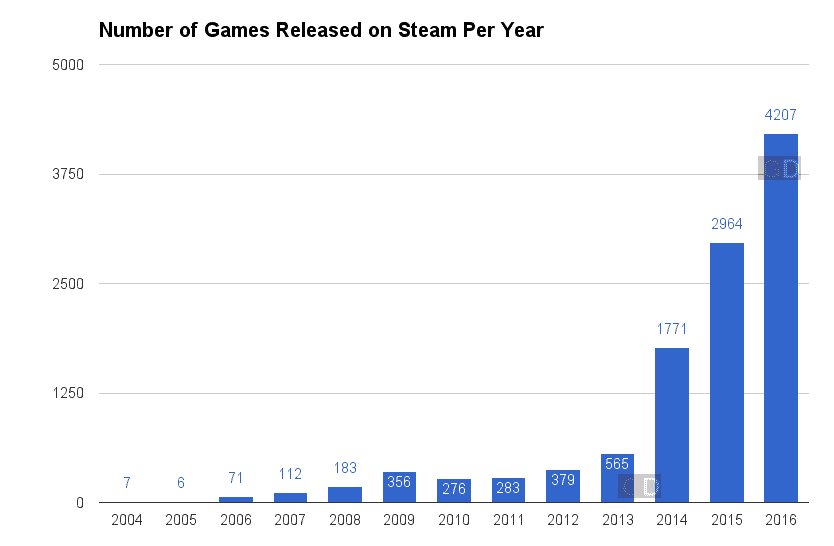
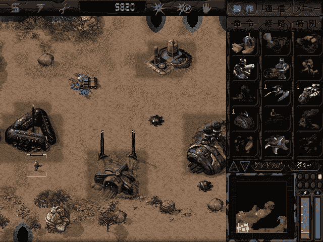
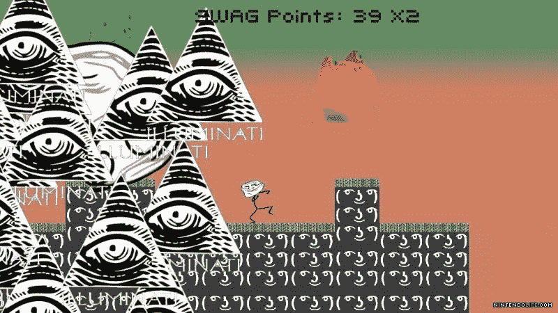

# 独立游戏的未来是多平台和光明的

> 原文：<https://medium.com/hackernoon/the-future-of-indie-gaming-is-multi-platform-and-bright-43267bac038f>

## 开发者关系访谈

> 披露: [***PubNub***](https://goo.gl/JTeiDk) ，全球 DSN 和 realtime IAAS 公司，此前曾赞助黑客正午。

*今天我们要赶上* [*乔丹·舒茨*](https://www.linkedin.com/in/jordanschuetz) *，开发者关系处*[*pub nub*](https://www.pubnub.com/?utm_source=Syndication&utm_medium=Medium&utm_campaign=SYN-CY18-Q2-Medium-Hackernoon-Sponsorship&utm_content=interview-jordan)*。7 年前，他创办了* [*忍者猪工作室*](http://www.ninjapigstudios.com/) *，迄今为止，他们已经开发并发布了超过 15 款产品，累计下载量超过 50 万次，如《智商测试》、《迷因快跑》和《小鸟》。今天，我们讨论独立游戏行业的发展方向、驱动游戏性能的技术以及开发者关系的复杂性。*

在让你自己或与一个小团队一起构建一个伟大的游戏变得更容易方面，哪些技术是领先的？

独立游戏开发者应该始终选择适合他们开发技能水平的技术，同时也允许他们针对他们想要发布内容的平台。编程经验有限的开发人员应该选择他们感觉更舒服的引擎。我从 Corona SDK 开始，因为编程语言 Lua 很容易掌握。然而，当我需要瞄准其他平台时，Unity 成了我的首选。Unity 现在正在扼杀竞争，因为它使开发者能够编写一个代码库并发布到几乎所有平台。这对印度人来说很好，因为他们不必担心确保他们的应用程序能在数千种不同的设备上运行；Unity 为他们做了所有繁重的工作。

**你最近做了演讲:** [**在竞争激烈、拥挤的独立游戏市场中脱颖而出**](https://twitter.com/rangleme/status/976528881766117376) **。PubNub 如何融入游戏领域？PubNub 目前在游戏行业的使用情况如何？你认为开发游戏的哪些方面对 PubNub 来说是未来的高增长/高使用率？**

PubNub 擅长游戏的两个不同领域。首先是支持多人游戏功能——换句话说，让玩家移动并同步游戏状态。我们提供基础设施和 API，只需几行代码，你就可以让 PubNub 在你的游戏中运行。

我们擅长的另一件事是多人游戏的社交功能——简单来说，就是让玩家说话。我们让游戏中的实时聊天、排行榜和通知变得更加简单。此外，PubNub 可以用来更新玩家的位置，实时输入，并可以显示当前连接的玩家数量。

我们在游戏领域有大量的大客户，他们在各种各样的用例中使用我们。流行手机游戏《战龙》(War Dragons)的开发商 Pocket Gems，[使用 PubNub 来支持游戏中的实时战斗，](https://www.pubnub.com/customers/pocket-gems/?utm_source=Syndication&utm_medium=Medium&utm_campaign=SYN-CY18-Q2-Medium-Hackernoon-Sponsorship&utm_content=interview-jordan)以及存储播放功能&来允许玩家加入战斗，即使玩家在战斗开始时不在线。此外，PubNub 是全球复制的，这使得 Pocket Gems 能够到达他们通常由于可靠性限制而无法到达的区域。

游戏对我们来说是一个巨大的增长行业，因为每一个游戏状态的变化，如输入事件、聊天消息或玩家移动，都是需要通过我们的网络发送的消息。开发人员需要以快速可靠的方式传输这些实时信息，使用 PubNub 网络，我们能够为开发人员提供这种服务。

**仅 Steam 一项，独立游戏市场估计就超过 10 亿美元。你能给我介绍一下独立游戏市场的发展吗？**

在 20 世纪 90 年代中期之前，游戏发行完全由出版商和零售商控制。作为一名独立开发者，你必须出去游说出版商，看看他们是否愿意发行你的作品。出版商随后会提供他们的见解，要求修改，大多数情况下会断然拒绝发行你的书。如果你的产品没有被批准发布，作为独立制作人，你唯一的选择就是将你的产品作为共享软件发布，并希望你能收到足够的捐款来支付账单。改变行业的是在 2000 年，Valve 发布了他们的数字发行平台 Steam，这为印度公司自行出版他们的作品打开了大门。印度现在有了财政独立和思想独立，可以通过自己的预算限制来创作他们想要的游戏。

独立开发者面临的许多挑战是发行。较大的游戏公司有很多内置的分销渠道。随着越来越多的开发者成为独立游戏开发者，游戏行业的发行渠道是如何发展的？

拥有 Steam 等数字发行渠道的公司为人们如何消费和拥有数字内容铺平了道路。苹果跟随 Steam 的脚步创建了 App Store，随后不久 Google Play store 也紧随其后。XBOX、Playstation、Nintendo Wii 和 3DS 在看到客户对即时购买内容的需求后，都开始推出自己的数字发行平台。消费者从想要拥有他们游戏的硬盘拷贝，到想要一个数字图书馆，而不需要在他们的房子里占据物理空间，或者担心他们的游戏被盗。这也改善了独立体验，因为现在独立公司不必担心他们的游戏在二级市场上转售。

**你对游戏使用如何随着平台/硬件的变化而变化有什么见解吗？对于未来游戏玩家的采用，什么样的平台或硬件特别令人兴奋？**

游戏玩家更关心多人游戏体验，他们可以与其他游戏玩家进行社交互动，并为共同的目标而合作。多人游戏领域正在起飞，这使得游戏开发者在游戏中实现多人游戏功能变得越来越重要。Oculus、HTC Vive 和 Hololens 等设备是令人兴奋的新技术，由于它们提供了更具沉浸感的体验，游戏社区正在迅速采用这些技术。VR/AR 领域将在未来 5-10 年内迅速发展，并将成为多人游戏的未来。作为一个独立制作人，试图在新兴平台上率先上市是一个很好的盈利策略，也是独立制作人最有增长空间的地方。

你如何评价一款游戏应该在哪里/如何/何时投入他们的营销资源？对于脸书广告、Youtube 视频、Twitch 社区建设、应用商店优化等渠道，你认为游戏行业有什么营销趋势？？

获得营销曝光的最有效方法是让社区中的其他有影响力的人对你的头衔感到兴奋。我从来没有在营销我的作品上花一分钱，但是我花了大量的时间发展与 YouTubers 的关系，并向他们提供免费下载代码，这样他们就可以试用我的作品。Twitch 和 YouTube 是目前最大的两个游戏发现平台，所以它们需要成为你的关注点，而不仅仅是花钱做广告。

**你能给我们介绍一下你一周的工作生活吗？你的核心指标是什么？你如何衡量进步？**

一周的一半时间，我在办公室写内容，另一半时间，我要么参加当地的技术会议小组，要么在一个会议上工作。我在 PubNub 的 DevRel 工作的目标是让开发人员对我们的产品感到兴奋，并向他们展示 [PubNub](https://goo.gl/JTeiDk) 如何节省他们的时间，让他们能够更专注于营销他们的产品，而不是开发它。我的衡量标准是我制作的内容的整体参与度，以及我能在聚会和会议上面对多少人。DevRel 可能是一个很难量化的角色，因为很多时候你的营销努力和对社区的影响是无法完全衡量的。然而，创建有趣且吸引人的演示，让开发人员在网上搜索，是评估性能的最可测量的方法。

**怎样才能让一个好的开发者关系变得专业？开发者关系专家目前犯的最大错误是什么？**

在 DevRel 角色中工作需要个人魅力和激情。你应该经常思考如何改善开发者的体验，如何制作让开发者兴奋地尝试和使用你的产品的内容。我认为开发人员关系专业人员面临的最大挑战是，他们可能会从一开始就与作为开发人员的感觉脱节。DevRel 专业人员需要给开发者他们甚至不知道自己想要的东西。在这个职位上工作需要大量的创造力和头脑风暴，但是当你成功的时候是值得的。

**小小年纪，你最喜欢的电脑游戏是什么？为什么/如何让你大吃一惊？**

我小时候最喜欢的游戏是一个叫《黑暗统治:战争的未来》的游戏。那是一款即时战略游戏，我以前在我爸的 Windows 98 电脑上玩过。我喜欢在未来世界中控制军队的想法。我曾经玩了几个小时的黑暗统治，我的父母实际上不得不把电脑拿走，因为他们意识到我有点太沉迷于它了。

是什么让游戏上瘾？有史以来你最喜欢的游戏是什么？

我认为实时竞技游戏是最令人上瘾的，因为它促进了与你的同伴的竞争和游戏中的激励。我认为我一直以来最喜欢的游戏是英雄联盟，因为它非常具有挑战性，并且总是根据对手的难度而变化。

**当** [**Meme Run**](https://en.wikipedia.org/wiki/Meme_Run) **真正开始起飞时(你 20 岁时做的一款 Wii U 游戏)，它受到了相当多的负面报道。**

**负面新闻是如何增加/减少游戏使用率的？就个人而言，你是如何处理/疏导这种网络负面情绪的？**

我的核心观众是更小的孩子，他们非常喜欢《米姆快跑》,认为它的幽默令人发指，非常有趣。然而，大多数负面新闻来自年长的游戏玩家，他们认为这款游戏是任天堂 Wii U 平台的“耻辱”。所有的负面报道是游戏如此有争议的原因，实际上让游戏被 Twitch Streamers 和 YouTubers 捡起来，他们只是想批评它。这吸引了不同频道的数百万次综合观看，总体上增加了销售额。人们想买这个游戏，只是为了向他们的朋友展示这个游戏是多么疯狂、令人发指和充满争议。我甚至在家里订购了披萨，却被不喜欢这款游戏的网络流氓所欺骗。让我熬过所有仇恨的是我的核心观众热爱这个游戏。我甚至通过在 4chan 上发布关于 Meme Run 的负面帖子来煽动负面情绪。我明白为什么这么多人不喜欢这个游戏，因为我和我哥哥把它当成了一个玩笑，但是我给了人们一些他们不知道他们想要的东西。让这一切变得值得的是看到有多少人确实喜欢这个游戏，看到粉丝在 Miiverse 上的评论，以及看到 YouTubers 对令人发指的幽默的反应。

许多风靡一时的数字游戏缺乏生命力。就像病毒攻击通常有一个新奇和保质期。你认为哪些电子游戏能让人长寿？就像 Craiglist 之于互联网，游戏之于业界？

我相信所有游戏的半衰期都是有限的。有电竞团队的竞技游戏似乎寿命最长。此外，不断更新新补丁和开发者支持的游戏似乎是最成功的。像《反恐精英》、《英雄联盟》和《守望先锋》这样的游戏似乎做得很好，因为玩家加入的每一个游戏都会带来新的挑战，让他们不断回归。

**为什么开发者应该考虑使用** [**PubNub 进行多人游戏**](https://www.pubnub.com/solutions/multiplayer-games/) **而不是自己构建一个解决方案或者构建一些开源软件？**

作为一名独立开发者，PubNub 允许我快速制作我的多人游戏，这让我有更多的时间来处理我的游戏营销。开发人员通常太专注于开发他们的游戏，并试图使它变得完美，而不是发布它来看看它如何发展。PubNub 允许你快速开发一款多人游戏，并且在全球范围内发行，不会有任何问题。作为独立制作人，你根本没有时间去建立一个全球分布的网络。你应该专注于创造一个有趣的游戏，而不是担心后端基础设施。

**对于在一家大公司工作，但有自己的游戏想法，并正在考虑自己创业的游戏开发人员，你会给他或她什么建议？**

独立游戏开发是一个竞争非常激烈的领域，只能提供短期收入。有可能一夜暴富，但在大多数情况下，你必须不断推出新游戏来谋生。你应该带着这样的心态进入独立游戏开发，你正在创造你热爱的东西，如果你做得对，钱就会随之而来。我认为最好的策略是在你有空闲时间的时候去做，因为我见过很多人放弃了他们生命中的很多年去做游戏，但最终都失败了。大多数开发者花太多时间在开发上，而没有足够的时间在营销上，这是导致他们失败的原因。了解你的观众是在独立游戏领域取得成功的关键。试着回忆一下你小时候的事情以及你当时认为有趣的事情，通过游戏来模仿这些事情会让你的玩家产生共鸣。

## 我想认识任何对游戏开发感兴趣的人，从大工作室到独立开发者。[在@ninjapigstudios 发微博给我](https://twitter.com/ninjapigstudios?lang=en)。

## 我还用 JavaScript 编写了一个全面的指南来构建你的第一个多人游戏。来看看吧！