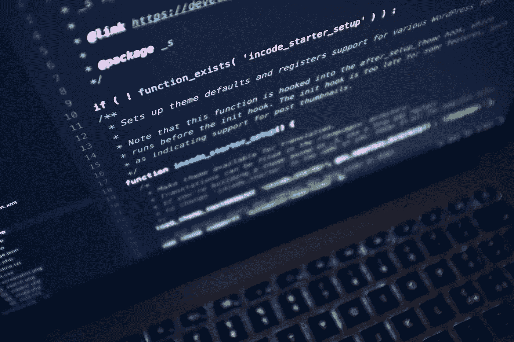

# 保护数据安全的未来

> 原文：<https://medium.com/hackernoon/the-future-of-keeping-data-safe-a2cc855ce9ae>

> 由《编年史》(2015 年至今)的联合创始人萨姆·拉多奇亚(Sam Radocchia)撰写。[原载](https://www.quora.com/How-is-data-security-privacy-maintained-in-Ethereum-BlockChain-if-data-is-stored-with-each-node-on-the-network-In-use-cases-of-Blockchain-that-deal-with-sensitive-data-such-as-health-care-how-safe-is-it-to-broadcast/answer/Sam-Radocchia)于 [Quora](http://quora.com/?ref=hackernoon) 。

数据隐私最近成了热门话题。

政治咨询公司剑桥分析公司泄露了数百万脸书用户的数据，这一消息震惊了整个科技界。

鉴于人们向脸书这样的公司提供的数据量，有必要采取措施保护信息和敏感数据的安全。

# zk-SNARKs 是隐私和安全之战中的宝贵武器。

zk-SNARK 因其在 Zcash 中的广泛使用而闻名，是“零知识、简洁、非交互式知识论证”的首字母缩写。

说起来很拗口，但是它的功能很简单。zk-SNARK 是一种密码学形式，它在不暴露信息的情况下证明拥有某些信息，并且在证明者和验证者之间没有任何交互。

例如，个人可以使用 zk-SNARK 证明来证明他们的银行账户持有一定数量的资金。但证据不会透露账户中的确切金额。只知道他们达到或没有达到一定的货币门槛。

这些证据允许区块链公司建立更智能的自动化系统，这些系统可以证明某些事实，而不会揭示这些事实背后的数据。

这很重要，因为尽管提高透明度一直是许多区块链拥护者的目标，但透明度也有其局限性。公司和个人都有理由保持敏感信息的私密性，同时还能从去中心化的区块链网络中获益。

zk-SNARKs 正在帮助做到这一点。

# **他们从哪里来？**

zk-SNARK 技术可能看起来很现代，因为它正在区块链系统中使用，但是第一个零知识证明是在 80 年代后期开发的。

第一个零知识简洁论证是由 Joe Killian 在 1992 年的一篇论文中提出的。

但是 zk-SNARKs 的现代结构直到几十年后才出现。2012 年，加州大学伯克利分校的教授和 Zerocash 的共同发明人 Alessandro Chiesa 与[合著了一篇论文](https://dl.acm.org/citation.cfm?id=2090263)，创造了术语 zk-SNARK。

# **它们是如何工作的？**

你童年的数学老师可能一次又一次地告诉你，“你必须展示你的作品。”

你必须证明导致你的结论的步骤。

但在现实世界中，人们往往不愿意展示自己的作品。他们的工作可能包含重要的商业情报或不想让其他人看到的数据。财务信息、密码、身份或库存信息—所有这些都必须得到保护。

zk-SNARK 为一方提供了一种方法来证明一条数据的准确性或存在性，而无需实际披露它。

例如，假设一个男人想去酒吧，但他不想透露他的年龄。显然，这是个问题。保镖需要知道他已经 21 岁了才能遵守法律。如果涉及零知识证明，保镖可以运行一个程序来扫描 ID，并确定该男子是否至少 21 岁。年龄本身不透露，只回答男方是否符合年龄要求。

# zk-SNARKs 如今有着广泛的用途。

在金融界，零知识证明正被用来帮助保护加密货币交易的身份。

许多人没有意识到，比特币和大多数其他加密货币暴露了区块链上每个用户的支付历史。这意味着任何人都可以查找与支付相关的信息。

在很多情况下，完成交易的各方都不希望公开这些信息。一家企业会希望它的客户能够准确地查看每个客户被收取了多少费用吗？

财务和交易通常被认为是私人信息，公开这些信息会将个人或公司置于危险境地。

数字货币 Zcash 就是用零知识证明来解决这个问题的。它的[零现金协议](http://zerocash-project.org/)保护付款人、收款人和金额的身份。用户可以选择用匿名的“零硬币”支付给其他人，而不是公开所有这些信息。

# **zk-SNARKs 也是未来需要的。**

区块链系统，如总部位于旧金山的技术公司[提供的系统，记录为](http://chronicled.com/)，可以在几乎每个行业提供跟踪和追踪能力以及完全可见性。问题是，即使许可的区块链也允许所有节点运营商访问存储在网络内节点上的数据。

因此，如果多家公司加入一个区块链网络，它们中的每一家都可以访问网络中的所有数据。对于大多数公司来说，这是不可能的，尤其是那些拥有敏感商业情报、希望保密的公司。

zk-SNARKs 为这个问题提供了一个优雅的解决方案。zk-SNARKS 允许企业在一个节点上只存储交易的证据，而不是记录业务交易或流程的所有数据。公司可以对自己的敏感数据保密，同时仍然保持对相关出处记录的信心。

随着世界进一步自动化，以及公司收集越来越多的数据，隐私和数据保护将变得至关重要。区块链和其他新兴技术的一些用途有反乌托邦色彩。你只需要看看[中国新的声誉得分](https://www.wired.com/story/age-of-social-credit/)，就能看到一个令人不安的想法变成现实。

这就是为什么公司和个人都将受益于一个使用零知识证明来保护他们的身份、私人数据和竞争商业情报，同时跟踪必要的商业信息的系统。

> 由《编年史》(2015 年至今)的联合创始人[萨姆·拉多奇亚](https://www.quora.com/profile/Sam-Radocchia)。[最初发表于](https://www.quora.com/How-is-data-security-privacy-maintained-in-Ethereum-BlockChain-if-data-is-stored-with-each-node-on-the-network-In-use-cases-of-Blockchain-that-deal-with-sensitive-data-such-as-health-care-how-safe-is-it-to-broadcast/answer/Sam-Radocchia) [Quora](http://quora.com/?ref=hackernoon) 上的。
> 
> 更多来自 Quora[的趋势科技答案，请访问](/@quoraofficial)[HackerNoon.com/quora](https://hackernoon.com/quora/home)。