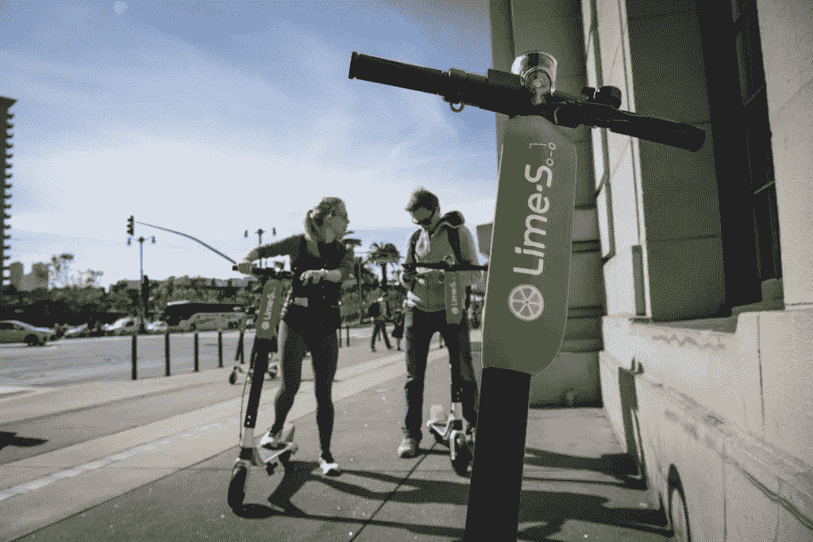
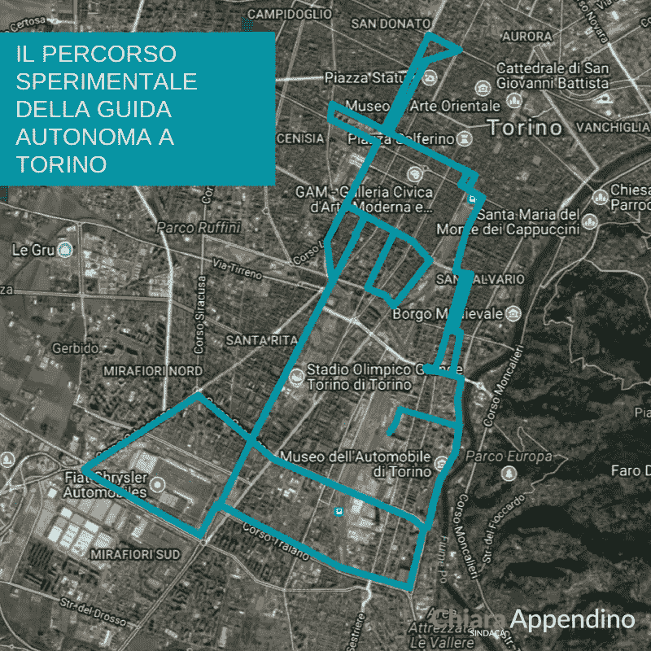

# 欧洲移动和智能城市的未来

> 原文：<https://medium.com/hackernoon/the-future-of-mobility-and-smart-cities-in-europe-715424b65f92>

## 意大利都灵正在试验自动驾驶汽车和电动滑板车，而英国伦敦正在努力成为世界上最适合步行的城市。

围绕移动性的争论越来越多。这不再是关于交通和自行车道，而是关于改造我们的城市和建立新的合作伙伴关系，使智能移动成为最终目标。

有趣的是，我的祖国意大利的都灵市正在成为一个开放的创新实验室，围绕着移动性开展重要项目。

首先是与意大利交通部和一些私人/公共合作伙伴签署的关于自动驾驶汽车的新谅解备忘录(MOU)，包括该市的两所主要大学。

都灵市长 Chiara Appendino 在脸书的一段视频中说:“在都灵这样一个以汽车工业闻名的城市，展望未来是一个重要的挑战。”。

新的谅解备忘录允许汽车制造商和自动驾驶汽车公司参与都灵市的测试。

Turin is starting to experiment with autonomous cars.

“这座城市将成为一个实验实验室，”负责城市交通的专员玛丽亚·拉皮特拉评论道。“这个项目真正的创新之处在于，我们不会使用专用赛道来试验自动驾驶汽车。对我们来说，在真实的城市、真实的交通和真实的问题中测试这项新技术是很重要的。我们希望成为对我们城市未来的真正考验。”

“我们的目标不仅是测试这项技术，还包括创建一个生态系统，其中包括自动驾驶汽车、无人机和机器人，可以为旨在为城市带来创新和吸引新业务的新机制做出贡献，”负责城市创新的专员保拉·皮萨诺说。

除了自动驾驶汽车，都灵还将试验电动滑板车。事实上，市长已经宣布，该市已经与 LimeBike 合作，将他们的滑板车带到都灵和它的第一个意大利城市——该公司于 6 月在巴黎推出，首次在欧洲亮相。

这一合作项目将从现在开始到 9 月，将为都灵带来大约 300 辆小型摩托车，从黎明到日落，白天都可以租赁，晚上不行。用户还可以选择将滑板车带回家充电，并在 Lime 应用程序上获得积分——以模仿美国所谓的“榨汁机”的方式。

除了都灵，伦敦也试图带来更多的移动创新。伦敦有史以来第一位步行和自行车专员威尔·诺曼公布了首都首个*步行行动计划*。它展示了伦敦将如何成为这样一个城市:对于那些可以步行的人来说，步行是所有短途旅行中最明显、最愉快和最有吸引力的旅行方式。

该计划有一个雄心勃勃的愿景，要让伦敦成为世界上最适合步行的城市，到 2024 年，每天增加一百万次步行旅行。此外，伦敦市长希望到 2041 年将步行、骑自行车和乘坐公共交通工具的比例从现在的 63%提高到 80%。市长正投资创纪录的 22 亿英镑在伦敦的街道上，使它们更适合步行和骑自行车，并改善空气质量。

伦敦步行和自行车专员威尔·诺曼(Will Norman)说:“步行是游览和探索伦敦的绝佳方式，让更多伦敦人定期步行对我们城市的健康和未来繁荣至关重要。无论你是去商店还是去当地火车站，我们都在投入创纪录的资金，让步行成为最安全、最简单、最愉快的出行方式。通过让伦敦人更容易把车留在家里，转而步行，这将解决空气污染危机，并随着伦敦人口的持续增长减少拥堵。这将对我们的城市产生真正的变革性影响。”