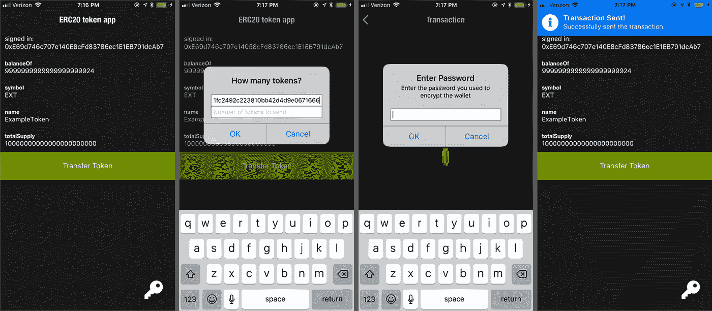
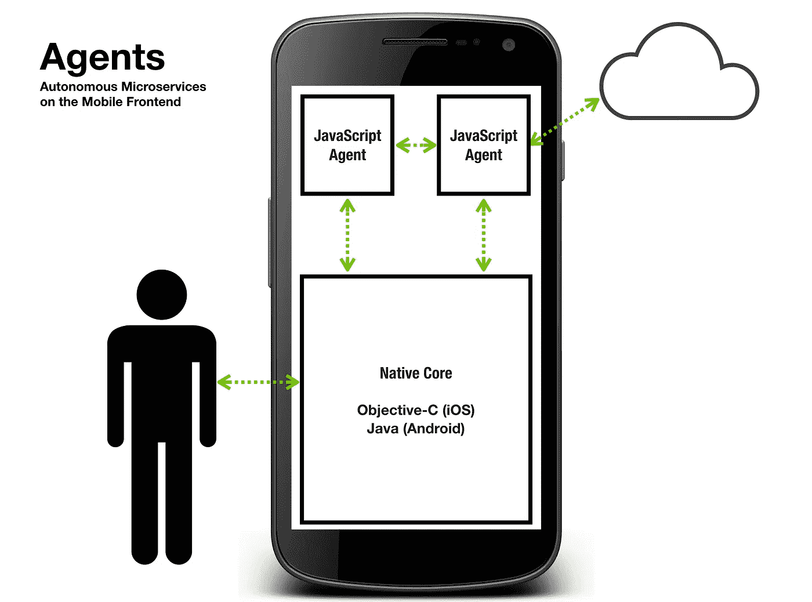
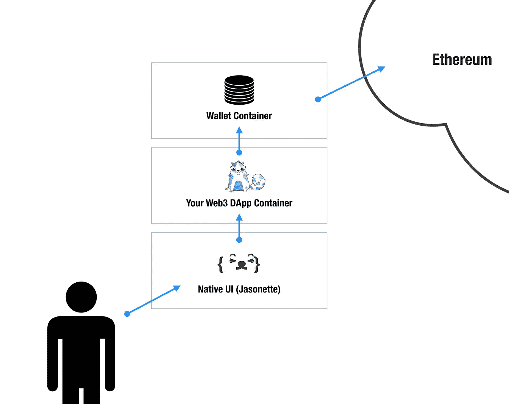
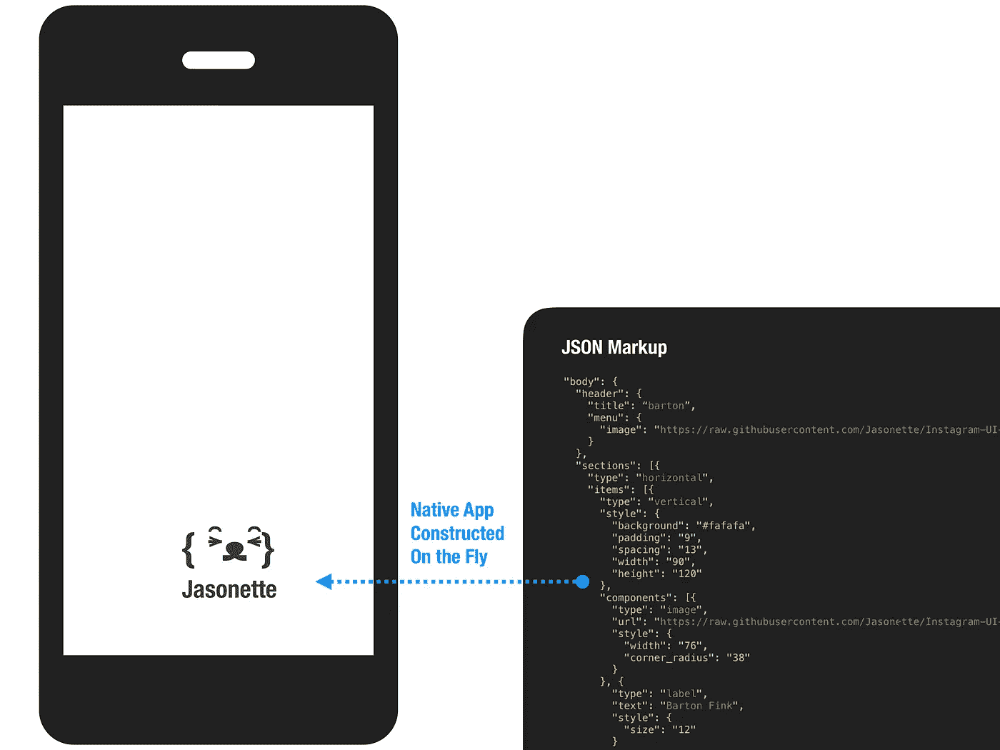
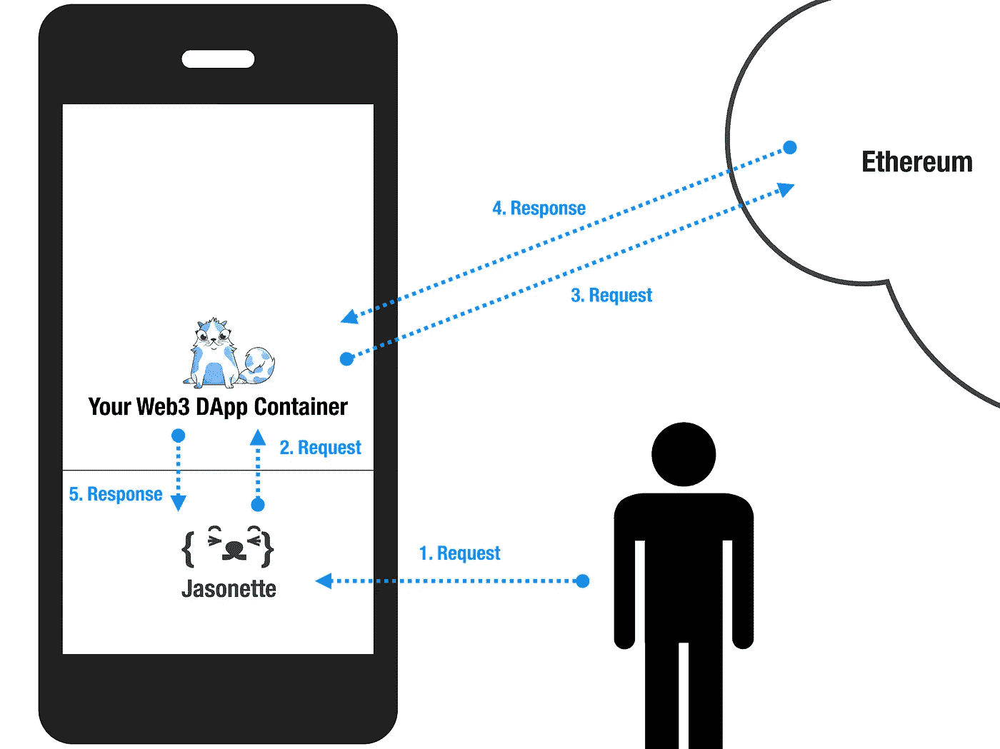
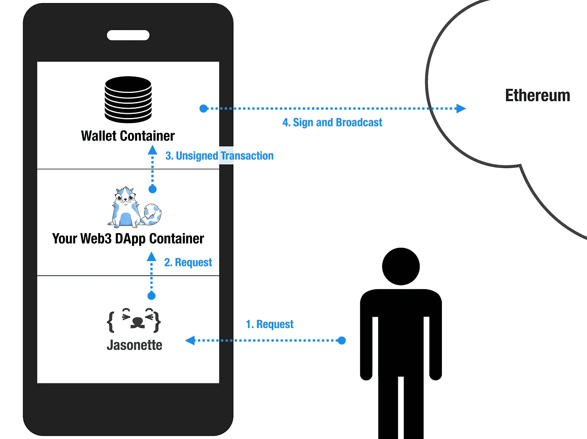
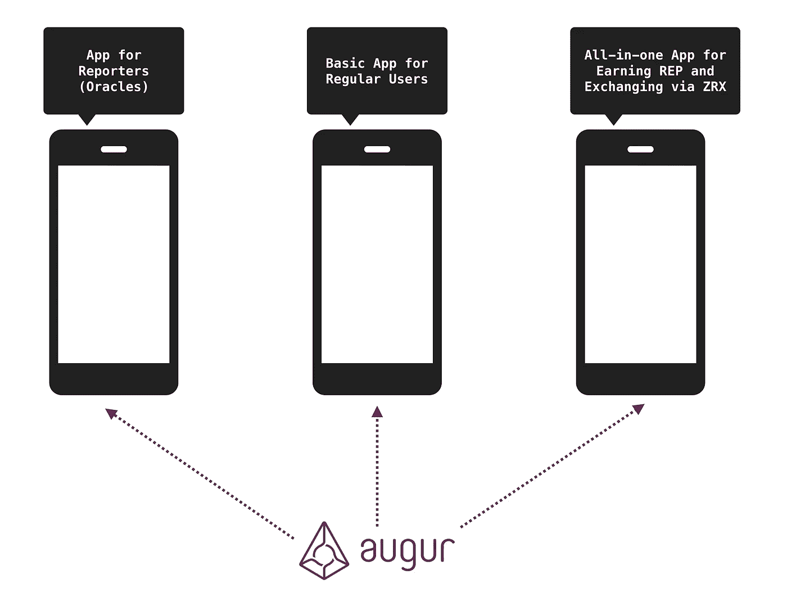

# 区块链上的原生移动应用的未来——它们应该是什么样子，以及如何在今天构建一个。

> 原文：<https://medium.com/hackernoon/the-future-of-native-mobile-apps-on-blockchain-what-they-should-look-like-and-how-to-build-one-d25024db07d5>



有很多很好的理由让你的[我们用 Infura](https://medium.com/u/d626b3859bc9#L209) 吧。

[](https://infura.io/) [## Infura -可扩展的区块链基础设施

### 对以太坊 API 和 IPFS 网关的安全、可靠和可伸缩的访问。

infura.io](https://infura.io/) 

> **Jasonette:** 跨平台原生手机 App 框架

第一个构建块是本机 UI。我们将使用 Jasonette，这是一种构建跨平台原生应用的标记驱动方法。

[](https://www.jasonette.com) [## Jasonette —基于 HTTP 的本地应用

### Jasonette 把 JSON 变成 iOS 和 Android 原生组件。

www.jasonette.com](https://www.jasonette.com) 

Jasonette 就像一个网页浏览器，但用于构建本地应用。就像 web 浏览器如何动态解释 HTML 并将其呈现在浏览器屏幕上一样，Jasonette 解释 JSON 标记以在 iOS 和 Android 上动态构造原生应用程序。

标记语法支持从**模型**到**视图**到**控制器**的一切表达，所以构建一个原生应用只需要一个 JSON 标记。

Jasonette 工作原理快速介绍:

深入教程:

> **代理:**移动前端的微服务

对于我们的用例来说，Jasonette 的一个重要内置特性是`agent`。

代理就像一个微服务，你可以把它嵌入到你的本地应用前端。它自动在父本地应用程序和它自己之间形成双向通信通道，允许它们通过 [JSON-RPC 协议](http://www.jsonrpc.org/specification)进行通信。



例如，您可以将任何在浏览器中工作的 web 应用程序作为代理嵌入到本机应用程序中，而不是将一些 API 数据呈现到 DOM 中，而是将其作为事件发送到父应用程序。然后 app 就可以原生渲染了。

**我们将使用代理将我们现有的 web3 DApp 嵌入到一个本机应用程序中，并将其用作数据源(并使用本机部分来呈现数据)。**

快速浏览以下页面，了解有关代理的更多信息:

[](https://www.jasonette.com/agent) [## 茉莉酮酸酯剂

### 将任何 JavaScript 应用程序转变为跨平台的原生移动应用程序

www.jasonette.com](https://www.jasonette.com/agent) 

# 履行

现在我们已经准备好构建移动应用程序了。



上图是总体数据流的快速概览。

*   用户与本机 UI 进行交互。
*   本机 UI 向“DApp 容器”(包含您的 web3 DApp 代理)发出请求
*   DApp 容器向“钱包容器”代理发出请求(现在，就把它想象成元掩码的移动等价物)
*   钱包容器然后连接到以太坊。

所有这些都通过 JSON-RPC 协议相互连接，应用程序——所有三个模块——完全用 JSON 标记描述。

在我们开始之前，提醒一下您可以在以下网址找到完整的源代码:

[](https://github.com/gliechtenstein/erc20) [## 格利希滕斯坦/erc20

### erc20 —全栈 erc20 令牌应用程序(合同+网络+移动)

github.com](https://github.com/gliechtenstein/erc20) 

说了这么多，现在让我们看看每个模块。

## 1.本机用户界面

第一个构建块是本机 UI。Jasonette 有一个内置的模板引擎——也是用 JSON 编写的——它可以接受任何 JSON 对象并呈现到本机布局和 UI 组件中，还可以在 JSON 标记中表达本机 API 函数调用。



在这种情况下，我们将使用 DApp 容器——我们将在下一节中讨论——作为数据源，因此我们定义模板并等待来自 DApp 容器的响应。一旦 DApp 容器触发了一个事件，我们将根据模板呈现数据。以下是完整的标记:

[https://github . com/gliechtenstein/ERC 20/blob/master/mobile/app/main . JSON](https://github.com/gliechtenstein/erc20/blob/master/mobile/app/main.json)

标记驱动方法最酷的一点是**应用程序逻辑与设备完全分离。**这意味着你可以在任何地方存储和提供应用程序(就像网络浏览器做的那样)。它可以存储在远程服务器上，本地设备上，甚至像 IPFS 一样分散存储。

让我们退一步想想这意味着什么。通过将应用与设备分离，我们可以确保无论苹果或谷歌未来发生什么，我们的应用都可以移植到新的平台，只要框架本身移植到新的主导平台。这也是 Jasonette 选择 JSON 作为标记语言的原因， **JSON 是机器存储和相互通信数据最流行的格式**，因此，未来假想的“新平台”很可能也将支持 JSON 作为一等公民。

对于我们的 MVP 应用程序，我们从 github 上的一个远程 JSON】提供服务。

## 2.DApp 集装箱

第二个构件是 DApp 容器。



从这个图表中可以注意到一些事情:

1.  用户只与本机 UI 交互。对于用户来说，DApp 是不可见的，它只是作为一个数据源。
2.  本机模块通过 JSON-RPC 将用户请求转发给 DApp 容器。
3.  然后，DApp 容器向以太坊网络(thanks，Infura)发出请求，当它得到响应时，将它转发回父本地应用程序，该应用程序使用上面提到的本地模板呈现。

我们将 DApp 容器实例化为一个代理。声明一个代理只需要在现有的应用程序标记中添加 3 行 JSON 代码:

```
{
  "$jason": {
    "head": {
      "title": "Web3 DApp in a mobile app",
 *"agents": {* ***"eth": {
          "url": "***[https://gliechtenstein.github.io/erc20/web](https://gliechtenstein.github.io/erc20/web/)***"
        }* ** *},
      ...* }
  }
}
```

在这种情况下，我们初始化 DApp 容器并将其命名为`eth`，当我们进行 JSON-RPC 调用时，我们将使用它作为 ID。

以下是完整源代码:[https://github . com/gliechtenstein/ERC 20/blob/master/mobile/app/main . JSON](https://github.com/gliechtenstein/erc20/blob/master/mobile/app/main.json)

请注意，我们没有接触到原始的 web 应用程序。**我们只是将 DAPP 作为代理嵌入，并将其用作移动应用程序的即时伪后端。**要明确的是，你不必这样做，只需保留一个单独的代理程序来嵌入到移动应用程序中，但我只是想展示如何在移动应用程序中重用相同的 DApp。

## 3.钱包容器

写以太坊比读以太坊更棘手。我们必须更加小心，因为它处理的是创建实际交易和发送真实货币。

通常，当构建一个常规的 DApp 时，我们使用`web3.js`库进行 API 调用，如下所示:

```
contract.transfer.**sendTransaction**(receiver, tokens, {
  to: contract.address,
  gasLimit: 21000,
  gasPrice: 20000000000
}, function(err, result) {
  // Render the DOM with result
})
```

这个方法`sendTransaction`实际上做了两件事:

1.  为名为`"transfer"`的契约方法创建一个编码的事务对象。
2.  通过 JSON-RPC 对交易对象进行签名并广播到以太坊。

对于我们的项目，我们将不再让 DApp 处理这两者，而是:

1.  让我们的 **DApp 容器** **只处理第一部分**
2.  并创建一个名为**“钱包容器”****的单独容器来处理第二部分**

通过将两者分开，DApp 容器不必处理私钥，而是将它委托给钱包容器，就像[元掩码](https://metamask.io/)在桌面上自动处理这个问题一样。这样，DApp 开发人员可以专注于应用程序逻辑。

因此，我们没有使用`sendTransaction`方法，而是首先使用一个名为`getData`的 API 来获取一个事务对象:

```
var tx = contract.transfer.**getData**(receiver, tokens)
```

然后通过`[$agent.response](https://docs.jasonette.com/agents/#2-agentresponse)`[API](https://docs.jasonette.com/agents/#2-agentresponse)将其传递回父 app:

```
$agent.response({ tx: tx })
```

然后，父本地应用将[将其传递给我们的新钱包视图](https://github.com/gliechtenstein/erc20/blob/master/mobile/app/main.json#L54)。



wallet 视图(及其包含的 wallet 代理)将获取这个未签名的交易数据，对其进行签名，然后通过 Infura 进行广播。可以在这里查看钱包视图源代码:[https://github . com/gliechtenstein/ERC 20/blob/master/mobile/wallet/wallet . JSON](https://github.com/gliechtenstein/erc20/blob/master/mobile/wallet/wallet.json)

下面是钱包代理代码:[https://github . com/gliechtenstein/ERC 20/blob/master/mobile/wallet/wallet . html](https://github.com/gliechtenstein/erc20/blob/master/mobile/wallet/wallet.html)

请注意，“钱包视图”是一个完全独立的沙盒视图，就像 MetaMask 在新的弹出浏览器中打开一样。这是故意的。这使 DApp 开发者不必处理私钥。

# 为什么要这样建？

概括一下，我们的整个移动应用程序是如何工作的:

*   用户只与本地的 UI 进行交互
*   原生 UI 是由标记实时构建的，而不是硬编码的编译程序。
*   原生 UI 嵌入了多个类似微服务的 web 容器，它们运行独立的 HTML/JavaScript 应用，通过 JSON-RPC 相互通信。
*   开发人员需要编写的唯一“程序”是描述 UI 和指令的 JSON 标记。

这样构建一个 app 有什么好处，尤其是对于以太坊这种去中心化的网络？

## 1.容易的

用这种方式构建应用程序简单多了。你不需要重写你的 DApp 来在移动上工作，你不需要雇佣一个移动开发者，你不需要维护一个单独的移动代码库。

你需要做的就是:

1.  编写两个表示每个视图的标记文件
2.  像 iframe 一样嵌入自己的 DApp 作为代理
3.  让您的 DApp 和父本机应用程序通过 JSON-RPC 之类的协议进行通信。

这给了你一个单一的代码库，既可以作为你的网站，也可以用于手机。**你唯一需要维护的是标记**。但是即使是标记——因为它是公开的——也可以被不同的应用程序共享。

我们可以看看以太坊的 ERC 标准是如何工作的，以便理解其含义。大多数 ERC20 令牌开发者只是简单地继承了[合同地址](https://medium.com/u/4e5199c3ee0a#L208)来重复使用。

# 未来的移动应用会是什么样子？

未来的移动应用将建立在连接到比特币和以太坊等分散网络的加密协议之上，而不是连接到脸书这样的集中网络。

在这个世界上，我们可能需要重新思考什么是“移动应用”的概念，以及当用户的身份被植入协议时，如何在不损害用户安全的情况下构建一个移动应用。

## 1.最小权力原则

有一个概念叫做“最小能量法则”，由蒂姆·伯纳斯·李爵士创造并实施，作为万维网的基本设计原则。

 [## 最小权力原则

### 万维网在全球范围内促进信息重用的能力是独一无二的。信息发布于…

www.w3.org](https://www.w3.org/2001/tag/doc/leastPower.html) 

这个想法是，在潜在的危险环境中，简单优于复杂，比如网络。该规则规定[“描述性”语言比“过程性”语言更强](https://en.wikipedia.org/wiki/Rule_of_least_power):

> “……在计算机语言中进行选择，……**一个人选择的语言越不程序化、越具描述性，他就越能处理用该语言存储的数据。**

同样，简单的语言比复杂的语言更安全:

> “……**功能较弱的语言通常更容易保护**……因为用简单语言编写的程序更容易分析，也更容易识别它们确实存在的安全问题”

总结:**简单比复杂更强大。简单比复杂更安全**。像万维网这样的狂野西部环境应该用尽可能简单的语言来实现，比如 HTML。

> “使语言变得强大的各种特征可能会使对用这些语言表达的程序或信息的分析复杂化或阻止这种分析，这表明在网上发布信息时要认真权衡这种风险。的确，在网络上，通常应该选择最不强大的语言。

快进到今天，我们正在应对一个新的互联网，我们通过它发送真金白银，我们希望我们的应用程序在最初的创意团队离开后很长时间内以最少的维护安全地运行。**“最小功率法则”的设计原则从未像今天这样重要。**

这就是为什么我相信一个“不太强大”的标准化 [**标记驱动的方法**更适合构建基于加密协议的移动应用](https://www.jasonette.com)，而不是构建“强大”的应用，从长远来看，这些应用最终会成为一种负担。

## 2.分散式互联网的结构

作为一名协议开发人员，你的目标不应该是构建一个单一的应用程序——你不是一名“应用程序开发人员”。相反，**你应该 100%的专注于让任何人都可以轻松的将你的协议嵌入到他们的应用程序中**，并尽可能的开放它。



Hypothetical example: [**https://docs.jasonette.com/#mc-embedded-subscribe-form**](https://medium.com/u/f4d568271227#mc-embedded-subscribe-form)