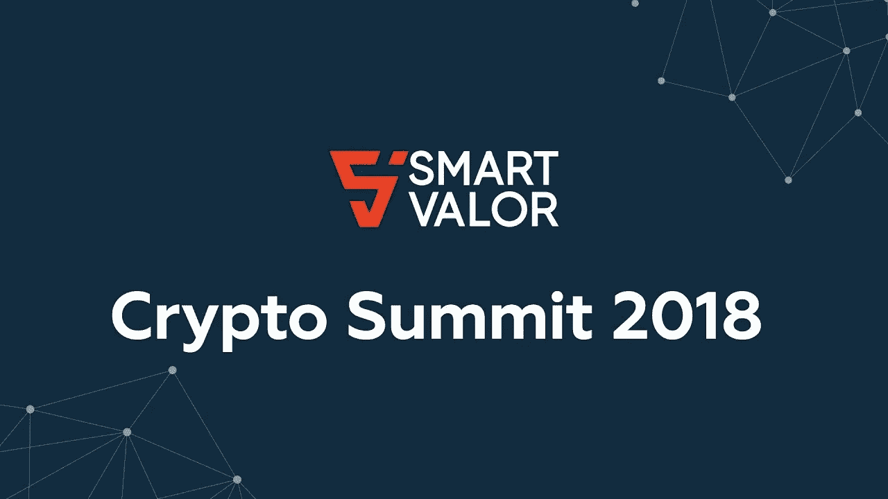

# 安全令牌的未来:神话与现实

> 原文：<https://medium.com/hackernoon/the-future-of-security-tokens-myths-and-realities-d3371cee9c65>

今天早上早些时候，我在瑞士苏黎世举行的 [Crypto ICO 峰会](https://cryptosummit.smartvalor.com/)上做了一个分组会议。我演讲的主题:未来，安全令牌的神话和现实。我涵盖了各种领域，从安全令牌市场的现状到需要在不久的将来解决的基础设施和协议领域。下面提供了幻灯片:

一些关键点可能会指导您完成这一部分:

证券代币的一些非常市场化的好处，如部分所有权和流动性，如今几乎不存在。

从端到端解决方案到专用加密安全协议的过渡将决定主流采用的差距。

在安全令牌市场的当前状态中存在重要的摩擦。例如:监管与分权或身份与匿名

安全令牌的下一阶段需要结合更好的项目(令牌)以及构建所需的基础架构构建块。

近期能释放市场潜力的新令牌化领域有:令牌化债务、令牌化证券(债券、衍生品、新形式的稳定币、B2B 发行。

安全令牌的新基础架构构建块包括以下领域:隐私、加密金融原语、流动性、披露、治理等。

我们可能很快就会看到 1-2 家专门从事安全令牌的区块链。不管这是不是个好主意。