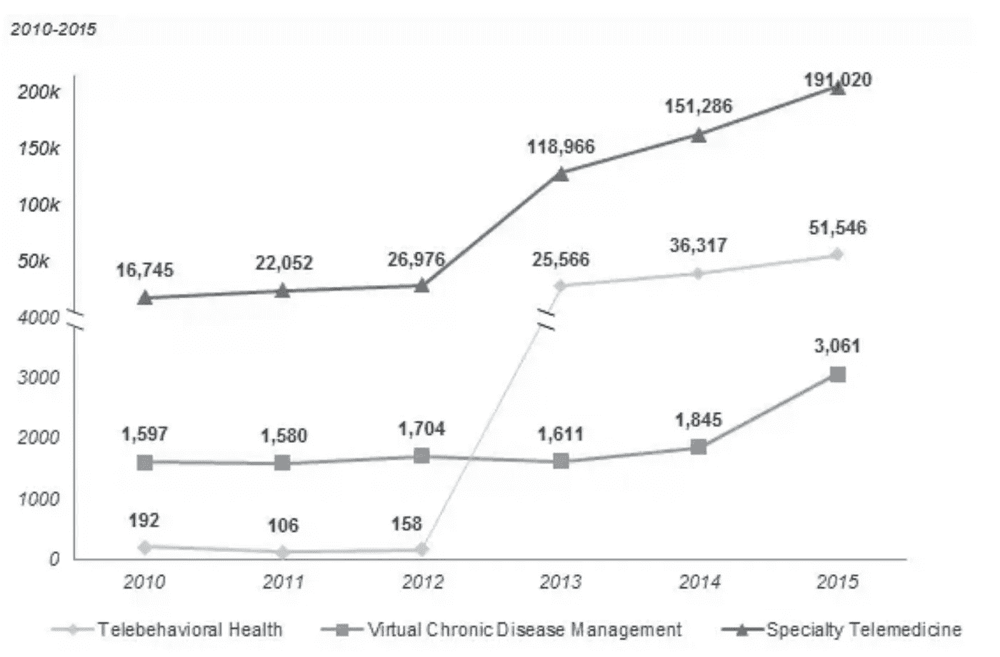

# 远程医疗的未来

> 原文：<https://medium.com/hackernoon/the-future-of-telemedicine-8f704b3054b7>

> 由 [Nitin Goyal，医学博士](https://www.quora.com/profile/Nitin-Goyal-MD)，骨科医生，Pulse Platform 创始人& CEO。[原载](https://www.quora.com/What-does-the-future-of-telemedicine-look-like/answer/Nitin-Goyal-MD)于 [Quora](http://quora.com?ref=hackernoon) 。

使用技术提供远程医疗服务是定义远程医疗的最简单方式。

仔细想想，这种向远程(或按需)服务的转变已经在大多数行业发生了。以银行业为例。沿着街道走到一家分行，仅仅是为了在实体店存一张支票，这种想法让人感觉过时、麻烦而且没有必要。

众所周知，在医院休息室等候看病的麻烦经历也是如此。

在过去的十年里，远程医疗取得了巨大的进步，病人的采用也是如此。但是[根据行业数据](https://www.advisory.com/research/market-innovation-center/the-growth-channel/2017/03/growth-trends-telehealth)，引领潮流的不是远程医疗，而是行为健康(在 2012-2013 年间有了巨大的飞跃)和专业远程医疗服务。

下面是一个例子，展示了远程医疗快速发展的三个领域。

## **远程医疗的医疗保健收费服务趋势**

推动远程医疗采用的不一定是技术，而是社会行为和生活习惯。

事实是，远程医疗服务的技术已经存在了一段时间——电话。很快，像 Skype 这样的东西成为了交流的选择。然后是智能手机上的 FaceTime。

2015 年， [American Well 做了一项调查](https://www.americanwell.com/press-release/american-well-2015-telehealth-survey-64-of-consumers-would-see-a-doctor-via-video/)发现 64%的消费者愿意通过视频看病。它还发现，当涉及视频组件时，消费者最容易接受远程医疗服务的想法，因为这让他们感觉更投入。他们相信视频将帮助他们的医生做出更准确的诊断。

有趣的是，88%的人表示，他们更愿意根据在线资料中列出的经验水平来选择医生，强调医生需要在互联网上公开活跃——这是我个人投入大量精力的事情。

最后，调查指出，消费者认为远程医疗是一种省钱的方式。有趣的是，62%的消费者“认为视频访问应该比亲自访问花费更少。”这是一个有趣的观点，因为一个医生的一个小时仍然是一个小时。

但这些见解只是更大图景的一部分。

## 下面是未来 5 年、10 年、20 年有效的远程医疗将会是什么样子。

今天的消费者更加灵活——从各方面来说都是如此。人们更喜欢发短信而不是打电话，因为在大多数情况下，打电话时间太长。

人们喜欢在他们想要的时候挑选他们想要的东西。他们不想根据医生的时间表来调整自己的时间表。(他们期望的是反过来)。

比起一切，人们更喜欢透明，并希望按需得到问题的答案，因为像谷歌这样的工具已经在他们生活的各个方面创造了这种习惯。

当我们想到远程医疗及其使用案例时，我们的谈话就陷入了如何让有缺陷的东西更好地工作。具体来说，关于消费者如何期望远程医疗访问比亲自访问花费更少。实际上，这并没有解决医生一天只能工作这么多小时的难题。

一个小时还是一个小时。

远程医疗的未来不仅在于简化这些流程，还在于将流程落实到位，以确保患者的问题不仅得到解答，还能得到预期。这是真正的数字健康解决方案。

远程医疗与整个数字医疗行业的创新紧密相连。消费者想要的，不仅仅是远程医疗，而是所有的医疗保健服务，是感到轻松，了解他们的健康，并在绝对必要的时候与他们的医生联系。

作为一名外科医生，很多时候我的病人有非常简单(但重要)的问题，这些问题可以很容易地用另一种方式来回答——这种方式可以节省他们在休息室等待的时间。

因此，远程医疗有效性的衡量标准将很快基于它为消费者节省了多少时间。不仅仅是去医生办公室的旅行时间。它将包括沿途突然出现的所有小问题，可以通过应用程序或信息系统轻松交流，而不是预约时间直接与医生交谈。

这一趋势已经在数字健康的其他方面发生了。它也只会继续推动远程医疗的发展。

> 由 [Nitin Goyal，医学博士](https://www.quora.com/profile/Nitin-Goyal-MD)，骨科医生，Pulse Platform 创始人& CEO。[原载](https://www.quora.com/What-does-the-future-of-telemedicine-look-like/answer/Nitin-Goyal-MD)于 [Quora](http://quora.com?ref=hackernoon) 。
> 
> 更多来自 Quora 的趋势科技答案，请访问[HackerNoon.com/quora](https://hackernoon.com/quora/home)。

 [## 美国的医疗保健

### 这个国家医疗保健人性化的一面。

healthcareinamerica.us](https://healthcareinamerica.us)